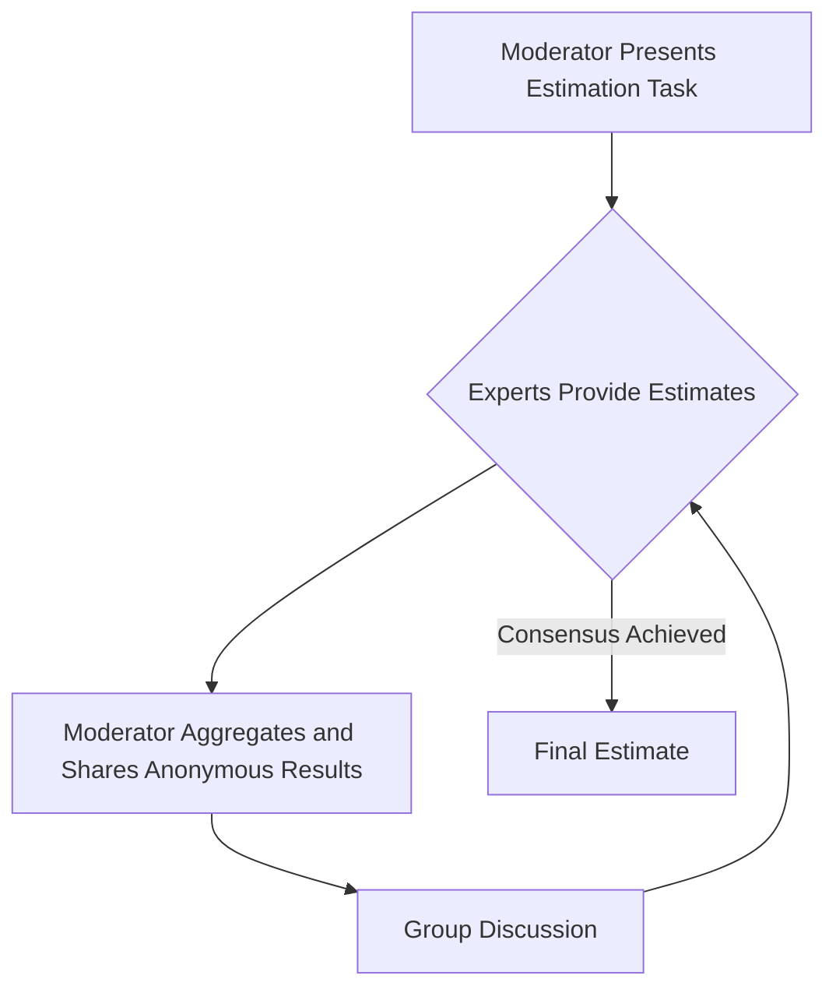
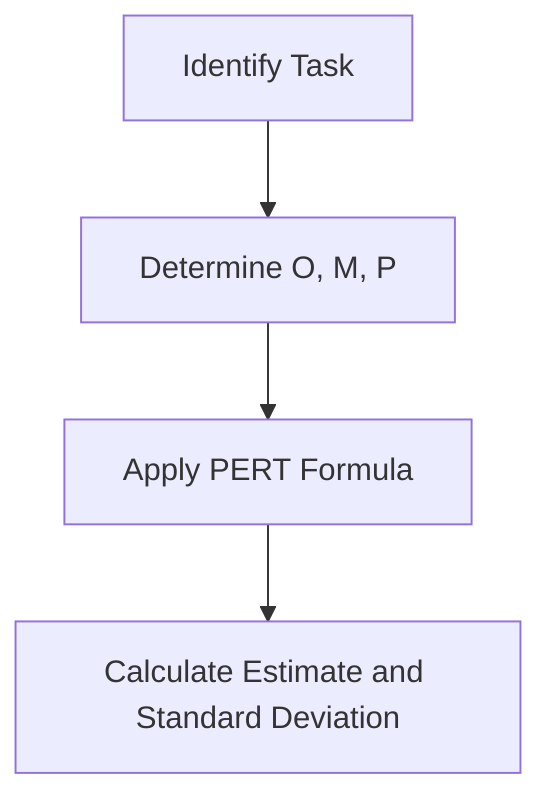
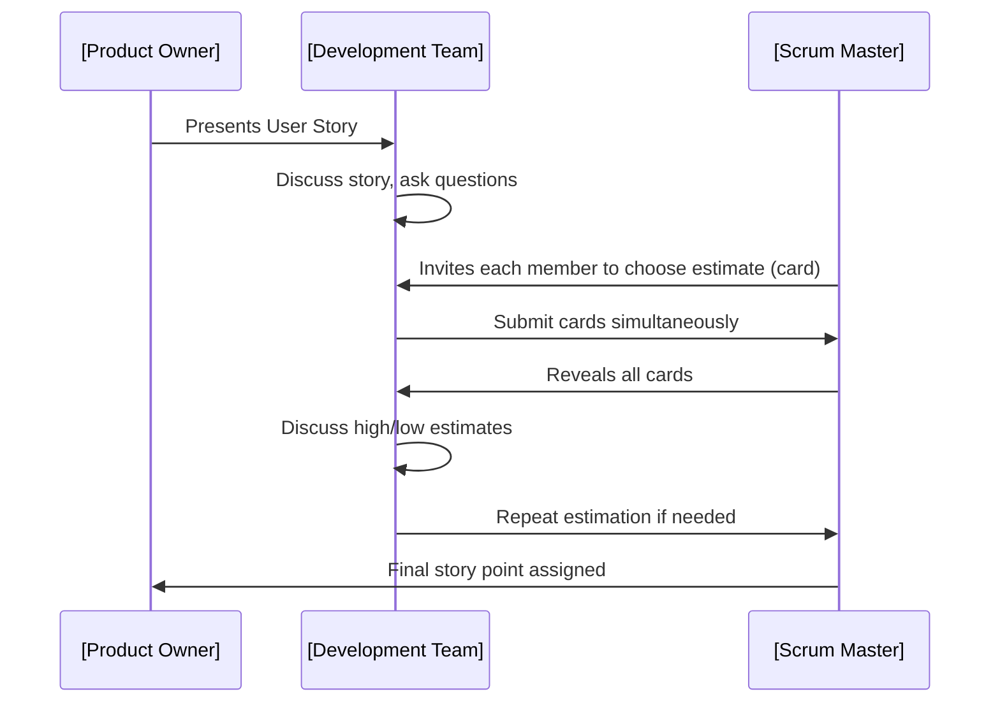

# Estimation Techniques (Agile & Traditional)

Estimation is a critical aspect of engineering and project management, providing the basis for planning, scheduling, resourcing, and risk management. Effective estimation techniques help teams anticipate the effort, cost, duration, and complexity of project tasks and deliverables. In software engineering, both Agile and traditional (waterfall and hybrid) development methodologies employ distinct estimation methods tailored to their unique planning and delivery patterns.

This primer examines the foundational principles and practical applications of estimation techniques in both Agile and traditional contexts. It covers widely adopted methods such as story points, t-shirt sizing, and parametric modeling, as well as key integration workflows and engineering considerations.

---

## 1. Introduction to Estimation

### 1.1 Definition and Context

**Estimation** refers to the process of approximating a value (e.g., effort, duration, cost, or resources) required to complete a specific project, deliverable, or activity. In software engineering, estimation seeks to answer the question: “How much work is required to deliver this feature or project, and when can it be done?”

Accurate estimation is essential for:
- Resource allocation
- Project scheduling
- Budgeting and forecasting
- Managing stakeholder expectations
- Risk identification and mitigation

Estimates are inherently uncertain and best interpreted as reasoned approximations, not guarantees.

### 1.2 Core Types of Estimation

- **Effort Estimation:** Quantifies work in terms of person-hours, story points, or ideal days.
- **Cost Estimation:** Approximates monetary resources needed.
- **Duration Estimation:** Predicts calendar time required.
- **Size Estimation:** Measures the scale of the work (e.g., lines of code, function points, backlog items).

### 1.3 Estimation in Agile vs. Traditional Contexts

- **Agile Estimation:** Emphasizes relative measurement and adaptability. Estimates are often recalibrated throughout the project lifecycle (iterative/incremental development).
- **Traditional Estimation:** Often employs upfront, absolute quantification of scope (predictive planning, e.g., Waterfall). Assumes minimal change during execution.

---

## 2. Core Concepts and Key Estimation Techniques

### 2.1 Story Points (Agile)

#### 2.1.1 Definition

**Story points** are a unit of measure used in Agile methodologies (e.g., Scrum, XP) to express the relative effort or complexity of implementing a user story or backlog item. Story points are abstract (non-time-based) and capture factors such as:

- Complexity
- Amount of work
- Risk/uncertainty

#### 2.1.2 Relative Estimation Model

Instead of estimating in absolute time, teams compare items to one another, creating a consistent internal scale.

#### 2.1.3 Common Scales

- **Fibonacci Sequence:** 1, 2, 3, 5, 8, 13, etc. (reflects uncertainty growth)
- **Linear Progression:** 1, 2, 3, 4, 5 (less common)

#### 2.1.4 Process Flow

```mermaid
flowchart TD
    A[Backlog Refinement] --> B[Team Discusses User Story]
    B --> C[Relative Sizing (Story Points)]
    C --> D[Consensus (e.g., Planning Poker)]
    D --> E[Story Assigned Estimate]
```

#### 2.1.5 Estimation by Analogy

Teams select a reference story of known effort and compare new stories to it. This practice supports calibration across sprints.

**Key Points:**
- Not a direct mapping to hours/days.
- Team calibration is vital for consistency.
- Velocity (average points completed per sprint) supports forecasting.

> **Alert**
> **Do not convert story points to hours as a rule.** This undermines the intent and value of relative estimation and tends to reintroduce time-based thinking, which Agile approaches seek to avoid.

---

### 2.2 T-Shirt Sizing (Agile)

#### 2.2.1 Definition

**T-shirt sizing** assigns a relative size (XS, S, M, L, XL, etc.) to backlog items or features. This provides a coarse-grained estimation suitable for high-level planning and early grooming cycles.

#### 2.2.2 Workflow

1. Present backlog items.
2. Team assigns a t-shirt size by consensus.
3. Map sizes to ranges of effort or man-days later if necessary.


#### 2.2.3 Use Cases

- Portfolio/program planning where fine-grained estimation is impractical.
- Early phase project sizing and scoping.
- Rapid comparison and grouping of features or epics.

#### 2.2.4 Limitations

- Lack of precision for sprint-level planning.
- Mapping to quantitative values introduces risk of misinterpretation.

---

### 2.3 Ideal Days / Ideal Hours (Agile & Traditional)

#### 2.3.1 Definition

Estimating the duration of a task assuming no interruptions, perfect focus, and all requirements clarified. Originated in Extreme Programming (XP) but used in many contexts.

#### 2.3.2 Application

- Useful for communicating rough order-of-magnitude duration.
- Commonly degrades into time-based estimates with associated risks.

#### 2.3.3 Constraints

- Fails to account for real-world distractions, context switching, meetings, etc.
- Subject to optimism bias.

---

### 2.4 Expert Judgment / Delphi / Wideband Delphi (Agile & Traditional)

#### 2.4.1 Expert Judgment

- Senior engineers or domain experts estimate based on prior experience.

#### 2.4.2 Wideband Delphi

A repeatable group-based estimation process:
- Experts independently estimate.
- Moderator collects and shares estimates anonymously.
- Group discusses variances.
- Process repeats until convergence.



#### 2.4.3 Benefits

- Reduces bias.
- Leverages collective knowledge.
- Achieves consensus for improved accuracy.

---

### 2.5 Three-Point (PERT) Estimation (Traditional & Agile)

#### 2.5.1 Definition

Estimates are based on three values:
- **Optimistic (O):** Best-case scenario.
- **Pessimistic (P):** Worst-case scenario.
- **Most Likely (M):** Most probable scenario.

The expected estimate is typically calculated as:
- **E = (O + 4M + P) / 6** (Weighted average; PERT method)

#### 2.5.2 Workflow



#### 2.5.3 Application

- Used in formal project management (e.g., PMI’s PMBOK).
- Captures uncertainty explicitly.
- Enables risk-based planning and buffer analysis.

---

### 2.6 Function Point Analysis (FPA) (Traditional)

#### 2.6.1 Definition

Function points measure the size of a software system by quantifying its functional components, irrespective of technology or programming language.

Components:
- External Inputs (EI)
- External Outputs (EO)
- External Inquiries (EQ)
- Internal Logical Files (ILF)
- External Interface Files (EIF)

Each is weighted and summed to produce a function point count. Multipliers for complexity and environmental factors convert function points to effort or cost estimates.

#### 2.6.2 Use Cases

- Useful for vendor contracts and regulated environments.
- Supports cross-project comparison and benchmarking.

#### 2.6.3 Limitations

- Requires specialist knowledge.
- Can become bureaucratic for small or Agile teams.

---

### 2.7 Parametric Modeling (Traditional)

#### 2.7.1 Definition

Parametric estimation models use established mathematical formulas and parameters (historical data, code size, productivity factors) to predict duration, effort, or cost.

#### 2.7.2 Examples

- **COCOMO (Constructive Cost Model):**
  - Estimates effort and schedule based on code size (KLOC) and project factors.
  - **Effort = a × (KLOC)^b × EAF**, where EAF = Effort Adjustment Factor

- **SLIM (Software Lifecycle Management):**
  - Uses staffing and productivity indices for large projects.

#### 2.7.3 Advantages

- Handles large data sets and complex projects.
- Basis in empirical data.

#### 2.7.4 Constraints

- Requires accurate historical/project data.
- Models may not fit all project contexts.

---

## 3. Estimation Architecture and Workflows

### 3.1 Integration Into Project Lifecycle

Estimation occurs throughout the software delivery lifecycle, from high-level portfolio planning to daily task tracking.


---

### 3.2 Agile Estimation Workflow

```mermaid
flowchart TD
    AA[Backlog Grooming] --> AB[Relative Estimation (Points, T-Shirt)]
    AB --> AC[Assign Estimates]
    AC --> AD[Team Planning (Sprint, Release)]
    AD --> AE[Velocity Tracking]
    AE --> AF[Forecast Future Sprints]
```

### 3.3 Traditional Estimation Workflow

```mermaid
flowchart TD
    BA[Requirements Specification] --> BB[Decompose Into Work Packages]
    BB --> BC[Estimate Size (e.g., LOC, Function Points)]
    BC --> BD[Apply Parametric Model / Expert Judgment]
    BD --> BE[Project Schedule & Budget]
    BE --> BF[Baseline & Monitor Progress]
```

---

## 4. Practical Engineering Considerations

### 4.1 Integration Points

- **Agile Tools:** Jira, Azure DevOps, VersionOne support story points, t-shirt sizing, and real-time velocity calculation.
- **Traditional Tooling:** MS Project, Primavera, and cost estimation spreadsheets integrate function points and parametric models.

### 4.2 Performance Implications

- **Over-Estimation:** Results in unused buffer, missed opportunities, and demotivated teams.
- **Under-Estimation:** Causes missed deadlines, technical debt, and quality issues.

### 4.3 Implementation Challenges

- Calibration of estimation scales across teams.
- Managing estimation as a team activity, not an individual responsibility.
- Ensuring estimates remain distinct from commitments.

> **Alert**
> **Caution:** Estimates are not promises. Conflating estimation and commitment is a common source of project dysfunction.

### 4.4 Common Pitfalls

- **Anchoring:** First estimate provided unduly influences subsequent estimates.
- **Confirmation Bias:** Overconfidence in best-case scenarios.
- **Misapplied Historic Data:** Reusing past velocities or productivity rates in new, non-equivalent contexts.
- **Scope Creep:** Uncontrolled scope changes invalidate earlier estimates.

---

## 5. Variations and Evolving Practices

### 5.1 No Estimates Approach

A subset of Agile practitioners advocate for minimizing or eliminating estimation, focusing instead on breaking down work into similar-sized items and tracking throughput (Kanban, flow-based metrics). This approach remains controversial.

### 5.2 Hybrid Approaches

Many organizations blend estimation techniques (e.g., start with t-shirt sizing, later refine to story points or ideal days), particularly in hybrid Agile/Waterfall environments.

### 5.3 Continuous Re-Estimation

Frequent backlog grooming and re-estimation are key practices in Agile, maintaining estimation accuracy as understanding evolves.

---

## 6. Assumptions, Constraints, and Standards

### 6.1 Assumptions

- Estimation assumes a reasonable level of requirement clarity.
- All estimation methods lose accuracy as uncertainty increases.
- Team experience and historical data improve accuracy.

### 6.2 Constraints

- Organizational culture may mandate specific estimation artifacts.
- Regulatory, audit, or contract environments may require formal estimation methods (e.g., FPA, COCOMO).

### 6.3 Relevant Standards

- **ISO/IEC 20926:** Standard for Function Point Analysis.
- **PMI PMBOK Guide:** Project estimation processes.
- **SEI COCOMO Model Definitions:** Standardizes parametric estimation at scale.

---

## 7. Summary Table of Estimation Techniques

| Technique           | Agile | Traditional | Granularity      | Complexity | Quantitative | Typical Use                   |
|---------------------|:-----:|:-----------:|------------------|------------|--------------|-------------------------------|
| Story Points        | ✔     |             | Fine             | Med-High   | No           | Sprint planning, forecasting  |
| T-Shirt Sizing      | ✔     |             | Coarse           | Low        | No           | Portfolio, epic sizing        |
| Ideal Days/Hours    | ✔     | ✔           | Fine             | Medium     | Yes (sort-of)| Sprint/waterfall planning     |
| Expert Judgment     | ✔     | ✔           | Any              | Varied     | No           | Any stage                     |
| Wideband Delphi     | ✔     | ✔           | Any              | High       | No           | Consensus, complex estimation |
| PERT/3-Point        | ✔     | ✔           | Fine/Medium      | Med-High   | Yes          | Risk-sensitive estimation     |
| Function Points     |       | ✔           | Medium/Coarse    | High       | Yes          | Contractual, regulated env.   |
| Parametric Modeling |       | ✔           | Medium/Coarse    | High       | Yes          | Large projects, cost analysis |

---

## 8. Conclusion

Estimation techniques are integral to both Agile and traditional software engineering practices. Selecting and applying an appropriate technique requires an understanding of project context, organizational culture, and the nature of the work. While no estimation approach is perfect, combining empirical, collaborative, and adaptive methods supports better planning, risk management, and stakeholder communication.

> **Alert**
> Effective estimation is an organizational capability built through teamwork, structured feedback, and a culture that recognizes the inherent uncertainty of software development.

---

## Appendix: Example—Planning Poker in Agile Estimation

### Planning Poker Process

A widely used Agile estimation protocol combining expert judgment with consensus-building.



---

## Recommended Diagram

> **Note**
> [Diagram to be added later]: Function Point Analysis Count–An example breakdown of a sample system into FP components with weights, depicted as a flowchart or system overview.

---

This concludes the technical primer on estimation techniques for Agile and traditional software delivery contexts.