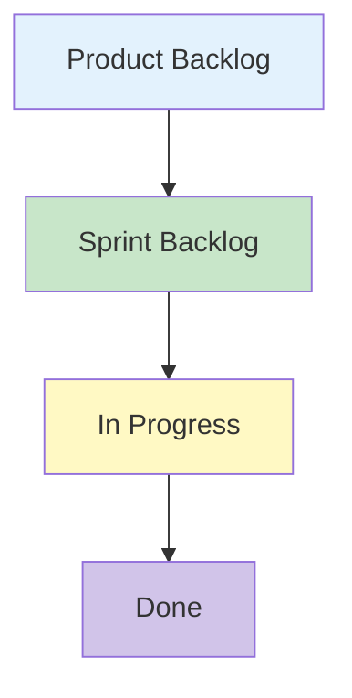
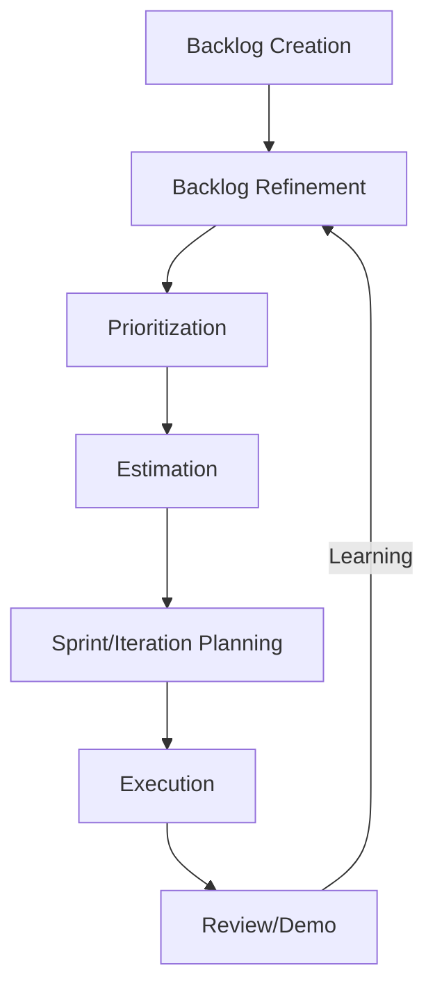
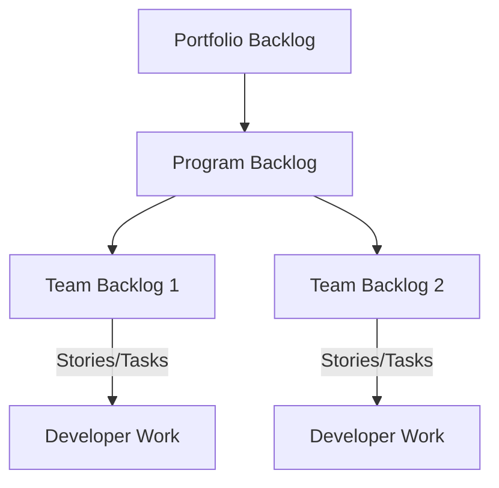

# Backlog Management

## Introduction

Backlog management is a foundational practice in modern agile software development and delivery. It comprises the structured creation, organization, prioritization, and maintenance of lists—commonly known as backlogs—containing requirements, features, technical debt, and defect repairs. Backlogs are central artifacts within frameworks such as Scrum, Kanban, and other iterative development methodologies, serving as transparent sources of truth for the work that remains to be completed by engineering teams.

Proper backlog management is essential for effective delivery cycles, enabling timely response to changing requirements, technical uncertainty, and shifting stakeholder priorities. This document outlines the core principles, processes, and engineering considerations associated with efficient backlog management.

---

## 1. Backlog Fundamentals

### 1.1 Definition of a Backlog

A **backlog** is an ordered list of tasks, features, enhancements, bugs, and technical activities that may be prioritized and selected for implementation by a delivery team. There are generally two principal types:

- **Product Backlog:** Contains everything that might be worked on by the team, including new features, enhancements, defects, technical tasks, and research (spikes).
- **Sprint (or Iteration) Backlog:** A subset of the product backlog selected by the team to deliver in a specific time-boxed period (often a sprint or iteration).

### 1.2 Backlogs in the Agile Context

In frameworks like Scrum and Kanban, the backlog is a living artifact. It evolves as product understanding, technical insights, and stakeholder priorities change. The backlog is continuously refined—a practice formalized in Agile as **backlog refinement** or **grooming**.

#### Backlog Artifacts Overview (Mermaid Diagram)



---

## 2. Core Concepts and Key Components

### 2.1 Backlog Items

Backlog items can represent various types of work:
- **User Stories:** Descriptions of features or functions from an end-user perspective.
- **Defects/Bugs:** Issues identified in production or test environments.
- **Technical Tasks:** Non-feature development work, such as infrastructure changes or refactoring.
- **Research/Spikes:** Time-boxed exploration of possible solutions or risky unknowns.
- **Improvements:** Optimizations, process improvements, or debt repayment.

Often, items are decomposed for clarity and prioritization; higher-priority items are generally more detailed (a concept known as **backlog decomposition** or **vertical slicing**).

### 2.2 Attributes of a Well-Formed Backlog Item

A robust backlog item commonly includes:
- **Unique Identifier**
- **Title and Description**
- **Acceptance Criteria**
- **Priority**
- **Size or Estimate**
- **Dependencies**
- **Status/State**
- **Assignee (optional)**

> **Note:** Some teams also track links to supporting documentation, business value, technical debt tags, risk level, or custom fields.

### 2.3 Prioritization

Effective backlog management revolves around prioritization. Common prioritization schemes include:
- **MoSCoW (Must, Should, Could, Won't)**
- **Stack Ranking**
- **Kano Model**
- **Weighted Shortest Job First (WSJF)**, notably used in SAFe
- **Value vs. Effort Mapping**
- **Cost of Delay**

Prioritization criteria may relate to business value, risk reduction, market urgency, technical dependencies, cost, or customer impact.

---

## 3. Backlog Management Lifecycle

Backlog management is a recurring and continuous process, often structured as shown below.

### 3.1 Backlog Management Flow (Mermaid Diagram)



### 3.2 Workflow Steps

#### 3.2.1 Backlog Creation

Initial backlog population may derive from product roadmaps, stakeholder workshops, legacy systems, or user feedback. Early backlog items are often high-level epics needing further decomposition.

#### 3.2.2 Backlog Refinement

Refinement (or grooming) is the process of continually reviewing and clarifying backlog items. Goals include:

- Ensuring items are well-understood by the team (INVEST criteria: Independent, Negotiable, Valuable, Estimable, Small, Testable)
- Breaking down epics into actionable items (vertical slices)
- Identifying blockers, dependencies, or ambiguous requirements
- Estimating effort (relative sizing is typical: story points, t-shirt sizes)

> **Tip:** Regular refinement sessions prevent planning bottlenecks and improve estimation accuracy.

#### 3.2.3 Prioritization

Teams, often in collaboration with product owners or stakeholders, assign priorities to backlog items according to documented criteria (see 2.3).

#### 3.2.4 Estimation

Backlog items are estimated for effort, complexity, or risk. Various estimation techniques exist, including Planning Poker, bucket system, or affinity mapping.

#### 3.2.5 Sprint/Iteration Planning

Selects the highest-priority, ready-for-development items and commits them to the sprint/iteration backlog based on team velocity and capacity.

#### 3.2.6 Execution

The team implements selected items, often visualizing status on boards (Kanban, Scrum, or hybrid).

#### 3.2.7 Review and Learning

Outcomes are demonstrated to stakeholders. Feedback and discovered learning feed into further refinement.

---

## 4. Architectural and Tooling Considerations

### 4.1 Tool Support

There is a wide landscape of tools for backlog management. Examples include:
- Jira
- Azure DevOps
- Trello
- GitHub Projects
- Rally
- VersionOne

These tools support:
- Hierarchical backlog structures (epics, stories, tasks)
- Visualization (boards, lists, charts)
- Automation (workflows, notifications)
- Integration with version control, CI/CD, incident tracking

#### Integration Example (Mermaid Diagram)

```mermaid
flowchart LR
    A[Backlog Tool (e.g., Jira)] -- Creates issues --> B[Source Code Platform (e.g., GitHub)]
    B -- Links commits/pull requests --> A
    A -- Syncs status --> C[CI/CD Pipeline]
    C -- Deployments --> D[Production Environment]
    D -- Sends incidents --> A
```

### 4.2 Typical Integrations

Backlog management systems are often tightly integrated with:
- **Version control systems:** Reference issues in commit messages.
- **CI/CD:** Trigger automation based on ticket status.
- **Incident management:** Track production bugs from monitoring/alerting platforms.
- **Documentation systems:** Link to supporting architectural, functional, or user documentation.

> **Caution:** Poor integration may create information silos and reduce traceability.

### 4.3 Constraints and Limitations

- **Scalability:** Large backlogs (>1000 items) become unwieldy without archiving, filtering, and advanced search features.
- **Overhead:** Excessive process or tooling can overwhelm teams; balance automation with flexibility.
- **Traceability:** Maintaining historical context and audit trails is critical for compliance-driven environments.

---

## 5. Practical Considerations and Pitfalls

### 5.1 Common Challenges

- **Backlog Creep:** Continuous accumulation of low-priority or obsolete items dilutes focus. Routine backlog pruning (removal/archiving) is essential.
- **Over-Specification:** Detailing items too far in advance leads to waste when business needs change.
- **Lack of Definition of Ready/Done:** Blurred states reduce transparency and impair sprint planning.
- **Inconsistent Prioritization:** Unclear or shifting prioritization criteria create churn and stakeholder misalignment.
- **Poor Granularity:** Oversized backlog items (epics/stories) disrupt planning and estimation.

> **Warning:** Attempting to complete backlog refinement in large, infrequent sessions leads to team fatigue and lower quality results.

### 5.2 Engineering Decisions

Engineers must balance:
- **Just-in-Time Elaboration:** Detailing items only as they approach implementation, minimizing rework.
- **Technical Debt vs. New Features:** Ensure that technical work is visible and prioritized alongside business-driven items.
- **Dependency Management:** Identify cross-team or cross-domain dependencies early to avoid bottlenecks.
- **Automation:** Leverage automation for repetitive processes, such as backlog grooming rules, notifications, and status transitions.
- **Documentation Practices:** Reference appropriate RFCs, architectural decision records (ADRs), or requirement specifications in backlog items.

---

## 6. Advanced Practices

### 6.1 Scaling Backlog Management

At scale (multiple teams, programs), additional layers of backlog are required:

- **Portfolio Backlog:** High-level organizational initiatives and investment themes.
- **Program Backlog:** Cross-team features or capabilities.
- **Team/Product Backlog:** Items actionable by delivery teams.

#### Multi-Level Backlog Hierarchy (Mermaid Diagram)



### 6.2 Backlog Refinement Techniques

**Story Mapping:** Ordering user stories along two independent axes (e.g., business workflow vs. priority) to visualize delivery slices.

**Impact Mapping:** Linking backlog items to business goals and validating value streams.

**Weighted Prioritization Matrices:** Algorithms that account for multiple factors (risk, value, urgency) to generate a prioritized order.

### 6.3 Metrics and Reporting

Backlog management tools enable collection and visualization of metrics such as:
- **Lead Time:** Time from backlog entry to completion.
- **Cycle Time:** Time in active development.
- **Backlog Age Distribution:** Identifies staleness.
- **Cumulative Flow Diagrams:** Visualize bottlenecks and work in progress.

> **Tip:** Base process adjustments on metrics, not intuition alone.

---

## 7. Standards and Specifications

While no universal standard governs backlog management, practices are influenced by:

- **Scrum Guide (Schwaber & Sutherland):** Defines product and sprint backlogs, refinement, and ownership.
- **SAFe (Scaled Agile Framework):** Provides structured backlog hierarchies and prioritization techniques.
- **Lean/Kanban Principles (David J. Anderson):** Emphasize flow, limiting work-in-progress (WIP), and visual management.
- **Agile Manifesto and Supporting Principles:** Value individuals, collaboration, responding to change.
- **ISO/IEC/IEEE 26515:** Practices for agile development (includes references to backlog management).

---

## 8. Summary

Effective backlog management is crucial to achieving transparency, responsiveness, and predictability in software delivery. It requires consistent attention to item quality, prioritization, estimation, tooling, process discipline, and cross-functional collaboration.

Engineering teams that excel in backlog management are equipped to deliver incremental value, handle change gracefully, tackle technical debt, and maintain delivery momentum.

> **Alert**
>
> Remember that backlog management is not a one-time activity, but an ongoing discipline. Ensure backlog health and flow are visible, and schedule regular refinement to adapt to evolving priorities and constraints.

---

## Appendix: Example of a Backlog Item (YAML)

```yaml
id: USR-1234
title: "Implement user login"
description: >
  As a registered user,
  I want to be able to log into the system with my email and password,
  so that I can securely access my personalized content.
acceptance_criteria:
  - User can submit email and password via secure form
  - Authentication fails with invalid credentials
  - Successful authentication redirects to dashboard
priority: High
estimate: 5 points
status: To Do
assignee: null
dependencies:
  - USR-1227 # Frontend login form
  - SEC-1102 # Backend authentication service
```
