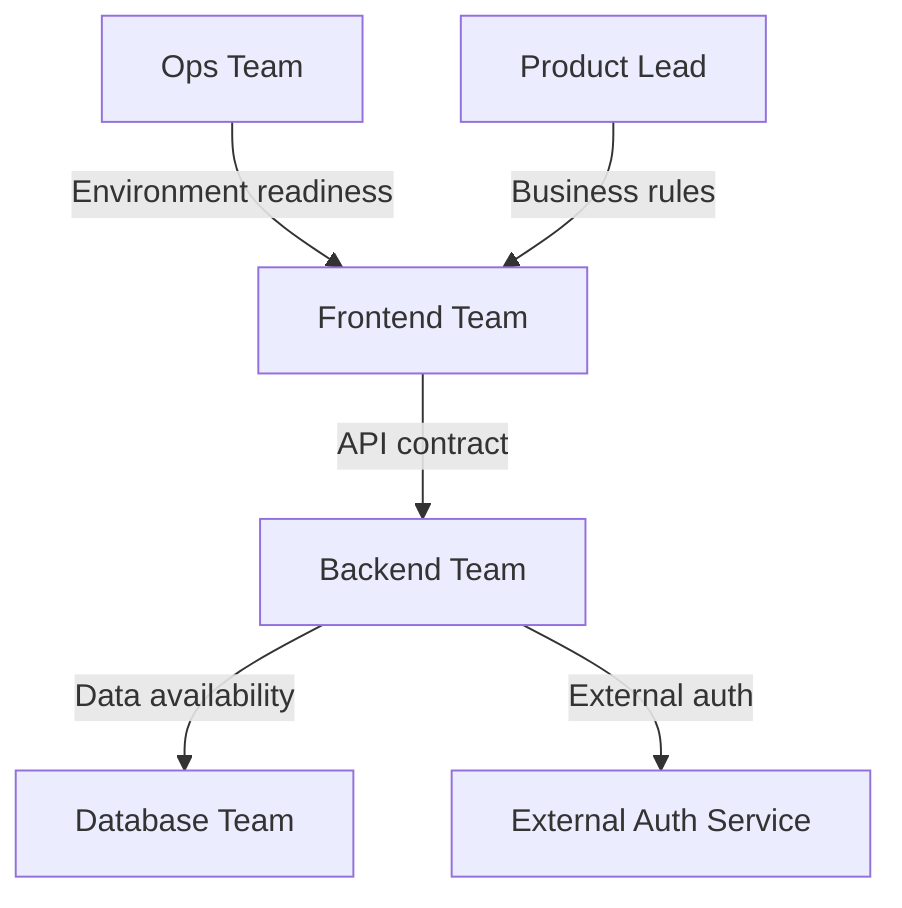
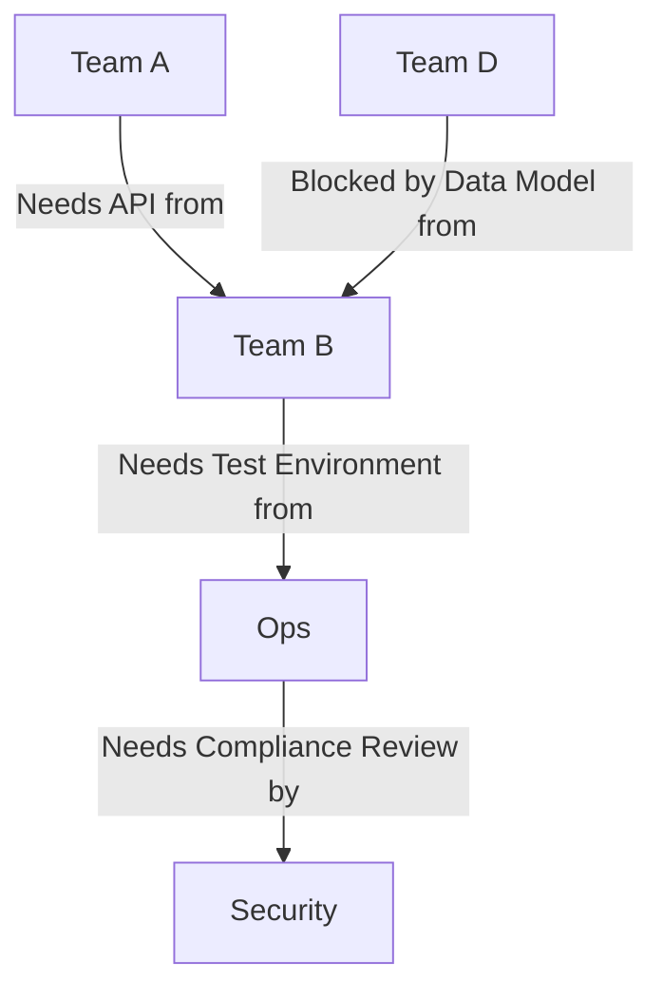
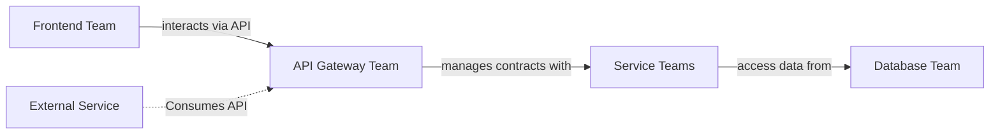
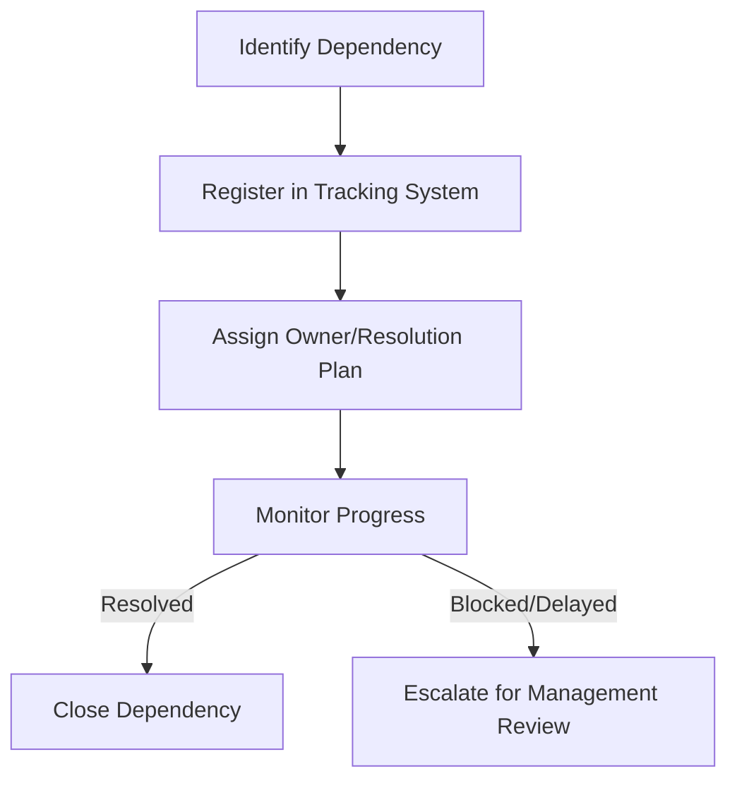
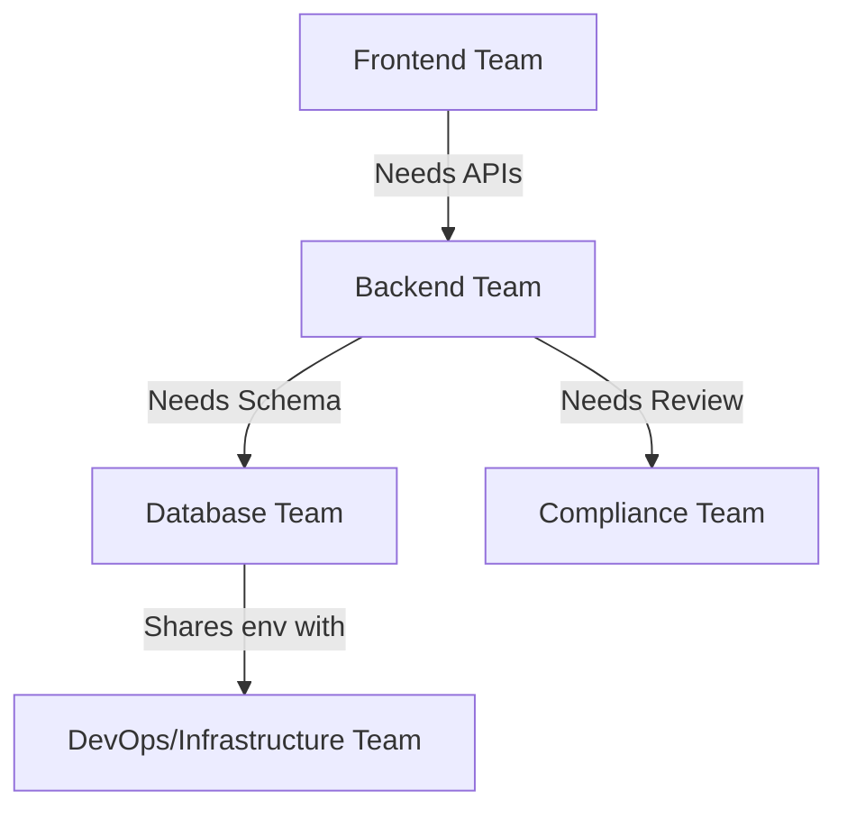

# Dependency Management in Large Programmes

## 1. Introduction

Large programmes in software development—spanning multiple teams, systems, business domains, and organizational silos—are inherently complex. One of the most persistent sources of risk, delay, and failure in such environments arises from poorly managed dependencies across teams, workflows, and technical systems. Dependency management, in this context, encompasses all strategies, techniques, and tooling required to anticipate, track, coordinate, and resolve inter-team and inter-system dependencies to minimize bottlenecks and maximize delivery throughput.

This overview provides a technically rigorous introduction to dependency management in large programmes. The document covers definitions, architectural patterns, classic workflow solutions, practical considerations, and common tools. It also explores reference practices from frameworks such as the Scaled Agile Framework (SAFe™) and industry-standard coordination models, giving engineers the foundational knowledge to reason about, architect for, and implement effective dependency management.

---

## 2. Definition and Scope

**Dependency management** in large-scale software delivery refers to the systematic identification, documentation, scheduling, and resolution of cross-team, cross-system, or cross-layer dependencies in a programme composed of multiple concurrently developed features or products.

### 2.1 Types of Dependencies

Dependencies encountered in large programmes are classified as:

- **Technical Dependencies**: Code or component-level dependencies (e.g., Team A needs an API from Team B).
- **Organizational Dependencies**: Human and process dependencies (e.g., Team X requires sign-off or information from Team Y).
- **Resource Dependencies**: Bottlenecks resulting from shared and limited infrastructure, environments, or specialized roles.
- **External Dependencies**: Third-parties, partners, vendors, regulatory bodies, or hard deadlines outside the programme's direct control.

### 2.2 Why Dependency Management Matters

Failing to effectively manage dependencies leads to:

- Increased risk of delivery bottlenecks
- Delays from blocked work items
- Quality degradation due to workarounds or rework
- Reduced transparency, making programme status hard to assess
- Lower team autonomy and morale

**GitHub Alert**
> ⚠️ **Important**: Unmanaged dependencies are a leading cause of critical-path bottlenecks in large-scale agile software deliveries. Early identification and rigorous management are essential.

---

## 3. Core Concepts

### 3.1 Dependency Identification

First and foremost, dependencies must be identified proactively. This process typically involves:

- Backlog refinement and joint planning sessions (e.g., Big Room/PI Planning in SAFe)
- Architectural scoping and mapping
- Ongoing reviews as work is decomposed into stories/tasks

**Mermaid Example: Dependency Types in a Large Programme**

### 3.2 Dependency Registration and Visualization

Registered dependencies should be tracked using artefacts such as dependency boards, matrices, or digital tools (e.g., JIRA Advanced Roadmaps, Azure DevOps Delivery Plans). Visualizing dependencies makes bottlenecks, handoffs, and risks clear.

**Mermaid Example: Simple Dependency Matrix Representation**

### 3.3 Dependency Classification and Risk Assessment

Every dependency should be classified by:

- **Criticality** (blocking vs. non-blocking)
- **Stability** (well-defined contract vs. evolving interface)
- **Risk Profile** (likelihood of impact, externality, etc.)

This assessment is key to prioritization and risk management strategies.

---

## 4. Programme Architecture and Organizational Models

### 4.1 Architecture Patterns to Minimize Dependencies

Effective dependency management begins at the architectural level. Key approaches:

- **Loosely Coupled Architectures**: Clear interface contracts, decoupled modules, and microservices patterns reduce direct code and deployment dependencies.
- **API-First and Contract-First Development**: Teams design and agree on interface specifications early, enabling parallel work and decoupling.
- **Platform and Service Layering**: Well-defined layers buffer dependencies (e.g., front-end ↔ API ↔ services ↔ data).

**Mermaid Example: Layered System Minimizing Cross-Team Dependencies**

### 4.2 Organizational Coordination Models

Organizing teams and work to reduce dependency friction:

- **Feature Teams vs. Component Teams**: Feature teams own vertical slices, reducing cross-team dependencies for single features.
- **Agile Release Trains (SAFe)**: Larger units of cross-functional teams align to a shared delivery cadence, making dependencies predictable and manageable.
- **Communities of Practice/Expertise**: Centralize complex knowledge and provide advice rather than direct ownership to minimize blocking.

---

## 5. Dependency Management Workflows

### 5.1 Sprint- and Release-Level Planning

Dependencies should be surfaced and agreed during planning events:

- **Sprint Planning (Scrum)**: Teams identify blockers and negotiate resolution strategies.
- **Programme Increment (PI) Planning (SAFe)**: Cross-team dependencies are mapped out, scheduled, and tracked over multi-sprint increments.

### 5.2 Ongoing Tracking and Resolution

- **Dependency Boards**: Physical or digital boards tracking in-flight dependencies, typically as swimlanes or card grids.
- **Automated Notification and Alerting**: Integration with backlog tools for real-time updates when dependencies shift or resolve.
- **Dependency Resolution Meetings**: Dedicated ceremonies (e.g., Scrum-of-Scrums) for escalations and coordinated resolution.

**Mermaid Example: Dependency Resolution Workflow**

### 5.3 Integration Points

Dependencies often surface at:

- **Code Integration/User Acceptance Testing (UAT) Gates**
- **Shared Environment Usage**
- **Major Milestones (e.g., releases, regulatory reviews)**

Tracking these integration points is critical to avoid late surprises.

---

## 6. Performance, Scaling, and Tooling Considerations

### 6.1 Tooling

**Common Tools for Dependency Management**

- Jira Advanced Roadmaps: Visualizes delivery plans and cross-team dependencies
- Azure DevOps Delivery Plans: Timeline-based visualization
- Custom Kanban or Gantt charts
- Spreadsheets (for small or legacy environments)

**Features to Assess**

- Ease of dependency linkage between backlog items
- Alerting and automation options
- Visualization and reporting capabilities
- Support for both internal and external dependencies

### 6.2 Scaling Considerations

As the number of teams and deliverables increases, dependency management must scale:

- **Automated Parsing and Linking**: Utilizing APIs to detect cross-team linkages and send automated alerts
- **Standardized Taxonomies**: Consistent naming, tagging, and conventions across teams
- **Decentralized Self-Service Models**: Empowering teams to register and negotiate dependencies directly, supported by central governance

**GitHub Alert**
> 💡 **Tip**: Over-centralized dependency management rapidly becomes a bottleneck at scale. Prefer decentralized, tool-supported self-service models accompanied by lightweight governance.

---

## 7. Practical Challenges and Pitfalls

### 7.1 Common Pitfalls

- **Late Identification**: Dependencies remain undetected until work is blocked or delayed.
- **Overly Complex Tracking**: Exhaustive matrices become hard to maintain and are ignored.
- **Cultural Friction**: Teams hesitate to raise dependency risks for fear of blame or reprisal.
- **Ambiguous Ownership**: No clear party is responsible for driving dependency resolution.
- **Poor Visibility**: No shared view of open/blocking dependencies.

### 7.2 Mitigation Strategies

- **Early and Proactive Transparency**: Foster environments where raising dependencies is rewarded.
- **Clear Ownership Assignment**: Every dependency has a defined owner and direct escalation path.
- **Regular Review and Grooming**: Dependency boards and risk matrices must be living artefacts.
- **Effective Tooling**: Make it as easy as possible to register, track, and visualize dependencies.
- **Continuous Education**: All stakeholders capable of identifying dependencies must understand the processes and tools.

---

## 8. Standards, Frameworks, and Industry References

Several industry standards and frameworks address or intersect with dependency management:

- **Scaled Agile Framework (SAFe)**: Specifies explicit mechanisms (PI Planning, Dependency Boards, ARTs) for cross-team dependency management.
- **Scrum@Scale and LeSS**: Both frameworks address cross-team planning and impediment removal, albeit at different organizational scales.
- **DevOps and CI/CD Pipelines**: Impose architectural and tooling requirements that often highlight or automate the management of technical dependencies.
- **Backlog Management/Work Item Hierarchies**: Hierarchical backlog items (epics, features, stories) are instrumental in tracking and cascading dependencies.

No single RFC, ISO, or protocol exists covering dependency management, but patterns are well-established via the above frameworks, and best practices are evolving in fast-moving technical organizations.

---

## 9. Case Study Example: Agile Programme with API Dependencies

**Programme Scenario:**  
Three agile teams—Frontend, Backend, and Database—must deliver an integrated financial product, where the Frontend depends on Backend APIs, and the Backend requires a new schema from the Database team. A compliance review is externally scheduled and not negotiable.

**Mermaid Example: Integrated Delivery Dependencies**

### Walkthrough

1. **Dependencies are identified** during joint PI Planning, registered using JIRA Advanced Roadmaps.
2. **Dependency owners assigned** (e.g., Backend Lead for API contract delivery).
3. Backend-Database API contract agreed and scheduled to complete before Backend’s acceptance window.
4. Regular **Scrum-of-Scrum meetings** enable escalation of risks (e.g., Backend is blocked waiting for schema; resolution plan is accelerated migration).
5. **Compliance dependency tracked** as a fixed-date delivery, with prioritized work to ensure readiness for review.
6. **Post-implementation review** identifies that earlier registration of external audit requirements would have reduced last-minute risk.

---

## 10. Conclusion

Dependency management in large programmes is a foundational discipline for effective, predictable delivery. It requires:

- Proactive identification and registration of all technical, organizational, resource, and external dependencies
- Well-chosen architectures and organizational models to minimize and decouple dependencies
- Robust tooling and workflows for tracking, visualization, and escalation
- Cultural norms that reward transparency and rapid resolution
- Periodic review of processes to continuously adapt to programme changes and lessons learned

Rigorous dependency management reduces bottlenecks, lowers risk, and improves throughput in complex, multi-team environments. As software organizations scale, the importance—and engineering challenge—of dependency management only increases, making it an essential area of expertise for any engineer working in, or leading, large programmes.

---

## 11. Additional Diagrams (Suggestions)

**Note**
> Diagram to be added later: Example of dependency board swimlane visualization for multiple teams and workstreams.

**Note**
> Diagram to be added later: Gantt representation overlaying team deliverables and dependencies to highlight critical path.

---

_End of document._