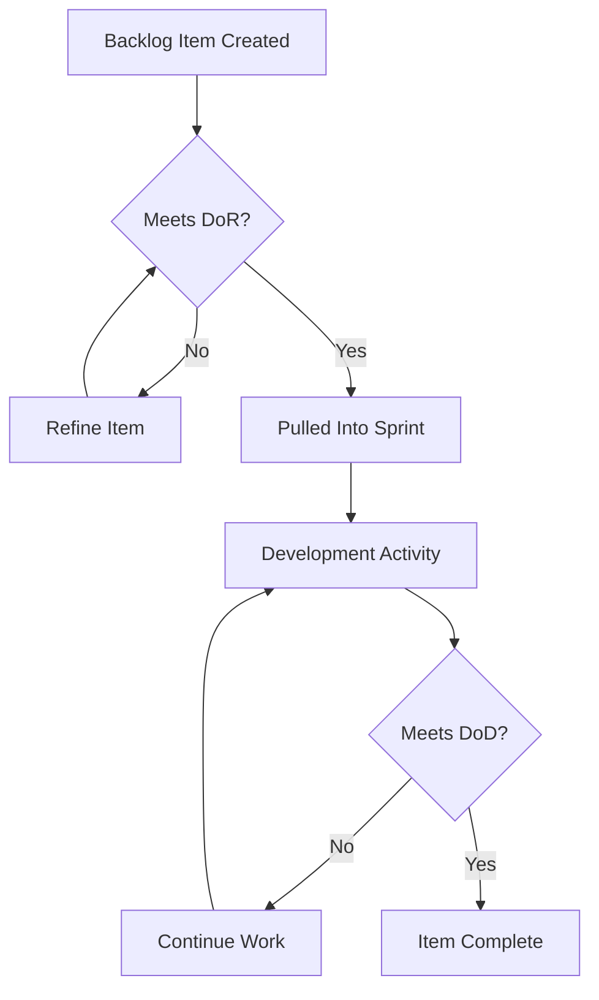
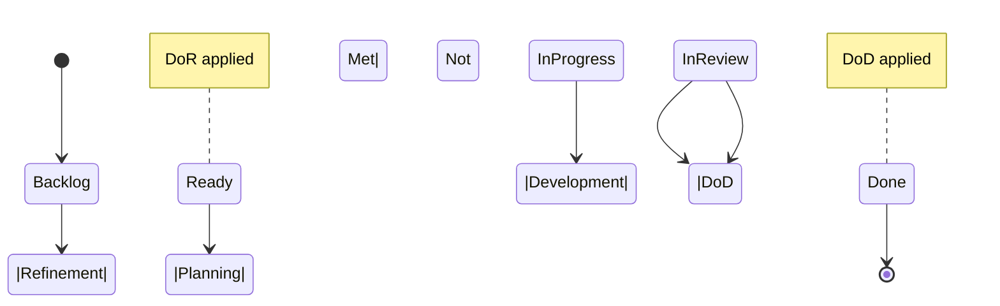

# Definition of Ready (DoR) and Definition of Done (DoD)

## Introduction

Efficient software delivery requires well-defined checkpoints that ensure clarity and consistency in the execution of work. In agile practices—especially Scrum and related iterative development methodologies—the *Definition of Ready* (DoR) and *Definition of Done* (DoD) serve as structured quality gates that guide teams in starting and completing work with shared understanding and measurable standards.

DoR and DoD are not optional nor arbitrary: they are engineered artifacts designed to reduce ambiguity, enforce transparency, and uphold quality across product backlogs, development activities, and delivery milestones. This primer introduces both concepts, highlights their importance, provides standard implementation guidelines, and discusses practical considerations relevant to engineering teams.

---

## Context and Motivation

Product development at scale requires multiple contributors to align on what it means for work to *begin* and subsequently to be *complete*. Problems such as incomplete requirements, ambiguous acceptance criteria, or varying quality expectations can hinder progress, introduce defects, and degrade delivery predictability. DoR and DoD mitigate these risks by codifying entry and exit criteria for work items—typically at the level of user stories, features, or tasks.

Organizations commonly adopt DoR and DoD in the context of the Scrum framework, but they apply equally to other iterative and incremental methodologies, including Kanban and XP.

---

## Core Concepts

### 1. Definition of Ready (DoR)

**Definition:**
A Definition of Ready is an explicit, pre-agreed set of criteria that a product backlog item (e.g., user story, bug, feature) must satisfy before it is eligible for the team to pull into an iteration or sprint. DoR assures that work items are sufficiently understood, specified, and free from impediments at the time work is committed.

#### Typical DoR Criteria:
- The item is clearly described and unambiguous.
- Acceptance criteria are defined and testable.
- Dependencies are identified and managed.
- Estimates are available (or at least a size is assigned).
- Stakeholders have reviewed the item (if required).
- Relevant data, designs, or test assets are attached.

> [!NOTE]
> The specific DoR criteria should be collaboratively agreed upon by the delivery team and relevant stakeholders, and may evolve over time.

### 2. Definition of Done (DoD)

**Definition:**
A Definition of Done is a documented and enforced checklist of quality criteria that a product backlog item must meet to be considered complete. This definition ensures uniform quality and readiness for delivery or release.

#### Typical DoD Criteria:
- Code is written, peer-reviewed, and merged.
- Unit and integration tests are implemented and passed.
- Documentation (code comments, user guides) is updated.
- All acceptance criteria are fulfilled.
- No critical bugs exist (open or known).
- Changes are deployed to an appropriate environment (e.g., staging, production).
- Security and compliance checks are completed.

> [!WARNING]
> Failing to enforce a common DoD may result in technical debt, defects escaping to production, and misalignment between teams and stakeholders.

---

## Key Components

The canonical structure of DoR and DoD consists of:

- **Criteria List:** Specific, objective, testable checkpoints.
- **Governance Process:** Mechanisms for review, agreement, and revision of criteria.
- **Artifacts:** Documentation (on boards, wikis, or tracking systems) to make DoR/DoD visible and accessible.
- **Inspection Points:** Mandated meetings or gates where compliance is audited (e.g., backlog refinement for DoR, sprint review or code merge for DoD).

---

## Practical Workflows

The application of DoR and DoD typically follows a repeatable flow within an agile team cycle. The following Mermaid diagram captures the macro workflow involving both gates:

---

## Typical Implementation Patterns

### Backlog Refinement and DoR

During backlog grooming/refinement sessions, the team reviews upcoming items against the DoR checklist. Items failing the DoR are typically returned for further elaboration, clarification, or decomposition.

### Sprint Planning and DoR

Prior to starting a sprint or iteration, only items with “Ready” status (per DoR) are considered for commitment. This avoids carrying incomplete or ill-defined work into development cycles.

### Development Workflow and DoD

Developer workflows incorporate DoD as a set of acceptance checks before declaring an item “done.” Automated tools (CI/CD pipelines, linters, test coverage reporting) may enforce several DoD items.

### Sprint Review/Release and DoD

At release or review milestones, completed work is evaluated against the DoD. Items failing to meet the criteria are not released or demoed, maintaining quality.

---

## Constraints and Assumptions

- **Team Ownership:** DoR and DoD should be defined, reviewed, and owned by the actual delivery team—not imposed unilaterally by external stakeholders.
- **Evolvability:** Teams are expected to inspect and adapt DoR/DoD in retrospectives, balancing quality with flow efficiency.
- **Level of Application:** DoD can exist at multiple levels (story, feature, release) and must be consistently applied at the appropriate granularity.
- **Tool Support:** Most agile management tools (e.g., Jira, Azure DevOps, Trello) provide mechanisms for managing DoR/DoD enforcement.

---

## Example Criteria

### Example: Definition of Ready Checklist

| #  | Criteria                          |
|----|-----------------------------------|
| 1  | Clear Description                 |
| 2  | Acceptance Criteria Defined       |
| 3  | Dependencies Identified           |
| 4  | Size/Estimate Provided            |
| 5  | Stakeholder Review (if required)  |
| 6  | Test Data Available               |

### Example: Definition of Done Checklist

| #  | Criteria                          |
|----|-----------------------------------|
| 1  | All Acceptance Criteria Met       |
| 2  | Unit/Integration Tests Passed     |
| 3  | Code Reviewed and Approved        |
| 4  | Code Merged to Main Branch        |
| 5  | No Critical Defects/Open Bugs     |
| 6  | Deployed to Staging/Prod          |
| 7  | Documentation Updated             |

---

## Engineering Considerations

### Integration Points

- **CI/CD Pipelines:** Automate DoD verification (unit tests, static analysis, deployment checks).
- **Code Review Systems:** Integrate DoD checks into PR templates or review gates.
- **Backlog Management Tools:** Implement status flags and custom fields to track DoR compliance.

### Implementation Challenges

- **Overly Rigid Criteria:** Excessive or poorly-scoped DoR/DoD can delay work or introduce bottlenecks. Periodic review and iterative refinement are necessary.
- **Lack of Visibility:** Criteria not displayed where teams work (boards, workflow tools) may be overlooked.
- **Inconsistent Enforcement:** Without disciplined application, DoR/DoD lose value as quality gates.

### Common Pitfalls

> [!CAUTION]
> *Ignoring evolving context:* Static DoR/DoD are likely to become outdated—review at regular intervals in retrospectives.

> [!TIP]
> *Keep DoR/DoD objective and testable:* Avoid vague language; phrases like “well-designed” without clear metrics are non-actionable.

---

## Variations and Extensions

### Multi-Level DoD

Organizations may define DoD at:

- **User Story Level:** Technical and functional completeness.
- **Feature/Epic Level:** Integration, system tests, stakeholder sign-off.
- **Release Level:** Deployment, rollback plans, monitoring readiness.

### Non-Functional Criteria

DoD may be extended to include:

- Security/compliance scans performed.
- Performance benchmarks met.
- Localization/internationalization checks.
- Legal reviews or accessibility conformance.

### Cross-Team Alignment

When multiple teams work on a product, establishing *shared* DoR/DoD ensures interoperability and uniform quality across modules or services.

---

## DoR/DoD in Agile Lifecycle

The following Mermaid diagram illustrates typical touchpoints for DoR and DoD within a Scrum sprint lifecycle.

---

## Alignment with Standards and Frameworks

### Scrum Framework

The Scrum Guide (latest revision) references Definition of Done explicitly as necessary for transparency and quality. While DoR is not strictly mandated, it is an established industry best practice referenced by engineering teams and agile coaches.

### Other Frameworks

- **SAFe, LeSS:** Encourage formalization of Definition of Done to ensure multi-team quality alignment.
- **Kanban:** Supports entry/exit criteria per workflow column, analogous to DoR/DoD.

> [!NOTE]
> There are no formal RFCs or ISO standards governing DoR/DoD, but their use is widespread in agile software engineering.

---

## Diagram: DoR and DoD in Workflow States

---

## Summary

Definition of Ready (DoR) and Definition of Done (DoD) operationalize quality by instituting shared standards for when work can be started and when it can be considered complete. For engineering teams, these are fundamental guardrails that reduce ambiguity, promote alignment, and safeguard delivery quality at scale.

Systematic application, regular review, and appropriate tooling integration are key to unlocking their value—transforming subjective judgments about readiness and done-ness into objective, collaborative engineering practice.