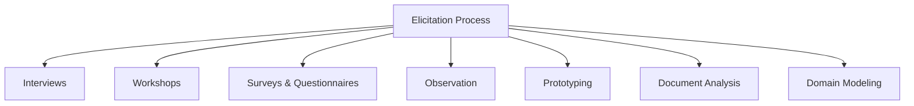
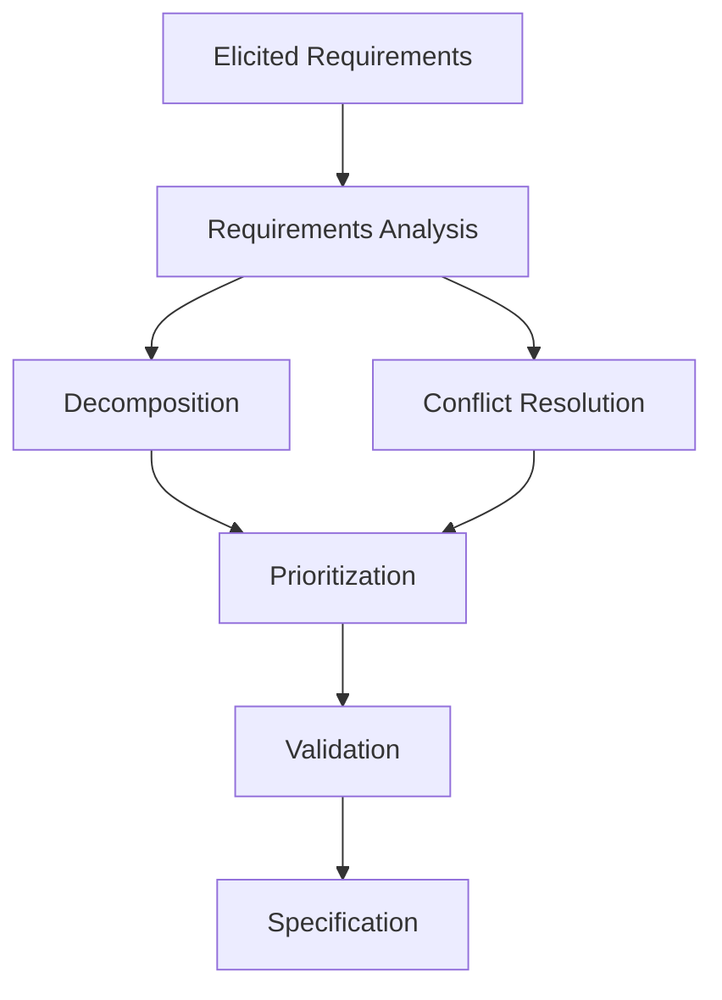
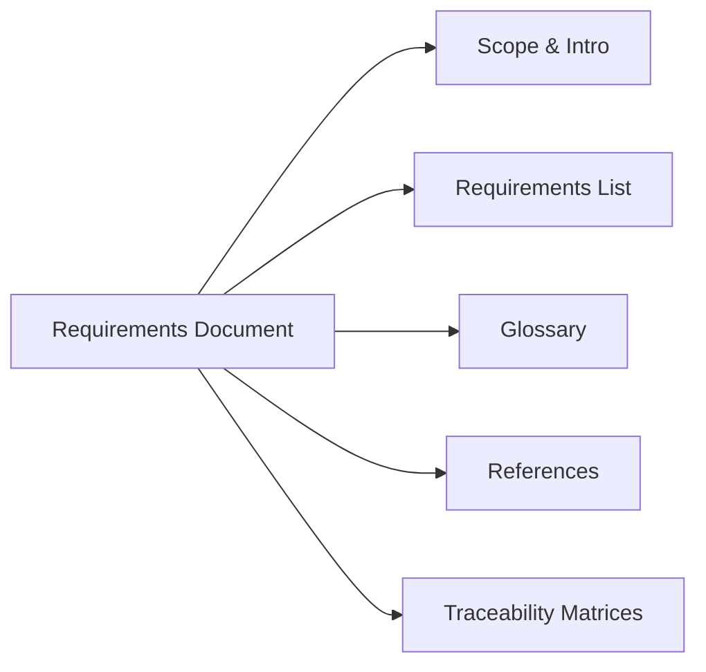
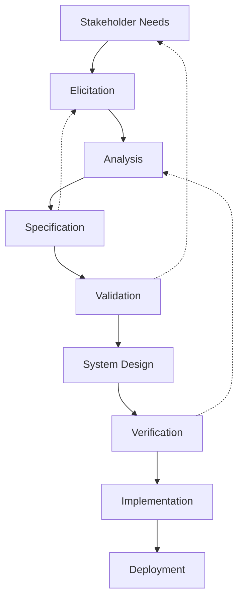

# Requirements Elicitation and Analysis

## Introduction

Requirements Elicitation and Analysis are foundational disciplines within systems and software engineering, encompassing processes aimed at identifying, capturing, clarifying, and validating the needs and constraints placed on a system. The ultimate objective is to ensure that engineered solutions align accurately with stakeholder expectations, regulatory mandates, operational contexts, and technical constraints. These processes are critical to preventing scope creep, minimizing the risk of project failure, and facilitating downstream activities such as system design, implementation, and testing.

Requirements engineering is governed by well-established standards such as IEEE 29148:2018 (Systems and Software Engineering — Life Cycle Processes — Requirements Engineering), ISO/IEC/IEEE 12207, and referenced in guidance like the BABOK (Business Analysis Body of Knowledge).

## 1. Definition and Technical Context

### 1.1 What Are Requirements?

A requirement is a singular documented physical or functional need that a particular design, product, or process must accomplish or possess. Requirements serve as the basis for system acceptance and contractual verification and are typically categorized into:

- **Functional Requirements:** Define specific system behaviors, inputs, outputs, or functions.
- **Non-Functional Requirements:** Describe quality attributes such as performance, reliability, security, scalability, and usability.
- **Constraints:** External factors that restrict design choices (e.g., regulatory statutes, hardware limitations).

### 1.2 The Role in Systems Development

Requirements Elicitation and Analysis occupy the early stages of the systems life cycle (V-Model, Waterfall, Agile, etc.). Their outputs directly feed into architecture, design, validation, and verification activities. Poor or incomplete requirements are a leading cause of project overruns and failures.

## 2. Core Concepts

Requirements Elicitation and Analysis involve several interconnected core activities:

- **Elicitation:** Systematic gathering of requirements from stakeholders and sources.
- **Analysis:** Clarification, decomposition, and prioritization of captured requirements; identification of conflicts, inconsistencies, and ambiguities.
- **Specification:** Clearly documenting requirements for use throughout the project lifecycle.
- **Validation and Verification:** Ensuring requirements are complete, consistent, feasible, and align with stakeholders’ intent.

## 3. Elicitation Techniques

### 3.1 Classification of Techniques

Requirements elicitation draws from a wide range of techniques, broadly divided as follows:

| Technique Type       | Examples                                  | Suitable For                         |
|----------------------|--------------------------------------------|--------------------------------------|
| **Interviews**       | Structured, semi-structured, unstructured | Direct stakeholder input             |
| **Workshops**        | JAD sessions, brainstorming                | Cross-functional consensus           |
| **Surveys/Questionnaires**   | Remote feedback                        | Large, geographically distributed groups |
| **Observation**      | Job shadowing, ethnographic study          | Understanding context and practices  |
| **Prototyping**      | Low/high fidelity mockups                  | Rapid feedback, clarifying needs     |
| **Document Analysis**| Reviewing existing docs, logs, artifacts   | Reverse engineering, baseline understanding |
| **Domain Modeling**  | Modeling entities, workflows               | Anchoring discussions in concepts    |

#### Mermaid Diagram: Elicitation Technique Categories

### 3.2 Choosing Techniques

Technique selection depends on project scale, stakeholder diversity, regulatory constraints, and organizational culture. Combining multiple techniques often yields the most complete requirements set.

> [!WARNING]
> Over-reliance on a single elicitation technique (such as only interviews) may result in incomplete or biased requirements. Cross-validation with multiple methods is recommended.

### 3.3 Stakeholder Identification and Engagement

Successful elicitation depends on recognizing all stakeholder classes, which may include:

- **End users**
- **Business sponsors**
- **Operations and support teams**
- **Regulatory bodies**
- **System integrators or partners**

Stakeholder maps or responsibility matrices (e.g., RACI) aid in systematically identifying and engaging relevant parties.

## 4. Requirements Analysis Practices

### 4.1 Analysis Objectives

Key objectives of analysis include:

- Removing ambiguities or contradictions
- Achieving completeness and traceability
- Decomposition (breaking down "epics" or high-level goals into actionable requirements)
- Prioritization (distinguishing "must have" from "nice to have")
- Ensuring requirements are feasible and testable

### 4.2 Requirements Attributes

Requirements are more valuable when accompanied by metadata:

- **Identifier:** Unique key for traceability
- **Description:** Clear articulation of need
- **Rationale:** Reason for requirement existence
- **Priority:** Business or technical criticality
- **Source:** Original provider or stakeholder
- **Acceptance Criteria:** Quantifiable validation

### 4.3 Analysis Techniques

- **Requirements Workshops:** Jointly analyze captured requirements.
- **Use Case and User Story Mapping:** Backlog visualization and breakdown.
- **Modeling:** Sequence diagrams, data-flow diagrams, state diagrams, entity-relationship diagrams for clarity.
- **Conflict Resolution:** Facilitated sessions to address inconsistent or infeasible requirements.
- **Prioritization Schemes:** MoSCoW (Must/Should/Could/Won’t), Kano model, or Weighted Scoring.

#### Mermaid Diagram: Requirements Analysis Flow

## 5. Requirements Specification

### 5.1 Formalization Approaches

Requirements are documented in forms such as:

- **Natural Language Specifications:** E.g., system requirements specifications (SRS) per IEEE 830 and IEEE 29148.
- **User Stories:** Typically in Agile. Follows the template “As a [role], I want [feature] so that [reason].”
- **Use Case Specifications:** Structured description of user-system interactions.
- **Formal Methods:** Notations like Z, TLA+, or formal logic for critical or safety-related systems.

> [!TIP]
> Use a requirements management tool (e.g., IBM DOORS, Jira, Azure DevOps, Jama) to support traceability, change management, and audit trails.

### 5.2 Structuring Requirements Documents

Requirements documents are organized by system domain, functional group, or product feature, with unique identifiers and cross-references. Key sections may include:

- Introduction and scope
- List of requirements (with metadata)
- Glossary and definitions
- Reference to source materials
- Traceability matrices

#### Mermaid Diagram: High-Level Requirements Specification Structure

## 6. Validation and Verification

### 6.1 Objectives

- Ensure requirements are **correct** (state stakeholder needs accurately).
- Ensure requirements are **complete** (no essential needs left out).
- Ensure requirements are **consistent** (no contradictions).
- Ensure requirements are **verifiable** (testable and measurable).

### 6.2 Validation Techniques

- **Reviews and Inspections:** Structured walkthroughs with stakeholders.
- **Prototyping:** Early system mockups to confirm understanding.
- **Test-Case Derivation:** Define acceptance tests for each requirement.
- **Model Validation:** Simulation or formal analysis for requirements modeling.

> [!NOTE]
> Validation is distinct from verification. Validation checks if the “right” system is being built; verification checks if the system is being built “right”.

## 7. Practical Workflows and Lifecycle Integration

### 7.1 Typical Workflow

Requirements Elicitation and Analysis integrate with broader engineering processes, forming an iterative feedback loop particularly in Agile or V-model lifecycles.

#### Mermaid Diagram: End-to-End Requirements Engineering Integration

### 7.2 Continuous Requirements Engineering

In Agile and DevOps, requirements engineering is ongoing. User stories are groomed and refined over multiple iterations (sprint backlogs) with regular stakeholder feedback loops.

> [!CAUTION]
> Changing requirements (requirement volatility) can derail architecture and introduce technical debt unless managed through systematic change control and traceability.

### 7.3 Tooling and Automation

- **Requirements Management Systems:** For artifact storage, versioning, change tracking, and traceability matrix generation.
- **Model-Based Systems Engineering (MBSE):** Tools like SysML support requirements modeling and automatic validation.

## 8. Key Engineering Considerations

### 8.1 Integration Points

- **Architecture:** Significant requirements should influence architectural decisions early, e.g., scalability or security constraints.
- **Testing:** Derived acceptance criteria define intended test cases (traceability from requirement to test result).
- **Project Management:** Prioritization guides incremental delivery and risk management.

### 8.2 Performance Implications

Non-functional requirements such as latency, throughput, and reliability must be specific, measurable, and testable. Ambiguity in quality attributes can result in under- or over-engineered solutions.

> [!TIP]
> Use SMART criteria (Specific, Measurable, Achievable, Relevant, Time-bound) for non-functional requirements to ensure effective downstream validation.

### 8.3 Common Pitfalls

- **Ambiguous Wording:** Leads to misinterpretation and implementation defects.
- **Missing Stakeholders:** Results in overlooked requirements or requirements that conflict with real-world practice.
- **Insufficient Traceability:** Makes impact analysis and change management difficult.
- **Scope Creep:** Additional requirements added informally without evaluation or customer approval.
- **Gold Plating:** Adding unnecessary features beyond what the requirement specifies.

## 9. Standards and Specifications

Significant references include:

- **IEEE 29148:2018:** Requirements engineering processes and requirements contents.
- **ISO/IEC/IEEE 12207:** Software life cycle processes; requirements within the context of system engineering.
- **BABOK v3:** Comprehensive guidance on business analysis, including elicitation and requirements analysis practices.
- **CMMI:** Process maturity frameworks include requirements management and development domains.

## 10. Common Variations and Extensions

- **Agile Requirements Engineering:** Focuses on lightweight, continuously evolving documentation (user stories, acceptance criteria).
- **Formal Methods:** Used in high-integrity domains (aviation, medical) to remove ambiguity and enable formal reasoning.
- **Goal-Oriented Requirements Engineering (GORE):** Models stakeholder intentions and system objectives rather than just behavioral requirements.

## 11. Conclusion

Requirements Elicitation and Analysis form a critical backbone in engineering disciplines, substantially influencing the success or failure of engineered systems. The discipline combines human factors, technical skills, and organizational processes to unambiguously capture stakeholder needs and transform them into actionable, testable, and traceable artifacts. Robust practices around elicitation, analysis, specification, validation, and verification, supported by appropriate standards and tools, are essential for delivering systems that meet user expectations, regulatory demands, and real-world operating conditions.

> [!IMPORTANT]
> Investing in rigorous requirements elicitation and analysis reduces downstream defects, scope misalignment, integration risk, and overall lifecycle cost. It is a strategic component of successful engineering management.

---

*Diagram to be added later: Example of a traceability matrix connecting requirements to architecture, implementation, and tests.*

> [!NOTE]
> For highly regulated or mission-critical domains, formal notations and automated tool support may be strictly required for compliance and auditability. 

