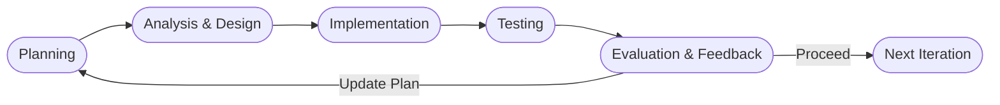
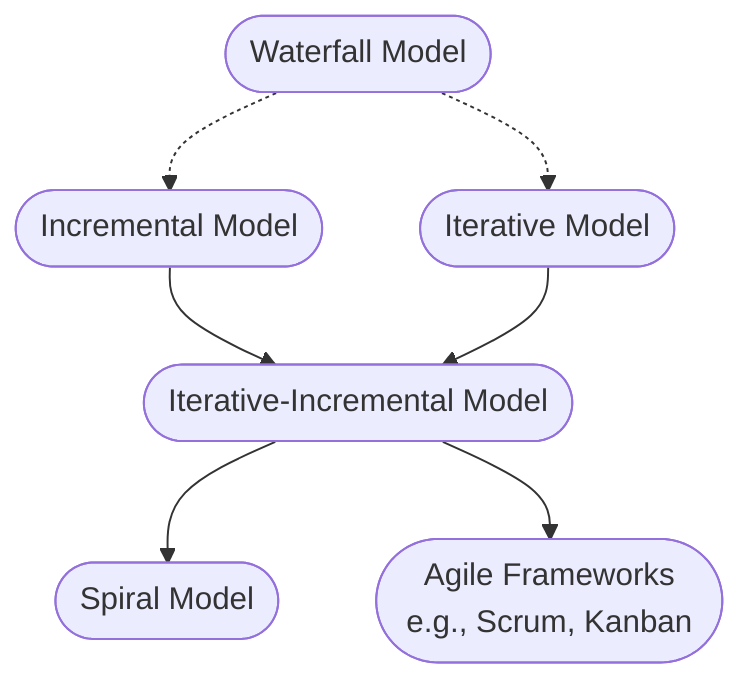
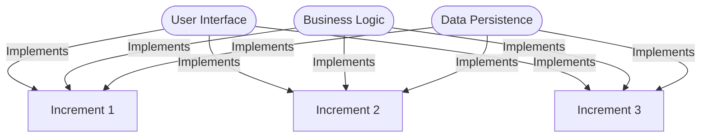
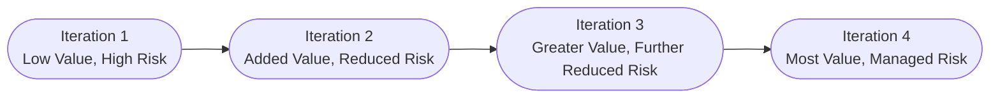

# Iterative and Incremental Development

## Introduction

Iterative and Incremental Development (IID) is a software development approach in which a system is built through repeated cycles (iteration) and in small portions at a time (increment). Each cycle produces a working version of the system, with enhancements and refinements introduced incrementally until the complete system is achieved. This process contrasts with monolithic, plan-driven models like the classic Waterfall model, which require all requirements, design, and implementation to be completed linearly.

IID is foundational to many contemporary software development methodologies and frameworks including Scrum, Kanban, Rational Unified Process (RUP), and the Spiral model. These practices support adaptability, manage complexity, and enable continuous feedback.

## Context and Historical Perspective

Iterative and Incremental Development challenges the assumption that all requirements, design decisions, and testing activities can be planned and completed up front. Early experience in software engineering—such as the development of large-scale systems for NASA and defense—highlighted the risks of rigid, sequential models.

The term "iterative" refers to the repetition of development cycles, with adjustments and improvements in each cycle. "Incremental" refers to the gradual construction of a complete system by adding functional slices over time. The combination of both principles enables teams to accommodate changing requirements, manage risk, and accelerate value delivery.

## Core Concepts

### Key Definitions

- **Iteration:** One development cycle, producing a version of the system with a subset of the overall functionality.
- **Increment:** The functional growth added to the system in each iteration.
- **Baseline:** A version of the system that serves as a stable foundation for future iterations.

### Underlying Principles

1. **Repeated Cycles:** Development proceeds in a series of iterations.
2. **Incremental Growth:** Each iteration adds new capabilities.
3. **Frequent Feedback:** Stakeholders review each increment for validation and adjustment.
4. **Continuous Learning:** The process adapts based on insights gathered in each cycle.
5. **Working Software:** Each increment results in a usable product slice.

### Diagram: High-Level IID Model

```mermaid
flowchart TD
    Start([Start])
    Iter1[Iteration 1<br>(Initial Implementation)]
    Inc1[Increment 1<br>(Functional Slice 1)]
    Iter2[Iteration 2<br>(Improvements)]
    Inc2[Increment 2<br>(Functional Slice 2)]
    Iter3[Iteration 3<br>(Enhancements)]
    Inc3[Increment 3<br>(Functional Slice 3)]
    Release[System Release]
    Start --> Iter1
    Iter1 --> Inc1
    Inc1 --> Iter2
    Iter2 --> Inc2
    Inc2 --> Iter3
    Iter3 --> Inc3
    Inc3 --> Release
```

## IID in Practice

### Workflow Overview

A typical IID lifecycle involves the following high-level activities:

1. **Planning:** Define a broad vision, identify high-level requirements, prioritize features, and plan the first iteration.
2. **Analysis & Design (per iteration):** Determine specific requirements and the technical approach for the current increment.
3. **Implementation:** Develop and integrate new or refined features.
4. **Testing:** Validate that the increment meets quality criteria and functional requirements.
5. **Evaluation & Feedback:** Stakeholders assess the working increment and provide feedback for the next cycle.
6. **Release or Deployment (optional):** The increment is shipped to end-users if suitable.

### Diagram: IID Iterative Cycle



### Architecture and Integration Points

IID approaches are frequently paired with architectures conducive to modularity, such as Service-Oriented Architecture (SOA), microservices, or layered/tiered designs. Iterations are best structured around the completion of valuable, user-facing “vertical slices,” which often entail spanning user interface, business logic, and persistence layers, as opposed to “horizontal slices,” which only cut across one layer (e.g., just the database).

**Key integration points include:**
- **Version control systems:** To manage frequent code baselines and branching.
- **Continuous Integration (CI):** To verify that newly integrated increments do not break existing functionality.
- **Automated Testing:** To ensure regressions are quickly detected during frequent iterations.

### Constraints, Assumptions, and Engineering Considerations

IID is not universally optimal. Certain project or organizational conditions influence its feasibility and effectiveness:

- **Evolving or Uncertain Requirements:** IID is most valuable where requirements are subject to change or cannot be fully specified at project onset.
- **Stakeholder Availability:** Feedback cycles require engaged stakeholders and clear communication channels.
- **Refactoring Discipline:** To accommodate iterative change, the codebase must support regular refactoring and modular extension.
- **Incremental Testability:** Each increment must be designed to be independently testable and demonstrable.
- **Architectural Agility:** Rigid, monolithic architectures can impair the ability to deliver incremental value.

> [!TIP]
> Tightly coupling increments to user-visible features (“vertical slicing”) is a common best practice to maximize value and maintain independent deployability.

> [!CAUTION]
> Neglecting architectural foresight in early iterations can result in excessive technical debt, requiring significant rework in later cycles.

## Variations and Related Models

IID encompasses a family of development models:

### 1. **Iterative Model**

Focuses on repeating the software development lifecycle in cycles, with each iteration refining the solution, regardless of whether new features are added. Each cycle may include refactoring, redesign, or retesting based on insights gained.

### 2. **Incremental Model**

Prioritizes the delivery of a series of functionally complete subsets (increments) of the software; each increment is planned upfront or added as requirements emerge.

### 3. **Iterative-Incremental Model**

Combines both strategies: software evolves by increments, and each increment is refined through multiple iterations. This hybrid is commonly implemented in agile frameworks.

### 4. **Spiral Model**

Formalizes IID by explicitly adding risk assessment and iterative prototyping in a spiral sequence. Defined by Barry Boehm, the Spiral Model integrates iterative development with systematic risk analysis.

### Diagram: Positioning IID in the SDLC Model Landscape



## Real-World Application Examples

### 1. Scrum

A widely-used agile process, Scrum is an embodiment of IID. Work progresses in timeboxed iterations called "Sprints," each delivering an increment of potentially shippable product functionality. Continuous feedback from stakeholders and regular retrospectives drive adaptation and improvement.

### 2. Rational Unified Process (RUP)

RUP formalizes IID principles by defining distinct phases and repeated iterations within each phase (Inception, Elaboration, Construction, Transition).

### 3. Kanban

Kanban is flow-based rather than strictly iterative, but supports incremental change. Features are added one-by-one as capacity becomes available, and continuous feedback is built into the process.

### 4. Large-Scale System Delivery

IID is critical in telecoms, enterprise IT, defense, and aeronautics, where complex projects cannot be rigidly specified up-front and must absorb changing requirements or discoveries with minimal disruption or rework.

## Engineering Details and Common Pitfalls

### Successful Increment and Iteration Planning

Careful scoping of each increment and iteration is essential. Slices should be thin, vertical, and user-oriented, facilitating meaningful stakeholder feedback:



> [!WARNING]
> Delivering “horizontal” increments (e.g., just UI, or just database schema) instead of end-to-end vertical features often results in non-functional, non-testable increments and provides little value to stakeholders until late in the project.

### Regression, Integration, and Quality Control

Frequent change introduces integration risk. Adopting CI/CD practices, automated regression testing, and static code analysis tools can help mitigate these risks.

> [!TIP]
> Establish baselining and rollback capabilities early. This ensures failed iterations do not compromise prior achievements.

### Refactoring Patterns

Anticipate that changing requirements can result in significant refactoring, especially in early cycles. Adopting design patterns that support modularity (e.g., Strategy, Observer, Adapter) and architectural techniques such as “clean architecture” or “hexagonal architecture” can facilitate iterative extension and decouple increments.

### Defining Done

A clear “Definition of Done” per iteration/increment is vital. This typically comprises production-quality code, associated automated tests, documentation, reviewed artifacts, and deployed/usable output.

## Standards, Specifications, and Frameworks

While IID is a process approach rather than a technical standard, it informs and is referenced by many frameworks and standards:

- **ISO/IEC/IEEE 12207:** The international standard for software lifecycle processes, which supports iterative models.
- **IEEE 1058:** Emphasizes iterative modeling and risk management in software project management plans.
- **Agile Manifesto:** Formulates core values consistent with IID.
- **Scrum Guide:** Explicitly defines iterative, incremental delivery through Sprints.
- **Rational Unified Process (RUP):** Codifies IID into process guidance adopted in regulated industries.

## Diagram: Risk Mitigation and Incremental Value



## Advantages and Limitations

### Advantages

- **Responsiveness to Change:** Accommodates evolving requirements and priorities.
- **Continuous Delivery of Value:** Stakeholders receive useful software earlier and more frequently.
- **Risk Management:** Early identification and mitigation through feedback and working increments.
- **Quality Improvement:** Continuous testing and integration increases overall quality.
- **Stakeholder Engagement:** Frequent feedback keeps development aligned with business goals.

### Limitations

- **Scope Creep:** Without stringent management, incremental changes may expand project scope.
- **Organizational Readiness:** Relies on engagement by stakeholders accustomed to adaptive planning.
- **Incomplete Early Functionality:** Early increments may offer limited features, which can be misperceived as slow progress.
- **Complexities in Architecture:** Initial underdesign may cause scaling problems; overdesign negates the benefits of adaptation.

> [!IMPORTANT]
> Successful adoption of IID requires cultural adaptation, investment in automation (CI/CD, testing), and cross-functional collaboration across engineering, QA, and product domains.

## Conclusion

Iterative and Incremental Development is a foundational approach within modern software engineering, prioritizing adaptive cycles, incremental value delivery, and continuous learning. By structuring development to embrace uncertainty and provide frequent opportunities for validation and course correction, it achieves higher resilience to change, better risk management, and stronger stakeholder alignment than linear models. Its principles underpin the majority of agile, lean, and modern SDLC methodologies. For engineering teams, effective IID adoption demands disciplined planning, sound architecture, robust integration and testing practices, and organizational support for evolutionary development.

---
