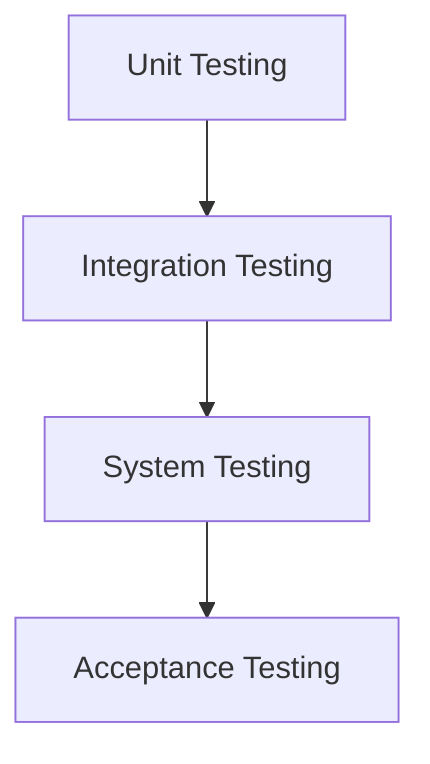
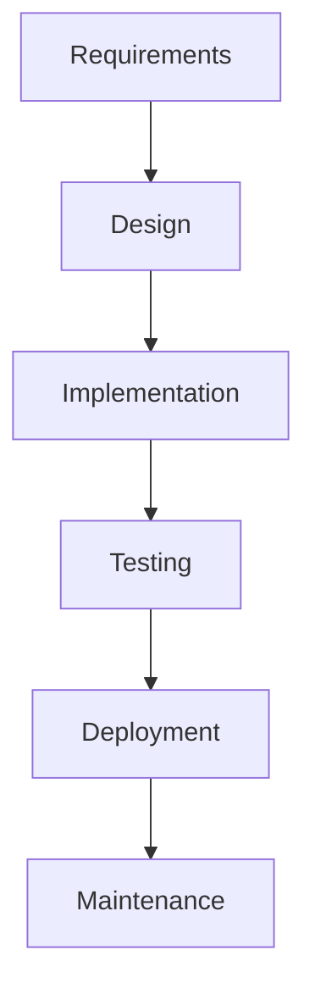
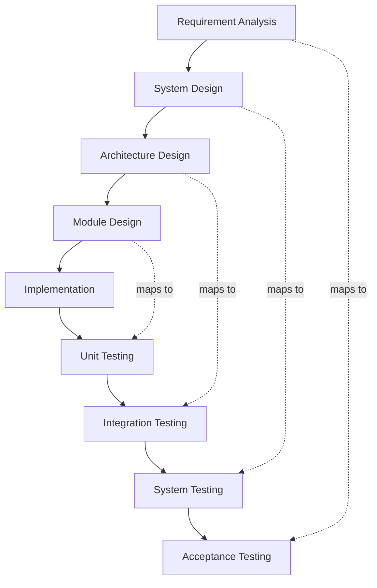
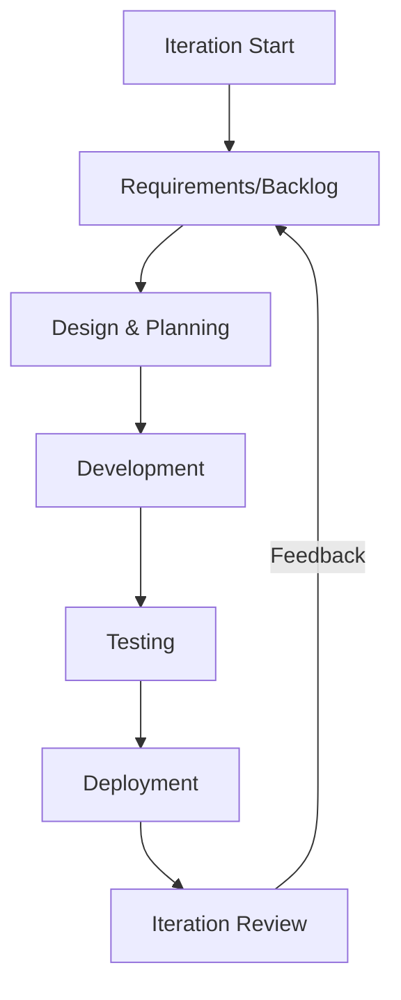

# Introduction

The Software Development Lifecycle (SDLC) is a systematic, structured process used to develop software and systems with consistency, predictability, and quality. Employed widely in engineering, SDLC prescribes distinct activities and phases from conceptualization through design, implementation, deployment, operation, and retirement. Understanding SDLC fundamentals is essential for engineers as it underpins project management, product quality, software reliability, and compliance standards.

## Definition and Context

SDLC encompasses a framework that describes the stages involved in the development, deployment, and maintenance of software systems. It is not a single model, but an umbrella term for several well-established methodologies (such as Waterfall, V-Model, and Agile) that guide engineering activities.

In software engineering, the SDLC provides:

- **Structure** for organizing complex tasks.
- **Predictability** in scheduling and resource allocation.
- **Repeatability** that enhances quality and traceability.
- **Alignment** between stakeholders across disciplines.

SDLC is fundamental to projects governed by regulatory or quality frameworks (e.g., ISO 12207, IEEE 12207, CMMI), as well as less formal but widely-adopted industry best practices.

## Core Phases of the SDLC

The SDLC decomposes software engineering work into discrete phases. While terminology varies, most models share the following high-level stages:

1. **Requirement Analysis**
2. **System/Software Design**
3. **Implementation (Coding)**
4. **Testing (Verification)**
5. **Deployment (Release)**
6. **Operation & Maintenance**

Below is a representative flowchart illustrating this sequence:

```mermaid
flowchart TD
    A[Requirement Analysis] --> B[System/Software Design]
    B --> C[Implementation (Coding)]
    C --> D[Testing (Verification)]
    D --> E[Deployment (Release)]
    E --> F[Operation & Maintenance]
```

### Phase Explanations

#### 1. Requirement Analysis

This initial phase captures, analyzes, and documents customer, business, and regulatory requirements. Outputs typically include requirements specifications, use case diagrams, and system constraints.

- **Integration Point:** Coordination with stakeholders is critical.
- **Constraint:** Ambiguity or incompleteness here results in downstream defects.
- **Standards:** IEEE 830 (Software Requirements Specification) provides relevant guidance.

#### 2. System/Software Design

This stage translates requirements into technical solutions, defining architectures, interfaces, data flows, and system interactions. Outputs include system architecture documents, component designs, and interface specifications.

- **Integration Point:** Involvement of UI/UX, infrastructure, and security architects.
- **Pitfall:** Overengineering or neglecting non-functional requirements (e.g., scalability).
- **Standards:** UML (Unified Modeling Language) often used for design artifacts.

#### 3. Implementation (Coding)

Actual code is generated according to design documents and specifications. Coding standards, code reviews, and version control are integral at this stage.

- **Integration Point:** Continuous Integration (CI) tools automate builds and initial tests.
- **Caution:** Unmanaged code drift or inadequate reviews increase risk of defects.
- **Standard:** Adherence to language-specific coding guidelines, e.g., MISRA C for safety-critical systems.

#### 4. Testing (Verification)

This phase verifies that the codebase meets requirements and design specifications. Testing activities include unit, integration, system, and acceptance testing.



- **Integration Point:** Test automation frameworks, code coverage tools.
- **Pitfall:** Incomplete or shallow test coverage undermines reliability.
- **Standard:** IEEE 829 (Test Documentation), ISTQB glossary.

#### 5. Deployment (Release)

Software is transitioned from development to a production environment. Steps include release packaging, environment configuration, and go-live support.

- **Assumption:** Infrastructure readiness and rollback plans are in place.
- **Common Variation:** Continuous Delivery/Continuous Deployment (CD/CD) pipelines.
- **Standard:** ITIL Release and Deployment Management for large enterprises.

#### 6. Operation & Maintenance

Includes monitoring, user support, issue resolution, and ongoing enhancements. This phase may persist for years, addressing both corrective and adaptive changes.

- **Constraint:** Technical debt and lack of documentation increase long-term maintenance cost.
- **Practical Decision:** End-of-life planning must be considered.

## SDLC Model Variations

While the core phases are broadly recognized, their sequencing and iteration give rise to different SDLC models. Below are the most prominent:

### Waterfall Model

A linear and sequential approach where each phase is completed before the next begins. Well-suited for projects with stable requirements.



**Properties:**
- Predictable schedules and deliverables.
- Limited flexibility for changing requirements mid-cycle.

### V-Model (Verification and Validation Model)

Extends Waterfall by mapping development phases to corresponding testing activities, emphasizing validation at every stage.



**Properties:**
- Early error detection via phase-to-phase validation.
- Rigid, with high upfront planning and documentation effort.

### Agile Models

Agile methodologies (e.g., Scrum, Kanban, Extreme Programming) structure work into small, iterative increments, incorporating regular feedback and adaptation.



**Properties:**
- Emphasizes adaptability to change, rapid delivery, and collaboration.
- Lower barrier to accommodating evolving customer needs.

**Note**
> Diagram to be added later: "Agile vs Waterfall Timeline Comparison"

### Other Models

- **Spiral** – Risk-driven cycles of planning, risk analysis, engineering, and evaluation.
- **Incremental & Iterative** – Systems built and improved through repeated cycles.
- **DevOps** – Places emphasis on automation, continuous integration/delivery, and synergy of development and operations.

## Key Concepts and Engineering Considerations

### Traceability

Maintaining mapping between requirements, design decisions, tests, and code is vital, especially in regulated industries. Requirements traceability matrices (RTM) ensure complete coverage and support impact analysis.

### Documentation

Each SDLC phase produces documents/artifacts (requirements specifications, design documents, test plans, code, user manuals). Adherence to documentation standards (IEEE, ISO) is crucial for maintainability and audits.

### Stakeholder Involvement

Effective SDLC requires proactive engagement between engineering teams, product owners, quality assurance, operations, and sometimes regulatory authorities.

> :warning: **Caution:** Lack of timely stakeholder involvement often leads to requirement misinterpretation, costly redesigns, or compliance gaps.

### Standards and Quality Assurance

SDLC process models often align with industry standards such as:

- **ISO/IEC 12207:** Standard for software lifecycle processes.
- **IEEE/EIA 12207:** US implementation.
- **CMMI (Capability Maturity Model Integration):** Maturity benchmarks for organizational processes.
- **ISO 9001:** Quality management for process improvement.

### Tooling and Automation

Modern SDLC implementations rely on integrated toolchains:

- **Requirements management:** e.g., IBM DOORS, Jira.
- **Version control:** Git, Subversion.
- **Build automation:** Jenkins, GitHub Actions.
- **Test automation:** Selenium, JUnit, pytest.
- **CI/CD pipelines:** GitLab CI, CircleCI.
- **Monitoring & Operations:** Prometheus, Grafana.

Proper tool integration enhances consistency, speeds up cycles, and enforces process adherence.

### Security and Compliance

Security requirements should be integrated from the earliest phases (“shift left”). Various standards (e.g., NIST SP 800-53, ISO 27001) may apply, especially for critical or regulated systems.

> :tada: **Tip:** Incorporate static code analysis, security testing, and compliance checks into CI/CD pipelines to reduce vulnerabilities and audit effort.

### Performance and Scalability

Selecting an SDLC model impacts ability to meet performance and scalability targets. For example, iterative models enable incremental optimization, while Waterfall may delay identification of architectural limitations until later stages.

### Common Pitfalls

- Incomplete or changing requirements.
- Overreliance on manual tasks.
- Insufficient alignment between documentation and actual implementation.
- Underestimating the importance of the maintenance phase.
- Failing to budget for technical debt or end-of-life.

## Conclusion

The Software Development Lifecycle provides a foundational reference architecture for delivering complex software and systems. While specific models and practices differ, all SDLCs emphasize well-defined stages, clear requirements and design, thorough testing, documented releases, and reliable maintenance. Selection and adaptation of an SDLC model should account for project context, risk profile, regulatory constraints, and organizational maturity. Adhering to SDLC principles enhances engineering discipline, minimizes failure risk, and contributes to predictable, quality software delivery.