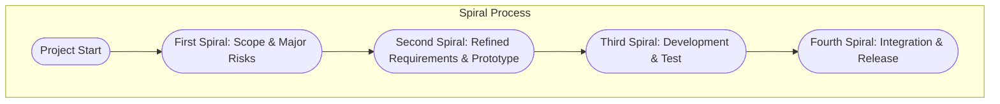

# Spiral Model: An Engineering Overview

## Introduction

The Spiral Model is a software development process that blends iterative development (prototyping) with systematic aspects of the traditional Waterfall Model. It is characterized by a risk-driven approach and is tailored to manage large, complex, and high-risk software projects. First elaborated by Barry W. Boehm in 1986, the Spiral Model introduces formal risk analysis as a central activity, differentiating it from other lifecycle models.

## Context and Position within SDLC Paradigms

Software development life cycle (SDLC) models prescribe procedures and phases for systematically developing information systems. Models such as Waterfall, V-Model, and Agile frameworks address different project characteristics and risk environments.

The Spiral Model is situated between linear models (like Waterfall) and flexible iterative methods (like Agile). It addresses the limitations of sequential models in dealing with complex, ambiguous, or high-stakes projects—especially those where requirements are not fully understood at the outset.

## Core Concepts

### Risk-Driven Approach

Risk management is foundational in the Spiral Model. Each iteration around the “spiral” is centered on:

- **Identifying risks**
- **Analyzing and prioritizing risks**
- **Mitigating risks through prototypes, simulations, or other techniques**
- **Reviewing risks with stakeholders before proceeding**

### Iterative Development

In the Spiral Model, the system is developed incrementally through repeated cycles (or “spirals”). Each spiral adds functionality or refines aspects of the system, informed by lessons and outcomes from prior cycles. This approach allows for incremental elaboration of requirements and solutions.

### Prototyping and Structured Planning

Prototyping is integral to managing uncertainty. The model incorporates stages for building prototypes or conducting experimental development. However, these occur within a rigorously planned and reviewed structure, echoing the order and discipline of classical SDLC models.

## Spiral Model Architecture

### Phases of the Spiral

Each cycle of the spiral consists of the following core quadrants:

1. **Determine Objectives, Alternatives, and Constraints**
    - Define goals and outcomes for the current loop.
    - Identify alternative approaches and constraints.

2. **Identify and Resolve Risks**
    - Perform risk assessment.
    - Select risk mitigation strategies, e.g., prototyping, simulation.

3. **Develop and Verify Deliverables**
    - Choose the most appropriate solution.
    - Develop system increments, prototypes, or components.
    - Conduct testing and verification.

4. **Plan Next Iteration**
    - Evaluate progress and process.
    - Plan the next cycle or phase.
    - Update the project plan, objectives, and risk lists.

### Spiral Model Structure (Mermaid Diagram)

## Workflow in Practice

### Typical Spiral Model Lifecycle

The Spiral Model does not fix the number of iterations. Each cycle’s scope and objectives are determined by previous progress, risk assessment outcomes, and stakeholder feedback.

A typical workflow involves:

1. **Initial Planning**: Determining project scope, initial objectives, and high-level risks.
2. **Prototype or Proof of Concept** *(if high uncertainty/risk)*: Rapid prototyping to clarify requirements.
3. **Iterative Development**: For each spiral:
    - Re-evaluate objectives.
    - Identify detailed risks and perform targeted prototyping or feasibility analyses.
    - Incrementally develop and test evolving versions.
    - Perform detailed reviews at spiral completion with stakeholders.
    - Update the plan, schedule, and risk register.
4. **Final Integration & Validation**: Final rounds of integration and acceptance testing.
5. **Deployment and Maintenance**: Conventional rollout and maintenance activities.

### Spiral Model Flow with Deliverables

## Key Components

### Risk Analysis Artifacts

- **Risk Register**: Living document identifying risks, their impact, probability, mitigation actions, and status.
- **Prototypes**: Rapid mock-ups or components to assess technical feasibility or clarify requirements.
- **Review documents**: Evidence of stakeholder evaluation and approval on completion of each cycle.

### Detailed Planning

Each cycle involves refined planning based on updated information. This includes:

- Detailed requirements for the upcoming phase
- Revised timelines and resource allocations
- Alternative approaches and contingency planning

### Stakeholder Involvement

Active stakeholder engagement is emphasized at each review point (“anchor point”). Stakeholders reassess priorities, risks, and system alignment with business goals at each cycle.

### Change Control

Since requirements and designs may be revisited after each spiral, robust configuration and change management policies are needed.

## Assumptions and Constraints

- **Critical-Risk Focus**: The project has significant technical or management risks that justify the overhead of strong risk analysis.
- **Resource Availability**: Spiral Model typically requires experienced analysts, significant stakeholder time, and potentially more project management overhead.
- **Iterative Timeframes**: Each iteration must be structured to deliver tangible value and incorporate learnings from previous spirals.

## Common Variations

### WinWin Spiral Model

An extension incorporating formal negotiation ("win conditions") with stakeholders at key anchor points. Useful where project success depends on explicit multi-party agreement (e.g., suppliers, regulators).

### Incremental-Commitment Model

Combines spiral cycles with explicitly defined points where incremental project commitments are made, supporting projects with high external dependencies or multiple partners.

## Integration Points and Engineering Considerations

### Integration with Other SDLC Models

- **Hybrid Models**: Spiral may be combined with Waterfall (for less risky phases) or with Agile methodologies for iterative, incremental delivery in later cycles.
- **Subcomponent Spiral Development**: Large projects may use spiral for subsystem development, while employing more traditional models for integration.

### Project Suitability Assessment

The Spiral Model excels in projects characterized by:

- High degree of novelty or uncertainty
- Large scale and long duration
- Ill-defined requirements or evolving user needs
- High potential for changing technology and requirements

### Tooling and Automation

Risk management and iterative planning processes may be supported using tools such as:

- Requirements management and traceability software
- Automated risk tracking tools
- Model-driven architecture (MDA) tools for rapid prototyping

### Cost and Schedule Implications

- Requires regular, scheduled risk analyses and reviews—potentially increasing project overhead.
- Mitigates the risk of catastrophic failures or expensive late changes by surfacing issues early.
- Schedules and costs can be harder to predict before the first few spiral cycles clarify risks and requirements.

> **Alert**
> When implementing the Spiral Model, underestimating the time required for stakeholder review, risk analysis, and incremental planning can result in missed deadlines and cost overruns.

## Standards and References

While the Spiral Model is a process framework rather than a formally standardized methodology, it is referenced in guidance on large-scale and critical-system development. Relevant references include:

- IEEE Std 1074: Standard for Developing a Software Project Life Cycle Process—addresses integration of risk management and iterative review principles.
- ISO/IEC/IEEE 12207: Systems and software engineering—Software life cycle processes. This standard allows for tailoring and combining iterative, risk-driven approaches.
- The original paper: Boehm, B. W. (1986). “A Spiral Model of Software Development and Enhancement,” ACM SIGSOFT Software Engineering Notes.

## Practical Implementation Challenges

### Risk Mismanagement

- Inadequate identification or mitigation planning can neutralize the Spiral Model’s core advantage.
- Superficial or checklist-driven risk analyses will lead to accumulation of hidden project risks.

### Stakeholder Fatigue

- Regular, in-depth participation is required from stakeholders. Poor engagement can result in missed requirements or late project pivots.

### Overemphasis on Prototyping

- Not all risks are best mitigated through prototyping. Effective risk reduction may require simulation, formal analysis, or third-party audits.

### Complexity in Coordination

- Large projects using multiple concurrent spirals (for subsystems) may incur overhead in integration planning.

> **Caution**
> Do not use the Spiral Model for small, low-risk projects. The overhead of frequent risk assessments and rigorous stakeholder reviews may outweigh the benefits.

### Change and Configuration Management

- Because requirements and designs evolve with every spiral, tracking changes and maintaining consistent baselines is essential.

## Spiral Model Compared to Other Lifecycle Models

### Waterfall Model

- **Waterfall** is linear and sequential—once a phase is complete, it is fixed.
- **Spiral** revisits phases cyclically, allowing for evolving requirements and continuous risk management.

### Agile Models

- **Agile** emphasizes rapid iteration, customer feedback, and lightweight processes.
- **Spiral** is more heavyweight, with emphasis on risk analysis, formal planning, and structured reviews, most suitable for large-scale, high-risk scenarios.

### Prototyping Model

- **Prototyping** produces early working models to clarify requirements.
- **Spiral** integrates prototyping (and other risk mitigation actions) within a formal risk-driven structure.

## Visualizing the Spiral Progression

### Spiral Model as Expanding Cycles

## When to Use the Spiral Model

The Spiral Model is particularly well-suited for:

- Large, complex, and mission-critical software development projects
- Projects with evolving or ambiguous requirements
- Projects with high risk and potential for significant change
- Programs where stakeholder consensus and incremental validation are required at every stage

## Summary and Key Takeaways

- The Spiral Model is a risk-driven, iterative SDLC model that integrates prototyping and structured planning.
- Each cycle (spiral) incorporates explicit risk analysis, stakeholder reviews, and contingent planning.
- Best suited to projects where requirements are uncertain, and where negative impact of risk is high.
- The model requires experienced personnel, active stakeholder participation, and robust change management procedures.
- Inappropriate for straightforward, low-risk, or rapid-development projects due to its overhead.

> **Tip**
> Early investment in training for team members on risk management and iterative planning improves the effectiveness of the Spiral Model.

## Diagram to be Added

> **Note**
> A radial "spiral" diagram showing expanding cycles, with labeled quadrants for each core activity (Objectives, Risks, Development, Planning), is typically used for visualization of the Spiral Model.
> *Diagram to be added later.*

---

This overview provides engineers with a technical grounding in the Spiral Model, highlighting its unique strengths, workflows, engineering implications, and practical considerations for adoption.