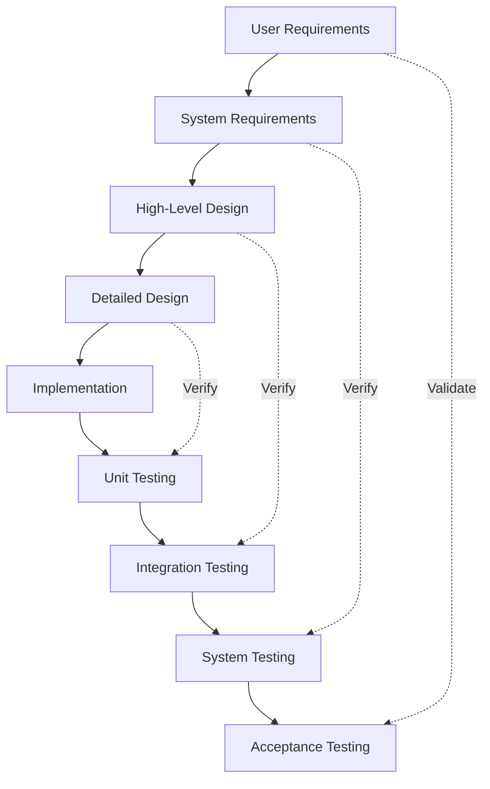
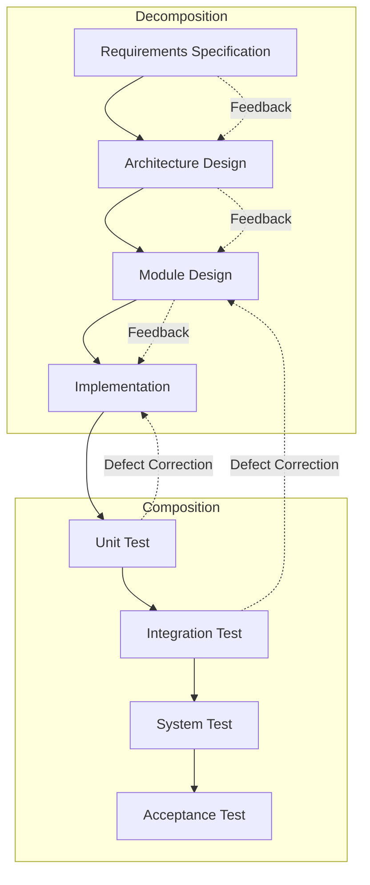

# V-Model (Software & Systems): An Engineering Overview

## Introduction

The V-Model is a widely adopted software and systems development lifecycle model emphasizing the parallel planning of verification and validation (V&V) activities throughout a project's progression. It is particularly prevalent in systems engineering domains, safety-critical industries, and projects requiring high assurance and traceability. This model complements, and is often positioned as a refinement of, the classic Waterfall Model by explicitly pairing each development stage with a corresponding test or evaluation activity, resulting in a “V”-shaped process structure.

## Context and Usage

The V-Model originated within software engineering but has since expanded into broader systems engineering and embedded systems practice, notably within fields such as aerospace (see DO-178C), automotive (ISO 26262), medical devices (IEC 62304), and defense (MIL-STD-498). Standards such as SWEBOK (Software Engineering Body of Knowledge) and INCOSE’s Systems Engineering Handbook provide further descriptions and guidelines for using the V-Model in practice.

The model is particularly valued in environments where:

- Requirements are well understood.
- Change is costly or difficult to accommodate after initial specification.
- Validation and verification rigor is a regulatory or contractual necessity.

## Core Concepts

### Structure of the V-Model

At its core, the V-Model represents the development lifecycle as a process that descends along the left side with increasing system decomposition and specification, bottoms out at implementation, and ascends the right side with progressive integration and verification.

This structure can be summarized as mirroring each left-side activity (development-related) with a matching right-side activity (test/validation-related), according to the level of system decomposition:

- **Left Side (Decomposition):** Requirements analysis, system design, architecture design, module/component design.
- **Bottom (Implementation):** Coding, realization, or construction.
- **Right Side (Integration & V&V):** Module testing, integration testing, system testing, acceptance testing.

### Fundamental Principles

1. **Paired Activities:** Each level of specification must be traceable to a corresponding verification activity.
2. **Early Test Planning:** Test plans, cases, and criteria are defined in conjunction with, not after, specification activities.
3. **Emphasis on Traceability:** Requirements, design, and verification artifacts are tightly linked.
4. **Verification vs. Validation Distinction:** Verification refers to building the system correctly per specifications; validation refers to ensuring the system fulfills intended use.

## The V-Model Lifecycle in Detail

The standard instantiation of the V-Model involves the following main phases:

### 1. Requirements Analysis

- **Objective:** Capture and analyze the needs and demands of stakeholders.
- **Artifacts:** System requirements specification (SRS).

### 2. System Design

- **Objective:** Translate high-level requirements into a conceptual architecture defining major subsystems and their interactions.
- **Artifacts:** Architectural design documents, interface control documents.

### 3. Subsystem/Module Design

- **Objective:** Decompose the system into functional modules/components for realization.
- **Artifacts:** Detailed design specifications.

### 4. Implementation or Realization

- **Objective:** Coding, fabrication, or construction of each module/component according to design specifications.

### 5. Unit/Module Testing

- **Objective:** Verify each module/component against its detailed design.

### 6. Integration Testing

- **Objective:** Integrate components and verify their interaction and correct realization of architecture.

### 7. System Testing

- **Objective:** Test the complete system for compliance with system-level requirements.

### 8. Acceptance Testing

- **Objective:** Stakeholders validate the system against their original needs and expectations.

### Classic V-Model Process Diagram

## Variants and Adaptations

The V-Model can be adapted to various contexts and project sizes. Key variations include:

- **V-Model XT:** An extension used in German federal IT projects, encompassing project management and quality assurance activities alongside the classical V-structure.
- **Multi-V Models:** In large systems-of-systems, “nested V’s” may represent the development and integration of subsystems at varying levels of abstraction.
- **Agile-V Hybrid:** Some organizations tailor V-Model concepts for use within iterative or Agile workflows, for example, by applying the V-concept at each iteration or sprint.

## Standards and Best Practices

- **INCOSE SE Handbook:** Provides broad guidelines for V-Model implementation within systems engineering.
- **ISO/IEC/IEEE 15288 and 12207:** Standardize systems and software lifecycle processes, often depicted using V-Model notation.
- **Defense and Safety Regulations:** Many defense, medical, and automotive safety standards mandate or recommend V-Model-based processes due to their focus on V&V traceability.

## Workflow and Engineering Practices

### Traceability and Documentation

- **Requirements Traceability Matrix (RTM):** Forms the backbone of traditional V-Model implementations. Links requirements to design and verification artifacts.
- **Configuration Management:** Rigorous change control practices are essential to maintain the integrity of traceability.

### Planning and Test Development

- Test planning is conducted in parallel with requirements and design specification, not deferred to later stages.
- Test cases, procedures, and acceptance criteria are derived directly from requirements specifications.

### Integration Points and Feedback Loops

While often depicted as a strictly sequential process, practical implementations of the V-Model may incorporate limited feedback loops (“sideways arrows”) to allow for issue correction and early defect detection. Excessive iteration, however, is not a primary feature of classic V-Model philosophy.

## Practical Considerations

### Advantages

- **High Assurance:** The explicit linking of requirements to verification activities supports robust traceability and compliance with rigorous quality or safety standards.
- **Clarity:** Well-structured documentation makes onboarding, auditing, and regulatory review straightforward.
- **Risk Mitigation:** Early identification and documentation of test activities reduces downstream integration surprises.

### Limitations

- **Rigidity:** V-Model assumes stable, well-understood requirements and is less adaptive to change than iterative, incremental models.
- **Late Integration Discovery:** Issues related to systems integration may remain unnoticed until the right side of the “V.”
- **Documentation Overhead:** The assurance focus demands extensive documentation and traceability structures.

> **:warning: Warning**
>
> The V-Model is not inherently well-suited to fast-evolving projects, user experience-driven innovation, or research-centric work. Its best use cases involve projects demanding strict V&V, predictable requirements, and independent test/certification.

### Common Pitfalls

- **Inadequate Traceability:** Failure to rigorously link tests and requirements may undermine the advantages of the V-Model structure.
- **Delayed Stakeholder Feedback:** Little working software is produced until late in the process, which can delay the discovery of fundamental requirement issues.
- **Documentation Erosion:** Changes after initial baselining can create gaps in the RTM and supporting artifacts.

### Practical Tips

> **:bulb: Tip**
>
> Use requirements management tools with traceability features to automate the creation, linking, and maintenance of the RTM, especially in large-scale or regulated environments.

> **:information_source: Note**
>
> In multi-supplier or complex systems-of-systems engineering, additional integration management practices should overlay the V-Model to coordinate interactions between interfacing subcomponents.

## Comparison to Related Lifecycle Models

### Waterfall Model

The V-Model and the Waterfall Model are both linear-sequential approaches. The V-Model may be viewed as an explicit evolution of the Waterfall Model, distinguishing itself by:

- Emphasizing the simultaneous development of verification artifacts alongside development artifacts.
- Formalizing one-to-one pairing between specification and test activities.

### MBSE (Model-Based Systems Engineering)

MBSE often incorporates V-Model structures, but employs system models (such as SysML) as the source of requirements, design, and test cases, automating traceability and supporting early simulation and analysis.

### SWEBOK

SWEBOK discusses the V-Model primarily in the context of software development best practices, particularly where explicit verification and validation is critical.

## Alternative Visuals

Alternative diagrammatic representations can be used to show nested V’s in systems-of-systems or “double V” for concurrent hardware/software development:

> **Note**
>
> Diagram showing nested V’s in a multi-subsystem integration scenario to be added later.

## Integration with Other Methodologies

Although the V-Model is often portrayed as inflexible and documentation-heavy, modern practice may involve tailoring its components for integration with incremental or Agile workflows.

**Example Hybrid:** Each Agile iteration or sprint can be framed as a mini-V with its own left-side specification, development, and right-side verification activities, enhancing traceability in rapid development environments.

## Summary Table: V-Model Phases and Corresponding V&V Activities

| Development Phase    | Key Artifact                | Paired Verification/Validation Activity      | Key V&V Artifact                |
|----------------------|-----------------------------|----------------------------------------------|----------------------------------|
| Requirements         | System Requirements Spec    | Acceptance Testing                           | Acceptance Test Plan             |
| High-Level Design    | Architecture Docs           | System Testing                               | System Test Plan                 |
| Detailed/Module Design | Detailed Design Spec      | Integration/Module Testing                   | Integration/Unit Test Plan       |
| Implementation       | Source/Binary Code          | Unit Testing                                 | Unit Test Cases/Reports          |

## When to Use the V-Model

Ideal situations for V-Model adoption include:

- Safety- or mission-critical system development (aerospace, defense, automotive, medical devices)
- Projects with stringent documentation needs or external audits
- Large or distributed teams where clarity and unambiguous traceability are mandatory

In less regulated or highly dynamic environments, consider lighter or more agile lifecycle models, or integrate V-Model components selectively.

## Conclusion

The V-Model remains a cornerstone methodology in regulated, high-assurance, and systems engineering contexts due to its focus on traceability and rigorous verification/validation coupling. While its classical form remains most applicable in stable, predictable domains, thoughtful adaptation allows the underlying principles of the V-Model to be beneficial even within hybrid or evolving lifecycles.

Engineers adopting the V-Model should be aware of both its strengths and limitations, ensuring alignment with organizational, technical, and regulatory requirements to maximize its value in practice.