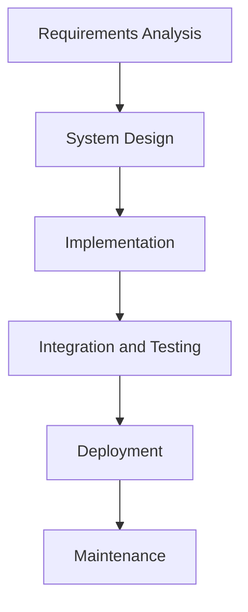
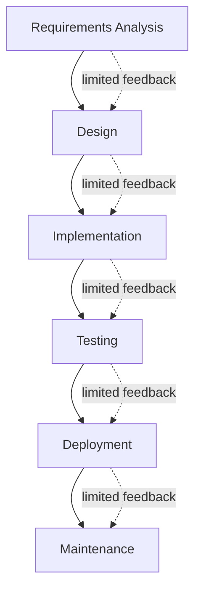
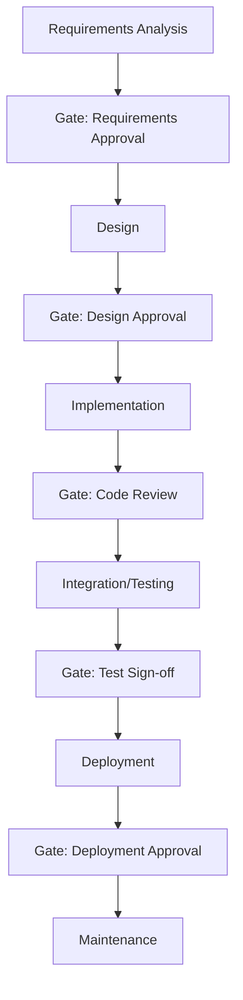
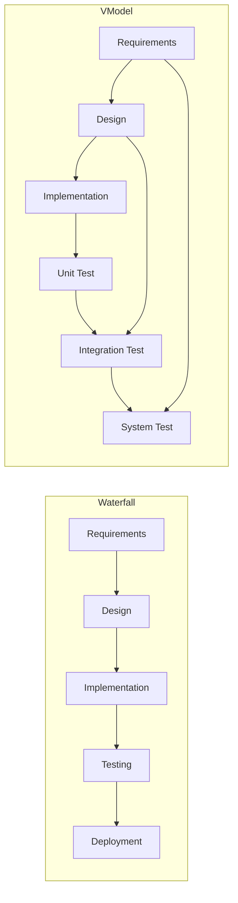

# Waterfall Model: Engineering Overview

The Waterfall Model is one of the earliest systematic methodologies used in software engineering and systems development. It presents a linear, sequential approach to the Software Development Life Cycle (SDLC), wherein each phase must be completed before the next phase begins, and there is minimal or no overlap between phases. Its plan-driven, phase-based structure ensures formalized documentation and rigorous control over progress, which is especially critical in industries requiring predictable workflows and traceability (e.g., aerospace, defense, healthcare).

## 1. Definition and Historical Context

The Waterfall Model was formally described by Dr. Winston W. Royce in 1970, in the context of managing large-scale software projects, particularly for the U.S. Department of Defense. While Royce originally intended to illustrate the limitations of strictly sequential development, the model was subsequently adopted—sometimes rigidly—for its simplicity and perceived clarity.

**Key Characteristics:**
- Highly structured, phase-dependent progression.
- Rigid entrance and exit criteria for phases.
- Strong emphasis on documentation.
- Assumes requirements are well understood and stable.

The Waterfall Model is often referenced in standards and guidelines for mission-critical and regulated software, such as IEEE 12207 and MIL-STD-498.

## 2. Core Concepts and Phases

The Waterfall approach segments the SDLC into consecutive, clearly defined stages. While the exact number of phases can vary, the canonical form generally includes the following:

1. **Requirements Analysis**
2. **System Design**
3. **Implementation (Coding)**
4. **Integration and Testing**
5. **Deployment (Installation)**
6. **Maintenance**

Each phase represents a distinct set of activities and deliverables.

### Mermaid Diagram: Waterfall Model Phases

#### 2.1 Requirements Analysis

- Formal gathering, documentation, and validation of functional and non-functional requirements.
- Output: Requirements Specification Document (often SRS - Software Requirements Specification).
- Stakeholders: Customers, users, business analysts, regulatory bodies.

#### 2.2 System Design

- Transformation of requirements into high-level (architectural) and detailed designs.
- Activities: Data models, interface specifications, system architecture, module decomposition.
- Output: Design Documents (often including High-Level Design [HLD] and Low-Level Design [LLD]).

#### 2.3 Implementation (Coding)

- Actual development/coding according to the design specifications.
- Focused on producing source code modules that meet the design requirements.
- Input: Design Documents; Output: Source code and executable components.

#### 2.4 Integration and Testing

- Systematic assembly and testing of modules to ensure functional correctness and compliance with requirements.
- Includes different testing stages: unit, integration, system, and acceptance testing.
- Output: Test Reports; validated, ready-to-deploy software.

#### 2.5 Deployment (Installation)

- Delivery and installation of the software system into the live environment.
- May involve data migration, environment configuration, and end-user training.

#### 2.6 Maintenance

- Addressing issues discovered in production, managing enhancements, bug fixing, and adapting to environment or requirement changes.

## 3. Waterfall Lifecycle: Process Flow

The Waterfall Model is named for its pictorial resemblance to a waterfall, as each stage flows into the next. The overall process is strictly top-down, and revisiting previous stages is generally discouraged or costly.

### Mermaid Diagram: Waterfall Flow with Feedback

> **Note**
> 
> Some Waterfall implementations support limited feedback loops to address critical issues detected late, but these are often time-consuming and expensive.

## 4. Assumptions, Constraints, and Suitability

### 4.1 Key Assumptions

- All requirements can be captured upfront and are unlikely to change during development.
- Each phase produces distinct, consumable documentation enabling handoffs.
- The team has complete clarity on technology, domain, and constraints at project initiation.
- Quality can be inserted and verified at each discrete phase boundary.

### 4.2 Suitability

The Waterfall Model is best applied when:
- Requirements are thoroughly defined and frozen before project start.
- The technology stack is well understood and not subject to rapid change.
- The customer (or regulatory body) mandates strict documentation and review.
- The cost/impact of late changes is prohibitive.

Examples: Embedded systems in avionics, defense, medical devices, traditional manufacturing automation.

## 5. Engineering Workflow

A typical Waterfall workflow involves rigorous stagewise reviews and formal approvals.

### Mermaid Diagram: Waterfall SDLC Workflow with Phase Gates

## 6. Benefits and Drawbacks

### 6.1 Benefits

- **Predictability:** Clearly defined phases and deliverables make planning and tracking straightforward.
- **Documentation:** Strong paper trail supports regulatory, compliance, and user support requirements.
- **Discipline:** Rigorous process enforces order and phase completion, limiting scope creep.
- **Ease of Handover:** Well-specified artifacts allow distinct teams to work sequentially.

### 6.2 Drawbacks

- **Inflexibility:** Difficult and expensive to accommodate requirement or design changes after early stages.
- **Late Feedback:** Testing occurs only after build is complete, potentially revealing critical issues late.
- **Risk Management:** Risks are often not uncovered until integration and testing.
- **Customer Engagement:** Limited involvement after initial requirements phase.

> [!caution]
> Major design flaws or misunderstood requirements not evident until system integration can require significant, cost-prohibitive rework.

## 7. Comparison to Related Models

### 7.1 Waterfall vs. Iterative Models

The Waterfall Model contrasts sharply with iterative and incremental models (e.g., Spiral Model, Agile methodologies), which emphasize frequent reassessment and adaptation.

**Key differences:**
- **Waterfall:** Linear, sequential, phase-dependent; change-resistant.
- **Iterative:** Embraces evolution of requirements and permits regular reprioritization and system improvement.

### 7.2 Waterfall vs. V-Model

The V-Model (Validation and Verification Model) is often considered an extension of Waterfall. Both are phase-driven, but the V-Model introduces explicit validation steps parallel to each development phase, mapping them to corresponding test activities.

### Mermaid Diagram: Waterfall and V-Model Comparison (Simplified)

> [!tip]
> When regulatory compliance is a key concern, both Waterfall and V-Model provide traceability and auditable checkpoints.

## 8. Practical Engineering Considerations

### 8.1 Integration Points

- **Handoffs:** Integration occurs primarily at phase boundaries, requiring synchronized documentation and strong interface contracts between teams.
- **Dependency Management:** Upstream changes post-handoff are costly—early, collaborative reviews are vital.

### 8.2 Performance Implications

- Suited for mature domains where the technology stack, libraries, and platform constraints are fixed and predicted.
- Does not readily support continuous performance tuning; performance issues may not be discoverable until late testing or production maintenance.

### 8.3 Implementation Challenges

- **Requirements Volatility:** Projects with changing stakeholders, ambiguous needs, or evolving technologies may suffer setbacks.
- **Documentation Overhead:** Rigor adds value for long-lived, safety-critical systems, but can be inefficient for short, exploratory projects.
- **Testing Delays:** Late defect discovery, especially with integration bugs, can be difficult to resolve within project constraints.

> [!warning]
> Waterfall’s rigidity makes it highly unsuited for domains characterized by uncertainty, emergent requirements, or high innovation velocity (such as consumer web applications, startups, or research-driven projects).

### 8.4 Common Pitfalls

- Treating requirements gathered at project inception as immutable.
- Insufficient user engagement after requirements phase leads to solutions misaligned with user needs.
- Underestimating the time and resources required for each phase, risking schedule slippage.
- Over-reliance on documentation can hide incomplete knowledge transfer or misunderstandings.

## 9. Common Variations and Extensions

- **Modified Waterfall:** Allows limited iteration between adjacent phases (e.g., rediscovering requirements during design).
- **Waterfall with Prototyping:** Introduces prototyping within early phases to validate requirements/interface concepts.
- **Waterfall with Stage Gates:** Formalizes review milestones and go/no-go decisions at each phase boundary.

> [!note]
> Diagram showing feedback loops and stage gates in extended Waterfall variants to be added later.

## 10. Summary and Applicability

The Waterfall Model remains a foundational discipline in engineering large, predictable systems with stable requirements, formal review cycles, and a need for thorough documentation. Its methodical approach addresses oversight, standardization, and governance at the cost of adaptability and responsiveness to change.

While modern software engineering trends emphasize flexibility and iterative delivery, the Waterfall Model persists in regulated domains, contract-driven development, and environments where system reliability and traceability take precedent over speed of delivery.

Its continued relevance underscores the importance of choosing an SDLC methodology aligned to the specific context, risk tolerance, and stakeholder needs of a given engineering project.