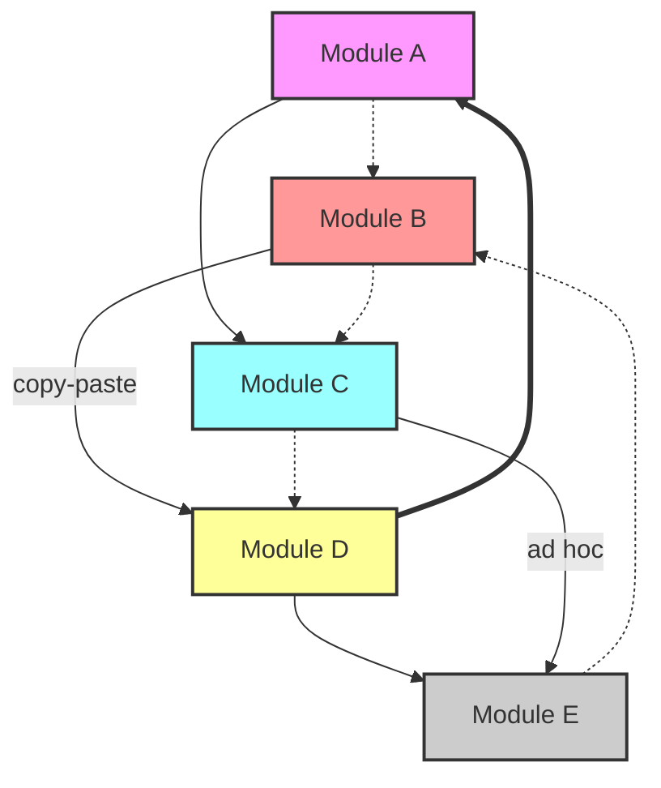
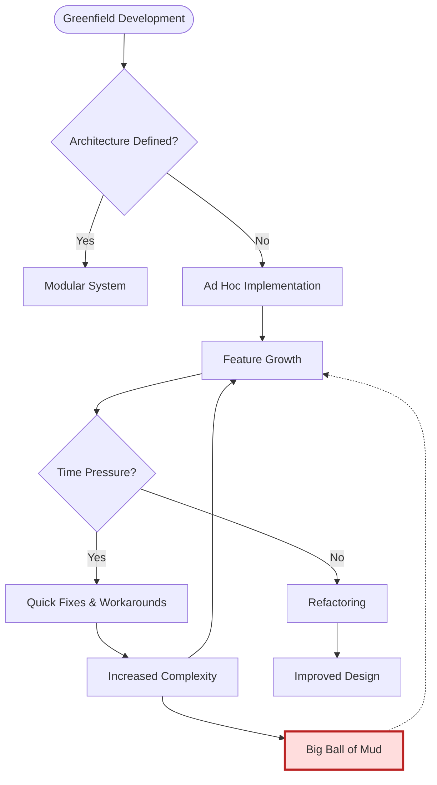
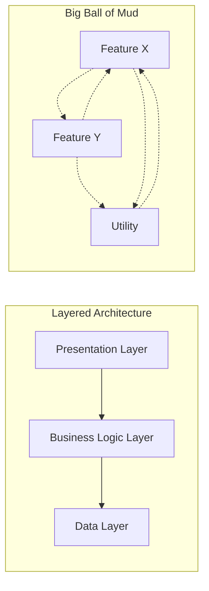
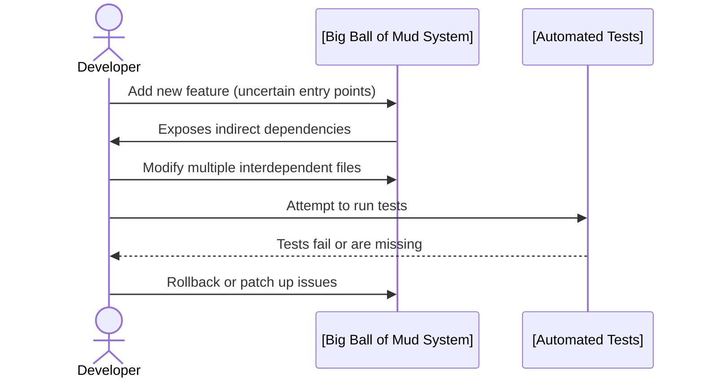

# Big Ball of Mud

## Introduction

The **Big Ball of Mud** is a well-known architectural anti-pattern describing systems with little to no discernible structure. Codebases fitting this description are typified by poor modularity, missing or incoherent boundaries, informal conventions, and an overall lack of architectural discipline. The result is a software system that, while possibly functional, is difficult to maintain, test, extend, or refactor.

This document provides an in-depth examination of the Big Ball of Mud anti-pattern, describes its symptoms and causes, outlines its impact in practical software engineering contexts, and discusses relevant engineering considerations.

## Definition and Context

A Big Ball of Mud (BBOM) is defined as:

> A system whose structure is haphazardly grown, repeatedly patched, and chaotically expanded such that its codebase resists decomposition, understanding, or reuse.

BBOM is not bound to any particular technology stack, methodology, or domain. It can afflict systems ranging from small scripts to large enterprise applications. The anti-pattern was formally documented in 1997 by Brian Foote and Joseph Yoder in their seminal paper ["Big Ball of Mud"](http://www.laputan.org/mud/mud.html).

The Big Ball of Mud is related to, but distinct from, other anti-patterns such as *Spaghetti Code* (which focuses on tangled control flows) and *Lava Flow* (which concerns outdated or abandoned code still present in production systems).

## Core Characteristics

Systems exhibiting the Big Ball of Mud anti-pattern typically demonstrate the following qualities:

- **Lack of Modularization:** Functional or logical boundaries are ill-defined or absent.
- **Inconsistent Naming and Coding Conventions:** No uniform style, leading to confusion.
- **Duplication:** Code is often copied-and-pasted and modified in separate locations.
- **Fragile Interconnections:** Tight coupling and weak encapsulation between system parts.
- **Poor Documentation:** Incomplete, outdated, or missing documentation and comments.
- **Ad Hoc Growth:** The architecture emerges as a side effect of ongoing development, rather than intentional design.

These characteristics reinforce each other, resulting in a system that is difficult to understand and maintain.

## Visualization: Typical BBOM Structure

A high-level overview of a typical Big Ball of Mud system can be represented as follows:

In this diagram, note the pervasive dependencies, ad hoc links, and cyclic relationships. The boundaries between modules are not clear, and responsibilities are not isolated.

## Causes and Contributing Factors

Several factors frequently contribute to the evolution of a Big Ball of Mud:

1. **Time and Resource Constraints:**
   - Emphasis on immediate delivery leads to architectural shortcuts.
2. **Evolving Requirements:**
   - Frequent requirement changes lead to numerous ad hoc modifications and quick fixes.
3. **Lack of Technical Leadership or Architectural Oversight:**
   - Absence of architectural vision or code stewardship.
4. **Inexperience:**
   - Teams without sufficient experience in modular, scalable design are more likely to accumulate technical debt.
5. **Organic Growth:**
   - Systems beginning as small prototypes that are incrementally expanded into production without periodic restructuring or refactoring.

## Lifecycle and Typical Workflow

A simplified flowchart of how a system might devolve into a BBOM is provided below:

In practice, projects rarely start as BBOMs. More often, it is the cumulative result of incremental, often well-intentioned, short-term decisions that prioritize progress over design integrity.

## Key Symptoms and Diagnostics

The following list summarizes common symptoms used to diagnose a BBOM in a codebase:

- **Unclear Module Boundaries:** It's hard to delineate which classes or files correspond to which business or technical concerns.
- **Circular Dependencies:** Frequent interdependent imports or references.
- **Long Chains of Modifications:** A simple change requires edits in many unrelated files.
- **Testing Difficulty:** Unit testing is either absent or ineffective, as components are difficult to isolate.
- **Frequent Merge Conflicts:** High-collision areas in version control, due to overlapping code responsibilities.
- **Onboarding Overhead:** New team members require excessive ramp-up time.

## Engineering Implications

### Maintenance Burden

The primary risk of a Big Ball of Mud is a rapidly increasing maintenance burden. Modifying any part of the system carries significant risk of side effects. Small changes frequently lead to unintended consequences elsewhere in the codebase.

### Performance Implications

Performance bugs are harder to track and optimize in BBOM systems. Inefficiencies can hide in duplicated logic or tightly coupled sections, leading to degraded performance and increased resource consumption.

### Integration and Testing Challenges

BBOM systems lack clear interfaces, making integration with external systems or components error-prone. Automated testing efforts are hampered by entangled dependencies.

### Evolution Constraints

Scaling, refactoring, or migrating such systems (e.g., to new architectures, cloud platforms, or service-oriented models) is expensive and risky due to uncontrolled interdependencies.

> **Warning**
> Attempting major refactoring without understanding the underlying structure in a BBOM often introduces new bugs—plan for staged, well-tested refactorings.

## Examples and Variations

Although BBOM is an anti-pattern, not a pattern, it can be observed in a variety of contexts:

- **Enterprise Monoliths:** Large business platforms or legacy ERP systems grown over decades.
- **Web Applications:** Older PHP, Perl, or Ruby web apps without modular frameworks.
- **Embedded Software:** Firmware where changes piled up to meet shipping deadlines.

**Variations** include:

- **Monolithic Big Ball of Mud:** A single deployable codebase with all logic intertwined.
- **Distributed Big Ball of Mud:** Even microservice architectures can devolve into a distributed BBOM if every service depends on every other, or shares data in uncontrolled ways.

## Related Patterns and Anti-Patterns

- **Spaghetti Code:** Focuses on tangled control flow, but not necessarily architectural structure.
- **Lava Flow:** Old, obsolete code that persists because it’s too risky or costly to remove.
- **God Object / God Class:** Central classes/objects responsible for excessive functionality.

> **Note**
> BBOM can coexist with other anti-patterns, compounding maintainability challenges.

## Prevention and Mitigation Strategies

The best cure is prevention, and the following engineering practices are critical:

- **Intentional Architecture and Design:** Apply layered, modular, or domain-driven designs.
- **Refactoring:** Allocate regular effort to restructure and simplify code.
- **Code Review and Stewardship:** Mandate reviews that evaluate not only correctness but also architectural impact.
- **Automated Testing:** Encourage test-driven development (TDD) and automation to catch regressions caused by structural issues.
- **Documentation:** Maintain up-to-date architectural and high-level design documentation.
- **Static Analysis:** Use tools to detect cycles, code complexity, and coupling.

> **Tip**
> Introducing architectural boundaries (using packages, modules, or services) early in development reduces the risk of BBOM formation.

## Abstracted Layered versus BBOM Structure

The contrast between a layered architecture and BBOM can be shown as follows:

Notice the clear, unidirectional dependencies in the layered approach versus the pervasive, cyclical interactions in the BBOM.

## "Why Do Big Balls of Mud Persist?"

Despite being universally disliked, BBOMs persist in industry due to:

- Short-term focus on feature delivery.
- Cost and risk associated with large-scale refactoring.
- Lack of tools or skills to restructure legacy systems.
- Business requirements vastly outpacing technical capacity.

> **Alert**
> BBOMs may be tolerated for business reasons ("it works for now"), but this incurs significant future cost and risk—often termed *technical debt*.

## Practical Example: Adding a Feature

### Layered System (Ideal):

1. Identify affected module(s).
2. Extend or modify local code only.
3. Update tests.
4. Deploy.

### BBOM System:

1. Trace through intertwined code to locate relevant logic.
2. Modify code in multiple locations, uncertain of side effects.
3. Difficulty in isolating and testing changes.
4. Higher risk of regression.

## Engineering Decision Points

Key decisions that can lead away from or toward a BBOM:

- **Enforce Module/API Boundaries:** Clear, enforced boundaries help avoid accidental integration.
- **Prioritize Architectural Integrity:** Set up and maintain architectural roadmaps.
- **Incremental Refactoring:** Favor gradual over big-bang approaches for legacy improvements.
- **Ongoing Training:** Ensure teams are familiar with principles of clean architecture.

> **Caution**
> Ignoring small architectural compromises at early stages often sets the foundation for BBOM.

## Summary Table: BBOM at a Glance

| Symptom                    | Impact                       | Prevention/Mitigation      |
|----------------------------|------------------------------|---------------------------|
| Poor modularity            | Hard to maintain/extend      | Modular design, refactor  |
| Copy-paste code            | Increased defects            | DRY principle             |
| Circular dependencies      | Build/test failures          | Decouple interfaces       |
| Unclear responsibility     | Onboarding overhead          | Documentation, reviews    |
| Ad hoc fixes               | Snowballing complexity       | Continuous improvement    |

## Conclusion

Understanding the Big Ball of Mud anti-pattern is crucial for software engineers striving to build sustainable, scalable, and maintainable systems. While inevitable in some organic codebases, awareness and application of sound engineering practices can prevent or remediate its formation. Long-term architectural thinking—backed by robust engineering disciplines, effective tooling, and management support—is essential to guard against this prevalent anti-pattern.