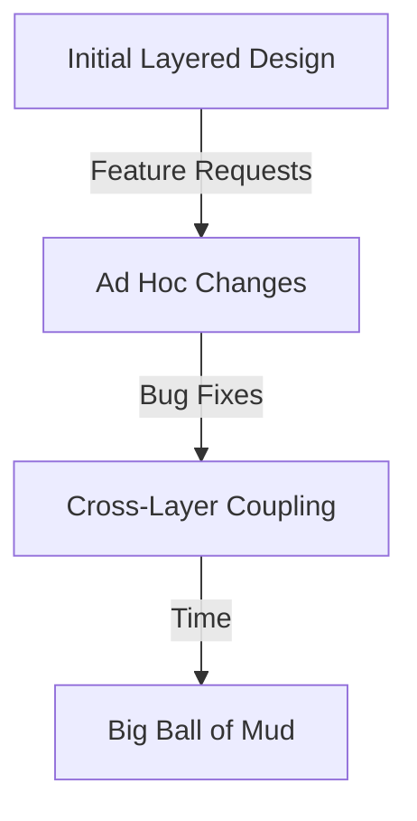
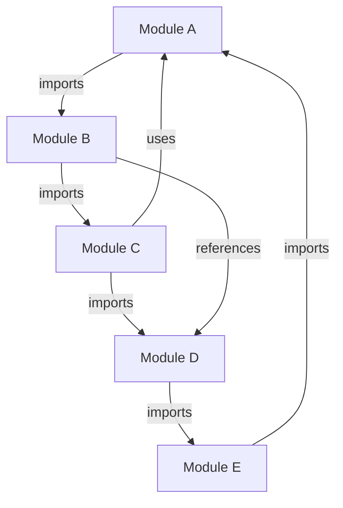

# Big Ball of Mud

## Introduction

**Big Ball of Mud** (BBOM) is a term describing a common but undesirable software architecture anti-pattern, characterized by a codebase lacking clear structure, modularity, and enforceable boundaries. The result is a sprawling, unstructured mass of code, often found in long-lived or fast-paced development environments where short-term objectives overshadow long-term maintainability and architectural discipline.

This primer analyzes the Big Ball of Mud anti-pattern: its definition, emergence, properties, technical implications, and methods of identification, along with engineering strategies for mitigation or prevention.

---

## 1. Defining the Big Ball of Mud

### 1.1. Conceptual Definition

A **Big Ball of Mud** system is typically described as:

- **Lacking architectural clarity**: No evident layering, modularization, or separation of concerns.
- **Ad hoc and expedient**: Design decisions prioritize getting things working fast, often at the expense of maintainability.
- **Eroded boundaries**: Initially defined boundaries between components, services, or modules are diminished or absent.
- **Tight coupling and high cohesion** (for the wrong reasons): Components are so tightly interdependent that even small changes propagate unpredictably.

The term originates from the influential paper ["Big Ball of Mud" by Foote and Yoder (1997)](http://www.laputan.org/mud/), which described such code as resembling a mass of tangled strings or a “spaghetti code,” emphasizing that it is the default architecture for most of the world’s software.

### 1.2. Technical Context 

- **Not a formal pattern**: Unlike architectural patterns (e.g., Layered Architecture, Microservices, Hexagonal Architecture), BBOM lacks prescribed structure or well-formed rules.
- **Common in legacy or fast-evolving systems**: Often seen in long-lived systems, prototypes that became production, or applications where requirements changed rapidly and architecture was never revisited.
- **Related anti-patterns**: Closely associated with _God Objects_, _Spaghetti Code_, and _Lava Layer_ anti-patterns.

---

## 2. Core Characteristics and Components

### 2.1. Structural Properties

The distinguishing features of a Big Ball of Mud include:

- **Missing or blurred boundaries** between modules, packages, or components
- **Intertwined business logic and technical concerns**
- **Global state** dominance (e.g., rampant use of global variables)
- **Weak or no encapsulation**
- **Pervasive code duplication**
- **Difficult-to-follow dependencies**

#### Example: Big Ball of Mud System Block Diagram

```mermaid
graph TD
  A[User Interface] --> B[BBOM Core]
  C[Database Layer] --> B
  D[External Service] --> B
  B -.-> E[Utility Code (Scattered)]
  B --> F[Shared Globals]
  BBOM[BBOM Core] -.-> BBOM
```

In contrast with layered or modular designs, communications in a BBOM system cross boundaries chaotically, and the central "core" codebase entangles interactions from all sides.

### 2.2. Lifecycle and Evolution

Big Ball of Mud architectures often result from:

- **Initial expediency**: Fast deadlines or lack of experience prompt engineers to write minimal or copy-paste code.
- **Organic growth**: Incremental expansion as new features, patches, and fixes accumulate in the same codebase, with minimal refactoring.
- **Discouraged refactoring**: Fear of breaking poorly-understood code prevents systematic cleanup.

---

## 3. How Big Ball of Mud Emerges

### 3.1. Typical Workflow from Clean to BBOM

**Initial State**: A newly structured project starts with some discipline—perhaps following well-known patterns (e.g., MVC, Hexagonal).

**Erosive Factors**:
- **Ad hoc fixes** added for urgent bugs or feature requests
- **Accreting partial refactorings** that are never finished
- **Pressure to minimize immediate costs** and defer quality

**Resulting State**: Over time, well-defined layers dissolve, cross-boundary dependencies proliferate, and understanding the code becomes progressively difficult.



#### Key Erosion Points

- Uncontrolled copying and pasting of code 
- Modification of internals from the outside
- Lack of enforcement of module boundaries
- Omission of tests or documentation, leading to uncertainty-driven "quick hacks"

---

## 4. Constraints, Engineering Implications, and Typical Variations

### 4.1. Performance and Scalability Impacts

- **Unpredictable performance**: Because responsibilities are tangled, identifying and optimizing bottlenecks becomes arduous.
- **Limited scalability**: Scaling parts of the system independently is difficult; efforts are hampered by hidden dependencies.

> :warning: **Warning**
> Attempts to improve performance or scalability in a Big Ball of Mud frequently lead to instability or regressions, since it is hard to predict the outcome of local changes.

### 4.2. Integration and Extensibility

- **Integration pain points**: External system integrations often require invasive changes through many code sections since no stable boundaries exist.
- **Poor extensibility**: Adding or replacing functionality is risky; adding new code often means inserting logic wherever it "happens to work," exacerbating the problem.

### 4.3. Maintainability Costs

- **Fragile codebase**: Seemingly trivial changes can break unrelated functionality.
- **On-boarding time**: New contributors need extraordinary effort to understand system behavior.
- **Testing difficulties**: Lacking isolation, tests often require elaborate setups or cover too much interdependent behavior.

---

## 5. Recognizing a Big Ball of Mud

### 5.1. Detection Criteria

Objectively, a codebase may fit the BBOM profile if:
- Architecture diagrams do not match the actual dependency graph.
- Most modules depend on most others.
- There is high degree of code duplication.
- There are many cyclic dependencies.
- Little or no reusable, clearly-defined abstractions exist.

#### Example: Dependency Graph with Cycles



### 5.2. Concrete Code/Design Symptoms

- The main entry point is enormous and difficult to parse.
- There are few (or no) clear interfaces or API boundaries.
- Random, non-standard naming or organization practices.
- Important logic is scattered and duplicated.
- Testability is poor; coverage is low.
- Documentation is often out of date or missing.

---

## 6. Typical Motivations and Rationalizations

### 6.1. Why Do Big Balls of Mud Appear?

- **Business urgency dominates**: Deadlines outweigh architectural consistency.
- **Unknown requirements**: “Just make it work” mentality due to rapidly changing business needs.
- **Lack of expertise or leadership**: Insufficient experience with design patterns, testing, or refactoring.
- **Accumulated legacy**: Iterative extensions on a legacy system with no time for revisiting architecture.

### 6.2. Rationalizing the BBOM

Some engineers justify a BBOM, e.g.:
- "It's just a prototype."
- "We'll clean it up later."
- "We need to move fast."
- "Only one team understands this part anyway."

> :bulb: **Tip**
> While expediency sometimes requires quick hacks, systematic accumulation of such decisions without eventual refactoring will almost always result in a Big Ball of Mud.

---

## 7. Variations, Related Anti-Patterns, and Comparison

### 7.1. Related Anti-Patterns

| Anti-Pattern          | Definition                                      | Relation to BBOM             |
|-----------------------|------------------------------------------------|------------------------------|
| God Object            | Single object that knows too much/does too much | BBOM often features multiple |
| Lava Layer            | Dead, unmodifiable code layered beneath active  | BBOM may contain lava layers |
| Spaghetti Code        | Unstructured flow, especially at code level     | BBOM is broader in scope     |

### 7.2. Common Variations

- **Gradual BBOM**: Partial layering remains but is undermined by cross-cutting changes.
- **Sudden BBOM**: A result of mergers or rushed rewrites.
- **BBOM with “Islands of Sanity”**: Some well-designed modules survive within the mass.

> :warning: **Caution**
> Even small “islands” of well-structured components can be overwhelmed by the system-wide effects of a BBOM.

---

## 8. Practical Engineering Considerations

### 8.1. Refactoring and Remediation

#### Core Approaches

- **Incremental refactoring**: Identify small, relatively isolated sections to extract into modules/services/classes with defined public interfaces.
- **Strangler Fig pattern**: Gradually replace pieces of the BBOM with better-structured components.
- **Automated testing**: Introduce/expand automated test coverage to allow safe changes.
- **Documentation updates**: Document as-is architecture and dependencies, not just intentions.

#### Example: Strangler Fig Remediation (Mermaid)

```mermaid
graph TD
  BBOM[BBOM Core] --> A[Candidate Functionality (to replace)]
  BBOM -->|New Requests| B[Refactored Module]
  A -.->|Refactoring| B
  B -->|Handles| C[Clients]
  BBOM -->|Legacy Requests| C
```

In this, new client requests are routed to refactored modules, while legacy code continues to serve old requests, until the BBOM sections are fully replaced.

### 8.2. Organizational and Process Mitigation

- **Architectural reviews**: Regular audits comparing actual codebase to intended diagrams.
- **Clear coding standards**: Enforce module ownership, interface definitions, and code review to maintain boundaries.
- **Automated static analysis**: Measure coupling, dependency cycles, code duplication.
- **Dedicated refactoring sprints**: Allocate project time specifically for cleanup.

---

## 9. Summary Table: Big Ball of Mud vs. Well-Designed System

| Attribute                    | Big Ball of Mud      | Well-Designed Architecture         |
|------------------------------|----------------------|------------------------------------|
| Modularity                   | Lacking              | High                               |
| Encapsulation                | Weak                 | Enforced                           |
| Interdependencies            | Many, tangled        | Minimal, explicit                  |
| Testability                  | Poor                 | High                               |
| Scalability                  | Difficult            | Easier                             |
| Ease of Integration          | Painful              | Predictable                        |
| Documentation                | Sparse/inaccurate    | Up-to-date                         |
| Maintainability              | Low                  | High                               |

---

## 10. When BBOM is Unavoidable

In some narrow contexts, architectural rigidity is unaffordable (e.g., early prototyping, hackathons, volatile requirements).

> :warning: **Warning**
> Without clear intent and planned remediation, any provisional BBOM rapidly becomes the permanent architecture—often to the detriment of product lifecycle, maintainability, and cost.

---

## 11. Concluding Remarks

The Big Ball of Mud is not simply a technical failure, but the aggregate result of engineering, organizational, and business expediency prioritizing short-term gains over long-term viability. Its prevalence does not imply its inevitability. Recognizing the warning signs and employing incremental refactoring, well-established architectural principles, documentation, and automated tools allows engineers to either avoid or remediate such “muddy” software systems.

In all cases, prioritizing clarity, modularity, and enforced boundaries remains the foundation for sustainable software architecture.

---

## Appendix: Diagram Placeholders

> :note: **Note**
> For specific legacy-system codebase reviews or modernization projects, additional context-specific architecture and refactoring sequence diagrams should be developed. (Diagram to be added later.)