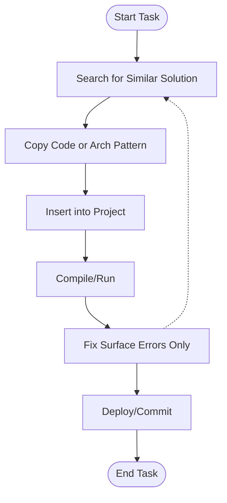
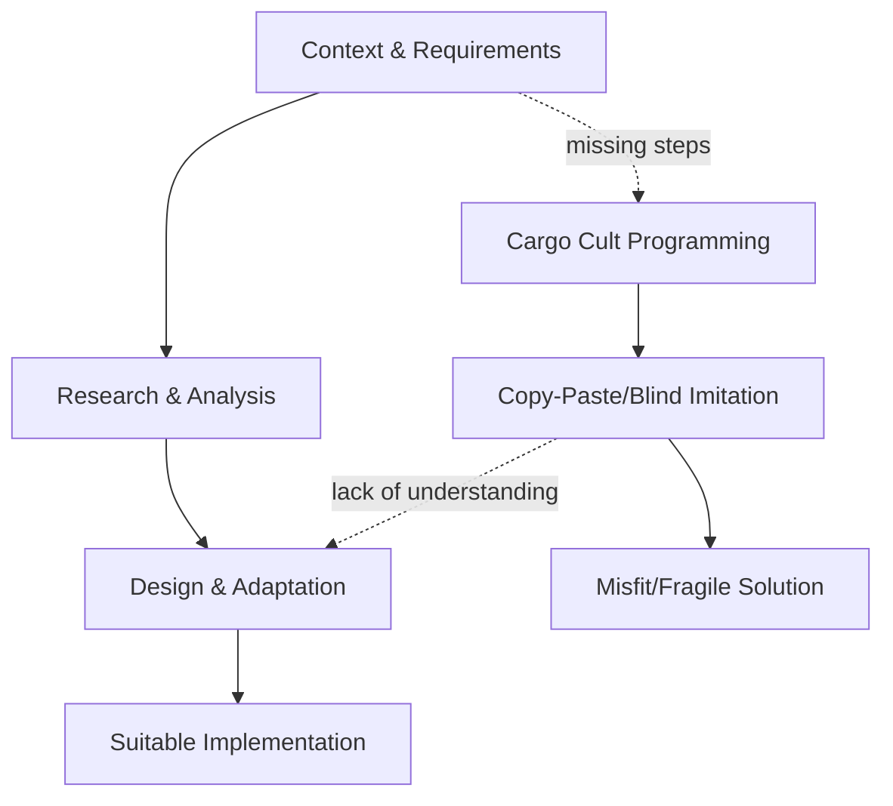

# Cargo Cult Programming

## Definition and Technical Context

Cargo cult programming refers to the practice in software engineering where programmers incorporate code structures, employ architectural patterns, or follow specific routines without understanding their underlying mechanisms, rationale, or applicability. The programmer mimics visible attributes of successful projects or mature codebases, but does so superficially—without comprehension of context or purpose.

The term itself originates from anthropological observations of Melanesian islanders during and after World War II, who built symbolic airstrips and aircraft in hopes of attracting material goods (cargo) from the sky, imitating observed actions without understanding their function. Analogously, in software, practitioners may copy code or design elements simply because they are present in other successful systems, not because those elements meet a need in the current context.

Cargo cult programming is widely recognized as an anti-pattern, meaning a common engineering practice that is counterproductive or misapplied, generally leading to increased technical debt, system fragility, reduced maintainability, and a greater potential for defects.

## Core Concepts

### 1. Blind Replication

The central attribute of cargo cult programming is replication without comprehension. This manifests in behaviors such as:

- **Copy-pasting code** from online forums, Stack Overflow, or other repositories without adapting or understanding its purpose or side effects.
- **Imitation of architectural patterns or libraries** solely because they are present in popular frameworks or in codebases perceived as successful.
- **Adoption of "best practices"** as rote rules, without contextual adjustment ([see also: design patterns and SOLID principles](https://en.wikipedia.org/wiki/SOLID)).

### 2. Lack of Contextual Awareness

Cargo cult programmers frequently fail to consider critical dimensions like:

- The business or technical requirements of the system.
- The underlying assumptions of the copied code or pattern.
- Performance, scalability, maintainability, or security implications.
- Interactions with other components or required adaptations for integration.

### 3. Surface-Level Adherence

Such programming focuses on the surface features (such as syntax, function signatures, or import statements), not on the semantic meaning or rationale.

## Typical Manifestations

Cargo cult programming can manifest at different levels of technical scope:

| Level                  | Example                                                                                 |
|------------------------|-----------------------------------------------------------------------------------------|
| Syntax/Boilerplate     | Adding unused imports, empty constructors, or redundant parameters                      |
| Algorithmic            | Using complex algorithms (e.g., sorting/graph traversals) where a simple iteration suffices|
| Architectural          | Implementing full microservice architectures for small, monolithic applications         |
| Testing                | Creating stubbed or mock tests that do not actually verify correctness                  |
| Tooling                | Integrating unnecessary libraries, frameworks, or CI/CD steps without clear benefit     |

## Practical Workflow and Lifecycles

The following flow illustrates a common cycle in which cargo cult programming emerges within a development workflow:

**Description**:  
This workflow skips fundamental phases such as *requirements analysis*, *code review for fitness*, or *system integration testing*. Instead, the cycle focuses only on “getting it to work” with minimal regard for purpose or consequences.

## Primary Engineering Constraints

Cargo cult programming is subject to several constraints and limitations:

- **Context Sensitivity**: Solutions optimal in one context may be actively harmful in another (e.g., threading models, data access patterns, or error handling strategies).
- **Hidden Assumptions**: Copy-pasted code often depends on assumptions that may not hold, like thread safety, pre-conditions, or environmental variables.
- **Integration Complexity**: Incoherent and mismatched code fragments or architectures can severely hinder integration, leading to brittle systems.
- **Maintainability**: Code that is not understood is unlikely to be maintained, improved, or debugged correctly.
- **Security and Compliance**: Blind copying can introduce vulnerabilities or breach compliance requirements if the source context differs.

## Key Pitfalls

> :warning: **Warning**
>
> Relying on cargo cult programming can introduce subtle bugs, technical debt, and security vulnerabilities that are extremely challenging to trace and debug.

## Relation to Design Patterns and Best Practices

Although cargo cult programming is often associated with the misuse of design patterns, it is the mindset, not the tools, that is problematic. Design patterns, as defined by the Gang of Four (GoF), are reusable solutions to recurring problems but require contextual tailoring.

A common failure mode is treating design patterns as mandatory recipes rather than as adaptable heuristics, leading to over-engineered solutions or architectures (e.g., inserting a Singleton or Factory where it is not justified).

## Typical Example

Suppose a developer, tasked with adding configuration management, searches for a popular configuration loader and copies its entire initialization code, including advanced dependency injection steps designed for enterprise-grade projects. In a small, single-user tool, this adds unnecessary complexity and failure points.

Another common scenario involves the indiscriminate use of multi-threaded constructs copied from an example designed for high-concurrency environments, accidentally introducing race conditions or deadlocks in a single-threaded context.

## Visualizing Implementation vs. Understanding

**Explanation:**  
The top sequence represents a considered approach: working from context to suitable implementation via research and adaptation. The lower sequence (Cargo Cult Programming) omits key steps, proceeding directly from observed example to a brittle result.

## Common Variations

- **Module/Library Cargo Cult**: Wholesale importation of large modules or third-party libraries with unused features.
- **Framework Cargo Cult**: Adopting entire frameworks because of popularity, regardless of suitability.
- **Language Parroting**: Replicating idioms or syntactic sugar seen in another language without regard for idiomatic usage in the current language.

## Detection and Prevention

Cargo cult programming is often exposed during code review, architectural discussions, or performance debugging. Systematic measures to prevent it include:

- **Code Review Checklists** that require contextual justification for external code or patterns.
- **Documentation Standards** mandating rationale for complex sections or architectural decisions.
- **Technical Mentoring** to build understanding of underlying principles.
- **Automated Static Analysis** to highlight dead code, unused imports, or anti-patterns.

> :bulb: **Tip**
>
> When uncertain about a code segment's purpose, discuss it with peers or review original documentation. Understanding is critical for correct modification or maintenance.

## Impact on Software Quality

The principal risks associated with cargo cult programming are:

- **Reduced Software Quality**: Code is less adaptive to evolving requirements.
- **Escalating Technical Debt**: Unnecessary complexity slows future development.
- **Security Exposures**: Blind code reuse can importing vulnerabilities.
- **Low Team Knowledge**: Team members may perpetuate mistakes without developing expertise.

## Summary of Engineering Recommendations

- Treat all patterns and external code as potentially context-dependent.
- Prioritize understanding above immediate synthesis.
- Use *design patterns* and *best practices* as guiding heuristics, not fixed prescriptions.
- Apply formal review and documentation to support shared comprehension.

## Summary Table: Differences Between Proper Use and Cargo Cult Programming

| Practice                 | Context-Sensitive Application | Blind Copying |
|--------------------------|------------------------------|----------------------------|
| Code Selection           | Based on requirements        | Based on superficial similarity or popularity |
| Adaptation               | Adjusted for context         | Unchanged reuse            |
| Documentation            | Explains rationale           | Lacks or copies explanations verbatim         |
| Maintenance              | Understandable, maintainable | Opaque, fragile            |
| Integration              | Smooth integration           | Frequent integration issues |

## Conclusion

Cargo cult programming is a pervasive but avoidable anti-pattern in software engineering. Its presence signals a breakdown in analytical process, contextual awareness, and individual/team learning. High-quality engineering requires practices rooted in understanding and appropriate adaptation of patterns, libraries, and codebases. Recognizing cargo cult tendencies and reorienting toward comprehension and thoughtful application fosters robust, maintainable, and effective software solutions.

---

> :information_source: **Note**
>
> For in-depth reference on proper use of design patterns, see "Design Patterns: Elements of Reusable Object-Oriented Software" by Gamma, Helm, Johnson, and Vlissides.  
> When implementing architectural templates, always perform system-level analysis to ensure alignment with project goals and constraints.