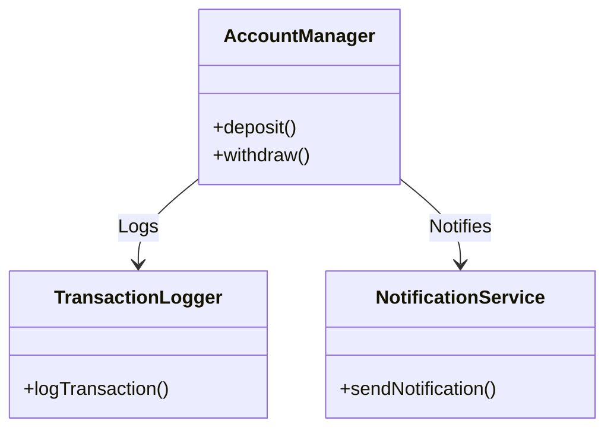
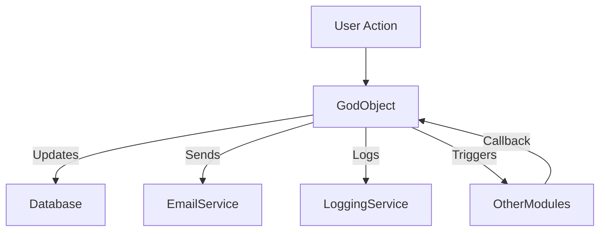
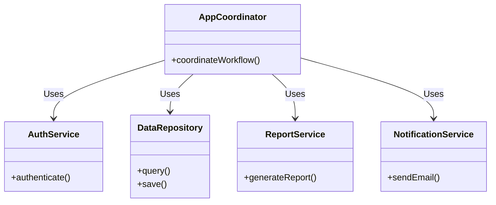

# God Object

## Introduction and Definition

A "God Object" is an anti-pattern in object-oriented software design wherein a single class or object is given excessive responsibility for a wide range of unrelated functionality, often accruing varied data and behavior that is more properly distributed among separate, cohesive entities. This concentration leads to reduced modularity, increased coupling, decreased testability, and major maintainability challenges.

The God Object violates established principles of software design, notably the [Single Responsibility Principle](https://en.wikipedia.org/wiki/Single-responsibility_principle) (SRP) of the SOLID framework, which prescribes that each class should encapsulate a single, well-defined responsibility. The anti-pattern most commonly arises in large, legacy codebases, iterative prototyping, or when maintenance and feature growth are performed without adequate refactoring or architectural oversight.

The term "God Object" is synonymous with similar anti-patterns, including "God Class" and "Blob". It is not language-specific and can be encountered in any paradigm or environment that supports aggregate objects, but is most frequent in object-oriented contexts.

## Technical Context

The God Object is discussed within the taxonomy of software engineering anti-patterns, specifically concerning object-oriented analysis and design (OOAD). Its manifestation is indicative of violated separation of concerns, poor encapsulation, and the accrual of technical debt. It often emerges in the absence of architectural vision, comprehensive refactoring, or adherence to design patterns.

Understanding the God Object is critical for software engineers concerned with clean architecture, maintainability, refactoring legacy systems, or assessing code health.

## Core Concepts and Characteristics

The God Object is characterized by several identifiable traits:

- **Excessive Responsibility**: Encompasses roles across multiple functional concerns (for example, business logic, data persistence, user interface, utility methods, etc.).
- **Artificial Centrality**: Other components become dependent on, or coordinate through, the God Object, resulting in a centralization of logic and communication.
- **Overly Large Size**: The object or class often grows to thousands of lines of code.
- **Diminished Cohesion**: Internal methods and fields are only loosely related.
- **Tight Coupling**: The object is known (directly or indirectly) to, or required by, many others; clients must interact with it to accomplish varied tasks.

These characteristics contribute to brittle architectures and systems prone to defect introduction during modification.

### Example: God Object in a Diagram

A standard model for a well-designed system encourages many small, focused classes:



Contrast with a God Object approach:

```mermaid
classDiagram
    class GodObject {
        +deposit()
        +withdraw()
        +logTransaction()
        +sendNotification()
        +processLoan()
        +calculateInterest()
        +exportData()
    }
    GodObject <.. "Many other classes" : Uses
```

In the God Object, all responsibilities are centralized, in violation of established design principles.

## Architectural Consequences

### Structural Problems

- **Poor Separation of Concerns**: Application logic is not modularized, making it difficult to track and manage feature scope.
- **Hidden Dependencies**: Internal implementation details and dependencies of the God Object proliferate, reducing encapsulation.
- **Propagation of Changes**: Modifying the God Object for a new feature or bug fix may inadvertently affect unrelated features or cause regressions.

### Maintenance and Evolution Constraints

- **Difficult Refactoring**: Each modification risks side effects spread across diverse domains the object handles.
- **Inhibited Parallel Work**: Large, central objects become a bottleneck for team collaboration due to high code-churn volatility.
- **Testing Challenges**: It is difficult to isolate, unit-test, or mock the God Object when its behavior crosscuts application concerns.

> **:warning: Warning**
> 
> Systems with prolonged existence of God Objects are likely to have slow engineering velocity, high defect rates, and high onboarding costs for new developers.

## Causes of God Object Formation

Understanding conditions that lead to God Objects is instructive for prevention:

- **Lack of Design Discipline**: Incremental addition of unrelated functionality without architectural review.
- **Tight Timelines and Rapid Prototyping**: Expedient implementations that forgo modularity checks.
- **Legacy Evolution**: Changes accumulate over time without periodic refactoring.
- **Centralized Control**: Misapplied patterns, such as Singleton, or misinterpreted MVC designs, encourage excessive centrality.

## How the God Object Works in Practice

### Typical Lifecycle

1. **Initial Design**: A class is introduced for a core purpose, e.g., handling user accounts.
2. **Feature Creep**: Related (and then, unrelated) methods and data are appended for convenience.
3. **Cross-Component Expansion**: Other modules rely on the God Object for tasks outside its original scope.
4. **Entrenchment**: Once central to the system, its interface, data, and dependencies become septate roots for all change.

### Workflow Implications

- **Central Messaging**: Non-central classes communicate through the God Object.
- **Global State**: The God Object may serve as a repository for global data and context, breaking encapsulation.
- **Difficult Extension**: Adding new features, or adapting for new platforms/layers, is hampered by the tangled nature of the object.

### Sample Workflow Diagram



This workflow demonstrates the God Object's role as a hub for numerous unrelated operations.

## Variations and Related Patterns

- **Blob**: An overly large object, similar to God Object—sometimes used interchangeably.
- **Manager Class**: A class with an ambiguous role, typically responsible for managing too many resources or subsystems.
- **Singleton God Object**: The God Object is deployed as a singleton, exacerbating state management issues and tight coupling.

### Noteworthy Counter-Examples

- **Facade Pattern**: Superficially similar, but hides complexity rather than accumulating responsibility. The facade delegates; the God Object implements.

> **:information_source: Note**
> 
> The distinction between necessary centralization (e.g., Application Kernel) and the God Object is nuanced. Application frameworks may legitimately require central orchestrators provided their responsibilities remain segregated and well-defined by interfaces.

## Detection Techniques

Detecting God Objects is feasible by both static and dynamic analysis:

- **Code Metrics**:
  - High class size (lines of code, number of methods and fields)
  - High cyclomatic complexity
  - Excessive coupling (afferent and efferent couplings)
  - Low cohesion (Lack of Cohesion in Methods - LCOM score)
- **Code Review**: Manual inspection revealing unrelated functionality within a single class.

Many static analyzers and code-quality tools (e.g., SonarQube, PMD, Checkstyle) can highlight likely God Objects.

## Engineering Considerations

### Integration Points

- **Architectural Boundary**: The God Object often straddles several architectural boundaries (business logic, persistence, presentation), complicating layer separation.
- **Dependency Spiral**: Downstream consumers of the God Object may inherit or duplicate its mixed concerns.

### Performance Implications

- **Resource Bottleneck**: As the "choke point" for system logic, the God Object can limit scalability and performance, especially under concurrent workloads.
- **Increased Memory Footprint**: Accumulated state and caches for diverse concerns grow the object's memory profile.

### Implementation Challenges

- **Refactoring Difficulty**: Remediation demands identifying and teasing apart cross-cutting concerns, often requiring behavior to move to new, focused classes.
- **Legacy Impact**: God Objects embedded in legacy systems may resist attempts to modularize due to entrenched dependencies.

> **:bulb: Tip**
> 
> Incremental refactoring strategies, such as the [Strangler Fig pattern](https://martinfowler.com/bliki/StranglerFigApplication.html), can assist in gradually replacing God Objects in critical systems.

### Common Pitfalls

- Assuming that "centralized = simplified"; in practice, complexity is hidden, not removed.
- Relying on the God Object for cross-cutting concerns (logging, security) instead of applying proper design patterns or aspect-oriented programming.

## Best Practices for Avoidance and Remediation

1. **Adhere to SOLID Principles**: Particularly, enforce the [Single Responsibility Principle](https://en.wikipedia.org/wiki/Single-responsibility_principle).
2. **Enforce Small, Cohesive Classes**: Group related functionality and data; refactor unrelated concerns into separate classes.
3. **Prefer Composition Over Inheritance**: Use delegation to distribute responsibilities.
4. **Layered Architecture**: Separate concerns into distinct application layers (e.g., UI, business logic, persistence).
5. **Automate Static Analysis**: Integrate metrics and code quality checks into CI/CD pipelines.
6. **Periodic Refactoring**: Allocate time for proactive codebase improvement, not only reactive changes.

## Example Remediation: Breaking Down a God Object

Suppose a single `AppManager` object is responsible for authentication, data access, report generation, and email notification.

Refactoring would involve:
- Extracting authentication functionality into an `AuthService`
- Data access logic into a `DataRepository`
- Report generation into a `ReportService`
- Notification logic into a `NotificationService`

Resulting structure:



This modular approach allows for independent evolution, testing, and scaling of each concern.

## Conformance and Standards

While the God Object is the antithesis of formally codified object-oriented standards and SOLID design principles, relevant standards that help avoid this anti-pattern include:

- **Object-Oriented Design Principles**: As articulated in the SOLID suite and [GRASP Patterns](https://en.wikipedia.org/wiki/GRASP_(object-oriented_design)).
- **Design Patterns**: Proper application of [creational, structural, and behavioral patterns](https://refactoring.guru/design-patterns/catalog) helps distribute responsibility.
- **Automated Quality Gates**: Quality standards such as those enforced by [ISO/IEC 25010](https://iso25000.com/index.php/en/iso-25000-standards/iso-25010) prioritize maintainability and modularity, discouraging monolithic class design.

## Summary Table: God Object at a Glance

| Attribute                 | Description                                 |
|---------------------------|---------------------------------------------|
| Definition                | Single object accumulating too many roles   |
| Key symptoms              | Large size, low cohesion, high coupling    |
| Main standard violated    | Single Responsibility Principle (SRP)       |
| Impact                    | Poor maintainability, difficult testing     |
| Common cause              | Incremental growth, lack of refactoring     |
| Prevention                | Small, focused classes, regular review      |
| Remediation               | Responsibility extraction, modular design   |

## Conclusion

The God Object is a serious and easily overlooked anti-pattern, especially in large or rapidly evolving codebases. Recognizing and remediating this structure is vital for sustainable software engineering, maintainable code, and effective team collaboration. Use code metrics, reviews, and architectural refactoring to prevent or decompose God Objects. Adherence to best practices such as SOLID principles remains the strongest defense against their emergence.

> **:octagonal_sign: Caution**
>
> The longer a God Object persists in a system, the more resources, risk, and time are required to resolve the resulting architectural debt. Proactive design review and modular thinking are essential.