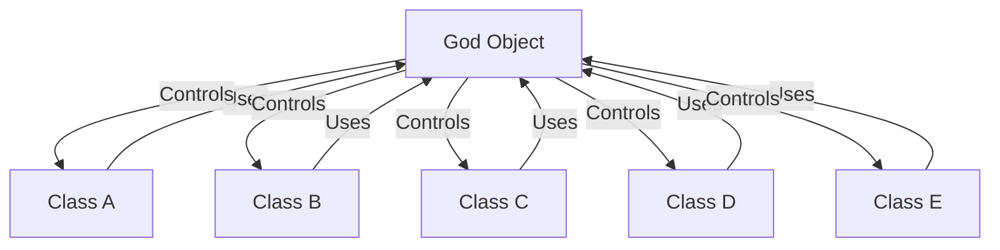
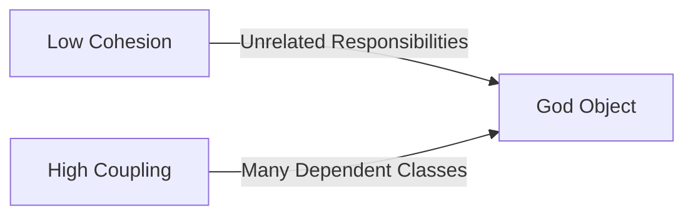
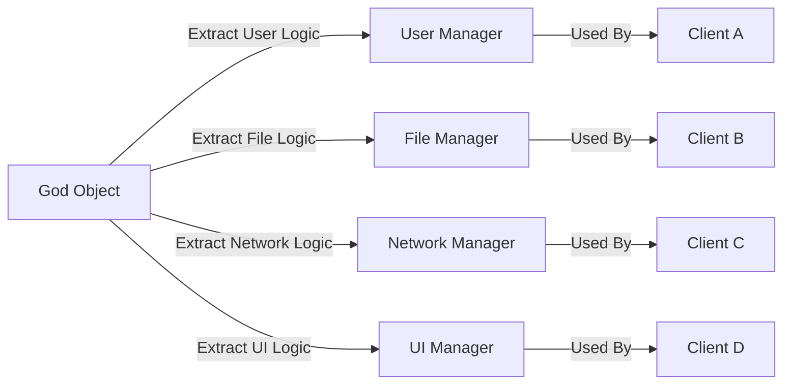

# God Object

## Overview and Definition

A **God Object** (also known as a "God Class" or "Monster Object") is a class or module in software design that assumes an excessive number of responsibilities. It encapsulates too much data, too many methods, or both, leading to highly centralized control and a violation of the **Single Responsibility Principle** (SRP) and other modularity principles.

God Objects are a fundamental anti-pattern in object-oriented design and are closely related to architectural smells such as the "Big Ball of Mud". Their presence indicates a design with poor separation of concerns, low cohesion, and high coupling, often making systems difficult to understand, test, refactor, and maintain.

## Technical Context

The concept of the God Object arises from the broader discipline of software modularization and maintainable architecture. Anti-patterns such as the God Object are documented as part of canonical references to design best practices, notably the **Gang of Four (GoF) Design Patterns** and the **SOLID Principles**:

- **Single Responsibility Principle (SRP):** Each module/class should have one reason to change.
- **Open/Closed Principle (OCP):** Modules should be open for extension but closed for modification.
- **Interface Segregation Principle (ISP):** Clients should not depend upon interfaces they do not use.

The proliferation of God Objects is especially common in poorly specified, rapidly evolving, or legacy systems, where design discipline is lacking or corners are cut for expediency.

## Core Concepts and Key Components

### Characteristics of a God Object

A God Object typically exhibits:

- **Excessive Size:** The class or module contains a substantial amount of code (methods, properties, fields, etc.).
- **Broad Responsibility:** It manages a wide array of unrelated concerns—data storage, UI logic, business rules, network communication, etc.
- **Centralized Control:** Many other classes interact with the God Object to access various services or data.
- **Low Cohesion:** The methods and properties are only loosely related.
- **High Coupling:** Changes to the God Object ripple through the system, as many components depend on it.
- **Hidden Dependencies:** The class often manipulates or references internal data directly, creating implicit dependencies.

These features reduce modularity and increase technical debt.

### Visualization of a God Object

Below is a typical dependency structure in a system with a God Object:



In this structure, the God Object is a hub for numerous bidirectional dependencies, hampering modularity and independent evolution of system components.

## Working in Practice: How God Objects Arise

God Objects often develop organically over time, especially in the following conditions:

- **Lack of initial architecture or domain modeling.**
- **Requirements growth:** As features are rapidly added, new responsibilities are tacked onto existing classes.
- **Poor encapsulation:** Utility classes morph into do-everything managers.
- **Avoidance of code duplication at the expense of clear responsibilities.**

Typical workflows in codebases with God Objects involve many disparate subsystems funneled through the God Object. As an example:

```plaintext
UI Layer --> GodObject: Handles UI events, manages state, invokes business logic
Business Logic Layer --> GodObject: Stores/integrates core business rules
Data Access Layer --> GodObject: Retrieves/saves entities
```

Such flows result in the God Object acting as an unauthorized "service locator", "state manager", and "logic processor" simultaneously.

### Example (Pseudocode)

```java
class ApplicationManager { // God Object
    // User management
    void createUser(...) { ... }
    void deleteUser(...) { ... }
    // File operations
    void openFile(...) { ... }
    void saveFile(...) { ... }
    // Network operations
    void connectToServer(...) { ... }
    void sendData(...) { ... }
    // UI logic
    void updateDashboard(...) { ... }
    // (Many other unrelated methods)
}
```

This structure violates the SRP and introduces significant coupling.

## Engineering Consequences

### Maintainability

A God Object increases the effort required to:

- Locate relevant logic (due to scattering of functionality).
- Refactor code (basic changes become high-risk).
- Add features (fear of unintended side-effects).
- Test code (object state is hard to initialize and control).

### Coupling and Cohesion

The anti-pattern creates **tight coupling** between the God Object and the modules that depend on it, as illustrated in the earlier diagram. Low cohesion means modules are not focused or functionally grouped.



### Testability

God Objects tend to be hard to mock or stub. Their statefulness and broad role make them a poor candidate for unit testing.

> :warning: **Warning:** In systems with God Objects, test coverage is often low or brittle. Small changes to the God Object break many tests due to its central role.

### Extensibility

When many unrelated functionalities coexist, changes/additions for one responsibility often require understanding unrelated areas, increasing the likelihood of regressions.

### Performance

Centralizing state and control can create bottlenecks, particularly if the God Object acts as a serialized resource or synchronizes access to multiple concerns. This can impede scalability in concurrent or distributed architectures.

## Typical Variations

God Objects can take various forms depending on language and system scale:

- **Singleton Manager/Object:** A single class responsible for core aspects of application lifecycle and subsystem management.
- **"Main" or "Application" Classes:** Especially in GUI toolkits or legacy frameworks, the main class absorbs logic for window management, event handling, etc.
- **Service Locator:** A "registry" or "dispatcher" that provides access to numerous services, abstracting service boundaries.

## Identification and Detection

Modern analysis tools and code quality checkers can flag God Objects by metrics such as:

- Lines of code (LOC)
- Number of methods or properties
- Cyclomatic complexity
- Number of direct dependencies

Notable static analysis tools include **SonarQube**, **NDepend**, **PMD**, and **Checkstyle**.

### Sample Metrics Table

| Metric                 | Threshold (Typical)   | Indicates God Object Risk |
|------------------------|----------------------|:------------------------:|
| Lines of Code          | > 1000               | High                     |
| Methods Count          | > 20-30              | High                     |
| Public Fields          | > 5                  | High                     |
| Fan-In (Dependencies)  | > 10                 | High                     |
| Cyclomatic Complexity  | > 15-20              | High                     |

Thresholds may vary by system scale and language.

## Remediation Strategies

### Refactoring Approaches

The recommended approach for eliminating God Objects is *decomposition*: break the God Object into smaller, focused components based on well-defined responsibilities.

**Common refactoring tactics:**

- **Extract Class:** Move logically related methods and data to new, cohesive classes.
- **Facade Pattern:** Use a facade as a thin interface without aggregating deep responsibilities.
- **Strategy/Command Patterns:** Delegate decision-making or operational behavior to dedicated objects.
- **Observer/Publisher-Subscriber:** Decouple event management from central business logic.

**Iterative workflow:**

1. Identify logical groupings of functionality.
2. Extract new classes for each concern (e.g., UserManager, FileManager).
3. Redirect clients to the new classes.
4. Eliminate redundant, leftover logic.



This process incrementally reduces the scope and complexity of the God Object.

### Organizational Practices

- Enforce **code reviews** focused on class responsibilities.
- Provide internal documentation and architectural guidelines.
- Use iterative, test-driven approaches to drive modular design.
- Encourage ongoing refactoring, not just greenfield modularity.

> :tip: **Tip:** Regularly check for classes growing beyond their original boundaries, and encourage collaborative discussions when refactoring is inhibited by architectural dependencies.

## Integration Points and Constraints

### Integration Points

God Objects commonly arise at architectural layer boundaries:

- **UI to Application Logic:** Main window classes in thick-client GUI apps.
- **Service Layer:** Central service manager in RESTful backend, invoked by controllers.
- **Stateful Contexts:** Single context or session object passed throughout a request lifecycle.

### Constraints and Assumptions

- Many legacy frameworks and libraries provide "God" classes or main entry-points; care is required when decomposing such code to avoid unintended breakage.
- Not all large classes are God Objects; genuine complexity sometimes resides in the domain itself.

> :caution: **Caution:** Over-aggressive decomposition can lead to excessive fragmentation and an abundance of trivial classes, trading one anti-pattern for another ("shotgun surgery").

## Related Standards and Architectural Patterns

While no specific RFC governs God Objects, avoidance and remediation are fundamental to several widely acknowledged methodologies:

- **SOLID Principles:** Emphasize modular, decoupled, and maintainable OO code.
- **Domain-Driven Design (DDD):** Encourages modeling real-world domains to align objects with business concepts and bounded contexts.
- **GoF Design Patterns:** Patterns such as **Facade**, **Observer**, and **Strategy** provide tested mechanisms for responsibility distribution.

## Comparative Summary with Related Anti-Patterns

- **God Object vs. Big Ball of Mud:** The Big Ball of Mud is a system-wide architectural smell, while God Object is a class/module-level smell.
- **God Object vs. Service Locator:** Both centralize functionality, but Service Locator mainly abstracts dependencies, not logic.
- **God Object vs. Blob:** "Blob" is an alternative term, often used interchangeably.

## Conclusion

The God Object anti-pattern results from over-concentration of responsibilities within a single class or module, violating modularity and maintainability principles core to modern software engineering. Identifying, refactoring, and preventing God Objects is crucial for scalable, testable, and robust systems. Software engineers should continuously apply architectural best practices, refactoring, and proper domain modeling to mitigate this anti-pattern throughout the software lifecycle.