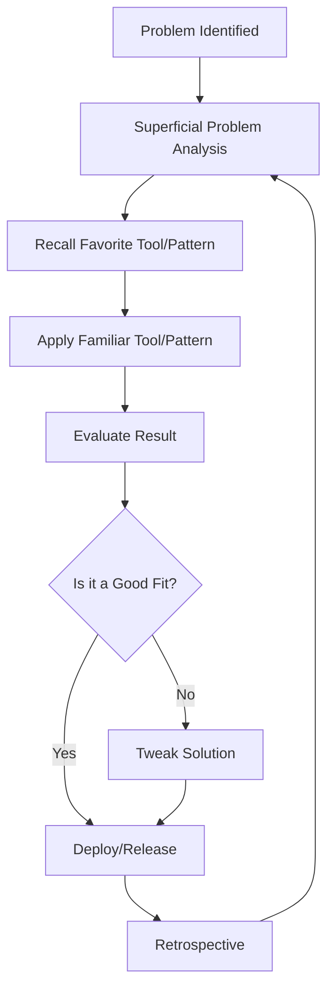
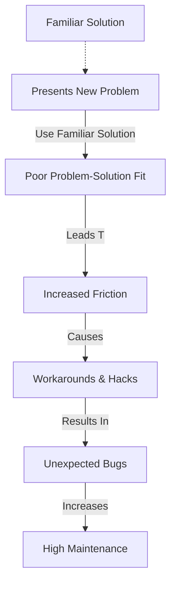
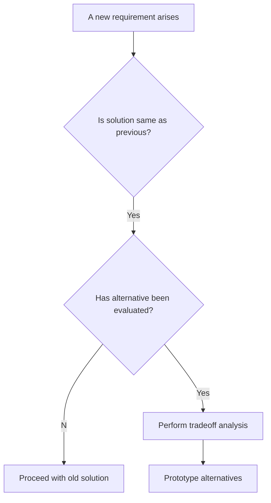

# Introduction to the "Golden Hammer" Anti-Pattern

In software engineering and related technical disciplines, the **Golden Hammer** refers to the persistent application of a familiar tool, technology, design pattern, or methodology to a wide range of problems—regardless of its suitability or appropriateness. The term derives from the adage, "**If all you have is a hammer, everything looks like a nail**." This anti-pattern negatively affects software quality, maintainability, and overall solution effectiveness.

Understanding the Golden Hammer anti-pattern is essential for engineers aiming to design adaptable, effective systems and to avoid common pitfalls associated with overengineering and inappropriate reuse.

---

## Technical Context and Definition

The Golden Hammer is classified as a **behavioral and organizational anti-pattern**. It emerges when individuals or teams repeatedly use a well-understood or favored solution, failing to recognize when alternate approaches or fresh tools are better suited for a given problem. It overlaps conceptually with decision-making heuristics such as **anchoring** and cognitive biases like **functional fixedness**.

**Scope of Impact:**  
- Can be manifested at all layers: architectural, design, coding, process, and technology selection.
- Occurs in individuals, teams, and even at organizational scale.
- Persists across languages, frameworks, and engineering cultures.

### Relationship to Other Patterns

- **DRY (Don't Repeat Yourself), KISS (Keep It Simple, Stupid), and YAGNI (You Aren't Gonna Need It)**: These principles advocate simplicity and appropriateness—directly opposing Golden Hammer tendencies.
- **Design Patterns (GoF)**: Overuse or misapplication of design patterns may lead to a Golden Hammer scenario, where patterns are applied out of context.

---

## Core Concepts and Components

**Key Elements of the Golden Hammer:**
1. **Familiarity Over Analysis:** Reliance on what is already known, instead of proper problem analysis.
2. **Inappropriate Reuse:** Applying previously successful solutions to new, fundamentally different problems.
3. **Neglect of Alternatives:** Failure to research, prototype, or even consider more suitable technologies or patterns.
4. **Organizational Inertia:** Institutional adoption of a standard "way" due to training, inertia, or procurement constraints.

### Workflow Manifestation

*Figure: Typical "Golden Hammer" workflow (over-reliance loop).*

---

## How the Golden Hammer Appears in Practice

### Architectural Level

At the architectural level, the Golden Hammer frequently arises when a preferred architecture style (e.g., microservices, event sourcing, RESTful APIs) is selected irrespective of project requirements.

**Example:**  
Implementing microservices in a small, single-team project without clear need for distributed deployment or independent scalability.

### Design and Implementation Level

Developers may over-apply familiar design patterns, frameworks, or paradigms.

- **Singleton Misapplication:** Making components singletons for no reason except ease of access.
- **ORM Everywhere:** Using Object-Relational Mappers (ORMs) for complex analytics or data pipeline tasks unsuited for ORM semantics.
- **Toolchain Selection:** Persistently using the same language, IDE, or testing framework without investigating alternatives.

### Process/Methodology Level

- **Agile for all projects:** Mandating Agile even for research or safety-critical embedded systems where waterfall or spiral models may be superior.
- **Scrum for everything:** Requiring rigid Scrum process for work that fits better in Kanban or simple task boards.

---

## Practical Engineering Considerations

### Integration Points

- **Vendor Lock-In:** Repeated use of a vendor’s stack due to familiarity increases integration inertia and reduces flexibility.
- **API and Protocol Mismatch:** Applying inappropriate communication protocols (e.g., REST instead of gRPC or binary protocols for high-throughput needs).
- **Legacy Constraints:** Favoring tools due to existing systems, even when new requirements diverge from original assumptions.

### Performance Implications

- **Overhead:** Applying heavyweight solutions to lightweight problems leads to unnecessary computational or operational overhead.
- **Scalability Mismatches:** Overengineered solutions may add complexity without performance benefits; conversely, underestimating requirements may result from blindly applying "lightweight" solutions where truly scalable options are needed.

### Implementation Challenges

- **Maintenance Burden:** The wrong tool for the job introduces maintenance complexity and impedes further development.
- **Resistance to Change:** Team expertise builds up around the Golden Hammer, producing cultural resistance to adopting more effective technologies.

### Common Pitfalls

*Figure: Common pitfall progression resulting from the Golden Hammer.*

---

## Causes, Constraints, and Assumptions

### Causes

- **Cognitive Bias:** Preference for known tools and patterns, comfort with past successes.
- **Training and Experience:** Team proficiency is closely tied to a limited set of technologies.
- **Organizational Inertia:** Budget, procurement, or management policy favor established vendors or toolchains.
- **Lack of Time for Evaluation:** Project pressures can lead to shortcutting proper evaluation of alternatives.

### Constraints and Assumptions

- **Real and Imagined Constraints:** Teams may perceive certain tools as "required" (due to compliance, licensing, or existing infrastructure), though such constraints may be negotiable.
- **Assumed Uniformity:** Assuming all problems are similar enough to warrant the same solution.

---

## Variations on the Golden Hammer

- **Silver Bullet:** Belief in a universally effective solution, often promoted with hype (“tool X solves everything”).
- **Cargo Culting:** Adopting design patterns, tools, or architectures without understanding underlying rationale (“everyone uses microservices, so must we”).
- **Vendor-Centric Hammer:** Overusing a vendor’s ecosystem (cloud, database, framework) irrespective of appropriateness.

---

## Detecting and Avoiding the Golden Hammer

### Detection Patterns

*Figure: Detection workflow—spotting unchallenged reuse of familiar solution.*

### Engineering Approaches to Avoidance

- **Systematic Tradeoff Analysis:** Utilize documented decision matrices or lightweight architectural decision records (ADRs) to justify technology or pattern selection.
- **Design Reviews:** Enforce peer review of major technology decisions, requiring rationale and exploration of alternatives.
- **Prototyping:** Employ rapid prototyping to evaluate technologies before committing.
- **Continuous Learning:** Cultivate engineering culture that rewards critical assessment and experimentation.

---

## Documented and Standardized Approaches

While the Golden Hammer anti-pattern is not codified in any strict technical standard, it is widely referenced in engineering literature:

- **AntiPatterns: Refactoring Software, Architectures, and Projects in Crisis (Brown, Malveau, McCormick, Mowbray)**
- **IEEE Software Engineering Literature** (e.g., coverage of design and process anti-patterns)

Supporting standards such as **IEEE 1471** (guidelines for architectural description) advocate for documenting decision rationales, which acts as a safeguard against Golden Hammer tendencies.

---

## Summary

The Golden Hammer anti-pattern embodies the danger of defaulting to familiar tools, technologies, or patterns at the expense of suitability and optimality. It is not limited by technical boundaries, affecting technical decisions from architecture all the way down to coding choices and beyond.

Avoidance of this anti-pattern is a function of engineering rigor—critical analysis, an openness to alternatives, cross-team knowledge sharing, and systematic evaluation of problem domains and solution spaces.

> **:warning: Warning:**  
> Persistent use of the Golden Hammer anti-pattern results in solutions that are suboptimal, costly to maintain, and fragile in the face of change.

Teams and organizations should nurture engineering processes—such as collaborative design reviews and systematic tradeoff analyses—that explicitly counteract the temptation to reach for the familiar, ensuring that every solution fits the context for which it is designed.