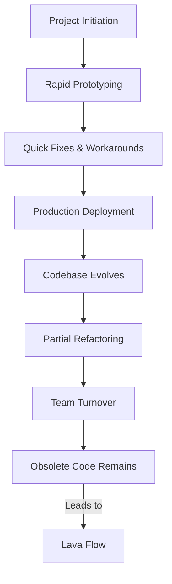
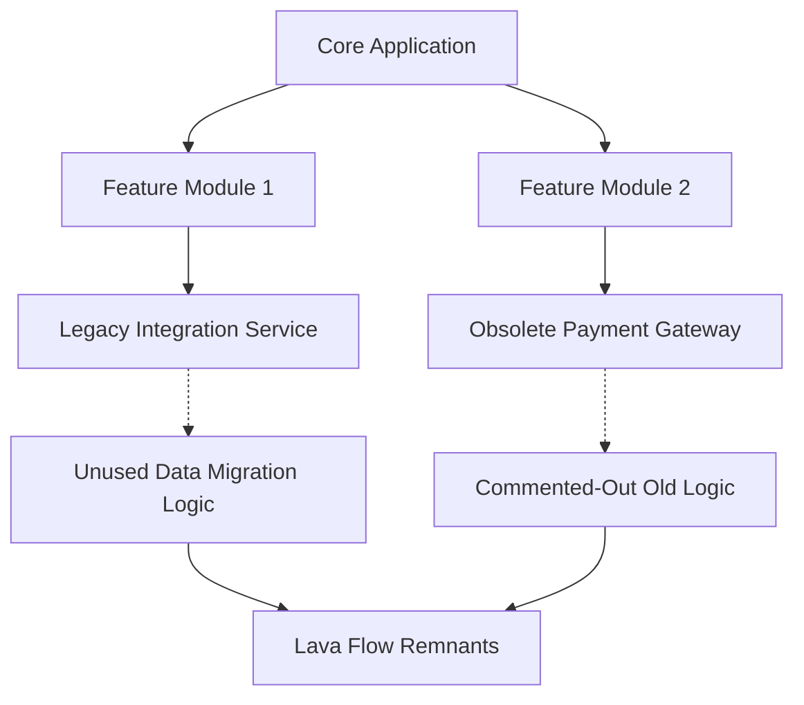

# Lava Flow

## Definition and Technical Context

**Lava Flow** is a software engineering anti-pattern characterized by the accumulation of dead code, obsolete modules, and vestigial architectural structures that persist within a codebase. These artifacts remain not due to utility or relevance, but owing to uncertainty, risk aversion, or a lack of institutional knowledge regarding their safe removal. Over time, as original contributors depart or as business requirements change, these remnants become less understood, embedding potential fragility into the system.

The term “Lava Flow” references geological lava flows that cool and solidify into permanent, often unworkable terrain. In software, this analogy describes how code—once fluid and actively developed—can become ossified, making further system evolution increasingly difficult.

Lava Flows frequently arise in large, long-running projects, especially where knowledge handoff and documentation are incomplete or where rapid prototyping leads to productionized “temporary” code. Such systems may face increased maintenance burden, reduced agility, and heightened risk of defects or regressions due to lingering dependencies on obsolete logic.

## Core Concepts and Components

### Origins and Formation Mechanisms

Lava Flow patterns commonly emerge from the following scenarios:

- **Prototyping-to-Production**: Experimental code or workarounds are promoted to production status in order to meet timelines, without sufficient refactoring.
- **Organizational Turnover**: Original system architects or developers leave, and successors lack understanding of legacy rationales or interdependencies.
- **Risk Aversion**: Teams avoid modifying or removing code whose purpose is unclear, for fear of unintended consequences.
- **Incomplete Refactoring**: Initiatives to modernize, restructure, or optimize codebases are only partly completed, leading to abandoned or duplicated segments.
- **Shifting Requirements**: Code is quickly adapted to changing requirements, with old functionality left in place “just in case.”

### Key Indicators

Codebases suffering from Lava Flow often exhibit:

- Multiple, functionally redundant modules or methods.
- Large blocks of commented-out or unused code.
- Configuration flags, toggles, or legacy compatibility hacks that no longer serve present needs.
- Obsolete dependencies or package imports.
- Sparse or outdated documentation compounding the removal risk.

### Architectural Impact

The architectural implications of Lava Flow include:

- **Increasing Complexity**: Vestigial code paths increase cognitive overhead for maintainers.
- **Reduced Test Coverage**: Legacy code often lacks sufficient automated tests, inhibiting safe removal or refactoring.
- **Obscured Intent**: The original rationale for code segments may be unknown, leading to confusion or accidental disruption in maintenance.

### Relationship to Other Anti-patterns

Lava Flow is closely aligned with other architectural anti-patterns, such as the **Big Ball of Mud**, in which informal, unstructured systems become increasingly tangled. However, Lava Flow specifically focuses on the legacy accretion of dead or orphaned components, whereas the Big Ball of Mud typically refers to loss of modularity and architectural discipline.

## Practical Manifestation in Engineering Workflows

### Typical Lifecycle

The following diagram outlines the typical lifecycle of Lava Flow formation in a software project:

### Workflow Integration Points

- **Integration with CI/CD**: Detection of dead code is possible via static analysis tools, yet requires ongoing vigilance and discipline to ensure removal is prioritized.
- **Code Review**: Lava Flow accumulation can be mitigated by enforcing code review standards discouraging the submission of unnecessary legacy or unused code.
- **Release Engineering**: Feature flags and backward-compatibility hooks are a common entry point for Lava Flows, especially if not tracked and removed once obsolete.

### Constraints and Assumptions

- **Dependency Uncertainty**: Unknown legacy dependencies may conceal side effects, leading teams to err on the side of leaving code untouched.
- **Assumed Usage**: Outward-facing APIs, internal modules, or third-party integrations may preserve the need for keeping unreferenced code active in the absence of clear dependency graphs.
- **Lack of Automated Tools**: While linting, code coverage, and static analysis tools exist, many do not fully account for runtime dynamics, reflection, or dynamically loaded code, complicating Lava Flow detection.

## Common Variations

- **Commented-Out Code Blocks**: Preserved as “reference” but never reactivated.
- **Obsolete Configuration Switches**: Left in place after feature deprecation.
- **Shadow Functionality**: Duplicate or parallel implementations of similar logic, with only one path in active use.
- **Historic Bug Fixes**: Workarounds for obsolete platforms or issues, no longer relevant but unremoved.

## Engineering Considerations and Pitfalls

> **⚠️ Warning**
> Lava Flow imposes significant technical debt. It increases onboarding times, complicates bug resolution, and can introduce security or compliance risks due to obsolete, unmaintained components.

### Integration Points

System interactions that amplify Lava Flow hazards include:

- Upgrading libraries or frameworks where legacy patch code remains.
- Migrating platform environments (e.g., on-premises to cloud) and discovering undocumented legacy dependencies.
- API versioning strategies that retain support for defunct endpoints or behaviors.

### Performance and Maintainability Implications

- **Bloat**: Increases in binary or memory footprint due to unused routines, classes, or dependencies.
- **Test Inertia**: Outdated test cases for dead code consume CI pipeline resources and maintenance effort.
- **Change Risk**: Interactions with unknown code may cause regressions, lengthening validation cycles.

### Challenges in Remediation

- **Traceability Gaps**: Incomplete version control history or sign-off documentation inhibits safe removal.
- **Insufficient Test Coverage**: Makes confident deletion difficult, especially in safety- or reliability-critical systems.
- **Institutional Conservatism**: Cultural resistance to code removal, due to fear of disrupting legacy functionality.

> **💡 Tip**
> Instituting “code burial” ceremonies—ritualized removal of dead code with documentation—can build organizational confidence in legacy cleanup activities.

## Example: Lava Flow in a Web Application

Consider a legacy web application evolved over 10+ years. Features have been added and discontinued, multiple teams have contributed, and portions of code supporting outdated browsers or integrations remain present. Over time, various modules are left unused, test coverage atrophies, and knowledge of which code is still essential dissipates.

In this context:

- **D [Legacy Integration Service]** and **E [Obsolete Payment Gateway]** are not referenced by active features but remain in the codebase.
- **F [Unused Data Migration Logic]** and **G [Commented-Out Old Logic]** are clear instances of Lava Flow.
- Edge H consolidates these as the Lava Flow remnants that complicate system evolution.

## Mitigation Strategies

### Proactive Detection and Removal

- **Static Analysis**: Tools like SonarQube, Coverity, and custom scripts can flag unreferenced code.
- **Test Coverage Analysis**: Employ test coverage metrics to surface code paths never exercised.
- **Dependency Graphing**: Utilize call-graph analysis and runtime instrumentation to identify uninvoked modules.

### Process-Oriented Approaches

- **Regular Code Audits**: Schedule dedicated code reviews for legacy cleanup.
- **Documentation and Knowledge Capture**: Maintain architectural decision records and historical context.
- **Feature Flag Tracking**: Institute strict policies for removal of deprecated flags post-migration.

### Functional Safeguards

- **Incremental Removal**: Stage deletion behind additional test coverage and canary deployments where possible.
- **Comprehensive CI Testing**: Augment regression suites to detect latent dependencies exposed by removals.

> **ℹ️ Note**
> Diagram to be added later: Comparative illustration of a healthy versus Lava Flow–afflicted codebase.

## Standards and Specifications

While **Lava Flow** as an anti-pattern is not formalized in a standards document or RFC, its mitigation aligns with best practices advocated by bodies such as the **IEEE 14764-2006** standard on software maintenance, and the **ISO/IEC/IEEE 12207** system/software engineering lifecycle processes, both of which stress code maintainability and the active management of technical debt.

## Summary

Lava Flow represents a persistent risk in evolving software systems, emerging from a combination of incomplete knowledge transfer, risk aversion, and the unchecked proliferation of obsolete code. Its presence complicates maintenance, impedes progress, and erodes system reliability. Effective mitigation relies on a mix of automated tooling, process discipline, and organizational culture—aiming for regular code cleanup, robust documentation, and a willingness to retire legacy artifacts whose original rationale has been lost to time. By maintaining vigilance against Lava Flow, engineering teams can sustain system health, agility, and maintainability throughout the software lifecycle.