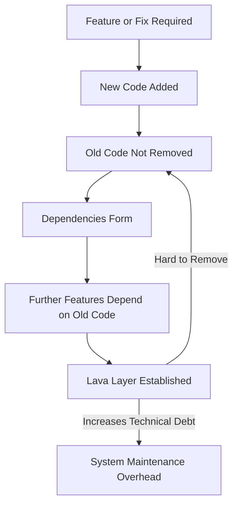
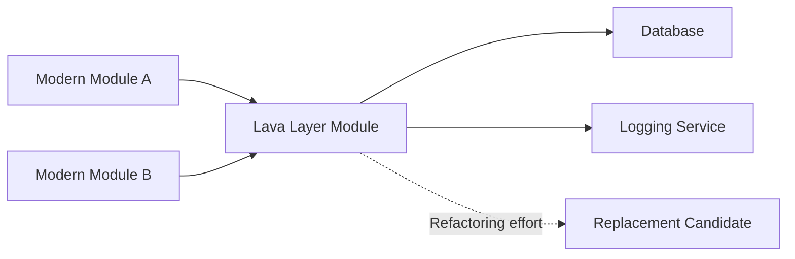
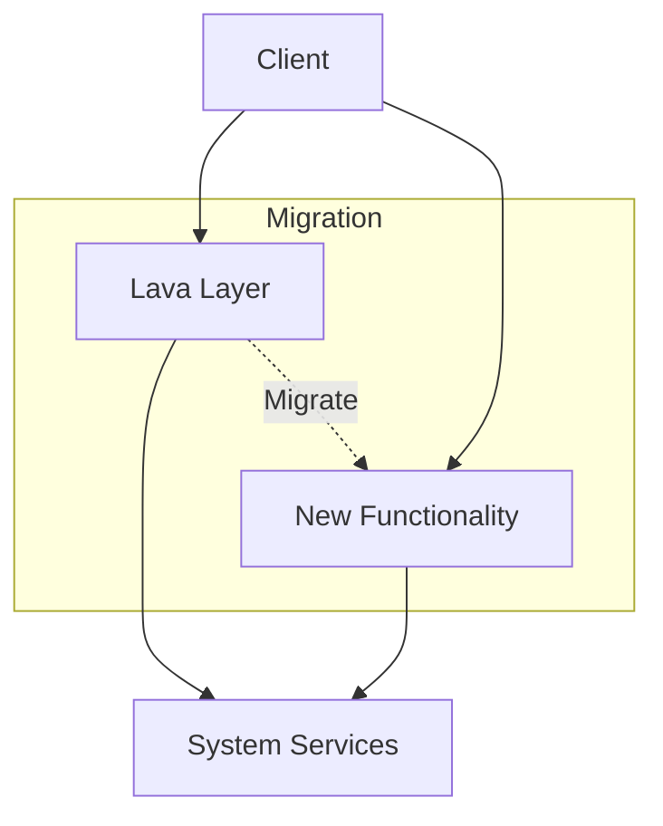

# Lava Layer: A Technical Primer

## Introduction

The **Lava Layer** is a well-documented software engineering anti-pattern characterized by deprecated or low-quality code that persists in a codebase because other components continue to depend on it. Over time, this detritus forms a rigid, unmaintainable stratum—analogous to layers of hardened lava—which persists regardless of attempted refactoring. The Lava Layer, sometimes referenced within the context of legacy system maintenance or architectural decay, is detrimental to system flexibility, maintainability, and evolvability.

This document examines the Lava Layer in depth, covering its technical definition, origins, internal mechanisms, and practical implications, and provides guidance on identification, management, and prevention.

## Technical Definition and Context

### Origin of the Term

The term "Lava Layer" was first popularized in the "Big Ball of Mud" paper by Brian Foote and Joseph Yoder (1999), classifying it as an anti-pattern that arises from the unchecked accumulation of obsolete code. It is distinguished from other forms of technical debt by the near impossibility of safely removing the offending code without substantial refactoring of dependent components.

### Key Attributes

- **Obsolete or poor-quality code:** The Lava Layer consists of code that is no longer considered best practice or which may have design and implementation flaws.
- **Dependency entanglement:** Crucially, active code relies on the Lava Layer, making its removal complex.
- **Immobility:** Attempts to refactor or excise the layer are thwarted by risk, uncertainty, or prohibitive effort.
- **Historic evolution:** The Lava Layer is often a byproduct of accumulated changes, patches, and retrofits.

### Relationship to Other Anti-Patterns

The Lava Layer is closely related to:
- **Big Ball of Mud:** A common architectural dysfunction in which system structure is lost to chaos.
- **Shotgun Surgery:** Modifications require touching many scattered components, increasing Lava Layer entrenchment.
- **Spaghetti Code:** While Lava Layers can contain spaghetti code, they are specifically defined by entrenchment via dependencies, not just complexity.

The presence of a Lava Layer is often a surface manifestation of underlying technical debt and poor architectural governance.

## Structural Elements and Architecture

### Layered System Model

Most modern software systems follow a layered architecture, where each layer encapsulates specific responsibilities. In a healthy system, layering supports replaceability and ease of maintenance. When a Lava Layer appears, it typically occupies a lower or middle tier within this architecture:

```
Application Layer
-------------------------------
Domain/Business Logic Layer
-------------------------------
Lava Layer (Obsolete Code)
-------------------------------
Infrastructure Layer (e.g., DB, IO)
```

### Mermaid Diagram: Lava Layer in Software Architecture

```mermaid
graph TD
    AL[Application Layer]
    DL[Domain Logic Layer]
    LL[Lava Layer (Obsolete Code)]
    IL[Infrastructure Layer]
    AL --> DL
    DL --> LL
    LL --> IL
    LL -->|Dependency| DL
    DL -->|Legacy Calls| LL
```

- **AL:** Application Layer (UI, REST APIs)
- **DL:** Business logic (active, maintained code)
- **LL:** Lava Layer (deprecated, fossilized code)
- **IL:** Infrastructure (DB, OS, external services)

In this model, the **Lava Layer** becomes a critical path for system operations because legacy business logic or infrastructure still requires or routes through it.

## Mechanisms and Lifecycle

### Formation

The Lava Layer emerges through several common mechanisms:

1. **Rapid Delivery Pressures:** In fast-paced development environments, teams prioritize features over refactoring, deferring removal of obsolete code.
2. **Risk Aversion:** Deprecated subsystems are left intact due to stability concerns and insufficient testing.
3. **Lack of Ownership:** No team or individual is incentivized or able to excise decaying code.
4. **Organic Growth:** As requirements change, quick fixes and “temporary” scaffolding become permanent by default.

### Lifecycle: How Lava Layers Persist

#### Mermaid Diagram: Lava Layer Lifecycle



This feedback loop explains why deprecated code, once forming a Lava Layer, is seldom removed without major coordinated effort.

## Practical Implications

### Engineering and Organizational Consequences

**System Rigidity:**  
The Lava Layer hinders change, as safe modification or removal requires deep analysis and regression testing.

**Increased Complexity:**  
Developers must navigate convoluted pathways, understanding both active and fossilized code for any significant change.

**Onboarding Difficulties:**  
New engineers face a steep learning curve, often unable to distinguish between deprecated and current logic.

**Performance Risks:**  
Legacy code is rarely optimized for modern workloads and may introduce inefficiencies or bottlenecks.

> **Alert**
> **Caution:** Removing, updating, or replacing the Lava Layer without adequate coverage and dependency mapping can introduce severe regressions.

### Typical Workflows and Engineering Practices

- **Read-Only Maintenance:** Lava Layers are often modified only when necessary for a pressing fix; this leads to isolation and potential architectural drift.
- **Accretive Development:** New features are built on top of, rather than replacing, deprecated subsystems.
- **Workarounds and Polyfills:** Patching over Lava Layer deficiencies rather than addressing root architectural issues.

## Typical Examples

### Example 1: Enterprise Application Framework

A large insurance company's core policy engine is housed in a Java module written in the early 2000s. Although a modern rules engine exists, many critical business operations (renewals, claims, audits) still use legacy APIs from this old module. Efforts to retire or refactor the old module have failed because:

- Multiple downstream systems synchronize data using its output.
- Regression tests do not cover all edge cases.
- The original authors have left the company, and the code is poorly documented.

### Example 2: Web Application Routing

A web application migrates from a monolithic routing table to a modular API gateway. However, authentication, logging, and error-handling logic remain entangled within legacy monolith middleware. Removing or refactoring this logic risks breaking either the new or old API paths, and, as such, a Lava Layer persists as a required dependency for all request handling.

## Constraints and Assumptions

- **Tight Coupling:** The Lava Layer's persistence requires that newer code does not merely replicate old logic but actively depends on it through function calls, data structures, or configuration.
- **Incomplete Test Suites:** Without comprehensive functional and regression tests, removal risk is frequently unknowable.
- **Limited Refactoring Budgets:** Business pressures deprioritize deep, non-customer-visible work.

## Detection and Analysis

### Identification Strategies

- **Static Analysis:** Use tools to identify dead code, deprecated APIs in active use, or high-coupling metrics.
- **Code Churn Audits:** Low-churn, high-dependency files are candidates for Lava Layer status.
- **Dependency Graphs:** Generate and inspect how modules interconnect; pivotal old modules signal potential Lava Layers.

### Mermaid Diagram: Dependency Graph Highlighting a Lava Layer



### Organizational Signals

- **Chronic Technical Debt Discussions:** Repeated complaints about “can’t touch that code” or “too risky to change.”
- **Project Delays:** Feature work constantly hampered by issues in legacy components.

## Engineering Considerations

### Integration Points

- **Service Abstraction Boundaries:** Attempts to shield new development from direct coupling to the Lava Layer using wrappers or adapter patterns.
- **APIs and Contracts:** Maintaining stable interfaces even as internals rot; over-reliance on backward compatibility requirements.

### Performance and Reliability

- **Non-Optimal Logic Paths:** Lava Layer routines rarely take advantage of modern optimizations (e.g., asynchronous IO, batch processing).
- **Resiliency Issues:** Legacy code often lacks sophisticated error handling or modern retry/backoff logic, hampering robustness.

### Implementation Challenges

- **Insufficient Documentation:** Understanding the functional intent of Lava Layer code can be extremely difficult.
- **Lack of Tests:** Mutation or safe replacement almost always requires extensive reverse engineering and test writing.

> **Alert**
> **Warning:** Passing through the Lava Layer may inadvertently expose critical systems to security vulnerabilities if legacy code is not updated to contemporary standards.

## Mitigation and Remediation

### Removal Strategies

1. **Strangler Fig Pattern:** Gradually replace Lava Layer functionality with new components, slowly migrating dependencies.
2. **Facade Introduction:** Implement a facade or adapter to encapsulate the Lava Layer; clients depend on the abstraction, not the obsolete code.
3. **Contract/Test Coverage:** Write regression and characterization tests around the Lava Layer to reduce uncertainty during replacement.
4. **Incremental Refactoring:** Break apart the Lava Layer into smaller, independently replaceable parts.
5. **Deprecation Policy Enforcement:** Mark all Lava Layer code as deprecated in documentation, code comments, and code analyzers.

### Diagram: Strangler Fig Pattern for Lava Layer Removal



- **C1:** Existing client code
- **LL:** Lava Layer (to be replaced)
- **NF:** New Functionality (replacement system)
- **S:** Downstream system services

> **Alert**
> **Note:** Complete Lava Layer elimination is a multi-phase effort, frequently spanning years in large systems.

## Prevention

### Design and Process Recommendations

- **Aggressive Code Reviews:** Vigilantly enforce code health and eliminate obsolete code as soon as it is detected.
- **Continuous Refactoring:** Allocate sprint time for ongoing cleanup, rather than deferring indefinitely.
- **Automated Testing:** High coverage enables safe refactoring and timely removal of outdated components.
- **Change Impact Analysis:** Invest in tooling that models the impact of code changes on dependencies.

### Cultural Interventions

- **Promote Code Ownership:** Assign responsibility for legacy modules so that technical debt is neither ignored nor orphaned.
- **Reward Maintenance:** Incentivize teams not only for new feature delivery but also for architectural hygiene.

## Common Pitfalls

- **Superficial Deletion:** Removing visible portions of Lava Layer code without unraveling dependencies often causes subtle runtime failures.
- **Interface Creep:** Preserving backward compatibility by endlessly extending Lava Layer APIs further entrenches the anti-pattern.
- **“Just One More Patch” Mindset:** Repeated short-term fixes deepen dependency webs and fortify the Lava Layer.

## Summary

The Lava Layer anti-pattern is a critical factor in long-lived systems that undermines the promise of layered, maintainable software architectures. Identification, management, and—where feasible—removal of Lava Layers require a combination of technical, organizational, and process interventions. By taking a disciplined, systematic approach to refactoring, testing, and dependency management, engineering teams can resist the fossilization of their systems and ensure continued agility and reliability.

---

**End of technical primer: Lava Layer.**