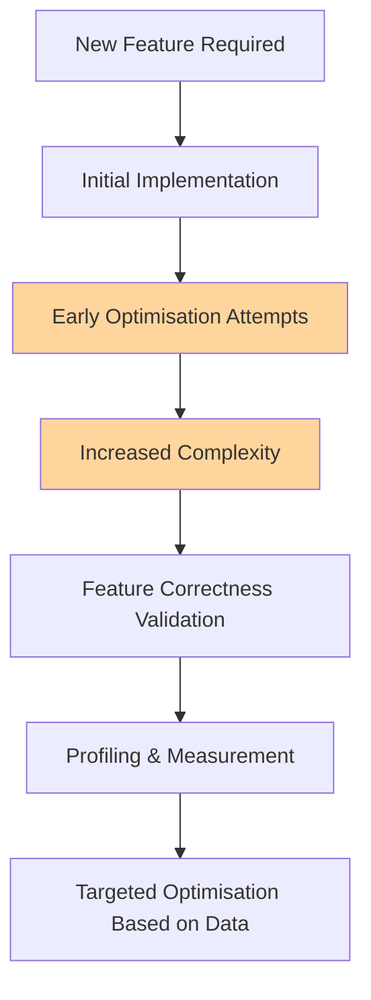
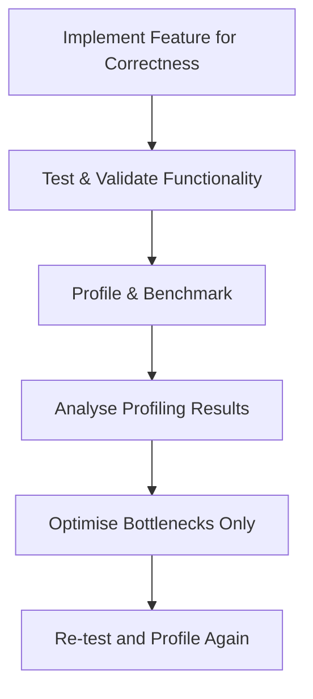
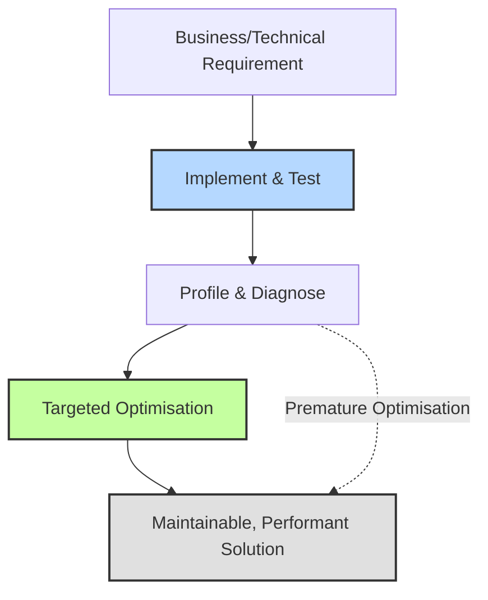

# Introduction to Premature Optimisation

Premature optimisation is a well-known anti-pattern in software engineering, where developers attempt to increase performance early in the development lifecycle, often without empirical evidence of bottlenecks. The result is frequently code that is harder to read, maintain, or extend, while providing negligible or unnecessary gains. This concept is encapsulated by Donald Knuth's seminal observation: “Premature optimization is the root of all evil” (Knuth, 1974). Understanding this anti-pattern is essential for producing robust, maintainable, and performant software.

## Technical Context and Definition

In the context of software engineering, optimisation refers to altering code, algorithms, or systems to improve aspects such as speed, memory usage, or other quantitatively measurable factors. Optimisation is desirable—when needed and justified. However, premature optimisation occurs when optimisation decisions are made before:

- Validating that a problem exists.
- Establishing that optimisation will provide significant value.
- Establishing any empirically measured need for improvement.

Premature optimisation is not a failure to optimise, but rather a failure to delay optimisation until sufficient evidence, such as profiling or benchmarking, identifies a genuine bottleneck or inefficiency. It commonly results in one or more of the following:

- Obfuscated code, difficult for team members to understand or modify.
- Increased risk of introducing subtle bugs.
- Increased technical debt and maintenance cost.
- Reduced flexibility and extensibility.

## Core Concepts and Key Components

### Maintainability versus Performance

Software maintainability—ease of understanding, modifying, and extending code—is a primary principle in sustainable engineering. Premature optimisation subverts this by prioritising hypothetical performance over clear, robust design. Inconsequential micro-optimisations may impair maintainability while failing to address more significant performance issues that only become evident in production-like environments.

### Empirical Evidence and Profiling

Modern engineering workflow mandates measuring real performance to inform optimisation. Profiling tools (e.g., `perf`, `gprof`, VisualVM, or Chrome DevTools) enable engineers to locate genuine bottlenecks after a feature-complete, correct, and maintainable implementation. Premature optimisation, by contrast, occurs absent such data.

### Local versus Global Optimisation

Premature optimisation is often localised, focusing on specific lines or loops inside a function before understanding the system-level or architectural causes of inefficiency. Experience repeatedly shows that global or architectural changes yield orders of magnitude greater performance improvements than tweaking inner loops.

### Cost of Change

Software systems evolve. Early, speculative optimisation decisions can complicate later changes—new requirements, refactoring, or integration with other modules—since these optimisations may require unraveling complex code paths.

## How Premature Optimisation Arises

The following are typical causes and workflows that lead to premature optimisation:

- **Assumptions over Measurement:** Developers assume certain code paths are performance bottlenecks without profiling.
- **“Just in Case” Coding:** Incorporating future-proofing or anticipated requirements that are not yet needed.
- **Overconfidence in Intuition:** Relying on personal judgment rather than empirical evidence to direct performance work.
- **Overexposure to Low-level Languages or Systems:** Overly importing practices from performance-critical domains into general software engineering tasks.

### Typical Premature Optimisation Workflow

**Note:** The highlighted steps (C and D) indicate where premature optimisation typically increases complexity before validating correctness or necessity.

## Common Patterns and Variations

Premature optimisation manifests in various common code and design scenarios, including:

- **Loop Unrolling Prior to Measurement:** Making loops faster by unrolling or refactoring without data showing a bottleneck in that region.
- **Manual Memory Management in Garbage-Collected Languages:** Applying complex pooling strategies in environments where the garbage collector is adequate for the task.
- **Inlined Assembly or Platform-Specific Code:** Introducing low-level or platform-tied code paths before cross-platform needs or portability have been resolved.
- **Excessive Caching:** Implementing elaborate caches without demonstrating that recomputation is a significant expense.
- **Algorithm Substitution Prematurely:** Replacing a simple algorithm with a complex, efficient one before establishing the need for such optimisation (e.g., using a complicated sorting algorithm for tiny data sets).
- **Disregard for Readable APIs:** Sacrificing clear, well-documented APIs in favour of leaner, less expressive interfaces for marginal performance gains.

## Impact on Software Design and Architecture

Premature optimisation influences architecture by “locking in” questionable trade-offs. Design patterns such as abstraction, encapsulation, and modularity may be sacrificed in favour of short-term speed. The anti-pattern also works against widely-accepted principles and heuristics, including:

- **YAGNI (You Aren’t Gonna Need It):** Only implement features or optimisations when there is clear demand.
- **KISS (Keep It Simple, Stupid):** Prefer simple solutions until complexity is justified.
- **DRY (Don’t Repeat Yourself):** Avoid duplicating code unless profiling justifies tailored, highly-optimised versions.

## Engineering Considerations and Integration Points

### Deciding When to Optimise

Optimisation should be both:

1. **Targeted:** Focused on code identified via profiling or direct measurement.
2. **Justified:** Backed by evidence that the current implementation impacts business or technical goals (such as user experience, cost, or scalability).

**Typical Workflow for Sensible Optimisation:**

### Performance Constraints and Real-World Trade-offs

Certain domains (e.g., embedded systems, high-frequency trading) require performance-first engineering due to hard constraints. In these environments, optimisation may be integral from the outset, but it is still evidence-driven and measured.

**Caution**
> Even in resource-constrained domains, unmeasured optimisation can introduce bugs, reduce portability, and increase cost of change. Strive for traceable, reproducible rationale behind every optimisation decision.

### Tooling and Standards

Numerous profiling and benchmarking tools are available and, in many environments, serve as de facto standards:
- **Unix/Linux:** `perf`, `gprof`, `valgrind`
- **JVM:** VisualVM, JProfiler
- **Web:** Chrome DevTools, Lighthouse
- **.NET:** Visual Studio Profiler

Usage of these tools is strongly recommended prior to optimisation work.

## Common Pitfalls and Anti-pattern Manifestations

### Pitfalls

- **Wasted Effort:** Optimising code segments that are never bottlenecks.
- **Reduced Velocity:** Increased time spent maintaining and debugging code.
- **Integration Issues:** Inflexible, fragile code that cannot easily interface with libraries, APIs, or other modules.
- **Security Risks:** Obfuscated or “clever” code can hide attack surfaces or vulnerabilities.

### Illustrative Example

Suppose a team introduces a custom memory allocator to “speed up” an application written in a managed language with a highly-optimised garbage collector. The result is more complex code, obscure bugs, and negligible, if any, performance gain.

**Tip**
> Always begin with straightforward, idiomatic solutions. Defer optimisation until observable profiling data clearly identifies a need.

## Relationship to Related Patterns and Principles

Premature optimisation is closely linked with several heuristic principles in software design:

- **KISS Principle:** Premature optimisation often violates simplicity, introducing accidental complexity.
- **YAGNI Principle:** Building for anticipated or imagined performance requirements instead of actual needs leads to waste.
- **Clean Code Practices:** Optimised code that sacrifices clarity and intent often contradicts clean code standards, making code reviews, onboarding, and debugging harder.

## Practical Guidelines for Avoiding Premature Optimisation

- **Prioritise Correctness and Maintainability:** Focus on clarity and correctness first. Clean, well-structured code simplifies subsequent optimisation.
- **Profile Before You Optimise:** Use profiling or tracing tools to gather quantitative data about application behaviour.
- **Apply Optimisation Incrementally:** Make one change at a time and re-profile after each optimisation.
- **Prefer Algorithmic Improvements:** Major performance benefits usually come from better data structures or algorithms, not micro-optimisations.
- **Document Rationale:** Every optimisation should be traceable to an observed problem or measured need.
- **Reviewer Awareness:** During code reviews, probe the need for performance enhancements early in the lifecycle.

**Alert**
> Attempting to optimise prematurely may save milliseconds but could cost weeks in future maintenance and unplanned refactoring.

## Summary Block Diagram

This diagram illustrates that only after measurement and diagnosis, targeted optimisation leads to a maintainable and performant solution. A dashed line shows how premature optimisation disrupts this sequence, often bypassing valuable steps.

## Conclusion

Premature optimisation is an anti-pattern that can hinder software quality, increase maintenance costs, and obscure system behaviour, especially when done without empirical justification. Adhering to a measured, data-driven workflow allows engineers to achieve both maintainability and performance, matching the dynamic needs of software systems as they evolve.

**Caution**
> Avoid optimising based solely on anticipation or intuition—rely on engineering data, preserve clarity, and optimise only when genuine need becomes apparent.