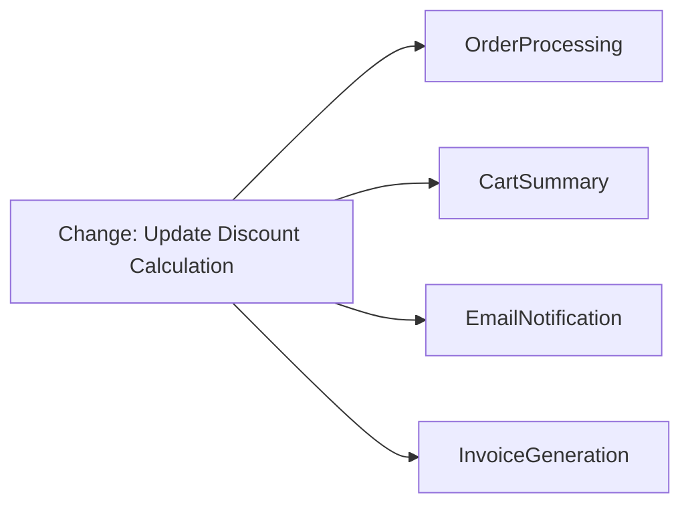
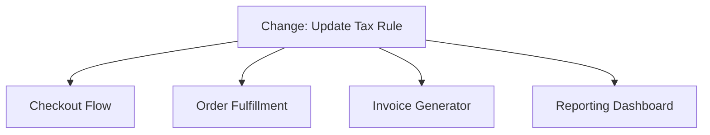
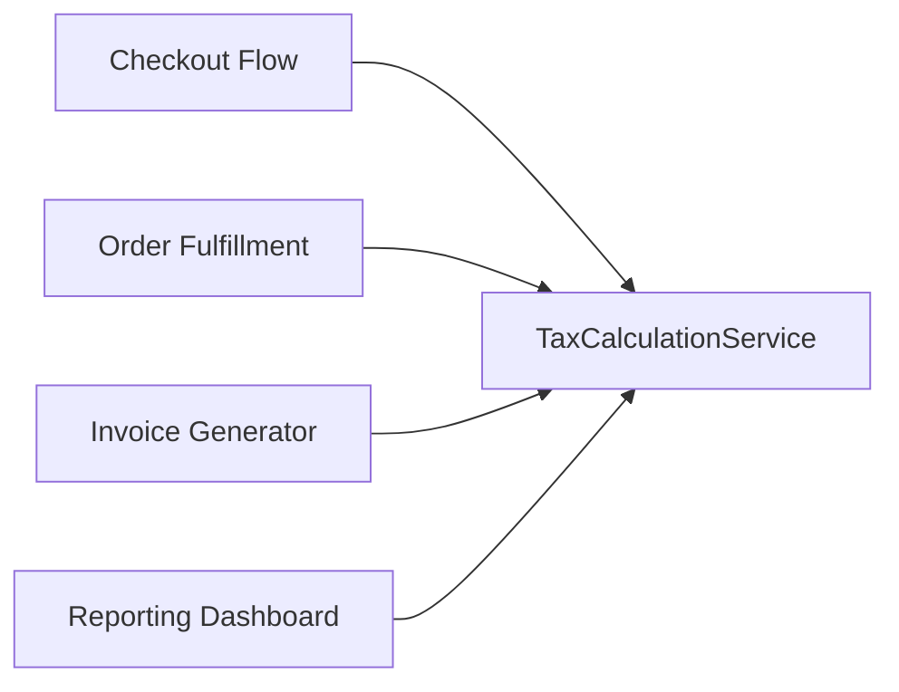

# Shotgun Surgery: A Technical Primer

## Introduction

In software engineering, maintaining and evolving complex systems demands rigorous attention to code modularity, cohesion, and separation of concerns. Among the spectrum of anti-patterns impeding effective change management, "Shotgun Surgery" stands out as a critical indicator of poor modularity. This anti-pattern occurs when apparently simple modifications require a developer to make numerous small edits across multiple files or modules. The result is not just higher maintenance overhead, but increased risk of regression, and a substantial barrier to agile responsiveness.

This primer elucidates the concept of Shotgun Surgery, examines the architectural scenarios in which it emerges, details its symptoms and root causes, and discusses refactoring and prevention techniques. It also explores associations with related anti-patterns and principles, especially God Object and the SOLID design principles.

## Defining Shotgun Surgery

Shotgun Surgery is a term coined in the context of code smell and refactoring patterns. It was popularized by Martin Fowler in his book *Refactoring: Improving the Design of Existing Code* (Addison-Wesley, 1999).

**Definition:**  
> Shotgun Surgery occurs when a single change requires altering many different classes, files, or modules at once, as opposed to changes that are localized to a specific area of code. It signifies low cohesion and over-dispersed responsibilities, undermining modular design.

Shotgun Surgery typically manifests in codebases lacking clear separation of concerns. Instead of encapsulating a responsibility, behavior, or logic in one place, the codebase spreads related logic across disparate modules, necessitating widespread, coordinated changes whenever the underlying concern evolves.

### Symptoms and Recognition

Typical signs of Shotgun Surgery include:

- Making the same type of small code update in numerous locations for a supposedly single logical change.
- Identifying a behavioral or business rule that, when changed, affects distant and otherwise unrelated parts of the codebase.
- High bug rates after changes resulting from missed edits during "surgical" modifications.
- Developers relying excessively on powerful search-and-replace utilities or scripts to find all occurrences that require updating.

**Common codebase indicators:**

- Low cohesion classes or modules that partially implement related logic scattered elsewhere.
- Duplication of business rules, validation logic, or calculation formulas.
- Tight coupling, where modules depend on intimate details of other modules instead of transparent APIs.

### Visual Representation

Below is a conceptual Mermaid diagram illustrating the effect of Shotgun Surgery on a hypothetical system where a single logical change (e.g., update in "Discount Calculation") requires edits across multiple modules.

*Diagram: **Shotgun Surgery Impact** — A single change request prompts distributed modifications across multiple modules.*

## Technical Context and Core Concepts

### Modularity, Cohesion, and Coupling

Shotgun Surgery is fundamentally a problem of low cohesion and excessive coupling:

- **Cohesion** refers to how closely related the responsibilities of a single module or component are. Higher cohesion signals that a module encapsulates a clearly defined responsibility.
- **Coupling** denotes the degree of dependency between modules. Tight or improper coupling (e.g., through global states or cross-module dependencies) increases propagation of changes.

**GitHub Alert**
> :warning: **Warning:** Persistent Shotgun Surgery leads to cascading maintenance costs, elevated defect rates, and decreased developer confidence. Each change increases the likelihood of missing a critical update.

### Role of Separation of Concerns

A core engineering principle that mitigates Shotgun Surgery is *Separation of Concerns (SoC)*. When SoC is not observed, business rules or infrastructural responsibilities become diffused, tying together unrelated modules with cross-cutting concerns.

### Relation to Other Anti-Patterns

- **God Object**: The opposite end of Shotgun Surgery. While Shotgun Surgery scatters single responsibilities, the God Object concentrates too many responsibilities into one place, leading to monolithic classes.
- **Tight Coupling**: When modules rely on each other’s internal structures, ripple effects from changes are magnified, encouraging Shotgun Surgery.

Both anti-patterns indicate architectural design issues and are often found together in legacy or rapidly evolved codebases.

## How Shotgun Surgery Arises

### Common Architectural Scenarios

- Copy-paste proliferation, where logic is duplicated instead of abstracted.
- Violation of the *Don't Repeat Yourself (DRY)* principle.
- Business logic implemented in presentation, persistence, and domain layers simultaneously.
- Cross-cutting concerns (logging, auditing, security) woven directly into multiple modules, rather than abstracted through design patterns such as Aspect-Oriented Programming (AOP) or decorator patterns.
- Lack of interface abstractions or centralized services for shared logic.

### Example Workflow

Suppose a new tax regulation requires the system to alter the way sales tax is calculated. In a well-designed, modular system, this change would require an update in a single core tax calculation module.

In a codebase plagued by Shotgun Surgery, similar (but subtly different) tax calculation code appears in:

- The checkout flow of an e-commerce cart
- The order fulfillment pipeline
- The invoice generator
- The reporting dashboard

Engineers must identify all locations, carefully update them, and ensure consistency. Missing just one leads to inconsistency and potentially critical business errors.

**Mermaid Diagram: Tax Calculation Spread**

### Diagnosing Shotgun Surgery With Static Analysis

Tools for static analysis and dependency mapping (e.g., [SonarQube](https://www.sonarsource.com/products/sonarqube/), [Structure101](https://structure101.com/)) can highlight indicators for Shotgun Surgery by:

- Reporting code duplication metrics
- Tracing code change impact (change propagation analysis)
- Identifying modules with high *change-coupling* (modules frequently changed together)

## Engineering Implications

### Maintenance Overhead

Recurring Shotgun Surgery significantly inflates time and cost for routine maintenance. Changes that should be tightly scoped require broad coordination, careful communication, and extensive testing to avoid regressions.

### Increased Risk of Defects

The breadth of change induces a higher probability of missing required updates, introducing inconsistencies, regressions, or latent bugs.

### Impaired Agility

Teams become reluctant to make changes due to the anticipated workload and risk. This slows delivery, frustrates stakeholders, and can create a perception of technical stagnation.

### Onboarding and Developer Experience

New developers face a steep learning curve as system logic appears inconsistent or only partially localized. Institutional knowledge becomes required to correctly apply changes.

## Constraints and Assumptions

- **Complexity of Domain**: Inherently cross-cutting business rules may be more susceptible, requiring explicit architectural attention.
- **Codebase Size and Age**: Larger and older codebases, especially those built without strong initial modularity, are more prone.
- **Tooling and Automation**: Sufficient code review, static analysis, and IDE tooling can help catch errors but cannot replace proper architectural modularity.

## Mitigation and Refactoring Strategies

### Localizing Responsibilities

Centralize logic that is liable to change into a single module or service. This may involve:

- Abstracting shared behaviors into utility or domain-specific services.
- Introducing interfaces for core business logic.
- Adopting patterns such as Strategy or Observer to encapsulate variable behaviors.

**Mermaid Diagram: Refactored Responsibility Centralization**

*Diagram: **Centralization of Change** — Multiple consumers now depend on a single point for tax calculation logic, simplifying changes.*

### Applying SOLID Principles

- **Single Responsibility Principle (SRP):** Each class/module should have exactly one reason to change.
- **Open/Closed Principle (OCP):** Systems should be open for extension, but closed for modification; achieve this via abstract classes, interfaces, and dependency inversion.
- **Interface Segregation and Dependency Inversion:** Rely on abstractions, not concretions, to allow for localized upgrades without ripple effects.

### Test Coverage and Automation

Ensure comprehensive automated test coverage to detect regressions when changes unavoidably touch multiple locations. Integrate continuous integration (CI) pipelines to enforce high assurance with every change.

### Incremental Refactoring

Where Shotgun Surgery is deeply embedded, pursue incremental refactoring. Start by:

- Identifying clusters of duplicate or similar logic.
- Gradually extracting and redirecting consumers to the new centralized module.
- Establishing integration tests that observe global system behavior, so changes can be validated holistically.

**GitHub Alert**
> :bulb: **Tip:** Perform impact analysis before every change. Tools capable of tracking "change coupling" can help prioritize refactoring hotspots.

### Cross-Cutting Concerns

For security, auditing, or logging logic that touches multiple modules, employ mechanisms like:

- Middleware
- Aspect-Oriented Programming (AOP) frameworks
- Dependency Injection for cross-cutting behaviors

### Documentation

Documentation (inline, architectural diagrams, API contracts) is essential to support coordinated updates until all business logic is centralized.

**GitHub Alert**
> :information_source: **Note:** While documentation and code review processes help reduce mistakes, Shotgun Surgery is best addressed at the architectural/design level.

## Engineering Tradeoffs and Practical Considerations

### When Not to Refactor

- Legacy systems approaching deprecation may not warrant large-scale refactoring to eliminate Shotgun Surgery.
- Commercial constraints may outweigh technical debt remediation unless change rates are high.

### Performance Considerations

Centralization can introduce subtle performance impacts, e.g., via network or inter-process calls if central services are remote. Engineering teams must balance maintainability with latency or throughput requirements.

### Integration Points

When refactoring to eliminate Shotgun Surgery, consider:

- API compatibility for legacy consumers.
- Data migration and backwards compatibility for shared components.
- Coordinated releases to avoid breaking consumers during transitions.

## Variations and Related Problems

### Scattered Feature Code

A closely related anti-pattern is scattered feature code, where features are not only spread across modules but are inconsistently named, versioned, or implemented, compounding the risk of defects.

### Contrasts With God Object

While Shotgun Surgery disperses change, the God Object tightly centralizes too much responsibility. Both are symptoms of inadequate modularization but manifest differently.

| Anti-pattern      | Symptom                                        | Core Issue         |
|-------------------|------------------------------------------------|--------------------|
| Shotgun Surgery   | Small change triggers edits in many places     | Over-dispersed logic |
| God Object        | Most logic and data lives in one bulky class   | Over-centralized logic |

## Summary

Shotgun Surgery emerges when a lack of proper modularity and cohesion disperses related logic across a codebase, making even simple changes expensive, risky, and error-prone. It is a prominent maintenance anti-pattern that undermines agility and increases the total cost of ownership for software systems. Effective mitigation requires a strategic approach to modularity, adoption of solid design principles, regular refactoring, and vigilant architectural stewardship.

Recognizing the signs of Shotgun Surgery early, and investing in proper abstraction and centralization of change-prone logic, are essential engineering practices for building maintainable and scalable systems.

---

**End of document.**