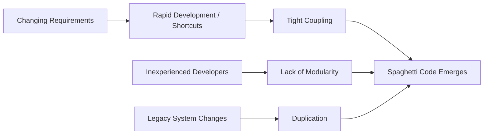

# Introduction to Spaghetti Code

Spaghetti code is an informal, yet widely-used term in software engineering describing source code that is difficult to understand, maintain, or extend due to its tangled and unstructured flow. The term evokes the appearance of cooked spaghetti, with logic interwoven and lacking the clear structure that underpins robust, modular systems. Spaghetti code is a core example of an *anti-pattern* in software development: a typical but counterproductive solution to recurring fundamental problems. Understanding spaghetti code is essential for all engineers aiming to produce clean, maintainable, and scalable software.

## Defining Spaghetti Code

At its core, spaghetti code is characterized by:

- Highly interdependent code segments (tight coupling)
- Absence of clear modular boundaries and reusable abstractions
- Complex, convoluted control flow, often dominated by excessive use of jumps, `goto` statements, or deeply nested conditionals and loops
- Lack of consistent naming, documentation, or style conventions

Spaghetti code can arise in any language or paradigm, though it is most commonly associated with procedural or scripting languages that offer few native organizational constructs.

## Technical Context and Historical Background

The battle against spaghetti code dates back to the earliest days of software development, particularly during the era when unstructured *goto*-driven programming was the norm (see the famous criticism of *goto* in Edsger Dijkstra’s 1968 letter “Go To Statement Considered Harmful”). The transition to structured programming, object-oriented design, and modular decomposition represents, in many respects, a direct response to the challenges imposed by spaghetti code.

Although modern languages and frameworks offer structures intended to prevent such tangled codebases, spaghetti code remains prevalent, especially in legacy systems, rapid prototypes, or projects lacking clear architectural discipline.

## Attributes and Components

Spaghetti code exhibits a collection of characteristics and architectural red flags, as follows.

### Structural Characteristics

- **Unstructured Flow**: The execution path is non-linear and hard to predict. Control jumps arbitrarily, making local reasoning about the program’s behavior difficult.
- **Tight Coupling**: Functions, modules, or classes depend directly on one another in ways that make them inseparable or non-reusable.
- **Global State**: Excessive use of global variables or side effects results in invisible dependencies across the codebase.
- **Duplication**: Code is frequently copied, leading to maintenance headaches and inconsistencies.

### Example of Spaghetti Code

Below is a simplified pseudo-code representation illustrating spaghetti-like structure:

```pseudo
function main() {
    action = promptUser()
    if (action == "A") {
        processA()
        if (conditionX) {
            processB()
        } else {
            processC()
            processA()
        }
    } else if (action == "B") {
        processC()
        // Deeply nested logic with many cross-references
        if (conditionY) {
            processA()
            processB()
        }
    }
}
```
The above lacks modular design, features deep nesting, and has repeated, cross-linked function calls.

## Mermaid Diagram: Control Flow in Spaghetti Code

```mermaid
flowchart TD
    Start([Start])
    A[Prompt User]
    B{Action == "A"?}
    C[processA]
    D{conditionX?}
    E[processB]
    F[processC]
    G[processA (again)]
    H{Action == "B"?}
    I[processC (B branch)]
    J{conditionY?}
    K[processA (B.Y)]
    L[processB (B.Y)]
    End([End])

    Start --> A --> B
    B -- Yes --> C
    B -- No --> H
    C --> D
    D -- Yes --> E --> End
    D -- No --> F --> G --> End
    H -- Yes --> I --> J
    J -- Yes --> K --> L --> End
    J -- No --> End
    H -- No --> End
```

This diagram illustrates a typical tangled flow with repeated calls, deep nesting, and ambiguous branches—hallmarks of spaghetti code.

## Causes and Typical Workflows

### How Spaghetti Code Emerges

Spaghetti code is usually not written intentionally; it evolves over time due to:

- **Lack of upfront design**: Projects undertaken without clear architectural sketches or roadmaps.
- **Pressure for rapid delivery**: Features added quickly, with little regard for the emerging structure.
- **Inexperienced developers**: Less familiarity with modular or hierarchical program structures.
- **Changing requirements**: As requirements shift, ad hoc fixes and additions accumulate, tangling the code further.

### Workflow Patterns

In practice, workflows in spaghetti codebases often rely on ad hoc editing and patching:

1. **Suppose a bug or new feature is identified.**
2. **Engineer locates relevant section—often by global search or trial-and-error, given lack of modularity.**
3. **Edits are performed in place, with new branches, flags, or cross-references added for special cases.**
4. **Testing is manual; regression bugs are frequent.**
5. **Over time, paths through the codebase proliferate, and maintainability degrades.**

## Engineering Considerations: Integration, Performance, and Maintenance

### Integration Points

Integration with external components, APIs, or libraries is especially risk-prone in spaghetti code. Non-modular programs make it difficult to:

- Substitute implementations
- Mock or isolate subsystems for testing
- Update or refactor without breakage

### Performance Implications

Although spaghetti code does not by definition perform worse at runtime, its lack of clarity and structure commonly introduces:

- Redundant calculations or operations
- Unreachable or dead code
- Errors in resource management (e.g., memory leaks)

### Maintenance Challenges

Spaghetti code is notorious for:

- **High onboarding costs**: New engineers struggle to understand the flow.
- **Regression risks**: Small fixes can have wide, unpredictable impact.
- **Bug propagation**: Fixing one bug often introduces others.
- **Testing difficulties**: Integration and unit testing are complicated by hidden dependencies.

> :warning: **Warning**
>
> Refactoring spaghetti code is risky and time-consuming. Regression testing coverage is essential before attempting any restructuring.

## Relationship to Other Anti-Patterns

Spaghetti code overlaps with, but is distinct from, related anti-patterns:

- **Big Ball of Mud**: Describes whole systems with no apparent architecture; spaghetti code can be a local or system-wide manifestation.
- **Lava Flow**: Refers to long-lived, unstructured, and obsolete code that accumulates over time.

## Diagram: How Spaghetti Code Grows



This diagram illustrates converging factors producing spaghetti code.

## Standards, Protocols, and Best Practices

There are no industry-wide formal standards specifically dedicated to preventing spaghetti code; rather, relevant software engineering standards and methodologies emphasize modularity and maintainability. For example:

- **Structured Programming:** Pioneered to combat the unstructured logic inherent to spaghetti code (see: Dijkstra, *Communications of the ACM*, 1968).
- **SOLID Principles:** Key guidelines for object-oriented design that emphasize single responsibility, open-closed architecture, and dependency inversion—all of which directly oppose spaghetti code practices.
- **Code Quality Tools:** Static code analyzers (e.g., SonarQube, PMD, ESLint) can detect complexity and coupling patterns symptomatic of spaghetti code.
- **Software Engineering Standards:** IEEE 829 (test documentation), ISO/IEC 25010 (software product quality), and similar process standards indirectly promote practices that inhibit spaghetti code growth.

## Remediation and Refactoring Strategies

Though this introduction does not cover advanced remediation approaches in depth, industry-recognized strategies include:

- Incremental modularization: Extracting functions and modules step by step
- Automated testing and coverage measurement prior to refactoring
- Adoption of coding standards and code review checklists
- Training and mentorship programs for consistent engineering discipline

> :bulb: **Tip**
>
> Even small improvements in modularity, decomposition, and documentation can yield disproportionately large gains in maintainability for legacy spaghetti codebases.

## Practical Engineering Summary

Spaghetti code poses a severe threat to code quality, maintainability, and team productivity. Identifying its symptoms and understanding its causes enables engineers to implement practices that directly counteract its emergence. Awareness of anti-patterns such as spaghetti code is a key hallmark of professional software engineering maturity. By recognizing, avoiding, and systematically refactoring tangled code, engineers uphold standards critical to sustaining large, reliable software systems.

---

**Note to contributors:**  
To visualize real-world spaghetti code, consider illustrating typical legacy refactoring workflows as additional stepwise diagrams.  
