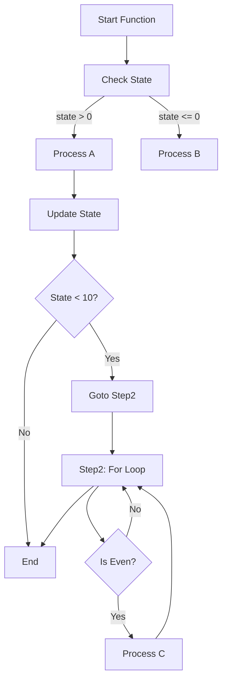
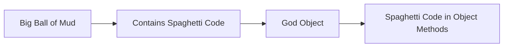
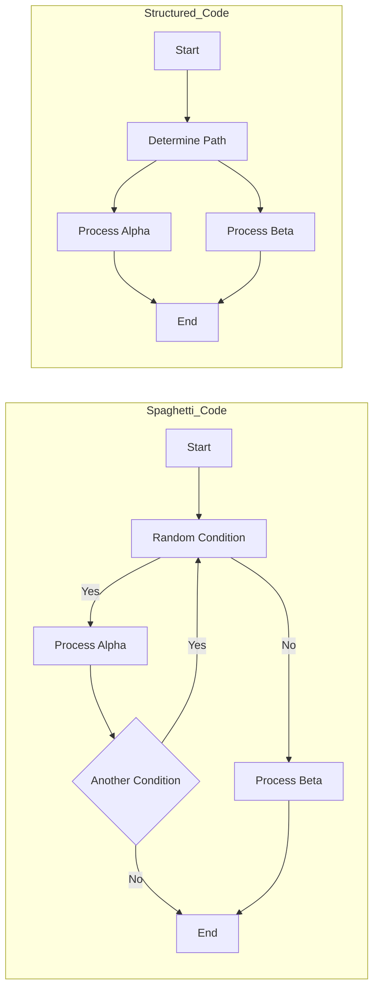

# Spaghetti Code

## Introduction

Spaghetti code is an anti-pattern in software engineering that refers to source code lacking clear structure or organization, resulting in an unmanageable and intertwined control flow. The code's resemblance to a tangled mass of spaghetti gives the pattern its name. Spaghetti code is characterized by arbitrary jumps in logic, excessive interdependence among program components, minimal modularization, and a general difficulty in understanding, testing, or modifying the system. These characteristics may emerge from hurried development, inadequate design, or a lack of adherence to best practices such as separation of concerns and encapsulation.

The prevalence of spaghetti code can lead to critical issues: maintainability is severely impacted, defects become hard to trace, and evolving the software becomes perilous due to the risk of unintended breakages. This primer examines spaghetti code in-depth, providing definitions, causes, technical symptoms, representative diagrams, and mitigation strategies, with a focus on practical engineering considerations.

---

## Defining Spaghetti Code

Spaghetti code does **not** refer to code written in a specific language or paradigm, but rather to the degree of *structural disorder* and *coupling* present in the codebase. It stands in contrast to well-structured code, which is modular, readable, and follows principles of software architecture such as single responsibility, loose coupling, and high cohesion.

### Core Characteristics

- **Tangled Control Flow:** Logic jumps erratically between code sections, often driven by goto statements, deeply nested conditionals, or poorly structured loops.
- **Lack of Modularity:** Code is not separated into logical units (e.g., functions, classes, modules), making reuse and encapsulation difficult.
- **High Coupling:** Code segments are excessively interdependent, so changes propagate unpredictably and bug fixes may cause regressions.
- **Naming, Documentation, and Testing Deficiencies:** Variables, functions, and classes are often poorly named. Documentation is typically absent or misleading, and meaningful tests are hard to write.

### Context and Scope

Spaghetti code is commonly found in:

- Legacy codebases that have evolved over time without refactoring.
- Systems written by inexperienced developers.
- Projects executed under aggressive deadlines, where speed takes precedence over architectural rigor.
- Applications grown without established coding or design standards.

It can pervade any layer of an application (UI, business logic, or data access), regardless of language, platform, or domain.

---

## Causes of Spaghetti Code

Understanding the sources of spaghetti code informs both technical diagnosis and remediation. The following are common contributing factors:

1. **Imperative Goto Statements**  
    Unstructured jumps in control, especially prevalent in older languages (e.g., BASIC, early C), break the predictable sequence of execution.

2. **Lack of Abstraction**  
    Absence of meaningful functions, classes, or modules results in one large block of code with all logic embedded inline.

3. **Rapid Prototyping and Ad-Hoc Fixes**  
    Code written for expedience often ignores design principles, accumulating technical debt as patches and quick fixes are layered on.

4. **Poor Understanding of Design Principles**  
    Failure to apply or even recognize established patterns for organizing code, such as Model-View-Controller (MVC), results in unstructured and entangled implementations.

5. **Inadequate Code Reviews and Testing**  
    Teams without strong review processes or test automation frequently accrue spaghetti code, as errors and anti-patterns propagate unchecked.

---

## Technical Symptoms and Examples

### Sample Spaghetti Code (Pseudocode)

Below is an illustrative example in a C-like pseudocode, showing erratic control flow, poor modularization, and excessive coupling:

```c
int main() {
    int state = getInput();
    if (state > 0) {
        processA(state);
        state = updateState(state);
        if (state < 10) {
            goto Step2;
        }
    } else {
        processB(state);
    }
Step2:
    for (int i = 0; i < state; i++) {
        if (i % 2 == 0) {
            processC(i * state);
        }
        // ... more deeply nested logic
    }
    // Continues with more jumps and nested conditions...
}
```

**Characteristics Observed**:

- Goto statements and disorganized jumps.
- Nested logic with weak abstraction.
- Control flow difficult to map or predict.

---

## Visualizing Spaghetti Code

Mermaid diagram representing a typical spaghetti codebase's control flow:



This tangled web highlights the lack of clear structure and the cyclical, hard-to-follow control paths emblematic of spaghetti code.

---

## Engineering Consequences

### Maintenance

Spaghetti code severely hinders maintainability. Even trivial bugs can require tracing long, convoluted logical paths, as single changes may have unexpected repercussions elsewhere. 

### Testability

Because logic is entwined and not decomposed into testable units, writing unit tests or even reliable integration tests is challenging, leading to fragile software.

### Extensibility

Adding new features or adapting to changing requirements is unsafe, with high risk of introducing defects. As a result, extensibility is nearly impossible without significant refactoring.

### Debugging and Troubleshooting

The lack of predictability means symptoms rarely point to a single root cause. Debugging tools and stack traces provide less utility in the absence of coherent structure.

---

## Relationship to Other Anti-Patterns

Spaghetti code often co-occurs with or evolves into other anti-patterns:

- **Big Ball of Mud:** A system-wide architecture typified by pervasive, undocumented, and unstructured code, of which spaghetti code may be the primary symptom.
- **God Object:** Where one object or module accumulates excessive responsibilities; the code within the god object itself is likely to exhibit spaghetti-like qualities.



---

## Mitigating Spaghetti Code

### Refactoring Strategies

The primary technical remedy for spaghetti code is refactoring: incrementally restructuring code to improve structure without changing external behavior.

**Common Techniques:**

- **Extract Method or Function:** Move repeated or logically coherent code into self-contained methods, functions, or classes.
- **Introduce Abstractions:** Employ design patterns (e.g., Strategy, State) to separate concerns and clarify responsibilities.
- **Encapsulate Conditionals:** Minimize nesting by returning early or using polymorphism.
- **Modularization:** Divide monolithic code into meaningful modules or packages with well-defined interfaces.
- **Remove Goto:** Replace jumps with structured control flow such as loops and switches.

#### Example: Refactoring Control Flow

**Before (Tangled):**
```python
if status == 'ready':
    process_a()
    status = update(status)
    if status < 10:
        i = 0
        while i < status:
            if i % 2 == 0:
                process_c(i, status)
            i += 1
else:
    process_b()
```

**After (Structured):**
```python
def process_ready(status):
    process_a()
    updated = update(status)
    process_loop(updated)

def process_loop(status):
    for i in range(status):
        if i % 2 == 0:
            process_c(i, status)

if status == 'ready':
    process_ready(status)
else:
    process_b()
```

### Tooling Support

Static analysis tools can help identify sources of spaghetti code:

- **Code Metrics:** Tools like SonarQube, pylint, or ESLint measure code complexity (cyclomatic complexity, function length, nesting depth).
- **Linting:** Automated style checkers flag deeply nested or excessively long code blocks.
- **Architecture Analysis:** Tools assess module or package dependencies, flagging tightly coupled components.

### Engineering Best Practices

- **Code Reviews:** Enforce peer reviews with a focus on maintainability and modularity.
- **Adopt Design Patterns:** Apply established object-oriented, functional, or modularization patterns as appropriate.
- **Continuous Refactoring:** Integrate refactoring as part of routine development, not just as a one-off task.
- **Testing:** Write unit and integration tests to support safe code reorganization.

---

## Practical Considerations

### Integration Points

When refactoring or extending spaghetti code, engineers should:

- Identify and secure integration points (APIs, libraries, external services) before refactoring, to minimize risk of breaking system contracts.
- Avoid large-scale rewrites unless justified; prefer incremental refactoring with frequent functional validation.

### Performance Implications

While spaghetti code is seldom a root cause of poor runtime performance, excessive inter-module calls, recursion, or unoptimized flow may contribute to inefficiencies. Restructuring for clarity often incidentally reveals performance improvement opportunities.

### Implementation Challenges

- **Gaining Context:** Reverse-engineering the logic in spaghetti code is time-consuming and error prone. Automated code visualization and coverage analysis can assist.
- **Risk of Regression:** With no modular boundaries, even small changes may introduce bugs. Strong automated test suites are vital.
- **Cultural Issues:** Teams accustomed to expediency may resist investing in long-term maintenance efforts.

> [!CAUTION]
> Attempting to refactor or rewrite large blocks of spaghetti code without ample test coverage or stakeholder buy-in can destabilize production systems. Always proceed incrementally.

### Common Pitfalls

- **Big Bang Rewrite:** Rewriting an entire codebase at once is usually not feasible; instead, prioritize high-value, high-risk modules for early restructuring.
- **Superficial Clean-Up:** Merely renaming variables or functions does not address the underlying issues; focus on decoupling and modularity.
- **Overengineering:** Excessive abstraction in the absence of clear requirements can be as damaging as the original entanglement.

---

## Contrasts and Variations

While spaghetti code is the prototypical anti-pattern in unstructured source code, other code smells may reflect related but distinct problems, such as:

- **Lasagna Code:** Layers are present, but interfaces between them are poorly defined or leak details.
- **Ravioli Code:** Codebase consists of many small, arguably too granular, classes or modules with unclear responsibilities.

Understanding these differences can guide appropriate remediation patterns.

---

## Mermaid Diagram: Spaghetti Code vs. Structured Code Control Flow



---

## Summary

Spaghetti code represents a serious obstacle to the maintainability, reliability, and extensibility of software systems, arising from a failure to apply structure, modularity, and proper abstraction. Engineers encountering tangled or coupled codebases should diagnose critical problem areas using metrics, diagrams, and static analysis tools, then apply disciplined, incremental refactoring in line with best engineering practices. Avoiding or remedying spaghetti code is fundamental to sustaining software quality and velocity in the long term.

---

> [!TIP]
> Regularly assess project code quality using both automated tools and peer reviews. Early identification and remediation are much less costly than dealing with a sprawling mass of spaghetti code at scale.

---

> [!NOTE]
> Diagram to be added later: A timeline view of codebase entropy increase in unmanaged spaghetti code systems.