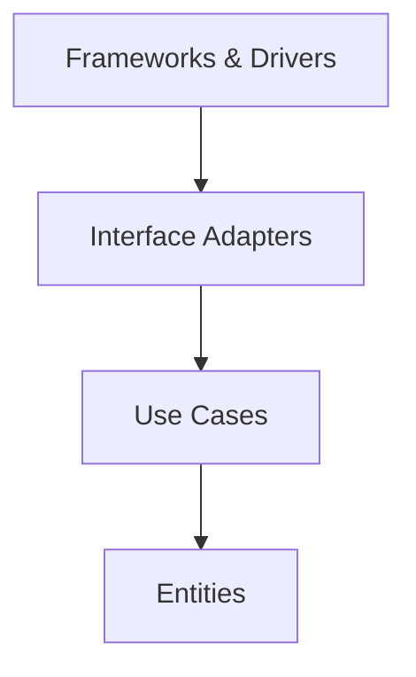
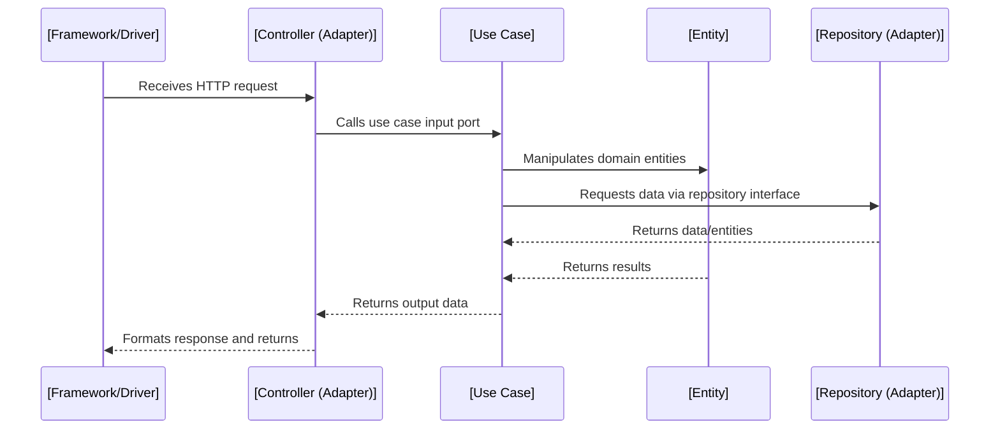

# Clean Architecture

## 1. Introduction

**Clean Architecture** is a software architecture style that places a strong emphasis on the separation of concerns, independence of business logic, and the definition of boundaries across system components. Its main purpose is to structure software so that critical business rules are completely decoupled from lower-level concerns such as frameworks, databases, and devices, enabling systems to be robust, adaptable, and testable.

Originating from the work of Robert C. Martin ("Uncle Bob"), Clean Architecture synthesizes principles from earlier paradigms such as Hexagonal Architecture (Ports and Adapters), Onion Architecture, and the general field of Domain-Driven Design (DDD). By emphasizing the independence of the core logic, Clean Architecture provides practical solutions to persistent issues in software systems, such as hard-to-change business requirements and technological churn.

## 2. Definition and Goals

Clean Architecture is a layered architectural style defined by concentric circles. Each layer, or ring, represents a different set of responsibilities, demarcated by clear boundaries. A crucial structural property is that dependencies always point inwards—lower-level mechanisms and devices depend on higher-level business rules, and never vice versa.

**Key goals of Clean Architecture:**
- **Business rule independence:** Business logic is isolated from external agents (database, UI, frameworks).
- **Testability:** Core logic can be tested independently of infrastructure.
- **Maintainability:** Effects of changes in technology or business requirements are localized.
- **Flexibility:** System can be adapted for varying environments (e.g., mobile/web), or updated to use different frameworks/datastores.
- **Separation of concerns:** Each layer has a focused role, reducing coupling and increasing cohesion.

## 3. Core Concepts and Components

### 3.1 The Layered Structure

Clean Architecture organizes code into the following typical layers (moving from innermost to outermost):

1. **Entities** – Core business objects and rules. Ex: domain models, enterprise rules.
2. **Use Cases (Application Layer)** – Specifications of application-specific business rules. Orchestrates and coordinates entities to execute workflows.
3. **Interface Adapters** – Adapters and translators: Controllers, Presenters, Gateways, Repositories. Convert data between formats used by use cases/entities and external agents (e.g., UI, DB).
4. **Frameworks and Drivers** – External agencies such as databases, web frameworks, UI technology, third-party APIs.

#### Mermaid Diagram: Clean Architecture Layered Model



**Dependency Rule:** Code in a given layer can only depend on code in the same layer or inward (never outward).

### 3.2 Boundaries and Dependency Inversion

**Boundaries** in Clean Architecture separate policy from detail, or business rules from implementation. All crossing of boundaries is done via interfaces (abstract types). The **Dependency Inversion Principle (DIP)** is central: high-level modules define abstractions; low-level modules implement them.

- **Input and Output Ports:** Use cases communicate with the outer world via interfaces ("ports"). External agents implement those interfaces ("adapters").
- **Shapes of boundaries:** Boundaries are not solely physical files or directories, but are enforced through programming constructs: interfaces, dependency injection, service locators, etc.

### 3.3 Externalities

Anything not central to the business logic—such as databases, UI, messaging systems, file systems—is treated as a detail to be plugged in at the edge of the architecture. Clean Architecture does not ban technology dependencies; it localizes and isolates them.

## 4. How Clean Architecture Works in Practice

### 4.1 Typical Workflow and Layer Interactions

A web request typically flows as follows:

1. **Framework Layer**: HTTP framework (e.g., Django, ASP.NET, Express) receives request, passes to controller.
2. **Interface Adapter Layer**: Controller parses request, invokes a use case via input port. Presenter prepares response.
3. **Use Case/Application Layer**: Use case performs workflow, orchestrates entities, invokes boundary interfaces for required external effects (repos, notifications, etc.).
4. **Entity Layer**: Domain objects encapsulate business logic, enforce validation/invariants, expose domain methods.
5. **Backwards:** Results propagate back through adapters/presenters to frameworks, which return response to user.

#### Mermaid Diagram: Request Processing Call Flow



### 4.2 Constraints and Assumptions

- **Independence of core:** Entities and application business rules should not be aware of UI frameworks, databases, or external agents.
- **Inward dependencies only:** All references and dependencies must point inwards toward business logic.
- **External agents implement interfaces owned by the core.**
- **Data is a detail:** Data schemas, encodings, and formats can change without requiring change in domain/business logic.

### 4.3 Implementation Details

#### 4.3.1 Interface Definition and Injection

Use case interfaces and repository boundaries are defined in the core. Implementations (such as database access) reside in outer layers and are provided to the inner layers (e.g., via constructor or dependency injection frameworks).

#### 4.3.2 Mapping Data Across Boundaries

Object-Relational Mappers (ORMs), serializers, or mappers are often used to translate between external data formats and internal entities. Mappings are handled in the Interface Adapters layer.

#### 4.3.3 Testing Implications

Because use cases and entities are decoupled from infrastructure, they can be unit tested with mock adapters, without running a database, server, or UI.

> **Note**
> 
> Code organization follows architectural boundaries, not necessarily technical constructs. Packages, modules, or namespaces may be used to enforce boundaries, depending on language support.

## 5. Common Variations and Related Patterns

### 5.1 Comparisons

- **Hexagonal Architecture (Ports and Adapters):** Similar emphasis on boundaries and dependency inversion; clean architecture generalizes the ports/adapters pattern by formalizing layers.
- **Onion Architecture:** Inner rings are for domain models, outer rings for interfaces/adapters. Clean Architecture assumes stricter layering and more explicit use-case/application rules.
- **Layered (N-Tier) Architecture:** Traditionally allows both inward/outward dependencies between adjacent layers; Clean Architecture restricts to inward-only.

### 5.2 Integration with Domain-Driven Design

Clean Architecture aligns well with DDD:
- **Entities/Aggregates:** DDD's domain entities live in the innermost circle.
- **Repositories:** Boundary interfaces defined in domain/application layer.
- **Value Objects and Domain Services:** Located in innermost circles.

### 5.3 Implementation Styles

- **Explicit Layers:** Some teams create explicit subdirectories or modules for entities, use cases, adapters, frameworks.
- **Package-by-Feature:** Within each layer, organization may be feature-oriented rather than type-oriented.
- **Framework-Inclusive Approach:** Minimal code in framework layer; business logic kept free from framework classes.

## 6. Engineering Considerations

### 6.1 Integration Points

- **Databases/Datastores:** Implement repository interfaces at the edge, allowing easy replacement or mocking.
- **UI/Services:** Implement UI ports in outer layers; inner layers expose only abstract capabilities.
- **Third-Party APIs:** Accessed via gateway interfaces, implemented in adapters.

> **Caution**
>
> Over-engineering boundaries can add unnecessary complexity if the business logic is trivial or the system is small and unlikely to change.

### 6.2 Performance Implications

- **Abstraction Costs:** Interface layers add indirection, which may incur runtime overhead, especially in languages where interface method calls are not inlined.
- **Boundary Crossing:** Excessive serialization/mapping across layers may degrade performance if improperly managed.
- **Optimizations:** Critical paths may require selectively relaxing boundaries or adding tactical optimizations (e.g., batching at adapters).

### 6.3 Implementation Challenges

- **Boundary Drift:** Without strict discipline, forbidden dependencies (from inner to outer layers) can creep in.
- **Testing:** While isolation eases unit testing, integration tests must verify the correct wiring of ports/adapters.
- **Team Structure:** Clean Architecture works best when teams align to architectural boundaries, reducing knowledge silos.
- **Framework Intrusion:** Some frameworks make it difficult to isolate business logic due to invasive conventions.

### 6.4 Common Pitfalls

- **Anemic Domain Models:** Failing to locate enough logic in the entity layer, leading to transaction scripts and procedural code in use cases.
- **Over-Abstracting Early:** Abstracting all possible infrastructure prematurely leads to unused interfaces and maintenance burden.
- **Layer Bleed:** Data transfer objects (DTOs) flowing through all layers, carrying framework or database-specific data into the domain.

> **Tip**
>
> Enforce boundary direction with tools such as dependency analyzers (e.g., ArchUnit for Java, dependency-cruiser for JavaScript/TypeScript).

## 7. Example: A Simplified Order Management System

To illustrate, consider an order management service:

### 7.1 Layers

1. **Entities:** `Order`, `OrderItem`, `Customer` with business invariants (e.g., cannot add items to shipped orders).
2. **Use Cases:** `PlaceOrder`, `CancelOrder`, `ShipOrder`.
3. **Interface Adapters:**
   - Controllers: Accept HTTP requests, call use cases
   - Presenters: Format order results to JSON
   - Repositories: Interface for storage/retrieval
4. **Frameworks/Drivers:** HTTP server, ORM, mail service, logging.

### 7.2 Example Data Flow: Placing an Order

#### Mermaid Diagram: Placing an Order (Layer Flow)

```mermaid
flowchart TD
    framework[HTTP Server]
    controller[OrderController (Adapter)]
    usecase[PlaceOrder (Use Case)]
    entity[Order Entity]
    repo[OrderRepository (Adapter)]
    db[Database]

    framework --> controller
    controller --> usecase
    usecase --> entity
    usecase --> repo
    repo --> db
```

## 8. Standards and References

While Clean Architecture is not formalized in standards such as RFCs, it draws upon codified architectural principles:

- **SOLID Principles:** Especially Dependency Inversion Principle.
- **IEEE 1471:** Recommended practice for architecture description.
- **ISO/IEC/IEEE 42010:** Systems and software architecture standard.
- **Related Patterns:** Hexagonal Architecture (Alistair Cockburn), Onion Architecture (Jeffrey Palermo).
- **Domain-Driven Design:** Eric Evans, Vaughn Vernon.

## 9. Conclusion

Clean Architecture offers a clear, principled approach to designing software systems that are resilient to change and easy to reason about. By structuring systems into concentric, dependency-inverted layers, and strictly separating business logic from frameworks and devices, this architecture style enables robust systems with a clear path to maintainability, testability, and adaptability.

By following the discipline of Clean Architecture, engineering teams can mitigate many of the classic challenges of software maintenance, technical debt, and rapid technological change, while allowing continuous evolution of system capabilities and longevity of business-critical code.

---

> **Note**
>
> For complex domain models, consider using additional diagrams (state charts, object collaborations) to explicitly model invariants and interactions—diagram to be added later.