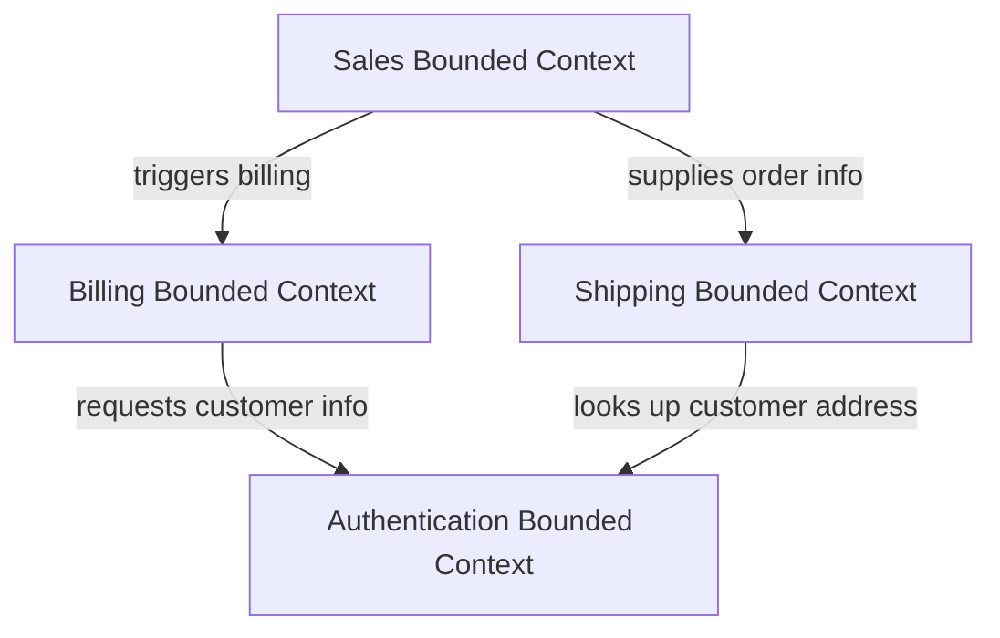
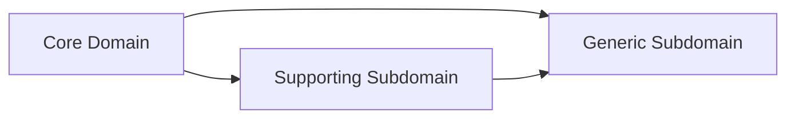
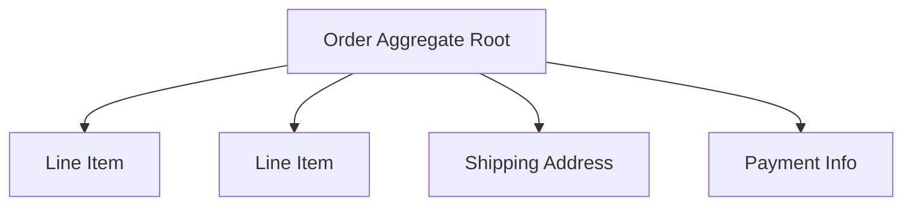
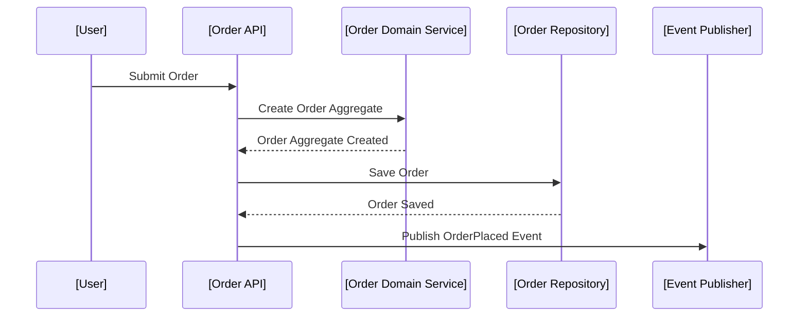

# Domain-Driven Design (DDD): An Engineering Overview

Domain-Driven Design (DDD) is a software engineering approach focused on modelling complex business domains by structuring software around evolving domain models. DDD seeks to foster a common understanding between business stakeholders and software engineers by managing complexity through concepts such as bounded contexts, ubiquitous language, aggregates, repositories, and domain events.

DDD was introduced by Eric Evans in his seminal book, "Domain-Driven Design: Tackling Complexity in the Heart of Software" (2004), and has since been applied in various domains and architectural paradigms, especially in large-scale, distributed, and microservice-based systems.

---

## 1. DDD in the Technical Context

DDD originated as a response to the challenges engineering teams encounter when modelling and maintaining complex, real-world systems. Traditional layered architectures often suffer from conceptual misalignment between business processes and technical implementation, leading to communication breakdowns, technical debt, and systems that fail to meet business needs.

DDD addresses these issues by prioritizing a model-centric approach, where software artifacts (classes, modules, APIs) align directly with business concepts. DDD is not a prescriptive architecture, but a set of guiding principles and patterns applicable within many architectural paradigms, notably Hexagonal, Microservices, and Event-Driven architectures.

---

## 2. Core Concepts of DDD

### 2.1 Ubiquitous Language

At the heart of DDD is the **ubiquitous language**: a common, rigorous vocabulary shared by both business experts and engineers. This language is reflected in all artefacts—code, documentation, tests, diagrams—minimizing translation errors and ambiguity.

**Example**: In a loan originations domain, terms like "Application", "Underwriter", and "Decision" must have precise, agreed-upon meanings used both in conversation and code.

> **Alert**
> 
> _Consistency in ubiquitous language is critical. Deviations in term usage or implicit translation introduce subtle, hard-to-detect bugs and communication failures._

### 2.2 Models and Domain Models

A **domain model** is an abstract representation of selected aspects of the business domain, typically expressed in terms of entities, value objects, aggregates, and their relationships. The domain model serves as the backbone of the implementation, dictating data structures, operations, and interactions.

#### Entities

**Entities** are domain objects defined primarily by a unique identity, not just their attributes.

**Example**: `Customer` with a unique `customerId`.

#### Value Objects

**Value Objects** are defined solely by their attribute values and are immutable.

**Example**: `Money` with an `amount` and `currency`, or `Address` with `street`, `city`, and `postcode`.

#### Aggregates

An **Aggregate** is a consistency boundary: a cluster of associated objects treated as a unit for data changes. Aggregates ensure invariants are enforced within the boundary but not across.

**Example**: An `Order` aggregate comprising line items, shipping info, and payment status.

#### Domain Events

**Domain Events** represent significant events that have occurred in the domain, often used to notify other components or services asynchronously.

**Example**: `OrderShipped`, `PaymentReceived`.

#### Repositories

**Repositories** mediate between the domain and data mapping layers, providing access to aggregate roots while hiding persistence details.

---

## 3. Bounded Contexts

### 3.1 Motivation and Definition

In large or complex domains, the meaning of terms and rules often varies depending on context. To prevent conceptual conflation, DDD introduces **bounded contexts**: explicit boundaries within which a particular domain model applies. Within a bounded context, the ubiquitous language is consistently and unambiguously applied.

**Example**: In one context, the term "Customer" may refer to an external party purchasing goods; in another, it may refer to an internal employee-as-customer scenario.

### 3.2 Bounded Contexts and Their Relationships

Bounded contexts are first-class modelling artefacts. Their relationships can include shared kernels, customer-supplier relationships, conformist contexts, and anti-corruption layers.

#### Context Map Diagram (Mermaid Syntax)



### 3.3 Integration Patterns

When bounded contexts interact, integrating them while preserving their individual integrity is crucial. DDD offers several integration patterns:

- **Shared Kernel**: Sharing only part of the model.
- **Customer/Supplier**: One context depends on another’s model.
- **Conformist**: Adopting the upstream model wholesale.
- **Anti-corruption Layer (ACL)**: Translator to protect the integrity of a model when integrating two bounded contexts.

---

## 4. Strategic Design

### 4.1 Domain Partitioning

Strategic design is about identifying, naming, and defining bounded contexts and their interrelationships—essentially mapping the entire system. Strategic design is especially relevant in microservices and large enterprises where separate bounded contexts may be implemented by different teams or technologies.

**Process:**
- Identify core domain, supporting subdomains, and generic subdomains.
- Map out bounded contexts and align teams to them.
- Choose integration approaches (see above).
- Align organizational boundaries to context boundaries for maximizing effectiveness (see: Conway’s Law).

### 4.2 Core, Supporting, and Generic Subdomains

- **Core Domain**: Where the business derives its competitive advantage.
- **Supporting Subdomain**: Enables the core (e.g., reporting tools).
- **Generic Subdomain**: Common solutions used by many (e.g., authentication).



---

## 5. Tactical Design

Tactical design covers fine-grained design patterns within bounded contexts, focusing on translating the domain model into software.

### 5.1 Aggregates

Aggregates are the fundamental consistency boundary in DDD. They encapsulate entities and value objects, enforcing invariants and transactional consistency.

**Design Rules:**
- Each aggregate has a single aggregate root.
- Only aggregate roots are referenced externally.
- Ensure aggregates are transactionally consistent, while allowing eventual consistency between aggregates if needed.



### 5.2 Entities and Value Objects

Entities are mutable, identity-based objects, whereas value objects are immutable and defined solely by their value. Use value objects liberally to express domain concepts with safety and clarity.

**Tip:**  
Use value objects to encapsulate domain rules (e.g., `EmailAddress` that validates format).

### 5.3 Domain Events

Domain events record that something interesting from the domain perspective has occurred. They are useful for integrating with other bounded contexts or external services, and enable eventual consistency patterns prevalent in distributed systems.

**Example:**

```java
public class OrderShipped extends DomainEvent {
    private final UUID orderId;
    private final Instant timestamp;
    // ...additional details
}
```

### 5.4 Repositories

Repositories abstract away data storage, allowing domain logic to operate against in-memory models or various types of persistence stores (relational, NoSQL).

**Practical Guidance:**
- Repositories only expose aggregate roots.
- Hide infrastructure details from domain logic.

---

## 6. DDD in Practice

### 6.1 Workflow Example

#### Example: Order Placement in E-Commerce

1. **User places order** with order details.
2. **Order aggregate** is constructed (with validation rules).
3. **Aggregate’s invariants** checked (e.g., inventory).
4. **Domain event** `OrderPlaced` emitted and handled.
5. **Repository persists** aggregate (could trigger transactional outbox pattern for events).
6. **Other contexts** (Shipping, Billing) are notified via event publication.



### 6.2 Constraints and Engineering Tradeoffs

#### Transactional Boundaries

Aggregates are designed to avoid large, monolithic transactions. DDD encourages small, focused aggregates, trading consistency for scalability and availability, especially in distributed architectures.

#### Performance Implications

- Aggregates should be small to minimize locking/contention.
- Avoid tight coupling and direct references between aggregates across contexts.

#### Integration and Eventual Consistency

In many modern systems (e.g., microservices), communication between bounded contexts is asynchronous, often via eventing (domain events). This introduces eventual consistency: updates propagate, but not instantly.

> **Alert**
> 
> _Failure to design with eventual consistency in mind can lead to subtle race conditions and business anomalies. Always make explicit which invariants are local (aggregate-scoped) and which are cross-context (integrity via process management or reconciliation)._

---

## 7. DDD and Architectural Styles

DDD is often used in conjunction with architectural patterns that facilitate modularity and autonomy.

### 7.1 Hexagonal Architecture

Also known as Ports and Adapters, Hexagonal Architecture naturally separates domain logic from infrastructure concerns, aligning with DDD’s emphasis on a clean, focused domain model.

### 7.2 Microservices

In microservices architectures, bounded contexts often align with service boundaries. Each microservice owns its data and its domain model.

**Engineering Decisions:**
- Minimize or manage dependencies between services (bounded contexts).
- Clearly define and document contracts (APIs, events).
- Apply anti-corruption layers where models cannot be reconciled directly.

### 7.3 Event-Driven Architecture

DDD's domain events are a natural fit for event-driven systems, enabling loose coupling, scalability, and resilience.

```mermaid
flowchart TD
    [Order Service] -- emits OrderPlaced --> [Event Bus]
    [Event Bus] -- notifies --> [Billing Service]
    [Event Bus] -- notifies --> [Shipping Service]
```

---

## 8. Common Variations and Extensions

### 8.1 CQRS (Command Query Responsibility Segregation)

CQRS is a pattern frequently applied with DDD. It separates mutation operations (commands) from query operations, often optimizing for scalability or performance, and sometimes employing distinct models for each.

### 8.2 Event Sourcing

Event sourcing persists the state of aggregates as a series of domain events rather than storing the current state directly. This provides auditability and aligns naturally with domain events, but imposes new persistence and reconstruction challenges.

> **Alert**
> 
> _Event sourcing and DDD aggregates fit naturally together, but event-store implementations require special care around event versioning, schema evolution, and replay consistency._

---

## 9. Implementation Challenges

### 9.1 Model-Driven and Collaborative Development

Consistent collaboration between business experts and developers is essential. Success depends not only on technical tooling, but on organizational practices, communication, and discipline in keeping code and terminology aligned.

### 9.2 Legacy Systems

When applying DDD to legacy or brownfield projects, anti-corruption layers become critical to protect new, clean domain models from leaky, entangled legacy concepts.

### 9.3 Tooling and Frameworks

While some frameworks (e.g., Axon, Lagom, Spring Data) provide DDD-friendly abstractions, overreliance on frameworks at the expense of expressive, model-driven code can undermine the core principles of DDD.

---

## 10. Common Pitfalls

- **Anemic Domain Models**: Domain logic should reside in the model, not just in services. Anemic models (all data, no behavior) are an anti-pattern.
- **Overengineering**: Not all projects require full-blown DDD. Use DDD where complexity and business logic warrant it; avoid applying tactical patterns dogmatically in CRUD-heavy or simple domains.
- **Ignoring Ubiquitous Language**: Allowing domain concepts to drift between stakeholders and code rapidly erodes the clarity DDD provides.
- **Misaligned Boundaries**: Setting bounded context boundaries incorrectly leads to excessive coupling and integration failures.

> **Alert**
> 
> _Start with discovering the true business complexity and identifying core domains, rather than prematurely optimizing designs or architectures._

---

## 11. Conclusion

Domain-Driven Design (DDD) is not a silver bullet, but rather a disciplined approach to managing complexity in business-critical systems. By aligning software structure and language with the domain, identifying clear bounded contexts, and maintaining model integrity through aggregates and supporting patterns, DDD supports systems that are robust, maintainable, and capable of evolving as business needs change.

Engineers adopting DDD should focus on consistent communication, strategic modelling, and tactical implementation practices. Effective use of DDD enables not just technically sound solutions, but ones deeply rooted in business reality, maximizing both system value and longevity.