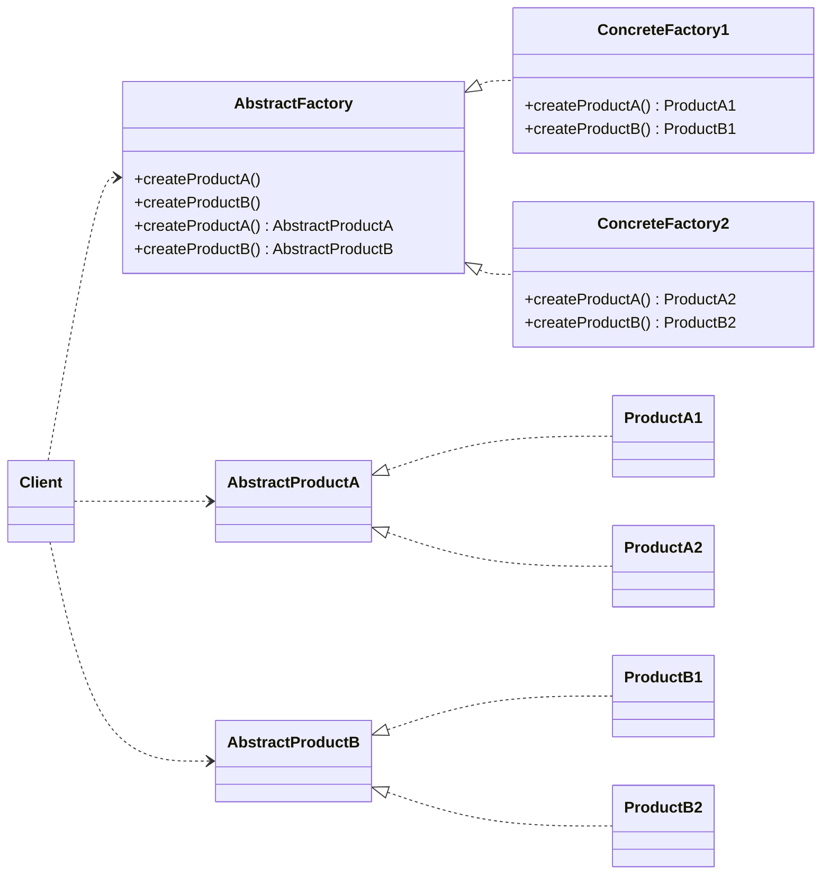
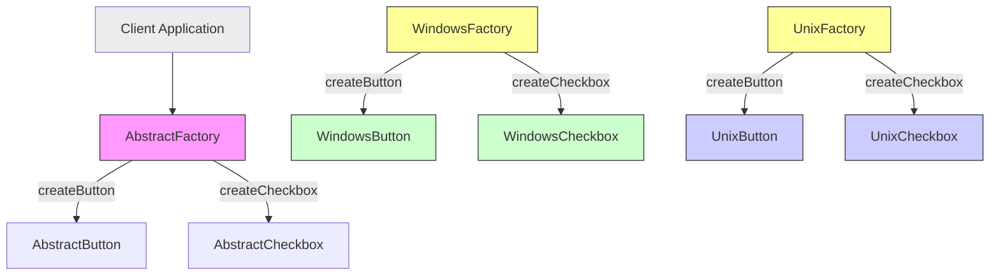
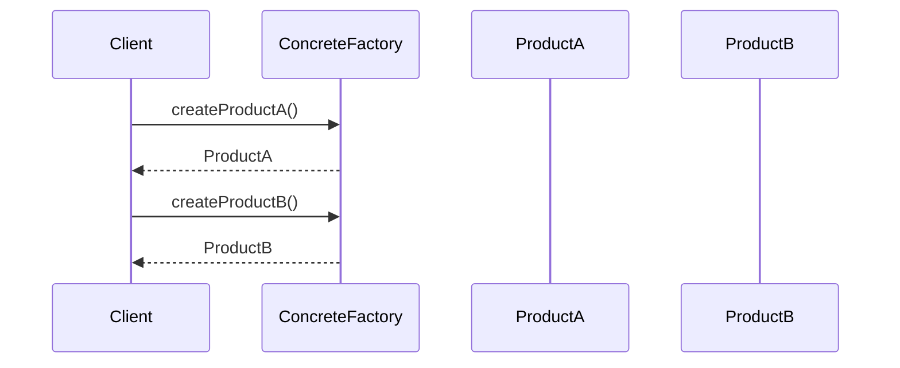

# Abstract Factory Pattern

## Introduction

The Abstract Factory Pattern is a creational design pattern in object-oriented software engineering. It provides a way to encapsulate a group of individual factories that have a common theme without specifying their concrete classes. Its presence ensures that a system is independent of how its objects are created, composed, and represented.

The Abstract Factory Pattern is a classic member of the "Gang of Four" design patterns catalogued in _Design Patterns: Elements of Reusable Object-Oriented Software_ by Gamma, Helm, Johnson, and Vlissides (1994). It is foundational in frameworks and libraries that require the creation of interoperable families of objects, supporting consistency and extensibility in the codebase.

## Motivation and Context

In software engineering, it is common to design systems that must be independent of their product creation process. For instance, an application may need to support multiple operating system interfaces, widget toolkits, database connectors, or document parsers. When object families are interdependent and should always be used together, instantiating them via explicit class references leads to rigid, hard-to-maintain code.

The Abstract Factory Pattern addresses these challenges by:

- Providing an interface for creating families of related or dependent objects without relying on their concrete implementations.
- Enforcing object consistency by guaranteeing that products from the same family are compatible.
- Supporting platform independence and ease of configuration in large-scale architectures, UI frameworks, database adapters, and device drivers.

## Structure and Core Concepts

### Key Components

The pattern consists of the following principal participants:

- **AbstractFactory Interface**: Declares a set of methods for creating the various abstract product types.
- **ConcreteFactory Classes**: Implement the creation methods for specific object families.
- **AbstractProduct Interfaces**: Declare interfaces for types of products to be created.
- **ConcreteProduct Classes**: Implement the product interfaces for specific families.
- **Client**: Uses only interfaces provided by AbstractFactory and AbstractProduct. It creates products without direct knowledge of their concrete classes.

### Class Diagram



#### Component Roles

- **AbstractFactory**: Declares creation methods for each abstract product type.
- **ConcreteFactory**: Implements creation methods for a specific family (e.g., Windows, macOS, or Linux in a cross-platform UI).
- **AbstractProduct**: Specifies the interface for a type of product, ensuring families are interchangeable.
- **ConcreteProduct**: Realizes the interface of an abstract product for a given family.
- **Client**: Instantiates factories and uses only exposed interfaces.

## Practical Example: Cross-Platform GUI

Consider a GUI framework supporting both Windows and Unix-like environments, each with its own widget set. Using the Abstract Factory Pattern, the system can provide widget families (buttons, checkboxes, etc.) appropriate to the underlying OS without clients directly instantiating OS-specific classes.



## Implementation Overview

### Workflow

1. **Define Abstract Factories and Products**: Specify base interfaces or abstract classes for factories and products.
2. **Implement Concrete Factories and Products**: Create subclasses for concrete product families.
3. **Client Usage**: The client instantiates a concrete factory, then creates products exclusively via the abstract interfaces.

### Example: Pseudocode

```plaintext
// Abstract Factory
interface WidgetFactory {
    Button createButton();
    Checkbox createCheckbox();
}

// Concrete Factories
class WindowsWidgetFactory implements WidgetFactory { ... }
class LinuxWidgetFactory implements WidgetFactory { ... }

// Abstract Product
interface Button { void render(); }
interface Checkbox { void render(); }

// Concrete Products
class WindowsButton implements Button { ... }
class LinuxButton implements Button { ... }
class WindowsCheckbox implements Checkbox { ... }
class LinuxCheckbox implements Checkbox { ... }

// Client
void application(WidgetFactory factory) {
    Button button = factory.createButton();
    Checkbox checkbox = factory.createCheckbox();
    button.render();
    checkbox.render();
}
```

### Factory Selection

Factory selection is commonly determined at runtime using configuration files, environment variables, or dependency injection, promoting greater flexibility and extensibility.

## Constraints, Assumptions, and Engineering Considerations

- **Consistent Product Families:** The Abstract Factory enforces creation of compatible products, preventing accidental mixing of unrelated products (e.g., Windows button with Unix checkbox).
- **Extension and Scalability:** Adding new product families (i.e., new ConcreteFactories) is straightforward. However, adding new product types (new methods in the AbstractFactory) may require interface changes across all factories.
- **Interface Overload:** If families grow to include many products, the factory interface can become unwieldy. Consider using sub-factories or the Builder pattern in such cases.
- **Dependency Management:** Integration with dependency injection frameworks can offload factory selection and binding, especially in large-scale applications.

> **Note**
>  
> The Abstract Factory is typically employed where products have interdependencies, and all objects must follow a particular interface to ensure interoperability.

## Benefits

- **Encapsulation of Object Creation:** Decouples the system from concrete product implementations.
- **Consistency:** Maintains uniformity among products from the same family.
- **Configurability:** Easily switch between product families with minimal changes to application logic.

## Drawbacks

- **Complexity:** May introduce an extra layer of abstraction not always necessary in smaller systems.
- **Expansion Overhead:** Adding new product types may require updates across all factories.

## Variations and Common Implementations

- **Hierarchical Factories:** Use of hierarchical or composed factories to break up large families of related products.
- **Integration with Dependency Injection Containers:** Factories may be managed by DI containers, allowing configuration through external means.
- **Factory of Factories:** Sometimes called “Kit” pattern, where several related factories are grouped into a larger abstract factory.

## Relationship to Other Creational Patterns

- **Factory Method Pattern:** The Abstract Factory is often implemented using Factory Methods. However, while Factory Method targets single objects, Abstract Factory deals with object families.
- **Builder Pattern:** Builder focuses on step-by-step construction of a complex object, while Abstract Factory emphasizes product family consistency.

## System Architecture Placement

The Abstract Factory Pattern is often found in:

- **UI Frameworks:** For providing platform-independent widget sets.
- **Database Libraries:** For abstracting connectivity and query objects across database vendors.
- **Plugin-based Systems:** For allowing plugins to define and create families of interoperable objects.

## Sequence Diagram: Client–Factory–Product Interaction



## Key Engineering Decisions

### Integration Points

- **Where and how to select the ConcreteFactory** (e.g., at startup, via configuration).
- **Ensuring private construction of products** to prevent clients from accidentally bypassing the factory.
- **Making product interfaces comprehensive but minimal** for future extensibility.

### Performance Implications

The Abstract Factory itself introduces minimal runtime overhead; it primarily structures code for maintainability and extensibility. However, improper factory selection or excessive object layers can contribute to confusing call stacks.

> **Caution**
>
> Avoid using reflection to select factories or instantiate objects unless necessary, as this can hinder type safety and performance.

### Testing Considerations

Abstract Factory supports easy swapping of object families, facilitating substitutions of test doubles or mock objects during automated testing.

## Common Pitfalls

- **Over-abstraction:** Using Abstract Factory when families of objects are not truly interrelated leads to unnecessary complexity.
- **Interface Bloat:** Interfaces should not grow to accommodate infrequently-related products; consider decomposing into smaller abstract factories.
- **Insufficient Separation:** If concrete products reference each other directly, the independence imposed by the pattern is broken.

> **Warning**
>
> Avoid leaking references to concrete products into client code, as this undermines the pattern’s purpose.

## Example Use Cases

- **GUI Toolkit API**: Implementing consistent widgets across operating systems (e.g., Java’s `LookAndFeel`).
- **Database Extension**: Supporting different query planners, record handlers, and connection profiles via interchangeable factories.
- **Serialization Libraries**: Allowing configurable parser/formatter object families matching data format (JSON, XML, YAML).

## Variants and Alternatives

- **Prototype Pattern**: Useful when product instantiation is expensive but factories alone are insufficient.
- **Service Locator**: Provides decoupling but at the cost of explicit dependency management and testability compared to Abstract Factory.

## Applicability Assessment

The Abstract Factory Pattern is appropriate where:

- Product families are designed to work together.
- The system configuration must change dynamically or at runtime.
- Multiple product families need to adhere to common interfaces.
- De-coupling object instantiation from system logic is essential for maintainability or testability.

It is less suitable where:

- Products do not share common interfaces.
- Only a single object or a simple hierarchy requires decoupled creation.

## Summary

The Abstract Factory Pattern is a robust tool for providing a consistent creation interface over families of related objects while decoupling clients from concrete implementations. Its disciplined use yields flexible, extensible architectures, particularly within platform-agnostic frameworks and systems requiring runtime configurability. 

By understanding and properly applying its structure and intent, software engineers can construct adaptable systems that are easier to extend, maintain, and test, especially when interoperability and object family consistency are required.