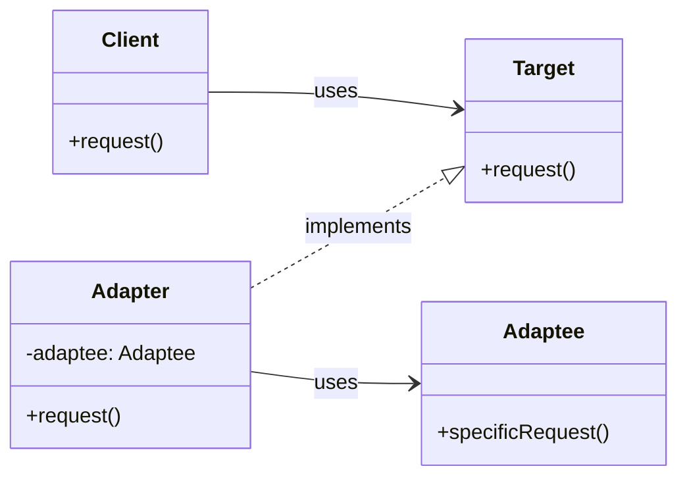
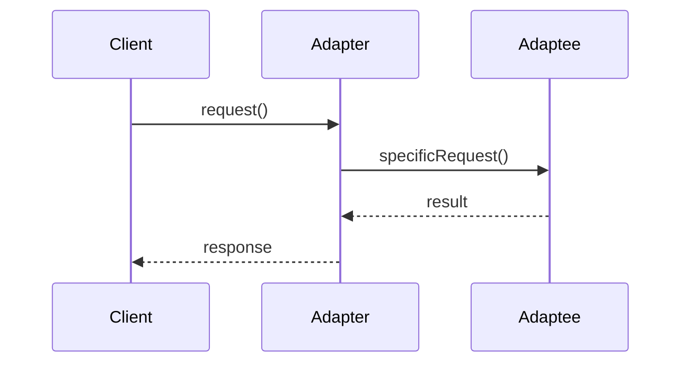
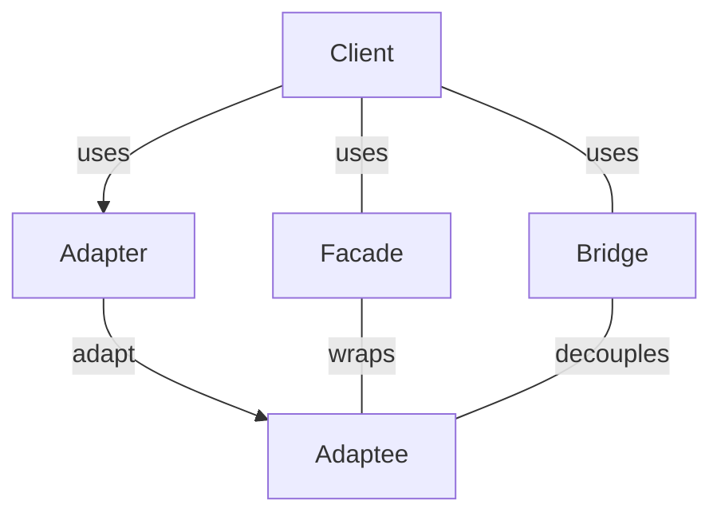

# Adapter Pattern: A Technical Primer

## Introduction

In modern software engineering, it is common to encounter situations where a system must interact with components or services whose interfaces are incompatible with what the client code expects. The Adapter Pattern, one of the canonical "Gang of Four" (GoF) structural design patterns, provides a solution to this problem by converting the interface of a class or object into another interface that clients expect.

## Context and Motivation

Software systems evolve over time, leading to the need for integration with legacy modules, third-party libraries, or APIs with differing interfaces. Directly modifying client code to accommodate new or incompatible interfaces is often impractical or undesirable, especially when striving to maintain modularity, reusability, or backward compatibility.

**Adapter Pattern** addresses this challenge by introducing an adapter that acts as an intermediary, translating requests or data formats as necessary.

## Definition

The Adapter Pattern allows objects with incompatible interfaces to collaborate by providing a wrapper (the adapter) that presents a compatible interface to the client. Thereby, it enables integration without changing existing source code or violating the Open/Closed Principle.

> **Key Concept**: The Adapter Pattern focuses on interface compatibility, not on object composition, behavioral extension, or class hierarchies exclusively.

## Core Concepts and Components

The Adapter Pattern fundamentally involves the following roles:

- **Target Interface:** The interface expected by the client code.
- **Client:** The component that interacts with objects conforming to the target interface.
- **Adaptee:** The existing component, class, or object with a different, incompatible interface.
- **Adapter:** The intermediate class/object that implements the target interface and translates calls to and from the adaptee.

### Visualizing the Structure



## Variations

There are two principal variants to the Adapter Pattern:

### 1. Object Adapter (Composition-Based)

The adapter holds a reference to an instance of the adaptee and translates client calls into adaptee-specific invocations.

**Advantages:**
- Supports adapting the adaptee and its subclasses or descendants.
- Promotes composition over inheritance.

### 2. Class Adapter (Inheritance-Based)

The adapter inherits from both the adaptee and the target interface (multiple inheritance, supported in some languages like C++ but not in others like Java).

**Advantages:**
- Can override adaptee behavior directly if the inheritance model allows.

> **Caution**
>
> The class adapter variant requires multiple inheritance and is thus not natively supported in single-inheritance languages such as Java or C#.

## Adapter Pattern in Practice

### Typical Workflow

1. **Identify incompatible interfaces** between the client and adaptee.
2. **Define the target interface**—the one the client is coded against.
3. **Implement the adapter**:
   - For object adapters, the adapter implements the target interface and holds a reference to an adaptee instance.
   - For class adapters, the adapter inherits from/adapts both.
4. **Integrate the adapter** seamlessly between the client and adaptee.

#### Example: Integrating a Legacy Logging System

Suppose a modern application expects a `Logger` interface:

```python
class Logger:
    def log(self, message: str) -> None:
        pass
```

But an existing legacy system provides:

```python
class LegacyLogger:
    def write_log(self, msg: str) -> None:
        print(f"LEGACY: {msg}")
```

**Adapter Implementation (Object Adapter):**

```python
class LoggerAdapter(Logger):
    def __init__(self, adaptee: LegacyLogger):
        self.adaptee = adaptee

    def log(self, message: str) -> None:
        self.adaptee.write_log(message)
```

The client code uses the `Logger` interface, unaware of whether it's dealing with a modern or adapted legacy logger.

### Adapter Interaction Flow



## Engineering Considerations

### Integration Points

Adapters are typically introduced at external or module boundaries where interface mismatches are frequent:
- Third-party SDKs or APIs
- Legacy modules during refactoring
- Hardware I/O interfaces
- Cross-language interoperability (e.g., wrapping a C++ API for use in Python)

### Performance Implications

_In general, adapters introduce minor overhead due to indirection._ This is usually negligible unless the adaptation is in an extremely hot code path or the translation logic is computation-heavy.

> **Tip**
>
> When using adapters in performance-critical contexts, minimize logic within the adapter or use delegation judiciously.

### Implementation Challenges

- **Interface Mismatch:** Adapter implementation is only feasible if the interfaces are at least semantically compatible. Severe mismatches may require additional mapping logic or even architectural changes.
- **State Management:** When adapting stateful objects, care must be taken that the adapter correctly maintains invariants and lifecycle expectations of both client and adaptee.
- **Error Propagation:** Exception or error signaling must be properly translated. The adapter should handle conversions between error types or codes where necessary.

> **Warning**
>
> Adapters are not intended to "paper over" fundamental semantic mismatches. Use with care when mapping between fundamentally dissimilar abstractions.

### Extensibility and Maintainability

Adapters support the Open/Closed Principle: client code operates solely in terms of the target interface and is thus not impacted by changes to adaptee implementation or differences between multiple adaptees.

Adapter implementations should themselves remain as thin as possible—simply translating interfaces, not introducing business logic.

## Common Variations and Patterns

### Pluggable Adapters

A system may register multiple adapters allowing adaptation to be chosen or configured at runtime.

### Adapter Chaining

Adapters may be composed where each one adapts between intermediate interfaces. However, excessive chaining can obscure code clarity and introduce performance penalties.

### Adapter vs. Related Patterns

**Facade:** Both adapter and facade "wrap" existing components. However, facades provide a simplified interface to a set of interfaces or subsystems, whereas adapters focus on interface compatibility between usually *one* client and *one* adaptee.

**Bridge:** The bridge pattern separates abstraction from implementation to allow them to vary independently, whereas adapters reconcile interface differences.



## Constraints and Assumptions

- The adaptee's interface should be accessible by the adapter in the working environment (public/protected visibility).
- Target and adaptee interfaces must be reconcilable, either directly or via meaningful data/operation translation.
- Language features may constrain implementation (e.g., single versus multiple inheritance, support for interface types, dynamic typing).

## When to Use the Adapter Pattern

- When a system must integrate components with incompatible interfaces.
- When you want to reuse or wrap existing modules without altering their code.
- When building systems for extensibility or plugin-style architectures.

> **Note**
>
> The Adapter Pattern is a key enabler for legacy integration and API compatibility layers in both object-oriented and component-based architectures.

## Anti-Patterns and Pitfalls

- **Over-adaptation:** Wraps not only interface but also hidden business logic, which leads to code duplication or hard-to-maintain adapters.
- **Leaky Abstractions:** Failing to shield the client from the adaptee's quirks will defeat the purpose of adaptation.
- **Excessive Chaining:** Overuse of adapters can create deeply nested or stacked adapters, obscuring behavior and harming maintainability.

## Comparison to Language and Platform Facilities

Some languages or frameworks offer facilities that make the Adapter Pattern more convenient:
- **C#**: Extension methods can sometimes act as adapters for simple method augmentation, though they are not full replacements for structural adaptation.
- **Java**: `java.util.Adapter`, and similar patterns in collections APIs.
- **Python**: Duck typing enables dynamic adaptation, but explicit adapters are still advisable for clarity and maintainability.
- **C++**: Multiple inheritance can implement class adapters, but care must be taken to avoid ambiguity and diamond problems.

## Summary Table: Key Properties

|                                | Adapter Pattern           | Facade Pattern           | Bridge Pattern          |
| ------------------------------ | ------------------------ | ------------------------ | ---------------------- |
| Purpose                        | Interface compatibility  | Simplify subsystem usage | Decouple abstraction   |
| Main Mechanism                 | Wrapping existing object | Wrapping subsystem       | Separate hierarchy     |
| Structural Type                | Structural (Wrapper)     | Structural (Wrapper)     | Structural (Double)    |
| Change Required in Client Code | None (uses target)       | None (uses facade)       | None (uses abstraction)|
| Main Focus                     | Interface translation    | Simplification           | Decoupling             |

## Conclusion

The Adapter Pattern is an essential structural design pattern for resolving interface incompatibilities without requiring modifications to either client or adaptee code. Effective use of adapters enables cleaner system integration, improved maintainability, and adherence to established design principles such as open/closed and single responsibility. By understanding both the intent and mechanics of the pattern, software engineers can craft robust, adaptable, and future-proof software architectures.