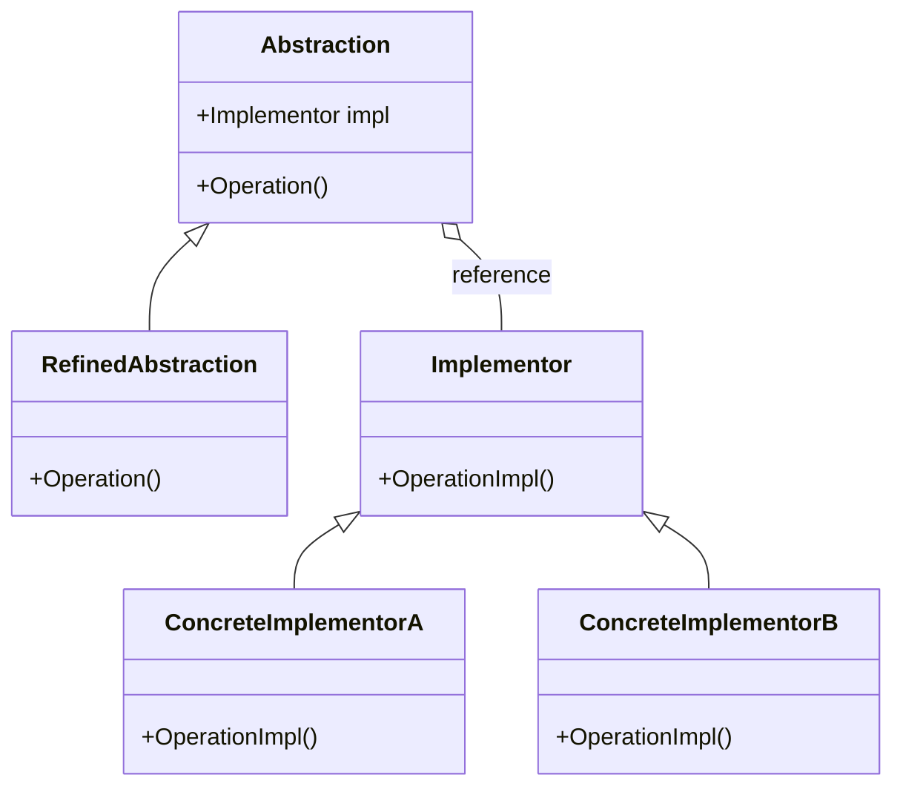
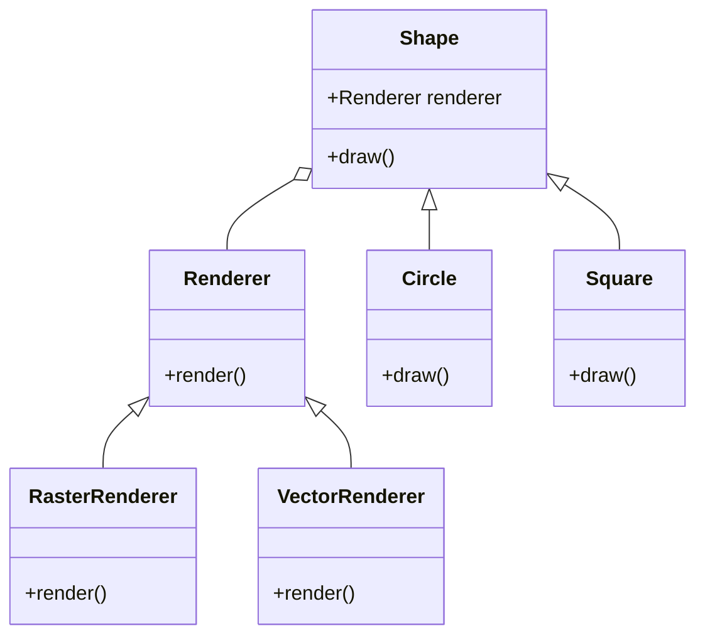
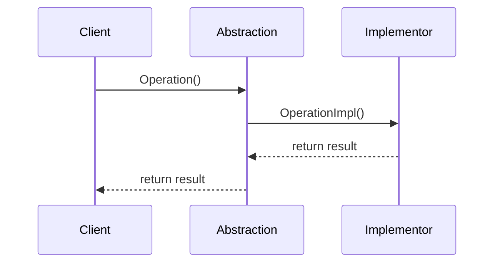
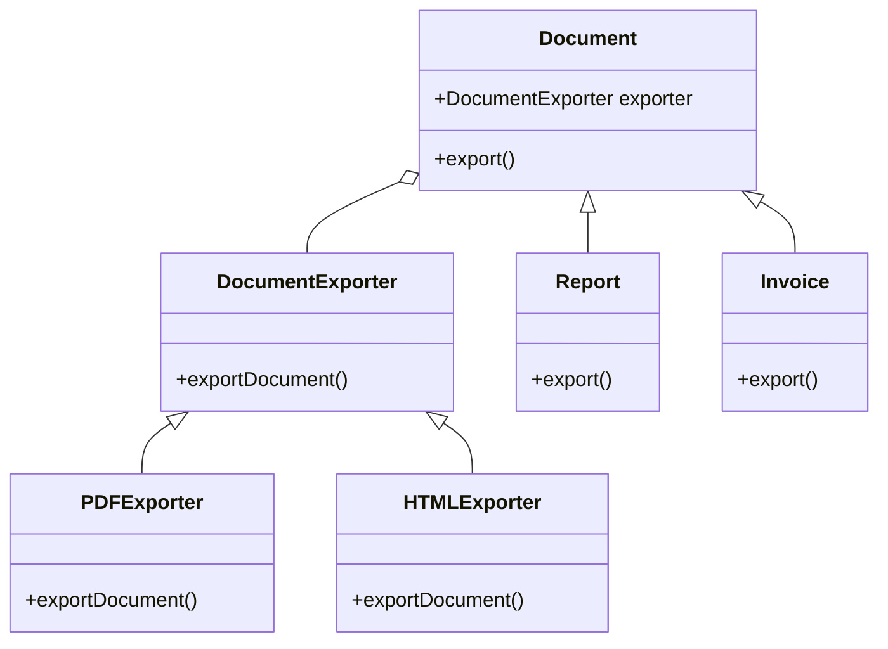

# Bridge Pattern: A Technical Primer

## Introduction

The Bridge Pattern is a fundamental structural design pattern in object-oriented software engineering. Its primary purpose is to decouple an abstraction from its implementation, enabling both to vary and evolve independently. By using the Bridge Pattern, systems can avoid rigid inheritance hierarchies and achieve greater flexibility and extensibility.

The Bridge Pattern is especially relevant in scenarios where an abstraction—such as a graphical shape, remote interface, or messaging system—may require multiple implementations, or where future changes are probable on either side of the abstraction/implementation boundary. 

## Technical Context

In classical inheritance hierarchies, refining an abstraction or its implementation results in a combinatorial explosion of subclasses. The Bridge Pattern counters this by favoring composition over inheritance, and is often discussed alongside other structural patterns such as the Adapter and Composite Patterns.

The pattern is widely recognized in modern software engineering as detailed by the "Gang of Four" (GoF) in their seminal book *Design Patterns: Elements of Reusable Object-Oriented Software* (1994). The principles underpinning the Bridge Pattern are agnostic to programming language, but are typically implemented in languages that support interfaces, abstract classes, and composition.

## Formal Definition

**Definition:** The Bridge Pattern separates an abstraction from its implementation so that both can be modified independently.

- **Abstraction:** The interface or abstract class representing high-level control logic.
- **Implementation:** The interface or concrete class encapsulating platform-specific or low-level operational details.

The abstraction maintains a reference to the implementation, allowing the functionality to be delegated.

## Core Concepts and Components

The Bridge Pattern consists of the following elements:

1. **Abstraction**: Defines the abstraction’s interface and maintains a reference to an object of type `Implementor`.
2. **Refined Abstraction**: Extends the interface defined by `Abstraction`.
3. **Implementor**: Defines the interface for implementation classes.
4. **ConcreteImplementor**: Implements the `Implementor` interface.

This structure ensures that clients interact with the `Abstraction`, remaining unaware of the concrete implementation.

### Bridge Pattern Structure



## Architectural Overview

### Key Points

- The abstraction is decoupled from its implementation by delegating the real work to the implementation interface.
- Both sides (abstraction, implementation) can be extended independently without affecting the other.
- Composition is used instead of inheritance between abstraction and implementation.

### Example Use Case

Suppose an application renders different shapes with varying rendering APIs (e.g., vector and raster renderers). Rather than creating a subclass for every shape-renderer combination, the abstraction (`Shape`) references an implementation (`Renderer`). New shapes or renderers can be introduced independently.



## Practical Implementation

### Typical Workflow

1. **Define implementation interface**  
   Abstracts core operations (e.g., `DrawCircle(radius, x, y)`).

2. **Provide concrete implementations**  
   Platform-specific or algorithm-specific classes (e.g., raster, vector).

3. **Define the abstraction interface**  
   High-level behaviors (e.g., `Shape.draw()`).

4. **Link abstraction to implementation**  
   Abstraction objects maintain and leverage references to implementation objects.

5. **Extend independently**  
   Add new abstractions or implementations without modifying existing classes.

### Sample Implementation (Java-like Pseudocode)

```java
// Implementor
interface Renderer {
    void renderCircle(float x, float y, float radius);
}

// ConcreteImplementor
class VectorRenderer implements Renderer {
    void renderCircle(float x, float y, float radius) {
        // Vector rendering logic
    }
}
class RasterRenderer implements Renderer {
    void renderCircle(float x, float y, float radius) {
        // Raster rendering logic
    }
}

// Abstraction
abstract class Shape {
    protected Renderer renderer;
    Shape(Renderer r) { renderer = r; }
    abstract void draw();
}

// Refined Abstraction
class Circle extends Shape {
    private float x, y, radius;
    Circle(Renderer r, float x, float y, float radius) { /* ... */ }
    void draw() { renderer.renderCircle(x, y, radius); }
}
```

The client creates a `Circle` (abstraction) and injects a `Renderer` (implementation), enabling decoupled evolution.

## Engineering Considerations

### Integration Points

- **Third-party or platform APIs:** The implementation side often adapts, wraps, or delegates to lower-level libraries or platform-specific code.
- **Dependency injection:** The Bridge Pattern benefits from explicit dependency management strategies such as dependency injection.

### Performance Implications

- **Indirection penalty:** Introducing the bridge increases the number of objects and delegation calls, though generally the trade-off for flexibility is worthwhile.
- **Binary size and memory usage:** Increased modularity can result in more classes and interfaces being loaded.

### Implementation Challenges

- **Complexity management:** Overuse can lead to unnecessary abstraction layers compound design complexity.
- **Refactor threshold:** The Bridge Pattern is most beneficial when there are (or will be) multiple variations in both abstraction and implementation dimensions.

> :warning: **Warning**  
> Applying the Bridge Pattern prematurely or where only a single implementation is required can lead to code that is needlessly abstract and harder to maintain.

### Common Pitfalls

- **Redundant hierarchies:** Avoid “artificial” bridges; use only when both sides are expected to have multiple implementations.
- **Leaking abstractions:** Keep implementation details encapsulated; avoid coupling the client to concrete implementors.
- **Inheritance misuse:** Do not misuse inheritance on either the abstraction or implementor side—prefer interfaces or abstract base classes.

### Engineering Decisions

- **Bridge vs. Adapter:** Adapter converts one interface to another; Bridge separates two dimensions so both can evolve.
- **Bridge vs. Abstract Factory:** Bridge focuses on decoupling abstraction and implementation; Abstract Factory creates families of related objects.
- **When to introduce Bridge:** When requirements suggest more than one possible implementation of an abstraction and future extension is anticipated.

> :bulb: **Tip**  
> The Bridge Pattern’s intent can often guide modularization boundaries in larger systems or frameworks.

## Variations and Extensions

### Variants

- **Single Implementor:** Acceptable as a preparatory step for anticipated future extensions.
- **Multiple Abstraction Layers:** Some systems require deep abstraction hierarchies (e.g., nested bridges).
- **Multiple Implementors per Abstraction:** Possible via strategy chains or composite bridges.

### Related Patterns

- **Adapter Pattern:** Focuses on interface compatibility rather than variation along abstraction/implementation axes.
- **Composite Pattern:** Often used alongside Bridge for recursive structures.
- **Strategy Pattern:** Useful when implementations are interchangeable at runtime.

## UML Sequence Diagram


_Sequence showing delegation from the abstraction to its implementor_

## Application Domains

The Bridge Pattern applies wherever:

- **Multiple platforms or APIs:** For example, GUI toolkits for different operating systems.
- **Multiple device types:** Rendering to screen, PDF, or printer.
- **Feature-rich frameworks:** Such as database abstraction layers, persistence frameworks, or drivers.
- **Remote proxies:** Separating the interface (client-facing) from the implementation (network or remote system).

## Constraints and Assumptions

- Systems using Bridge typically assume that abstraction and implementation change rates are independent.
- Not a substitute for all uses of inheritance; should target clear “dimension of variation” cases.
- Dependency injection frameworks and inversion of control can augment bridge implementations.

## Typical Workflow Example

1. Define an abstract high-level API (`Document`).
2. Define a low-level operational interface (`DocumentExporter`).
3. Concrete abstractions (`Report`, `Invoice`) use composition to reference exporters (`PDFExporter`, `HTMLExporter`).
4. When client requests export, `Document` delegates to `DocumentExporter`.



## Practical Patterns for Modern Engineers

Modern architectures often realize the Bridge Pattern implicitly:

- **Inversion of Control/Dependency Injection:** Automatically wires abstraction to implementation.
- **Interface-driven development:** Languages such as Java, C#, TypeScript make composition easy and natural.
- **Plug-in systems and drivers:** Common in frameworks and extensible platforms.

> :octagonal_sign: **Caution**  
> Not every scenario of interface/implementation separation necessitates use of the Bridge Pattern; evaluate tradeoffs against added complexity.

## Alternatives

If only one implementation is likely or if runtime flexibility is unnecessary, alternative patterns such as pure inheritance, static composition, or the Strategy Pattern may suffice.

## Summary

The Bridge Pattern is a powerful structural archetype for decoupling abstraction and implementation. By segregating responsibilities and leveraging composition, engineers can create designs that scale across multiple dimensions of change without entangling modules, enabling long-term maintainability and extensibility. Careful application of the Bridge Pattern can mitigate the maintenance burden of complex inheritance hierarchies and provide robust, adaptable solutions for evolving software systems.