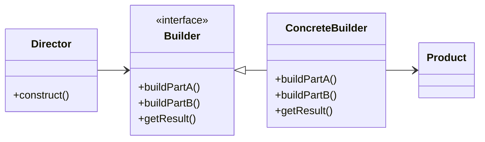
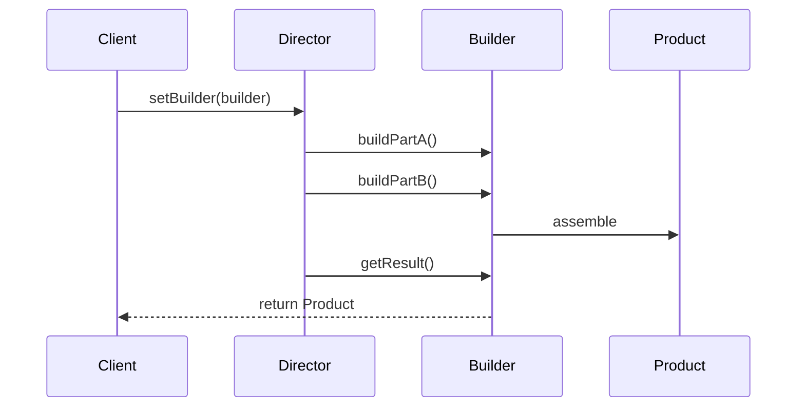

# Builder Pattern: A Technical Primer

## Introduction

The Builder Pattern is one of the core design patterns in object-oriented software engineering, classified under the creational patterns in the “Gang of Four” (GoF) taxonomy. Its primary purpose is to separate the construction of a complex object from its representation, allowing the same construction process to produce different representations. The pattern is particularly useful when an object must be constructed in multiple steps, or when there are numerous optional and mandatory parameters.

The Builder Pattern enables stepwise, controlled construction, supporting immutability, readable APIs, and clean separation of concerns.

## Context and Motivation

### Complexity in Object Construction

In many systems, object construction is non-trivial—some objects:

- Require multiple fields to be set in a precise order.
- Can be constructed in different ways or configurations.
- May have optional parts or require defaults.
- Should not expose their internals to client code.

Encapsulating all these variations directly in a single constructor (or multiple overloaded constructors) quickly leads to code that is difficult to read, maintain, and extend—a phenomenon often known as the telescoping constructor anti-pattern.

The Builder Pattern addresses this by delegating the construction logic to a separate object—a builder. This encapsulates the building process and enables flexible, reusable construction mechanisms.

## Core Concepts and Components

### Participants

The Builder Pattern is commonly defined by the following roles:

1. **Product**: The complex object under construction.
2. **Builder**: Specifies an abstract interface for creating parts of the Product object.
3. **ConcreteBuilder**: Provides implementations for the Builder interface, constructing and assembling parts of the Product.
4. **Director** (optional): Controls the construction process using a Builder object.

### Typical Class Diagram



- The **Director** orchestrates the build steps and is optional; sometimes, the client uses the Builder directly.
- The **Product** knows nothing about the builder.

## Pattern Structure and Workflow

### Workflow Overview

The construction process is decoupled:

- **Client** creates a Director object, supplying it with a specific Builder.
- The **Director** triggers the builder’s construction steps in a defined sequence.
- The **Builder** assembles the Product step by step.
- The complete Product is retrieved from the Builder.

In practice, many modern implementations—especially in Java and other fluent-API-heavy languages—often omit the Director, with the client invoking builder methods directly.

### Example: Building a Complex `Pizza` Object

Consider an object with multiple optional and mandatory fields:

```java
public class Pizza {
    private final String dough;
    private final String sauce;
    private final String topping;

    private Pizza(Builder builder) {
        this.dough = builder.dough;
        this.sauce = builder.sauce;
        this.topping = builder.topping;
    }

    public static class Builder {
        private String dough;
        private String sauce;
        private String topping;

        public Builder dough(String dough) {
            this.dough = dough;
            return this;
        }
        public Builder sauce(String sauce) {
            this.sauce = sauce;
            return this;
        }
        public Builder topping(String topping) {
            this.topping = topping;
            return this;
        }
        public Pizza build() {
            // Optionally validate fields
            return new Pizza(this);
        }
    }
}
```

**Usage:**

```java
Pizza pizza = new Pizza.Builder()
        .dough("thick crust")
        .sauce("tomato")
        .topping("pepperoni")
        .build();
```

This approach makes construction readable and flexible compared to telescoping constructors.

## Advantages and Practical Considerations

### Key Benefits

- **Immutability and Thread Safety:** By only exposing immutable finished products, builder-facilitated objects are easier to reason about and thread-safe by construction.
- **Readable APIs and Flexibility:** Providing named, chained methods allows for clear, intent-revealing code.
- **Separation of Concerns:** The construction algorithm is disentangled from the Product's internal representation.
- **Validation:** The builder can validate intermediate (or final) state before construction.

### When to Use

- When an object requires numerous configuration fields (especially with combinations of optional and mandatory).
- For immutable objects with many properties.
- When the construction process should be decoupled from the object itself.
- When complex construction algorithms exist, with steps that must be followed in a strict sequence.

### Common Pitfalls

> **Warning**
> Overusing the Builder Pattern for simple objects increases complexity and creates unnecessary boilerplate. Only apply it where construction is non-trivial or when future extensibility is anticipated.

> **Caution**
> Builders typically do not enforce build-step order unless specifically designed to do so. For order-sensitive construction, alternative patterns or staged builders (see **Common Variations**) may be required.

## Architectural Variations and Related Patterns

### Directorless Builder

Many modern implementations—in Java, C#, Python, etc.—forgo the Director role and allow client code to call builder methods directly. Fluent APIs and method chaining make the builder interface concise and clear.

### Fluent Interface

The fluent builder design encourages chaining, as seen in the Pizza example. Each setter returns `this`, yielding a builder that reads like a domain-specific language.

### Staged Builder

For objects requiring mandatory fields set in a strict order, staged builders use multiple minimal interfaces that restrict what methods are accessible at any step.

```java
public interface NameStep {
    AgeStep name(String name);
}
public interface AgeStep {
    BuildStep age(int age);
}
public interface BuildStep {
    Person build();
}
```

This approach ensures build correctness at compile time.

### Builders for Immutable Value Objects

Common in functional and concurrent architectures, builders facilitate the creation of immutable data structures by aggregating all state prior to freezing it in a final object.

### Integration with Serialization/Deserialization

Builders are frequently used in libraries to (de)serialize objects—e.g., JSON parsers collecting attributes and then calling `.build()`.

### Comparison with Related Patterns

- **Abstract Factory Pattern:** While both create families of related objects, Abstract Factory yields whole products, while Builder assembles them piece by piece.
- **Prototype Pattern:** Creates objects by cloning; Builder constructs step by step.
- **Factory Method Pattern:** Delegates object creation to subclasses but does not separate construction/representation distinction like Builder.

## Standard Implementations and Languages

While not a part of language core standards like RFCs, the Builder Pattern is widely codified in Java, C#, Python, and C++. Java’s `StringBuilder`, Google's AutoValue/AutoBuilder, Protocol Buffers, and many other frameworks and libraries prescribe or generate builders.

## Sequence Diagram Overview

The following diagram illustrates a typical builder pattern interaction, both with and without a Director.



- **Note:** If no Director is used, the Client invokes buildPart methods and getResult on Builder directly.

## Implementation Challenges

### Validation Logic

- Builders must sometimes enforce constraints or validation rules for constructed objects.
- Builders can throw exceptions or return error results if the object state is invalid.

### Thread Safety

- Builders are generally not thread-safe unless explicitly designed so.
- Immutable products built by a builder are naturally thread-safe, but the builder itself must be protected if shared across threads.

### Integration

- Builders integrate naturally with dependency injection (DI) frameworks.
- Serialization libraries (Jackson, Gson, Protocol Buffers) frequently expect or generate builders.

> **Tip**
> Use static factory methods or builders for objects with more than four constructor arguments to enhance code maintainability and clarity.

## Engineering Considerations

### Performance

Builders generally have negligible runtime cost. Occasionally, memory footprint may be higher than direct instantiation due to the temporary builder object.

### Boilerplate Management

To offset code verbosity, many teams rely on code generators or libraries (Lombok, AutoBuilder) that automate builder class creation.

### Maintainability

Encapsulating the building logic simplifies evolution—new fields or steps can be introduced in the builder, preserving backward compatibility.

### Constraints & Assumptions

- Assumes client must control or customize construction detail.
- Relies on correct orchestration of build steps.
- Works best when product objects are complex and multi-part.

## Sample Implementation in Python

A minimal, type-annotated example:

```python
from typing import Optional

class Burger:
    def __init__(self, patty: str, cheese: Optional[str]=None, lettuce: Optional[bool]=False):
        self.patty = patty
        self.cheese = cheese
        self.lettuce = lettuce

class BurgerBuilder:
    def __init__(self):
        self._patty = None
        self._cheese = None
        self._lettuce = False
    
    def patty(self, patty: str):
        self._patty = patty
        return self
    
    def cheese(self, cheese: str):
        self._cheese = cheese
        return self

    def lettuce(self, lettuce: bool):
        self._lettuce = lettuce
        return self

    def build(self):
        if not self._patty:
            raise ValueError("Patty is required")
        return Burger(self._patty, self._cheese, self._lettuce)
        
# Usage:
burger = BurgerBuilder().patty("beef").cheese("cheddar").lettuce(True).build()
```

## Visual: Builder Pattern Overview

```mermaid
flowchart TD
    subgraph Client
    A[Client Code]
    end
    subgraph Builder
    B[Builder]
    end
    C[Product]
    D[Director (optional)]

    A -->|Configures| D
    D -->|Controls| B
    B -->|Assembles| C
    A -.->|Calls builder directly (Directorless)| B
```

## Summary

The Builder Pattern enables the assembly of complex, multi-part objects with clarity, flexibility, and separation of construction logic from representation. Emphasizing intent, maintainability, and extensibility, it remains foundational in robust object-oriented systems.

> **Note**
> The Builder Pattern is not universally applicable; assess object complexity and construction requirements before engineering a builder solution.

---

This document has outlined the core principles, mechanics, and engineering implications of the Builder Pattern, providing a structured foundation for its use in modern software development.