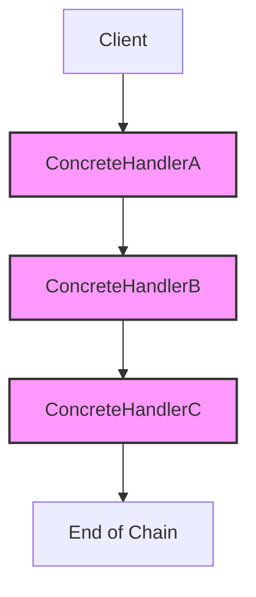
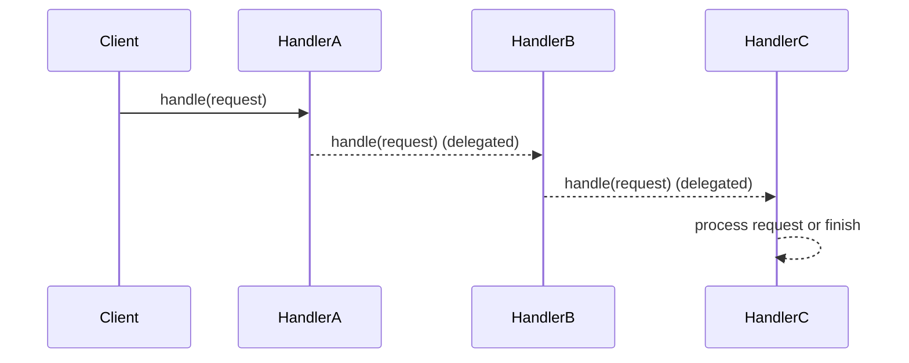
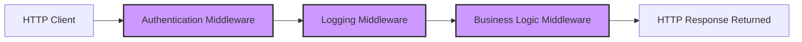

# Chain of Responsibility Pattern

## Introduction

The Chain of Responsibility (CoR) pattern is a behavioral design pattern that delegates the handling of a request to a chain of potential processors (handlers), allowing the request to traverse the chain until a handler processes it or the end of the chain is reached. It decouples the sender of a request from its receivers, promoting loose coupling and enabling flexible responsibility assignment at runtime.

Commonly used in scenarios where multiple objects may handle a request, but the handling logic or handler order must remain dynamic or unknown at compile-time, the Chain of Responsibility pattern is especially useful for structuring event processing pipelines, middleware stacks, business rule validators, filtering mechanisms, and permission systems.

## Core Concepts

### Definition and Motivation

The fundamental objective of Chain of Responsibility is to avoid coupling the sender of a request to its receivers by giving multiple objects a chance to handle the request. The request passes along the chain until one of the handlers processes it, or until the end of the chain is reached. If no handler takes responsibility, the request may remain unhandled or trigger a fallback mechanism.

### Key Components

- **Handler Interface/Abstract Class**: Specifies the contract for handling requests and for linking the handler to the next element in the chain.
- **Concrete Handlers**: Implement the handler interface; each decides whether to handle a request or delegate it to the next handler.
- **Client**: Initiates the request and defines the chain's order and composition.

### Architectural Structure



**Figure:** Example of a chain: Client sends a request to HandlerA, which may handle it or delegate to HandlerB, and so forth.

## How It Works

### Handler Interface

The most common abstraction is a handler interface or abstract class. It typically defines:

- A method for processing requests (e.g., `handle(request)`).
- A way to set or reference the next handler in the chain.

#### Example (Abstract Syntax)

```java
abstract class Handler {
    protected Handler next;
    void setNext(Handler next) {
        this.next = next;
    }
    abstract void handle(Request request);
}
```

### Request Flow

At runtime, the client creates instances of concrete handlers and links them. The client submits a request to the start of the chain. Each handler in turn decides either to process the request or delegate it further. This process continues iteratively or recursively.



### Chain Termination

- The chain typically terminates when:
  - A handler explicitly processes the request.
  - The end of the chain is reached without handling (potentially causing an exception or default behavior).

## Practical Applications

- **Event propagation (e.g., GUI toolkits such as Java AWT/Swing, .NET WinForms)**
- **Logging frameworks**: Log records are passed through chains of appenders; each may process or ignore the record.
- **Middleware pipelines** (e.g., HTTP servers): Requests pass through chains of middleware components.
- **Authorization and validation**: Chains to check multiple business rules or filters.
- **Exception handling**: Uncaught exceptions bubble up a chain of catch blocks.

## Example: Middleware Stack in a Web Server

One of the most canonical real-world cases is an HTTP middleware pipeline, like that found in Express.js or ASP.NET Core.

Each middleware component can handle a request, modify it, or pass it on.



Each middleware receives the request and response objects; it may choose to terminate processing or to invoke the next middleware.

### Pseudocode (Express-style Middleware)

```javascript
function middlewareA(req, res, next) {
    // Process or preprocess
    if (handled) {
        res.send('Handled');
    } else {
        next(); // Pass to next in chain
    }
}
```

## Design Considerations and Variations

### Chain Construction

- **Static**: Handlers are assembled at compile or boot time and remain fixed.
- **Dynamic**: Handlers are composed at runtime, allowing flexible reconfiguration.

### Chain Topologies

- **Linear**: A simple singly-linked chain (most common).
- **Tree**: Used in scenarios like event bubbling in GUIs.
- **Ring**: Rare; all handlers connected in a loop for round-robin or distributed handling.

### Propagation Policy

- **Short-circuiting**: The chain stops once a handler processes the request (default).
- **Broadcasting**: Every handler gets to process the request regardless of earlier handling.

> **Note**
> The classic GoF pattern describes short-circuiting chains, but broadcasting is an important variation seen in some frameworks (e.g., event listeners).

## Implementation Constraints and Practical Considerations

### Handler Coupling and Reuse

Handlers must expose a common interface for substitutability. Avoid tight coupling between handlers and knowledge of each other's identities to maximize reuse.

> **Tip**
> Favor composition over inheritance to build flexible handler chains.

### Chain Ordering

The order of handlers significantly affects outcome and performance. Determine and document the expected sequencing to avoid ambiguous or unintended side effects.

### Error Handling

The chain must explicitly define the behavior for unhandled requests (e.g., default fallback, explicit error, or special marker value).

> **Caution**
> If no handler processes the request, the system must handle this gracefully to avoid inconsistent system state or silent request drops.

### Thread Safety

If used in concurrent environments (such as web servers), handler state management must be thread-safe to prevent data races or corruption.

### Performance Implications

- **Chain Length**: Longer chains increase the number of steps per request, impacting latency.
- **Recursion Depth**: If handlers are implemented with recursion, stack overflows may occur for large chains; prefer iteration when necessary.
- **Handler Granularity**: Each handler should perform a distinct and minimal task for maintainability.

### Testing and Debugging

Testing handler chains can be complex due to the dynamic request paths. Consider using decorator patterns for adding instrumentation, or add explicit tracing.

> **Warning**
> Silent failures can occur if a chain omits a required handler, or if handlers fail to delegate properly.

## Common Pitfalls

- **Forgotten delegation**: Handlers that forget to invoke the next handler can unintentionally block processing.
- **Handler side effects**: Handlers that modify shared state without proper coordination may cause hard-to-debug defects.
- **Overly monolithic handlers**: Placing too much logic in a single handler reduces the benefit of the chain structure.

## Comparison with Related Patterns

- **Command Pattern**: Encapsulates a request as an object, allowing parameterization and queuing of requests, but does not delegate handling dynamically down a chain.
- **Decorator Pattern**: Enhances or modifies behavior of objects dynamically but does not facilitate the selection of a handler.
- **Observer Pattern**: Broadcasts events to many listeners, but usually **all** receive notifications, as opposed to a single handler "claiming" the request.

## Example Implementation: Java-Style Chain

```java
class Request {
    public String payload;
    // additional fields
}

abstract class Handler {
    protected Handler next;
    public Handler setNext(Handler next) {
        this.next = next;
        return next;
    }
    public abstract void handle(Request req);
}

class AuthHandler extends Handler {
    public void handle(Request req) {
        if ("AUTH".equals(req.payload)) {
            // handle authentication
        } else if (next != null) {
            next.handle(req);
        }
    }
}

class LoggingHandler extends Handler {
    public void handle(Request req) {
        // log request
        if (next != null) {
            next.handle(req);
        }
    }
}

// Usage
Handler root = new AuthHandler();
root.setNext(new LoggingHandler());
//...
root.handle(new Request());
```

## Engineering Decisions and Integrations

- **Handler Registration**: Should handlers be registered declaratively (e.g., XML/JSON config) or imperatively (in code)?
- **Chain Reconfiguration**: Should chains be mutable at runtime, and if so, how is consistency guaranteed?
- **Integration Points**: The pattern is especially useful when integrating cross-cutting concerns (e.g., logging, authentication, validation).
- **Monitoring and Tracing**: Instrumentation hooks can be placed at handler entry/exit points or via meta-handlers (decorators).

## Real-World Examples

- **Servlet Filter Chains (Java EE/Servlet specification)**: Each filter processes or delegates HTTP requests.
- **Node.js Connect/Express Middleware**: Array of middleware functions forming a chain.
- **CORBA Portable Interceptors**: Chains of interceptors invoked in order.
- **Windows Message Handlers**: Messages pass through WndProc chains for processing.

## Conclusion

The Chain of Responsibility pattern provides a flexible mechanism for processing requests through a series of potential handlers, effectively decoupling sender and receiver and allowing dynamic handler assignment and sequencing. Its applicability to middleware pipelines, validation frameworks, event handling, and beyond makes it a powerful tool in the engineering toolbox. Proper implementation demands careful consideration of chain assembly, handler structure, error handling, and system-specific constraints to realize the intended modularity, maintainability, and extensibility benefits.