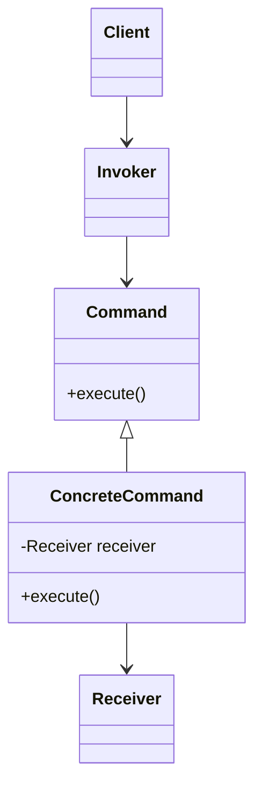
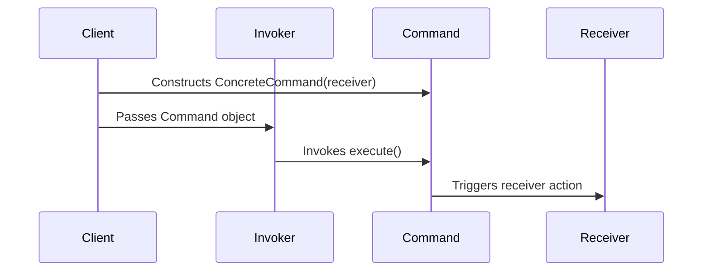
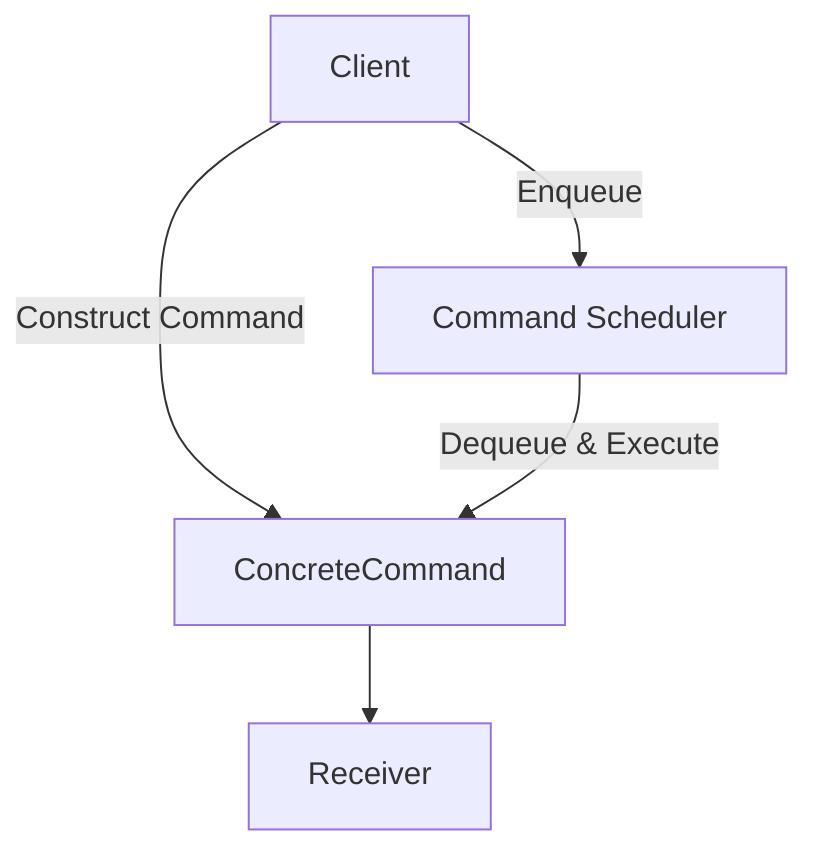

# Command Pattern: Technical Primer

## Overview

The Command Pattern is a behavioral design pattern that encapsulates a request as an object, thereby allowing for parameterization, queuing, logging, undoing, and other flexible treatment of commands. This pattern decouples the object that invokes an operation from the object that performs it. It is a well-established pattern, first formalized as part of the "Gang of Four" (GoF) design patterns.

The Command Pattern is widely used in scenarios that require operations to be reified as objects—such as transactional scripts, GUI actions, job scheduling, macro recording, and distributed request handling.

## Context and Motivation

In classic object-oriented design, method invocations typically happen through direct calls: a client calls a method on a receiver object. This approach tightly couples the requester and implementer, making it difficult to parameterize invocations, support undo/redo, keep histories for auditing, or schedule/queue commands.

By encapsulating all relevant details of an action (method, target, parameters) into a command object, the pattern achieves full decoupling between invoker and receiver. This increases flexibility and promotes the Single Responsibility and Open/Closed principles.

The Command Pattern is commonly utilized in:

- GUI frameworks (actions bound to buttons/menus, undo/redo stacks)
- Transactional and macro systems (multi-step, repeatable operations)
- Task scheduling, job queues, and distributed computing
- Logging and auditing mechanisms
- Remote method invocation or service orchestration

## Core Concepts and Components

The Command Pattern formalizes the following key abstractions:

1. **Command Interface** – Defines the contract for executing an operation, typically via an `execute()` method.
2. **Concrete Command** – Implements the `Command` interface and encapsulates all information needed to call a method on the receiver.
3. **Receiver** – The component possessing the actual implementation logic; the action is performed here.
4. **Invoker** – The component that holds, triggers, or manages command objects. Knows how and when to invoke the command but is decoupled from its implementation details.
5. **Client** – Responsible for creating ConcreteCommand objects, associating them with receivers, and giving them to invokers.

### Core Structure



- **Client** binds a **ConcreteCommand** to a **Receiver**.
- **Invoker** triggers the **Command**.
- **ConcreteCommand** holds a reference to a **Receiver** and implements the execution logic.
- **Receiver** performs the actual work.

## Detailed Explanation

### Command Interface

Defines a standardized method (often `execute()`; sometimes also `undo()` for reversible operations) that all concrete commands must implement.

```java
public interface Command {
    void execute();
    // Optional: void undo();
}
```

### Concrete Command

Implements the Command interface, encapsulates the call to the receiver's method, and can hold any required parameters.

```java
public class LightOnCommand implements Command {
    private Light light;

    public LightOnCommand(Light light) {
        this.light = light;
    }

    public void execute() {
        light.turnOn();
    }
    // Optional: undo() { light.turnOff(); }
}
```

### Receiver

Contains the actual implementation of the required functionality.

```java
public class Light {
    public void turnOn() { /* logic to turn light on */ }
    public void turnOff() { /* logic to turn light off */ }
}
```

### Invoker

Knows how to trigger command execution, but not what the command does internally.

```java
public class RemoteControl {
    private Command command;

    public void setCommand(Command command) {
        this.command = command;
    }
    public void pressButton() {
        command.execute();
    }
}
```

### Client

Composes all elements at runtime, wiring commands to receivers and assigning commands to invokers.

```java
Light light = new Light();
Command lightOn = new LightOnCommand(light);
RemoteControl remote = new RemoteControl();
remote.setCommand(lightOn);
remote.pressButton();  // Light is turned on
```

## Command Pattern Sequence

A typical sequence of interactions is visualized below:



### Key Engineering Benefits

- **Decoupling**: Invoker does not know (or care) about operation's details.
- **Extensibility**: New command types can be added without modifying invoker.
- **Support for Queues, Logs, Undo**: Commands are first-class objects; can be queued, stored, or reversed.
- **Macro Commands**: Multiple commands can be grouped and executed as a composite.

---

> [!tip]
> The Command Pattern's capability to encapsulate requests enables implementation of undo/redo by storing executed commands on a stack and invoking `undo()` methods.

---

## Common Variations and Extensions

While the classic [GoF definition](https://refactoring.guru/design-patterns/command) provides a core structure, the Command Pattern is frequently adapted to suit specialized requirements.

### Undoable Commands

Many command frameworks support reversible actions. This requires all commands to implement an `undo()` method, which reverses the effect of `execute()`.

```java
public interface Command {
    void execute();
    void undo();
}
```

Undo/redo stacks are then maintained by the invoker or a manager component.

### Macro Commands (Composite Commands)

Allows composite commands that aggregate multiple other commands.

```java
public class MacroCommand implements Command {
    private List<Command> commands;
    public void execute() { commands.forEach(Command::execute); }
    public void undo() { 
        // Undo in reverse order
        for (int i = commands.size() - 1; i >= 0; i--)
            commands.get(i).undo();
    }
}
```

### Parameterized Commands

Commands can be made generic, supporting different types of receivers and parameters, via generics or dynamic parameter packing.

### Command Queues and Schedulers

Supports asynchronous or deferred execution. Commands are placed on a queue and executed by a scheduler.



---

> [!note]
> Command objects can be serialized for remote invocation (RPC) or persistence, provided their full context is included.

---

## Practical Workflows and Engineering Considerations

### Integration Points

Command Pattern integrates at several key places in application architecture:

- **User Interface**: Map GUI actions (button clicks, menu items) to command objects for decoupling UI from application logic.
- **Service Orchestration**: Represent complex workflows or cross-service transactions as command chains.
- **Middleware and Message Brokers**: Encapsulate messages or jobs as commands to support queuing, retry, and scheduled execution.
- **Plugins and Extensibility**: Allow dynamic injection and execution of new commands at runtime.

### Performance and Resource Implications

- **Memory Consumption**: Storing large numbers of command objects (for queues, logs, or undo/redo histories) can consume significant memory, especially if commands encapsulate large state.
- **Serialization Overhead**: Commands designed for distributed execution or persistence must support (de)serialization, which can be complex if context/state is not easily serializable.
- **Execution Time**: Deferred execution (e.g., in queues) introduces latency and complicates error handling.

### Implementation Challenges and Pitfalls

- **Command Context Size**: Commands should encapsulate only necessary context; excessive coupling negates pattern benefits.
- **Atomicity and Idempotency**: Ensuring that `execute()` and `undo()` methods perform atomic, repeatable actions is crucial. Command re-execution may cause inconsistent state unless idempotence is considered.
- **Error Handling**: Exceptions during command execution/undo must be handled robustly, ideally with transactional support for composite commands.
- **Testing**: Each command should be unit-testable; the pattern encourages single-responsibility, facilitating testing.

---

> [!caution]
> When implementing Undo in systems with side-effecting commands (e.g., external system calls), ensure that undo operations are safe and won’t violate data integrity or create inconsistencies.

---

### Common Pitfalls

- **Leaky Abstractions**: Exposing implementation details of receivers in command classes can reduce decoupling.
- **State Synchronization**: In long-lived commands, ensuring the receiver's state matches that at command creation can be nontrivial.
- **Overengineering**: Using the pattern where direct method calls suffice can increase codebase complexity without clear benefits.

---

> [!tip]
> For simple actions or stateless operations, the overhead of Command Pattern may be unnecessary—evaluate design tradeoffs before introducing it.

---

## Standards, Conventions, and Related Patterns

While the Command Pattern itself is a general design pattern, it fits into several architectural standards and conventions:

- **Job/Task Queues** – Patterns for transactional queues (e.g., AMQP, JMS) often use command-like objects for encapsulation.
- **Undo Frameworks in GUI Toolkits** – Many desktop frameworks (e.g., Java Swing, Qt) recommend or implement command encapsulation for undo/redo.
- **Remote Method Invocation and Microservices** – Message commands are serialized and dispatched remotely (e.g., via gRPC or REST), requiring pattern adaptation.
- **Relation to Other Patterns**:
    - **Strategy Pattern**: Commands can be seen as parameterized strategy objects; difference lies in intent (actions vs. policies).
    - **Invoker Pattern**: Invoker is a core Command Pattern participant, not a separate pattern per se.
    - **Memento Pattern**: Often used together; Memento can store state snapshots required for undoing commands.

## Example Use Cases

1. **Text Editor Undo/Redo**: Every edit action is encapsulated as a command with undo capability, maintained in a stack.
2. **Macro Recording**: A user records a series of actions; each is a command, and the macro is a macro-command that replays all.
3. **Job Queuing in Web Services**: API calls result in commands queued for asynchronous execution, supporting retries and delayed processing.
4. **Transaction Scripting**: Business processes are assembled as command chains to support auditing, replay, and compensation.

## Summary Diagram: Command Pattern System Overview

```mermaid
flowchart LR
    Client[Client]
    Invoker[Invoker]
    Command[Command]
    Receiver[Receiver]
    Log[Command Log/Queue (optional)]
    UndoStack[Undo Stack (optional)]

    Client -->|Create/Configure| Command
    Client -->|Assign| Invoker
    Invoker -->|Store/Call| Command
    Command -->|Acts on| Receiver
    Invoker -.->|Push/Pop| UndoStack
    Invoker -.->|Queue| Log
```

## Conclusion

The Command Pattern is a foundational behavioral pattern for encapsulating actions, supporting separation of concerns, extensibility, undo/redo, event logging, macro programming, and distributed/queued execution. Its formal structure provides a robust toolkit for engineers designing flexible and maintainable command-processing systems. Care must be taken to avoid overuse or abstraction leakage, but when applied at the right level of granularity, the Command Pattern enables powerful, decoupled, and extensible architectures in a wide range of software systems.