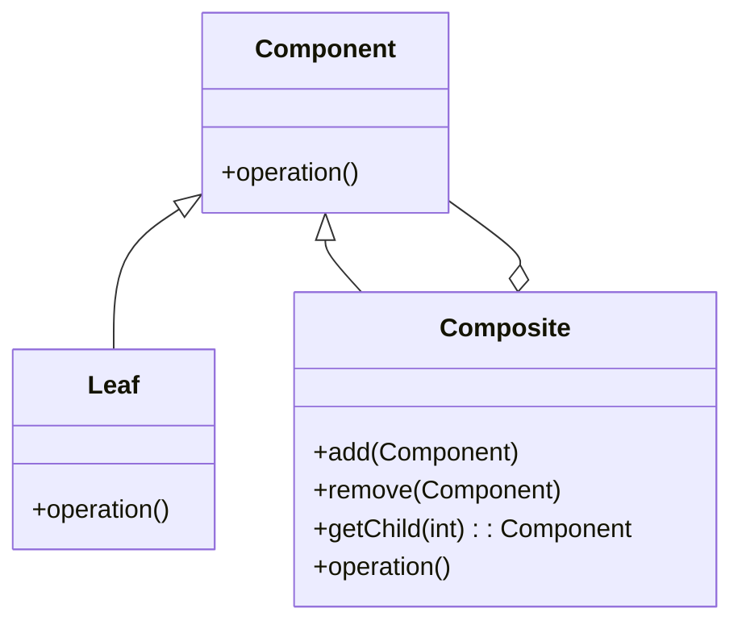
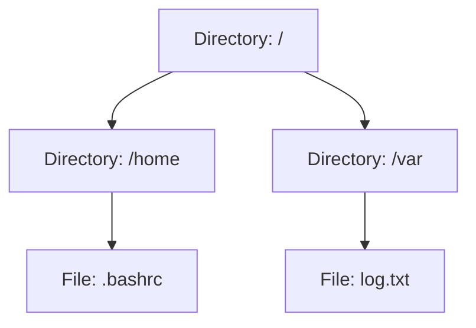
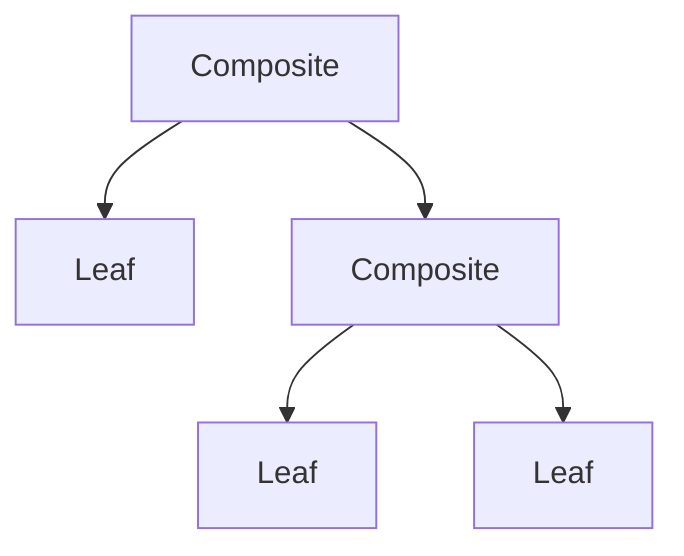
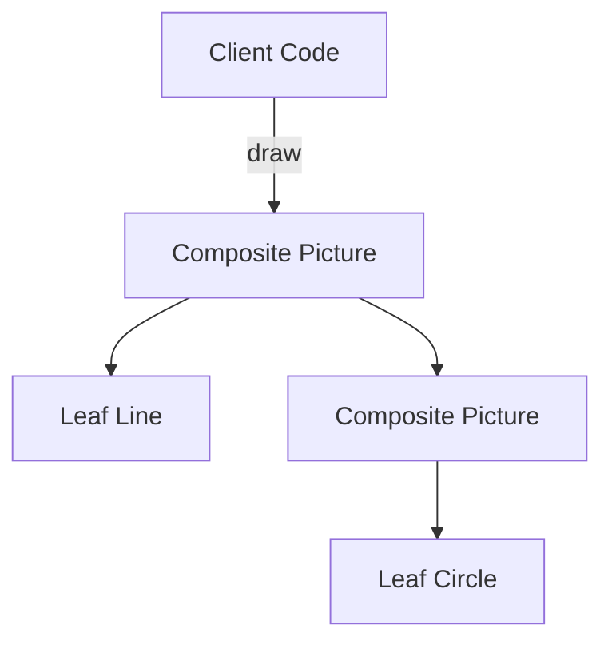

# Composite Pattern: A Technical Primer

## Overview and Context

The Composite Pattern is a fundamental structural design pattern in software engineering. It enables the composition of objects into tree-like hierarchical structures, allowing clients to treat individual objects and compositions of objects uniformly. As described in the canonical text "Design Patterns: Elements of Reusable Object-Oriented Software" by Gamma et al., the Composite Pattern is essential when forming part–whole hierarchies within object-oriented systems.

This pattern is a pillar of structural patterns (alongside patterns such as Decorator, Adapter, and Proxy), and it underpins many frameworks' ability to model recursive relationships among objects (e.g., user interface graphical components, file systems, organizational hierarchies).

## Motivation

The core motivation behind the Composite Pattern is to facilitate scenarios where atomic objects (leaves) and groups of objects (composites) need to be treated through a uniform interface. Without this pattern, client code would require explicit logic to distinguish between single objects and collections, increasing complexity, reducing extensibility, and violating the Open/Closed Principle.

### Problem Example

Consider a graphics drawing application. Shapes (lines, circles) might be individual graphical elements, but you may also define groups of shapes (drawings, diagrams) comprised of other shapes or groups. The application should allow a command like "move" or "draw" to be issued identically to both individual shapes and to groups, without forcing the client code to discern between the two.

## Core Concepts and Participants

The Composite Pattern is conceptually defined by the following primary participants:

- **Component**: An abstract interface or superclass for both simple and composite structures. Declares the interface for all concrete objects, atomic or group.
- **Leaf**: Concrete objects that represent atomic elements in the structure. Implements the Component interface with base behavior.
- **Composite**: Concrete objects composed of other Components (either Leafs or other Composites). Implements methods to manage child components and delegates behavior to them.

### Canonical UML Structure



- `Component` provides a common interface.
- `Leaf` provides concrete implementations for atomic objects.
- `Composite` aggregates children (of type `Component`) and implements structural management methods (`add`, `remove`, etc.).

## Practical Usage

### Typical Workflow

In practice, the Composite Pattern is implemented through a recursive tree structure. Each node in the tree is either a composite node (with children) or a leaf (without children). All nodes conform to the same interface, making it possible to traverse, manage, or operate on them using the same set of operations.

**Key workflow:**
1. Define a base Component interface for all operations (e.g., draw, move).
2. Implement Leaf types for atomic elements.
3. Implement Composite types that maintain a collection (commonly a list) of child Components.
4. Client code interacts with Components via the base interface, oblivious to their atomic/composite nature.

### Example: File System

A file system models files and directories in a classic composite structure: directories (composite) contain files or other directories, and files (leaves) contain data.



Common operations (`ls`, `rm`, `size`) can be called on both directories and files using the same interface.

### Example: UI Component Hierarchies

In graphical user interface (GUI) frameworks, all visible objects (windows, buttons, panels) are components. Containers such as panels or windows can contain other components, forming a recursive structure.

### Example: Organization Hierarchies

Organizations may model employees (leaves) and managers (composites), where managers contain subordinates who can be individual contributors or other managers.

## Implementation Details

### Component Interface

The interface (or abstract class) should define all applicable operations. In statically typed languages, this may be an interface or base class:

```java
public interface Graphic {
    void draw();
}
```

### Leaf Implementation

The leaf class implements the base operations:

```java
public class Line implements Graphic {
    public void draw() {
        // Draw line
    }
}
```

### Composite Implementation

The composite maintains a collection of child Components:

```java
public class Picture implements Graphic {
    private List<Graphic> children = new ArrayList<>();

    public void draw() {
        for (Graphic child : children) {
            child.draw();
        }
    }

    public void add(Graphic g) {
        children.add(g);
    }

    public void remove(Graphic g) {
        children.remove(g);
    }
}
```

### Client Example

```java
Graphic line1 = new Line();
Graphic line2 = new Line();
Picture picture = new Picture();
picture.add(line1);
picture.add(line2);
picture.draw(); // Draws both lines through uniform interface
```

## Architectural Characteristics

### Tree-Like Structure

Composite structures are commonly recursive and modeled as trees. Operations on composites can be implemented recursively, traversing or aggregating child components.



### Uniformity of Treatment

A major advantage is uniformity: client code interacts with all objects via the Component interface, without type checking or downcasting.

### Extensibility

New types of Leafs or Composites can be added with minimal changes to the client code, increasing extensibility and adhering to the Open/Closed Principle.

## Variations and Extensions

### Transparent vs Safe Composites

- **Transparent Composite:** The Component interface declares all child management methods (`add`, `remove`, etc). Both Leafs and Composites implement them; Leafs often throw exceptions or implement no-ops.
- **Safe Composite:** Only the Composite declares child management methods. The Component interface has only operations meaningful to both Leafs and Composites. This is safer but degrades interface transparency.

### Child Storage

Child components may be stored via arrays, lists, sets, or maps depending on ordering, access, and uniqueness requirements.

### Parent References

Occasionally, child components maintain a back-reference to their parent to facilitate upward traversal.

### Shared vs Exclusive Composites

- **Exclusive:** A component belongs to at most one composite at a time (typical tree).
- **Shared:** Components may belong to multiple composites (general DAG). This requires additional care to avoid cycles.

### Language Support

Certain languages with first-class algebraic data types or functional patterns (e.g., Haskell, Scala) allow composite-style structures via discriminated unions or recursive types, without explicit OOP hierarchies.

## Integration Points & Best Practices

- **Iteration:** The Iterator Pattern can be combined with Composite to traverse all components, regardless of depth or structure.
- **Visitor Pattern:** When multiple operations must be defined on trees, the Visitor Pattern can reduce the need to pollute Component with every operation.
- **Serialization:** Care must be taken to handle recursive structures during serialization to avoid infinite loops.

> [!TIP]
> When implementing complex operations (e.g., deep search, undo/redo), consider additional traversal methods or external visitors to avoid bloating the base interface.

## Engineering Considerations

### Performance Implications

- **Traversal Efficiency:** Deep trees may incur considerable recursive calls—stack overflows may occur for exceptionally deep structures unless tail-call optimizations or iterative approaches are used.
- **Memory Usage:** Each node incurs memory overhead (e.g., child collections, parent pointers). For very large structures, analyze memory consumption carefully.
- **Thread Safety:** Tree manipulations (add/remove) must be synchronized in multithreaded environments.

> [!CAUTION]
> Exposing mutable child collections directly (e.g., via public `List` fields) can lead to invariants violations. Always encapsulate access behind methods.

### Implementation Challenges

- **Type Constraints:** In strongly typed languages, covariance/contravariance must be considered if generics are involved.
- **Cyclic References:** Be wary of accidental cycles, especially if parent pointers or shared components exist. Cyclic structures may break algorithms that assume trees.
- **Error Handling:** Decide whether unsupported operations on Leafs (such as `add`) should throw exceptions, perform no-ops, or be omitted entirely.

### Common Pitfalls

- Treating compositing primitives as different from collections, leading to code paths that branch on type instead of delegating to the component interface.
- Forgetting to update parent references or consistent state on add/remove operations, causing tree corruption.
- Failure to design for operation extensibility, resulting in "fat" component interfaces.

## Related Patterns

- **Decorator Pattern:** Dynamically augments behavior; can be used alongside Composite to add responsibilities to tree elements.
- **Iterator Pattern:** Facilitates traversing composites without exposing structure.
- **Visitor Pattern:** Decouples algorithms from the object structure, useful for performing multiple unrelated operations on a tree.

## Sample Use-Case Diagram: Graphics System



In this example, the Client draws the complete picture tree without regard to whether each element is a primitive or a composite.

## Constraints, Assumptions, and Limitations

- Composite structures assume well-defined ownership or containment; shared children and cycles are advanced uses requiring careful management.
- The Composite Pattern is best suited for tree and DAG structures—arbitrary graphs are possible but may require additional robustness.
- Implementations may trade interface simplicity (transparent composite) for type safety (safe composite).

## Standards, Specifications, and Industry Use

Although the Composite Pattern itself is a software engineering idiom rather than a formal standard, it heavily influences design in areas such as:
- **UI Frameworks:** Swing/JFC (Java), .NET WinForms, Qt—all employ Composite for component trees.
- **Filesystem APIs:** POSIX, Java's `File` API, and .NET's `DirectoryInfo`/`FileInfo` mirror composite structures.
- **XML Parsers/DOM:** W3C DOM represents nodes, elements, and document fragments as a composite hierarchy.

## Conclusion

The Composite Pattern is a highly effective structural paradigm for enabling scalable, recursive, and uniform object hierarchies. It provides a robust method for treating individual objects and composites transparently, simplifies client code, and enables extensibility in hierarchical systems ranging from GUIs to filesystems and organizational models.

Careful implementation is required to manage traversal, type safety, mutation, and cycles. When leveraged alongside related patterns and engineering best practices, Composite forms a cornerstone of reusable, maintainable, and extensible software architecture.