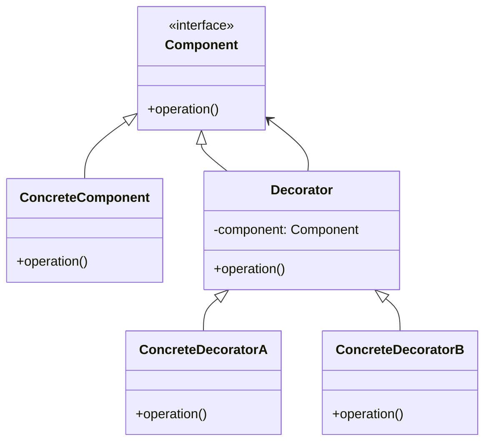
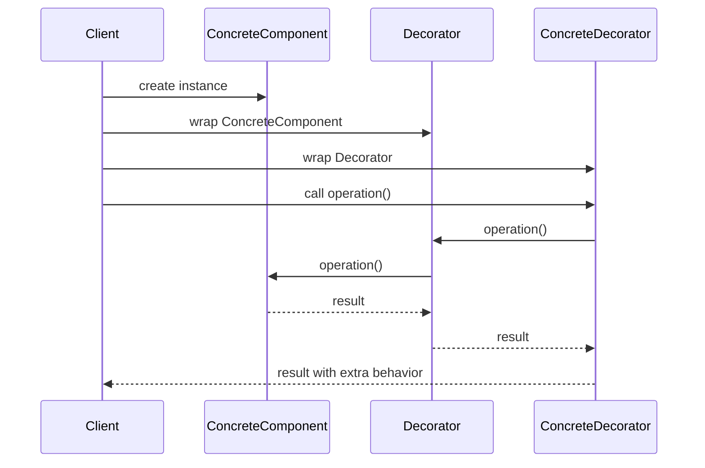

# Decorator Pattern: A Technical Primer

## 1. Introduction

The **Decorator Pattern** is a structural design pattern that enables behavior to be added to individual objects, statically or dynamically, without affecting the behavior of other objects from the same class. It is part of the **Gang of Four** (GoF) suite of patterns, formalized in the book *Design Patterns: Elements of Reusable Object-Oriented Software* by Gamma et al.

The primary objective of the Decorator Pattern is to overcome the limitations of subclass-based design when extending functionality. Instead of proliferating subclasses for every possible combination of features, the decorator pattern allows for composition of behaviors at runtime, thus adhering to the **Open/Closed Principle** of object-oriented design: classes should be open for extension, but closed for modification.

## 2. Core Concepts and Structure

### 2.1 Definition and Purpose

- **Definition:** The Decorator Pattern attaches additional responsibilities to an object dynamically. Decorators provide a flexible alternative to subclassing for extending functionality.
- **Intent:** To add new behavior to an object without changing its class.

### 2.2 Key Components

The pattern defines four primary participants:

1. **Component**: An interface or abstract class defining the basic operations.
2. **ConcreteComponent**: The class implementing the base operations.
3. **Decorator**: An abstract wrapper class implementing the component interface and holding a reference to a component object.
4. **ConcreteDecorator**: A class extending the decorator, adding new responsibilities.

#### Mermaid Class Diagram: Decorator Pattern Structure



### 2.3 Comparison to Related Patterns

- **Adapter Pattern**: Changes interface, not responsibility.
- **Proxy Pattern**: Controls access (e.g., via security or remote proxies) rather than augmenting behavior.
- **Composite Pattern**: Manages object trees; decorators focus on behavior addition to single objects.

## 3. How the Decorator Pattern Works

### 3.1 Example Workflow

1. **Define the base interface (`Component`)** for all objects that can have dynamically added behavior.
2. **Implement the core functionality** in a `ConcreteComponent`.
3. **Create abstract or base `Decorator` class** that follows the component interface and maintains a reference to a component object.
4. **Implement concrete decorators** that override methods and add their own behavior, possibly before or after delegating to the wrapped component.

#### Practical Example: Java I/O Streams

The Java I/O library uses the decorator pattern extensively (e.g., `BufferedInputStream`, `DataInputStream`, etc.), allowing different combinations of functionality (buffering, type conversion, encryption) to be layered dynamically at runtime.

```java
InputStream input = new FileInputStream("data.txt");
InputStream buffer = new BufferedInputStream(input);
InputStream data = new DataInputStream(buffer);
```

This pattern enables enhanced functionality (buffering, reading primitives) with minimal code duplication and without requiring an exponential number of subclasses.

### 3.2 Interaction Diagram



## 4. Architecture and Implementation Options

### 4.1 Architectural Overview

Decorators are arranged in a chain, with each decorator holding a reference to another component (either another decorator or the concrete component). Invocation of methods is typically done recursively through the chain.

#### Visual Representation: Decorator Chain


### 4.2 Layering and Composition

- **Layered extension:** Decorators can be stacked in any order, creating flexible, dynamic compositions.
- **Symmetric application:** New decorators can be applied to both decorated and undecorated objects.

### 4.3 Constraints and Assumptions

- All decorators and components must share a common interface.
- Decorators should be transparent to clients relying on the component interface.
- Side-effects in decorator behavior should be carefully controlled to avoid semantic conflicts.

## 5. Practical Considerations and Engineering Implications

### 5.1 Integration Points

- **Object creation:** Decorating objects is typically done at construction time or via factory/provider patterns.
- **Lifecycle management:** Chained decorators can complicate object disposal (such as closing streams or freeing resources).
- **Inversion of Control (IoC)/Dependency Injection (DI):** Can be used to configure decorator chains declaratively.

#### Tip
> When using dependency injection frameworks (like Spring), decorator chains can be described and assembled using configuration, supporting powerful runtime composition.

### 5.2 Performance Implications

- **Call overhead:** Each decorator introduces a method delegation, resulting in deeper call stacks. In high-throughput systems, excessive decorator depth may cause performance degradation.
- **Memory footprint:** Each decorator instance adds to overall memory usage, as each wrapper adds an object and references in the chain.
- **Granularity:** Fine-grained decorators give more configuration control but may trade off against performance.

#### Caution
> Avoid overly deep decorator chains in performance-critical code. Profile call stacks and memory usage to ensure system constraints are met.

### 5.3 Pitfalls and Common Mistakes

- **Non-transparent augmentation:** If decorators change object semantics beyond the interface contract, they may introduce bugs or violate client expectations.
- **Oder of application:** The order in which decorators are applied affects overall behavior. For example, logging before or after authentication changes log meaning.
- **State management:** Stateful decorators can break thread safety unless handled carefully.

#### Warning
> Do not assume decorators are stateless. If a decorator maintains state (e.g., caching), ensure thread-safety under concurrent access.

#### Note
> [diagram to be added later] Object lifetime and memory management in complex decorator chains.

## 6. Variations and Extensions

### 6.1 Static vs. Dynamic Decorators

- **Static decorators:** Applied at compile-time via code generation or static metaprogramming (e.g., templates in C++).
- **Dynamic decorators:** Applied at runtime (most common), enabling runtime composition for flexibility.

### 6.2 Language Support

Some languages offer native support for decorator-like behavior:

- **Python:** Decorators are a language feature for augmenting functions or classes via annotation-style syntax (`@decorator`), though the implementation pattern differs from the classic OOP decorator.
- **C#/.NET:** Attributes and aspects (aspect-oriented programming) can fulfill some decorator roles.
- **Functional languages:** Higher-order functions can behave like decorators.

### 6.3 Alternative Terms

- **Wrapper Pattern:** Sometimes used synonymously, though wrappers are not always decorators if the intent is only interface translation or protocol adaptation.

## 7. Application Scenarios

Decorators are suited to scenarios where:

- There is a need to augment objects with varying or combinable functionality.
- Inheritance is unwieldy or leads to an explosion of subclasses.
- Behaviors should be added transparently to selected instances, without impacting others or requiring client knowledge of concrete types.

### Examples

- **I/O streams:** As illustrated above.
- **User interface widgets:** Adding borders, scrollbars, or visual effects to component views.
- **Security:** Enforcing permissions, logging, or auditing on service objects.
- **Caching:** Adding caching to service calls without modifying service code.

## 8. Engineering Decisions and Best Practices

### 8.1 When to Use Decorators

- To extend or specialize behavior for individual objects, not entire classes.
- When extension by inheritance would be impractical or error-prone.
- For behavior combinations that are composable and order-sensitive.

### 8.2 When Not to Use Decorators

- When object identity must be preserved (decorators may obscure original identity).
- When objects need to be serialized or deserialized through strict formats—decorator chains may complicate serialization.
- When behavior must be extended for all objects of a type uniformly—prefer subclassing or direct modification.

### 8.3 Implementation Guidance

- Ensure the decorator and all decorators correctly implement the core interface.
- Delegate all non-extended methods directly to the wrapped component to maintain transparency.
- Be explicit about side-effects and the order of responsibility composition.
- Leverage factories or dependency injection to manage decorator stack construction.

#### GitHub Alert
> **Important**  
> When designing an API using the decorator pattern, document the intended sequence of decorator application and clarify which decorators are mutually compatible.

## 9. Summary

The Decorator Pattern is an essential structural pattern in object-oriented design, supporting flexible and compositional extension of individual object behavior. It mitigates the complexity of subclassing and empowers systems with runtime behavior modification capabilities. However, careful engineering is crucial to handle performance, object lifecycle, and semantic transparency, particularly in complex or concurrent environments.

---

## Appendix: Reference Implementation (Java)

```java
// Component
public interface Coffee {
    double cost();
    String ingredients();
}

// ConcreteComponent
public class SimpleCoffee implements Coffee {
    public double cost() { return 2.0; }
    public String ingredients() { return "Coffee"; }
}

// Decorator
public abstract class CoffeeDecorator implements Coffee {
    protected Coffee decoratedCoffee;
    public CoffeeDecorator(Coffee coffee) {
        this.decoratedCoffee = coffee;
    }
    public double cost() {
        return decoratedCoffee.cost();
    }
    public String ingredients() {
        return decoratedCoffee.ingredients();
    }
}

// ConcreteDecorator
public class MilkDecorator extends CoffeeDecorator {
    public MilkDecorator(Coffee coffee) {
        super(coffee);
    }
    public double cost() {
        return super.cost() + 0.5;
    }
    public String ingredients() {
        return super.ingredients() + ", Milk";
    }
}

// Usage
Coffee c = new MilkDecorator(new SimpleCoffee());
System.out.println(c.cost()); // 2.5
System.out.println(c.ingredients()); // Coffee, Milk
```

---

## FAQ

**Q:** Can a decorator remove behavior from an object?  
**A:** Decorators typically add responsibilities, but they can also override or block behavior. Care should be taken to avoid breaking the base interface contract or client expectations.

**Q:** Are decorators reusable?  
**A:** Yes, reusable decorators allow for flexible feature combination across different base objects conforming to the component interface.

**Q:** How is this pattern related to middleware pipelines?  
**A:** Middleware layers, such as in HTTP request processing, often use the decorator principle, chaining behaviors before or after delegating to lower layers.

---

**Related Patterns:** Composite Pattern, Strategy Pattern

**Category:** Structural Design Pattern