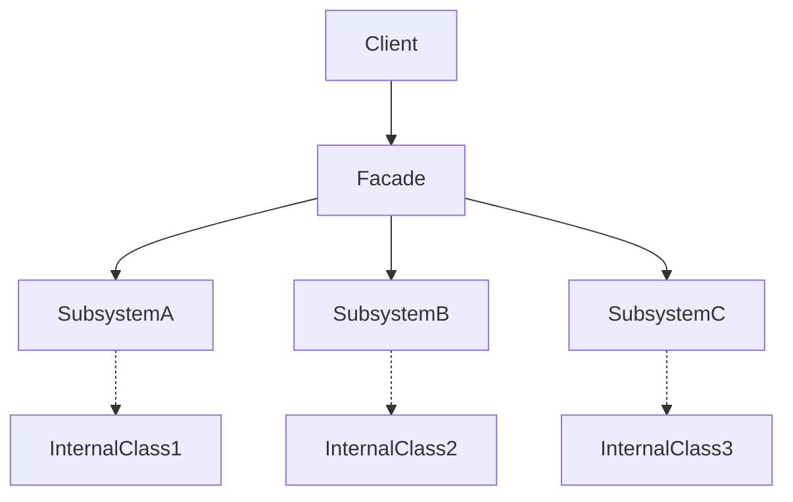
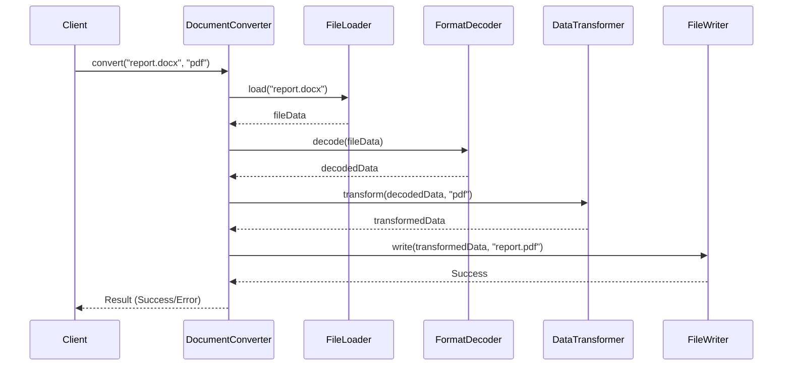

# Introduction

Software engineering often deals with building and maintaining complex systems, where subsystems may consist of interdependent components with intricate interactions. Managing such complexity, particularly at the boundaries between subsystems, can lead to excessive coupling, tighter dependencies, and difficult-to-maintain codebases. The Facade Pattern, classified as a structural design pattern, addresses these concerns by introducing a simplified, unified interface to a set of interfaces in a subsystem. By doing so, the pattern promotes loose coupling, clear separation of concerns, and improved maintainability.

# Definition and Context

The **Facade Pattern** is a structural design pattern described in the classic "Design Patterns: Elements of Reusable Object-Oriented Software" (Gamma et al., 1994). It supplies a high-level interface that makes a subsystem easier to use by masking its complexity. Rather than forcing clients to interact with a multitude of complex components, the pattern provides a single point of entry that coordinates the activities of underlying objects on the client's behalf.

This pattern is widely applicable in layered architectures, integration with third-party libraries, legacy system wrapping, and API design. It is language-agnostic and relevant across both object-oriented and structured programming paradigms.

# Core Concepts and Components

## Subsystem

A subsystem represents a collection of related classes, modules, or components performing a coherent set of responsibilities. Internally, these elements may expose multiple interfaces, adhere to different protocols, or require specific usage patterns. Subsystems frequently change as requirements evolve, making them prime candidates for encapsulation behind stable interfaces.

## Facade

The **Facade** is a single class or module that provides a simple interface to a complex subsystem. The facade internally delegates requests to specific subsystem components, handles orchestration, and encapsulates common workflows. This reduces the learning curve and shields clients from direct dependency on the subsystem's composition.

## Client

Clients interact exclusively with the facade interface rather than directly collaborating with subsystem objects. Changes in subsystem internals therefore have minimal impact on client code, provided the facade's contract remains stable.

## Diagram: Facade Pattern Structure

# Architecture and Implementation

The facade pattern's implementation involves designing a class or function set that exposes only those capabilities clients need, while delegating the details to the more granular subsystem components. Typical steps include:

1. **Identify subsystem boundaries**: Determine the classes, modules, or APIs that collectively form a coherent unit.
2. **Define the facade interface**: Identify common and essential operations needed by the client that can be served by the subsystem.
3. **Implement the facade**: The facade class translates high-level requests into sequences of subsystem calls, manages dependencies, and aggregates results.
4. **Manage dependencies**: The subsystem may have its own collaboration graph; the facade must be kept thin and should not replicate business logic but only coordinate.

A facade may itself be a part of a wider layered system, acting as a bridge between application and domain logic, or between an application and external providers.

## Example: File Conversion Subsystem

Consider a software utility that converts documents from one format to another. The subsystem may comprise several classes: `FileLoader`, `FormatDecoder`, `DataTransformer`, and `FileWriter`. Each has its own public methods, life cycles, and dependencies.

The facade, `DocumentConverter`, would provide a `convert(inputFile, outputFormat)` method. Internally, it interacts with the loader, decoder, transformer, and writer in the correct sequence, simplifying usage for client code.

## Sample Workflow in Practice

# Practical Application and Engineering Considerations

## Integration Points

- **API Gateways:** Facades are commonly used in microservices architectures as API gateways, aggregating and exposing data from multiple backend services through a unified HTTP interface.
- **Wrapping Legacy Code:** When integrating with legacy systems, a facade can mask outdated or convoluted APIs, providing a modern interface to new clients.
- **Third-Party Libraries:** When using complex libraries, exposing them entirely to client code can lead to tight coupling. A facade enables control over which features are exposed, and how.

## Performance Implications

- **Additional Layer:** Facades add an abstraction layer, which in most cases incurs negligible performance cost. However, care must be taken not to add excessive overhead, especially in latency-sensitive or high-throughput systems.
- **Batching and Optimization:** A well-designed facade can batch operations or optimize access patterns that would be inefficient if performed directly by clients.

## Implementation Challenges

- **Thin vs. Fat Facade:** There is a risk of the facade becoming a "God object"—overly responsible for disparate functionalities. Best practices dictate that a facade should not implement significant business logic, but coordinate orchestrations.
- **Change Management:** If the underlying subsystem changes significantly, the facade may need updates to maintain its contract. Clear versioning, regression testing, and interface segregation are vital.

> [!TIP]
> When designing a facade, favor composition over inheritance. Compose the facade from references to subsystem interfaces rather than extending them, which enhances flexibility and testability.

## Common Pitfalls

- **Leaking Abstractions:** If the facade exposes types or error conditions from the underlying subsystem, it negates the purpose of encapsulation.
- **Over-Abstracting:** Over-generalizing the facade to cover all possible subsystem use-cases may lead to a bloated and unusable interface.

> [!CAUTION]
> Avoid making the facade a mandatory dependency for all subsystem interactions, unless encapsulation needs are deliberate. Some consumers (power users/advanced modules) may legitimately require direct access to specific subsystem features.

## Testing and Maintenance

- **Mocking and Testability:** Facade interfaces are typically easier to mock or stub in unit tests since clients rely on their simplified API.
- **Backward Compatibility:** When evolving subsystems, maintaining backward compatibility at the facade boundary is critical for reducing breaking changes to clients.

## Language and Technology Notes

- Most object-oriented programming languages (e.g., Java, C#, Python) natively support the construction of facades via classes and interfaces.
- In functional languages, the facade may be realized as a module or set of higher-order functions.
- In service-oriented architectures or distributed systems, the facade may manifest as an endpoint, protocol adapter, or service gateway. For example, the [API Gateway pattern](https://microservices.io/patterns/apigateway.html) is an application of the Facade pattern at the system level.

# Variations and Related Patterns

While closely related, the Facade, Adapter, and Mediator patterns serve distinct purposes:

- **Adapter Pattern**: Focuses on converting one interface into another expected by the client, mainly targeting interface incompatibility rather than complexity reduction.
- **Mediator Pattern**: Centralizes collaboration among a set of objects, handling their interactions rather than simplifying a subsystem for clients.
- **Proxy Pattern**: Provides a placeholder or surrogate for an object to control access, often for reasons such as security or lazy instantiation.

Multiple facades can exist for a given subsystem, targeting different types of clients or responsibilities (e.g., a "read" facade vs. a "write" facade).

# Summary

The Facade Pattern is a pragmatic and widely adopted technique for reducing the apparent complexity of subsystems. By serving as a single, unified entry point, the facade streamlines client interactions, fosters loose coupling, and enhances maintainability. Its correct application is a hallmark of robust software architecture, especially in large or evolving codebases where complexity management is paramount.

By understanding and leveraging the Facade Pattern, software engineers can design more cohesive, adaptable, and resilient systems while protecting clients from unnecessary exposure to underlying implementation details.
