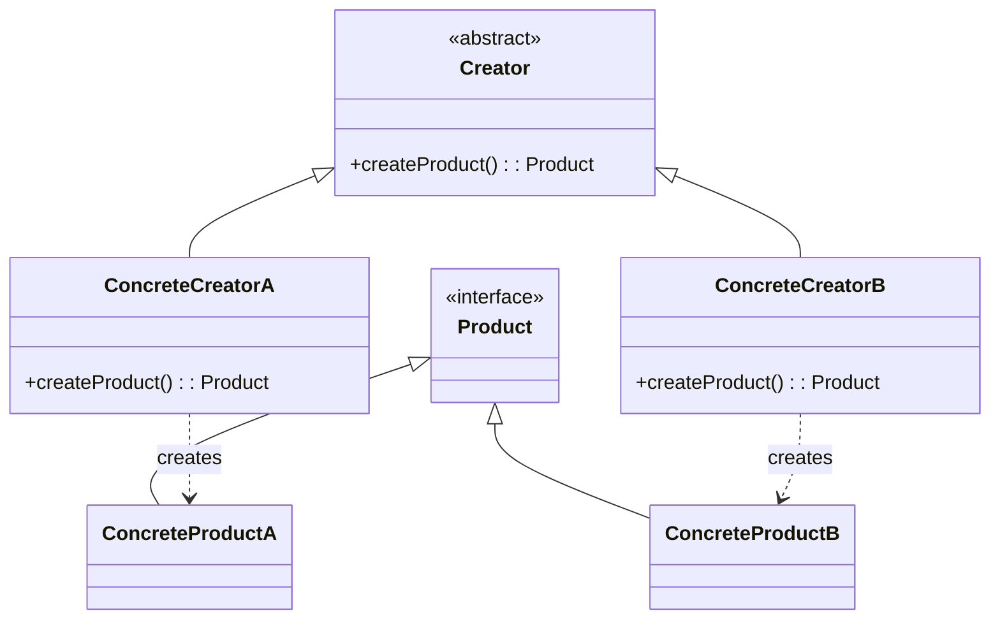
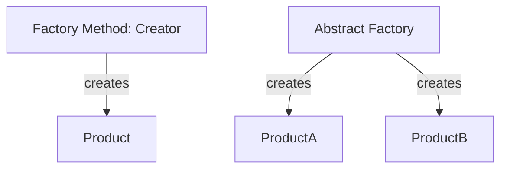
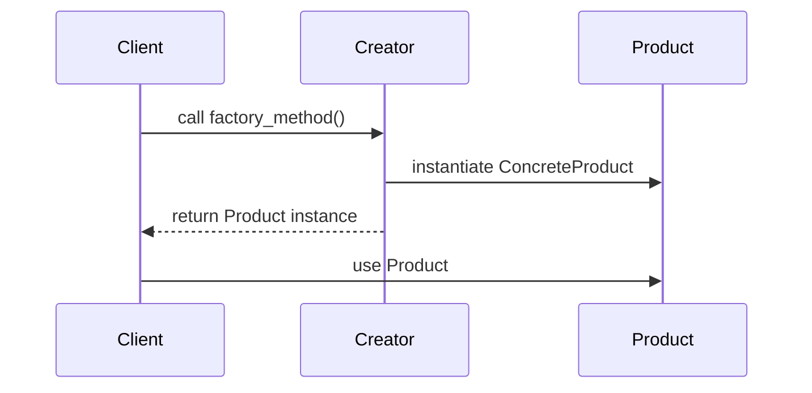

# Factory Method Pattern: A Technical Primer

## Introduction

The Factory Method Pattern is one of the core *creational patterns* described in "Design Patterns: Elements of Reusable Object-Oriented Software" (Gamma et al., 1994), often abbreviated as GoF (Gang of Four). It provides a framework for creating objects in a manner that allows the code instantiating them to remain independent of their concrete types. By delegating object creation to subclasses through a common interface, the Factory Method Pattern promotes loose coupling and enables extension without modifying client code.

This primer describes the Factory Method Pattern in detail, examines its architectural context, illustrates the pattern’s structure, provides engineering perspectives, and explores practical implementation issues relevant to software engineers.

---

## Concept and Motivation

In object-oriented design, constructors are often used for object creation. Introducing a direct dependency on specific classes by invoking `new` or direct constructors couples code to concrete implementations. When such dependencies proliferate, maintainability and flexibility suffer.

The Factory Method Pattern addresses this by:

- **Defining an interface for creating an object** (the factory method),
- **Allowing subclasses to decide which class to instantiate**,
- **Deferring the instantiation to subclasses** instead of direct construction.

This level of indirection enhances extensibility (adding new products requires no changes to client code) and promotes adherence to the *Open/Closed Principle* and *Dependency Inversion Principle*—foundations of flexible software architectures.

---

## Pattern Structure

The Factory Method Pattern is characterized by the following core components:

- **Product**: Abstract base type for the objects being created.
- **ConcreteProduct**: One or more implementations of the abstract Product interface/class.
- **Creator**: Declares the factory method, which returns `Product` instances.
- **ConcreteCreator**: Implements the factory method to instantiate and return a particular `ConcreteProduct`.

### Mermaid Diagram: Factory Method Pattern Structure



---

## Example: Logger Creation

Consider a scenario where different types of loggers (e.g., FileLogger, ConsoleLogger, NetworkLogger) are used, but client code should remain independent of the logger type.

### Abstract Example (Pseudocode)

```python
class Logger:
    def log(self, message): pass

class FileLogger(Logger):
    def log(self, message): # implementation...

class ConsoleLogger(Logger):
    def log(self, message): # implementation...

class LoggerCreator:
    def factory_method(self) -> Logger: pass

class FileLoggerCreator(LoggerCreator):
    def factory_method(self) -> Logger:
        return FileLogger()

class ConsoleLoggerCreator(LoggerCreator):
    def factory_method(self) -> Logger:
        return ConsoleLogger()

# Client code
creator = FileLoggerCreator()
logger = creator.factory_method()
logger.log("Log message")
```

Here, the client interacts only with `LoggerCreator` and `Logger`, and new types of loggers can be added without modifying existing client logic.

---

## Operating Principles

### Typical Workflow

1. **Client code** calls the factory method declared in the abstract creator.
2. **Concrete creator** implements the factory method and instantiates a specific concrete product.
3. **Product abstraction** enables seamless usage of newly created objects through a common interface.

### Constraints and Assumptions

- **Single Responsibility**: The creator class often has additional responsibilities besides object creation.
- **Extensibility**: Adding new product types requires creating new concrete creators but not changing existing client-side logic.
- **Object Lifecycle**: Product objects may have different lifecycles depending on implementation; the pattern itself doesn't enforce singleton or pooling semantics.

---

## Engineering Considerations

### Integration Points

- **Plug-In Architectures**: The pattern is valuable in frameworks or systems that need to instantiate user-provided extensions or plug-ins.
- **Dependency Injection**: When used in tandem with dependency injection frameworks, the factory method can leverage inversion of control while providing finer instantiation detail.

### Performance Implications

- **Allocation Overhead**: Each invocation of the factory method typically yields a new instance, possibly impacting memory usage.
- **Abstraction Costs**: Relying on abstract interfaces can introduce indirection and minor performance overhead, especially in high-frequency paths.

### Implementation Challenges

- **Parameterization**: Sometimes, factory methods must accept parameters to construct more complex product variants.
- **Default Implementations**: Abstract creators may provide a default implementation; care must be taken to avoid violating the Liskov Substitution Principle.

### Common Pitfalls

> **Warning**
>
> Overuse of the pattern, especially when object types are unlikely to change or vary, can result in unnecessary complexity, making the codebase harder to understand and maintain.

---

## Typical Variations

### Parameterized Factory Method

In some cases, the factory method may accept arguments to influence what concrete product gets instantiated. This is sometimes known as the *Parameterized Factory Method*:

```java
abstract class Creator {
    abstract Product createProduct(String productType);
}
```

### Registerable Products

For extensible architectures, it's common to use a registry that maps identifiers to concrete product creators:

```python
class ProductRegistry:
    registry = {}

    @classmethod
    def register(cls, key, creator):
        cls.registry[key] = creator

    @classmethod
    def create(cls, key):
        return cls.registry[key]()
```

### Factory Method vs Abstract Factory

- **Factory Method**: Creates one product variant at a time, through subclassing.
- **Abstract Factory**: Provides an interface for creating *families* of related products, usually through composition, not subclassing.

### Mermaid Diagram: Factory Method vs. Abstract Factory



---

## Use Cases

- **Frameworks/Toolkits**: Where the framework instantiates client-implemented objects (e.g., UI widgets, handlers).
- **Document Editors**: For creating documents or views without knowledge of their specific types.
- **Resource/Network/Device Management**: Where the type of resource to be instantiated depends on runtime configuration or platform.

---

## Related Patterns and Standards

- **Abstract Factory Pattern**: Broader than the Factory Method; creates families of related products.
- **Template Method Pattern**: The Factory Method is often used in conjunction with this pattern, where the overall algorithm is defined by a base class but includes abstract steps.
- **Builder Pattern**: Focuses on stepwise, complex object construction, often when construction logic is decoupled from representation.
- **Dependency Injection (DI)**: While not a GoF pattern, DI frameworks often use factories to resolve and instantiate types.

---

## Sequence of Interactions

### Mermaid Sequence Diagram: Factory Method Call Flow



---

## Engineering Best Practices

> **Tip**
>
> - Use the Factory Method Pattern when a class cannot anticipate the class of objects it must create or when a class wants its subclasses to specify the objects it creates.
> - Limit the pattern’s application in performance-critical paths unless the abstraction benefits clearly justify the cost.
> - Document the responsibilities of each participant (creator vs. product) clearly, especially for teams unfamiliar with design patterns.

> **Caution**
>
> Circular dependencies can arise if products require references back to their creators; careful design of constructor and interface signatures is required.

---

## Summary Table: Factory Method Pattern at a Glance

| Aspect                | Description                                                                          |
|-----------------------|--------------------------------------------------------------------------------------|
| Purpose               | Delegates instantiation to subclasses via a "factory method"                        |
| Base Participants     | Product, ConcreteProduct, Creator, ConcreteCreator                                  |
| Benefits              | Decouples clients from concrete types, promotes extension                           |
| Typical Contexts      | Plug-ins, frameworks, resource & UI management                                      |
| Key Liabilities       | Complexity, risk of subclass proliferation, performance overhead                    |
| Related Patterns      | Abstract Factory, Builder, Dependency Injection, Template Method                    |
| Engineering Considerations | Object lifecycle, parameterization, registry management, abstraction cost      |

---

## Conclusion

The Factory Method Pattern is an essential tool in the software engineer’s design patterns toolkit. It achieves extensibility and decoupling by standardizing object creation through an abstract interface and delegating responsibility for deciding "which type" to subclasses. While not always necessary for simple applications, it enables robust architectures for frameworks, plug-in systems, and situations where client code must remain agnostic to concrete types. Awareness of the pattern’s trade-offs ensures it is applied to maximum benefit, supporting maintainable and future-proof code.

---