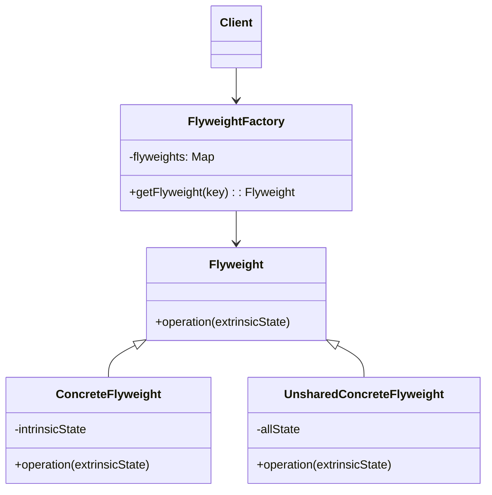
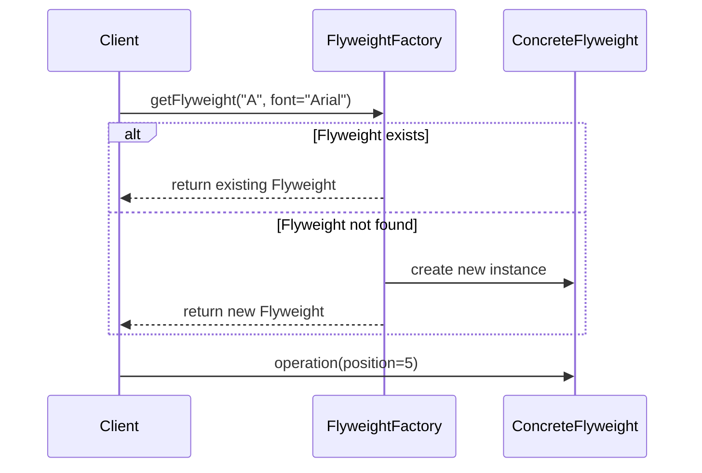

# Flyweight Pattern: Technical Primer

## Introduction

The Flyweight pattern is a structural design pattern that aims to optimize the use of system resources, primarily memory, when dealing with large numbers of fine-grained objects that share common data. By sharing intrinsic state among multiple objects, the Flyweight pattern minimizes resource consumption, enabling the efficient handling of large object graphs.

This technical primer introduces the Flyweight pattern by explaining its motivation, structure, practical implementation, and key engineering considerations. It addresses relevant architectural aspects, workflow scenarios, and common challenges associated with its application.

## Technical Context and Definition

In object-oriented software engineering, applications frequently manage large collections of similar objects which can lead to significant memory overhead if each object stores duplicate information. The Flyweight pattern addresses this by ensuring that shared, immutable ("intrinsic") data is stored centrally and referenced by all objects requiring it, while object-specific ("extrinsic") data is supplied externally or stored separately.

**Definition:**  
The Flyweight pattern is a structural design pattern that allows programs to support large numbers of fine-grained objects efficiently by sharing as much data as possible among them.

Flyweight is one of the classical "Gang of Four" (GoF) design patterns, categorized as a structural pattern because it enables a multigranular architecture through composition and data sharing.

## Core Concepts

### Intrinsic vs. Extrinsic State

- **Intrinsic State**: Information that is shared across multiple objects—immutable and independent of the object's context (e.g., a character's font, size).
- **Extrinsic State**: Information that is unique to the object’s context and must be supplied by the client (e.g., a character’s position in a text editor).

The separation of these two types of state is central to the Flyweight pattern. Intrinsic state is stored in shared Flyweight objects, while extrinsic state, often mutable and context-dependent, is supplied or managed externally.

### Pattern Structure and Key Components

The Flyweight pattern typically consists of the following participants:

1. **Flyweight**: Declares an interface through which flyweights can receive and act on extrinsic state.
2. **ConcreteFlyweight**: Implements the Flyweight interface and stores intrinsic state; shares data across multiple contexts.
3. **UnsharedConcreteFlyweight** (optional): Sometimes, not all flyweights can be shared. This class implements the Flyweight interface but cannot be shared.
4. **FlyweightFactory**: Creates and manages flyweight objects while ensuring shared instances are reused as needed.
5. **Client**: Maintains references to flyweight objects and supplies extrinsic state when invoking methods on them.

#### Pattern Structure Diagram



## How the Flyweight Pattern Works

### Factory-Managed Object Reuse

The Flyweight pattern relies on a factory to manage object creation and sharing. The factory maintains a central registry (often a hash map or dictionary) of flyweight instances, typically keyed by their intrinsic state. When the client requests a flyweight object with specific intrinsic characteristics, the factory either returns an existing instance from the registry or creates and registers a new one if none exist.

### Usage Example: Text Rendering

A canonical application of the Flyweight pattern is in text rendering systems, such as word processors. Each character on the screen may have multiple properties (character code, font, style, color, etc.), but many are shared among identical characters. Instead of creating a unique object for each character, the program reuses flyweight instances for shared properties, managing context-specific information (like position or line number) separately.

#### Example Mermaid Sequence Diagram: Flyweight Retrieval



## Implementation: Typical Workflow

1. **Client requests an object** with specific shared characteristics (intrinsic state) from the FlyweightFactory.
2. **FlyweightFactory searches its registry** for an existing instance with the requested intrinsic state.
3. **If found**, the factory returns the pooled object; **if not**, it creates, registers, and returns a new flyweight.
4. **Client supplies extrinsic state** (context) when using the flyweight.
5. **ConcreteFlyweight's logic** consumes both its internal (intrinsic) state and externally supplied (extrinsic) state to perform its required operation.

### Sample Pseudocode

```java
// Flyweight interface
interface Glyph {
    void draw(Position extrinsicState);
}

// ConcreteFlyweight
class CharacterGlyph implements Glyph {
    private char symbol; // Intrinsic state

    public CharacterGlyph(char symbol) {
        this.symbol = symbol;
    }

    public void draw(Position pos) {
        // Use intrinsic 'symbol' and extrinsic 'pos'
        // Drawing code here
    }
}

// FlyweightFactory
class GlyphFactory {
    private Map<Character, Glyph> pool = new HashMap<>();

    public Glyph getGlyph(char symbol) {
        if (!pool.containsKey(symbol)) {
            pool.put(symbol, new CharacterGlyph(symbol));
        }
        return pool.get(symbol);
    }
}

// Client code
Glyph a = glyphFactory.getGlyph('A');
a.draw(new Position(10, 20));
```

## Constraints, Assumptions, and Common Variations

### Constraints

- **Immutability**: Shared (intrinsic) state must be immutable to avoid data races or side effects when accessed by multiple clients.
- **Granularity**: The pattern is only beneficial when there is substantial duplication of data; overusing Flyweight may lead to increased complexity for marginal benefit.
- **Object Identity**: Flyweights are shared—clients must not rely on object identity (`==`) to distinguish between logically different objects with the same intrinsic state.

### Assumptions

- Most objects are similar or identical in core attributes.
- Extrinsic state can be provided on demand by the client or managed externally.

### Common Variations

- **UnsharedFlyweight**: Some objects may need to encapsulate both shared and unique state and cannot be shared; this is supported by an optional UnsharedConcreteFlyweight implementation.
- **Parameterized Intrinsic State**: In some systems, flyweights are parameterized by compound keys, where multiple intrinsic state attributes determine uniqueness.
- **Thread Safety**: Factory implementations often require thread-safe data structures to avoid concurrent instantiation of duplicate flyweights.

## Integration Points

- **Caching**: The Flyweight pattern underpins many caching and pooling schemes where objects with common properties are expensive to create or manage.
- **Resource-Intensive Systems**: Graphics engines, document editors, and game engines leverage Flyweight to optimize glyph, sprite, or object instance management.
- **Data Deduplication**: Flyweight can operate as a form of reference-based deduplication for memory optimization.

## Performance Implications

By eliminating redundant storage of shared state, Flyweight can reduce application memory consumption—sometimes drastically when object counts are large and data is highly redundant. However, there are important trade-offs:

- **Increased Indirection**: Accessing flyweight objects via a factory and handling extrinsic state may introduce indirection and management overhead.
- **Potential for Premature Optimization**: Manual application of Flyweight in situations with little intrinsic state repetition can unnecessarily complicate the system.
- **Thread Safety**: In concurrent environments, the flyweight factory must safely handle the creation and sharing of flyweights.

> :warning: **Caution:** Implementing Flyweight for objects with significant mutable state, or where extrinsic state cannot easily be managed externally, may result in more complex and error-prone code.

## Implementation Challenges and Pitfalls

- **Extrinsic State Management**: The burden of managing extrinsic state is shifted onto the client, which can complicate the client code and the overall collaboration contract.
- **Reference Management**: Flyweight factories should avoid memory leaks by using weak references or similar strategies, so that unused flyweights can be garbage-collected if not referenced elsewhere.
- **Object Identity Confusion**: Engineers new to the pattern may be surprised to find the same flyweight instance used in many places, leading to confusion over object equality vs. identity.

> :bulb: **Tip:** Favor immutable object structures for flyweight intrinsic state. If the flyweight objects must be extended to new types, consider using subclassing judiciously or composition for variant-specific behavior.

## Typical Engineering Decisions

When introducing the Flyweight pattern, engineers should ask:

- Is there a significant opportunity for data sharing due to repeated intrinsic state?
- Can the extrinsic state required by each logical object be maintained externally without excessive indirection?
- How will memory management of the flyweight pool be handled (e.g., reference counting, weak references)?
- What are the performance and concurrency requirements of the factory mechanism?
- Can the existing codebase’s semantics cleanly accommodate a separation of intrinsic/extrinsic state?

## Supplementary Diagrams and Visuals

### Example: Application in a Game Engine

Consider a game with thousands of trees—many of which have the same species and rendering attributes (shape, color, texture), but vary in location. The Flyweight pattern allows tree rendering code to share representation and data for each species, while storing only unique extrinsic data (location, orientation) separately.

```mermaid
graph TD
    Factory[TreeFactory]
    Flyweight[TreeSpecies Flyweight]
    World[GameWorld]
    TreePosition1[Location: (x1, y1)]
    TreePosition2[Location: (x2, y2)]

    World --> Factory
    Factory --> Flyweight
    World -->|drawTree| Flyweight
    Flyweight -->|with| TreePosition1
    Flyweight -->|with| TreePosition2
```

## Comparison With Related Patterns

- **Prototype Pattern**: The Prototype pattern delegates object creation to a prototypical instance. Unlike Flyweight, its primary purpose is to enable object cloning, not sharing.
- **Object Pool**: Both patterns involve object reuse, but Object Pooling keeps ready-to-use (often stateful) objects alive for performance, whereas Flyweight emphasizes data sharing and statelessness.
- **Singleton**: Singleton restricts a class to one instance. Flyweight enables many shared instances, each representing a unique set of intrinsic properties.

## Engineering Checklist: When to Use Flyweight

- You observe memory pressure from large numbers of similar objects.
- Intrinsic (shared, immutable) and extrinsic (unique, contextual) state can be cleanly separated.
- There are clear performance advantages from sharing and pooling.
- Clients can manage or supply extrinsic state adequately.
- The application's semantics are not tightly coupled to object identity.

## Summary

The Flyweight pattern is a powerful technique for reducing memory consumption and resource utilization in software systems that require a large number of fine-grained, similar objects. By isolating shared intrinsic state and managing unique extrinsic state externally, it allows for substantial data reuse and efficiency gains. Proper use of the pattern demands careful separation of state, robust factory design, and disciplined client code, especially in concurrency- and memory-sensitive environments.

Engineers evaluating the Flyweight pattern should weigh its complexity trade-offs against the potential for optimization, remembering that not all domains benefit equally from this form of structural sharing. When applied judiciously, Flyweight can dramatically improve scalability and performance in domains such as graphics rendering, editor design, and data deduplication.