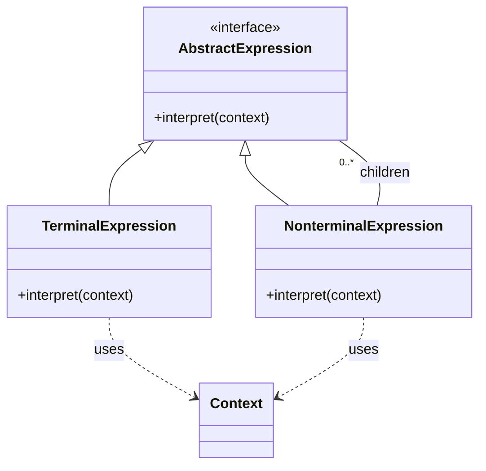
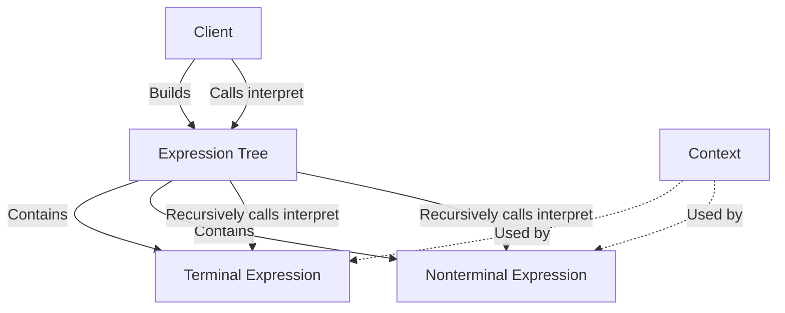
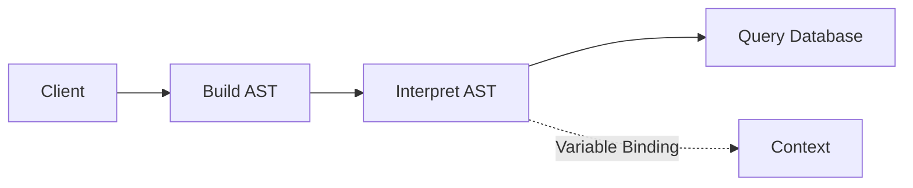

# Interpreter Pattern: A Technical Primer

## 1. Introduction to the Interpreter Pattern

The Interpreter Pattern is a behavioral design pattern that provides a standardized way to evaluate language grammar or define and interpret expressions in a structured and extensible way. It is particularly relevant for implementing languages, protocols, or rule engines with a fixed grammar. By representing each grammar rule as a class, the Interpreter Pattern enables the parsing and interpretation of sentences or expressions within a domain-specific language (DSL).

Placed in the context of software engineering design patterns, the Interpreter Pattern is most useful when the grammar of the language to be interpreted is simple, stable, and relatively small. Its core benefit is the encapsulation of parsing and interpretation logic within class hierarchies that mirror the grammar structure, providing clarity and separation of concerns.

## 2. Core Concepts and Pattern Structure

### 2.1. Problem Context

Software systems frequently require the interpretation of structured text or expressions. This occurs in:

- Interpreters for domain-specific languages (DSLs)
- Abstract syntax tree (AST) evaluators
- Scripting engines embedded in applications
- Query languages (e.g., SQL, XPath, regex engines)
- Rule engines (e.g., business or validation rules)

When the grammar is simple and changes infrequently, hard-coding the interpretation logic quickly becomes fragile and hard to maintain. The Interpreter Pattern addresses this by aligning code structure with grammar production rules, supporting easier extension and maintainability.

### 2.2. Participants

The formal structure of the Interpreter Pattern can be described as comprising the following participants:

- **Abstract Expression**: Declares an interpret method common to all nodes in the expression tree.
- **Terminal Expression**: Implements the interpret operation for symbols in the grammar that do not break down further (leaf nodes).
- **Nonterminal Expression**: Implements the interpret operation for grammar rules composed of multiple expressions (internal nodes).
- **Context**: Contains information relevant to the interpretation, such as the current variable mappings or environment.
- **Client**: Builds the abstract syntax tree representing a particular sentence in the language and initiates interpretation.

The pattern can be expressed in UML and Mermaid diagrams as follows.



### 2.3. Pattern Relationships

The Interpreter Pattern often integrates with other patterns:

- **Composite Pattern**: The structure of terminal and nonterminal expressions usually forms a composite tree.
- **Visitor Pattern**: For traversing or processing ASTs, Visitor can supplement Interpreter for operations other than interpretation.
- **Flyweight Pattern**: Can optimize resource usage when sharing common terminal expressions.

## 3. Architectural Overview

### 3.1. Expression Tree Construction

A client constructs an expression tree that mirrors the syntactic structure of statements in the language. Each node is an instance of an `Expression` subclass, corresponding to a grammar production.

### 3.2. Interpretation Workflow

The interpretation is generally performed by recursively traversing the tree, where each node delegates processing to its children (for nonterminals) or operates directly (for terminals).



## 4. Practical Engineering Applications

### 4.1. Use Cases

Some of the representative applications include:

- Rule-based engines, where business logic rules are expressed and interpreted dynamically
- Arithmetic or logical expression evaluators
- Simple command languages (e.g., navigation commands, robot control)
- Parsing and interpreting mini-languages embedded within larger systems

### 4.2. Typical Example: Arithmetic Expressions

Consider the arithmetic grammar for expressions with addition and multiplication:

```
expression ::= number | expression '+' expression | expression '*' expression
```

A simple interpreter might define classes as follows:

- `Expression` (abstract base/interface)
- `NumberExpression` (terminal)
- `AddExpression`, `MultiplyExpression` (nonterminal)

#### Code Example: Pseudocode

```python
class Expression:
    def interpret(self, context):
        pass

class NumberExpression(Expression):
    def __init__(self, number):
        self.number = number
    def interpret(self, context):
        return self.number

class AddExpression(Expression):
    def __init__(self, left, right):
        self.left = left
        self.right = right
    def interpret(self, context):
        return self.left.interpret(context) + self.right.interpret(context)

class MultiplyExpression(Expression):
    def __init__(self, left, right):
        self.left = left
        self.right = right
    def interpret(self, context):
        return self.left.interpret(context) * self.right.interpret(context)

# Usage: (5 + 3) * 2
expr = MultiplyExpression(
    AddExpression(NumberExpression(5), NumberExpression(3)),
    NumberExpression(2)
)
result = expr.interpret({})
# result = 16
```

### 4.3. Interpreting Variable Bindings and Context

In cases where expressions may contain variables, the `Context` participant provides the mechanism for variable substitution or symbol lookup.

```python
class VariableExpression(Expression):
    def __init__(self, name):
        self.name = name
    def interpret(self, context):
        return context[self.name]

context = {'x': 5, 'y': 10}
expr = AddExpression(VariableExpression('x'), VariableExpression('y'))
result = expr.interpret(context)
# result = 15
```

## 5. Integration Points and Constraints

### 5.1. Integration with Parsing Infrastructure

The Interpreter Pattern typically presumes that parsing and AST construction are performed elsewhere (e.g., by a parser generator, recursive descent parser, or hand-written code). Engineering challenges often include:

- **Integration with parsers**: Mapping parsed tokens/parse trees faithfully to the class hierarchy.
- **Handling syntax errors**: Providing user feedback for malformed input.
- **Reusability**: Extending the pattern for larger grammars, which may necessitate auxiliary factories or builders.

### 5.2. Performance and Scalability

The Interpreter Pattern’s recursive evaluation of object trees introduces certain performance considerations:

- **Overhead**: Each node is a separate object; deep expression trees may create substantial call stacks and object traversals.
- **Efficiency**: Suitable for small or moderate grammars. For complex languages, table-driven or bytecode interpreters (as in language VMs) often outperform class-based interpreters.

> [!WARNING]
> The Interpreter Pattern is not suitable for complex grammars requiring highly optimized performance due to the proliferation of small objects and deeply nested calls.

### 5.3. Maintainability and Extensibility

- **Adding new expressions**: Achieved by creating new subclasses; existing client code usually does not require modification.
- **Modifying grammar**: Structural changes to grammar (e.g., new operator precedence) may necessitate significant rework in tree construction but not in the underlying interpretation logic.

> [!TIP]
> Using a common base class or interface for all expressions enables the use of collections, higher-order functions, and generic algorithms for traversal and manipulation.

## 6. Common Variations and Pattern Extensions

### 6.1. Combining with Visitor

To extend the operations performed on expression trees (e.g., syntax checking, optimization, pretty-printing), the Visitor Pattern may be introduced. This allows multiple orthogonal traversals without modifying expression classes.

### 6.2. Memoization and Caching

Repeated interpretation of the same subtrees can be optimized by memoizing results, which is beneficial in contexts with redundant calculations.

### 6.3. Thread Safety

If evaluation contexts are shared (e.g., in a multithreaded rule engine), appropriate synchronization or stateless expression trees must be ensured.

> [!CAUTION]
> Avoid storing state within expression instances unless all access is coordinated. Stateless nodes are generally preferred in concurrent environments.

## 7. Engineering Pitfalls and Best Practices

### 7.1. When to Avoid

- **Large or evolving grammars**: The number of classes explodes with complex grammars, reducing maintainability.
- **Performance-critical paths**: High interpretation overhead is unsuitable for time-sensitive domains.
- **Highly dynamic grammars**: Use parser generators (ANTLR, yacc, etc.) and table-driven interpreters instead.

### 7.2. Best Practices

- **Separate parsing and interpretation**: Cleanly isolate the parsing logic from interpretation to improve testability and maintainability.
- **Leverage Composite and Visitor**: For nontrivial languages, blend Interpreter with Composite for structure and Visitor for operations.
- **Encapsulate context management**: Clearly define how variables, scopes, or environments are managed through the `Context`.

## 8. Example: Mini Query Language Architecture

To illustrate a realistic usage scenario, consider a simplified query language for filtering records.



- **Client** builds the AST from a parsed query.
- **AST** comprises expression nodes per the grammar.
- **Interpretation** recursively filters data via AST evaluation.
- **Context** is used to provide variable values or state.

## 9. Comparison to Related Patterns

- **Visitor Pattern**: Provides external traversal/operation logic, while Interpreter focuses on structure and interpretation.
- **Composite Pattern**: Used for representing the tree structure exploited by Interpreter.
- **Strategy Pattern**: Unlike Interpreter, Strategy swaps out algorithms but does not structure language rules or ASTs.

## 10. Conclusion

The Interpreter Pattern is a powerful, formalized solution for domains demanding extensible and maintainable expression evaluation for well-defined, fixed grammars. While highly suitable for lightweight interpreters, rule engines, and DSLs, its object-oriented approach may not scale for fully general-purpose language interpreters or large, performance-sensitive systems. Engineers should carefully assess grammar size, complexity, and performance constraints before adopting this pattern.

---

This technical primer has provided a comprehensive, structured outline of the Interpreter Pattern in software engineering, appropriate for professionals engaged in implementing or evaluating language grammars, mini-languages, or rule-based subsystems.