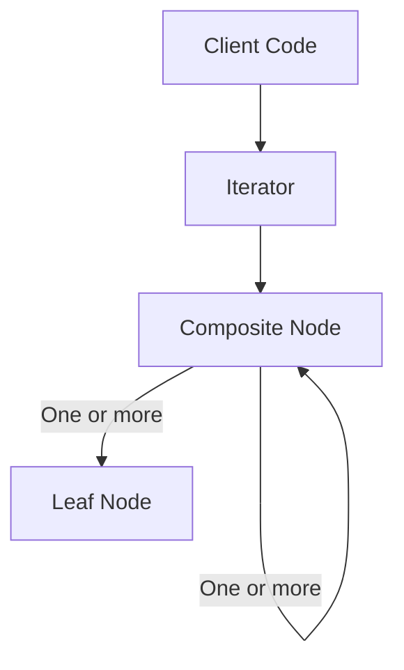

# Iterator Pattern: A Technical Primer

## Introduction

The Iterator Pattern is a behavioral design pattern that provides a standardized mechanism to sequentially access elements within an aggregate object (such as collections: lists, sets, trees) without exposing the underlying representation. By abstracting the traversal logic, it decouples collection classes from traversal code, fostering encapsulation, flexibility, and reusability.

This pattern is widely adopted in object-oriented systems and forms an integral part of many modern programming languages’ standard libraries and SDKs (e.g., Java’s `Iterator` interface, C++ STL iterators, .NET’s `IEnumerator`). Its relevance is underscored by its utility in enabling uniform access to various collection types, especially when combined with patterns like Composite and Factory.

## Core Concepts and Motivation

### Problem: Traversal Encapsulation

Many applications require traversing heterogeneous data structures. Directly exposing internal representations—for example, by returning an internal array or pointer—creates tight coupling and breaks encapsulation, making future modification and maintenance difficult. Iteration logic, if duplicated, leads to code redundancy and increased error rates.

### Solution: Externalizing Traversal

The Iterator Pattern addresses this by:

- **Separating traversal logic** from collection structure.
- **Defining a standard interface** for iteration, independent of how the collection is implemented.
- **Allowing multiple concurrent traversals**, possibly with different iteration strategies (forward, backward, filtered).

## Architecture and Key Components

The Iterator pattern formally defines several participants, as summarized in the following class diagram:

```mermaid
classDiagram
    Aggregate <|-- ConcreteAggregate
    Iterator <|-- ConcreteIterator
    Aggregate : +createIterator(): Iterator
    Iterator : +next()
    Iterator : +hasNext(): bool
    Iterator : +current()
    class Aggregate {
      <<interface>>
      +createIterator() Iterator
    }
    class ConcreteAggregate {
      -items: List
      +createIterator(): Iterator
      +otherCollectionMethods()
    }
    class Iterator {
      <<interface>>
      +next()
      +hasNext() bool
      +current()
    }
    class ConcreteIterator {
      -index: int
      +next()
      +hasNext() bool
      +current()
    }
    Aggregate o-- ConcreteAggregate
    Iterator o-- ConcreteIterator
```

**Participants:**

- **Iterator**: Defines the traversal interface (e.g., `next()`, `hasNext()`, `current()`).
- **ConcreteIterator**: Implements the traversal across a specific aggregate.
- **Aggregate**: Provides a method to create an iterator (`createIterator()`).
- **ConcreteAggregate**: Implements the creation of the corresponding concrete iterator.

## Pattern Dynamics: How Iteration Works

Iteration proceeds by the client obtaining an iterator instance from the aggregate and using it to traverse the data. The client only interacts with the iterator’s interface, remaining agnostic to the concrete collection’s type and internal structure.

```mermaid
sequenceDiagram
    participant Client
    participant ConcreteAggregate
    participant ConcreteIterator

    Client->>ConcreteAggregate: createIterator()
    ConcreteAggregate->>Client: ConcreteIterator
    loop until hasNext() == false
        Client->>ConcreteIterator: hasNext()
        alt hasNext() == true
            Client->>ConcreteIterator: next()
            ConcreteIterator-->>Client: current element
        else hasNext() == false
            break
        end
    end
```

## Standard Interfaces in Modern Programming Languages

Many modern languages have standardized the iterator concept:

- **Java**: `java.util.Iterator<E>` (`hasNext()`, `next()`, `remove()`)
- **Python**: `__iter__()` and `__next__()` methods, protocol-based
- **C# (.NET)**: `System.Collections.IEnumerator`
- **C++**: STL iterators with operators (`++`, `*`, etc.)

These interfaces often go beyond the classic pattern by integrating language-level support (e.g., `foreach`-loops, generators).

## Implementation Variations

### Internal vs. External Iterator

- **External Iterator**: Client controls iteration, invokes `next()` and `hasNext()`. Offers maximum flexibility, supports concurrent traversals over one collection.  
- **Internal Iterator**: The aggregate controls traversal and accepts a callback (often called an “iteration block” or “visitor”). Common in functional paradigms.

#### Example (Java-like Pseudocode):

```java
// External Iterator
Iterator<Book> iter = library.createIterator();
while (iter.hasNext()) {
    Book b = iter.next();
    // process b
}

// Internal Iterator
library.forEach(book -> process(book));
```

### Iterator Variation: Bidirectional, Reverse, Filtered

Iterators can implement different traversal strategies:

- **Bidirectional Iterator**: Supports both forward and backward movement (`previous()` method).
- **Random Access Iterator**: Allows direct jumping to any position.
- **Filtered Iterator**: Only returns elements matching specific criteria.

## Practical Workflows

1. **Obtaining an Iterator**: The client calls the aggregate’s factory method (e.g., `createIterator()`).
2. **Traversing the Collection**: The client queries `hasNext()`, then fetches each element with `next()`.
3. **Concurrent Iteration**: Multiple iterators may coexist and operate independently.
4. **Encapsulation Maintained**: Internals (e.g., arrays, linked lists, trees) remain hidden.

### Example in Python

```python
class MyCollection:
    def __init__(self, items):
        self._items = items

    def __iter__(self):
        return MyIterator(self._items)

class MyIterator:
    def __init__(self, items):
        self._items = items
        self._index = 0

    def __next__(self):
        if self._index < len(self._items):
            value = self._items[self._index]
            self._index += 1
            return value
        else:
            raise StopIteration

    def __iter__(self):
        return self

# Client code
for value in MyCollection([1, 2, 3]):
    print(value)
```

## Engineering Considerations

### Integration Points

- **Collection Libraries**: Iterators are essential in implementing custom collections interoperable with language features (`for`-loops, comprehensions).
- **APIs with Uncertain Backing Structures**: Enables traversing over database results, trees, graphs, files, or streams with a unified interface.

### Performance Implications

- **Lazy vs. Eager Evaluation**: Iterators may compute or retrieve values lazily (on demand), conserving resources for large or infinite collections.
- **Concurrency and Mutability**: Modifying a collection while iterating (outside iterator control) can lead to inconsistent states. Many implementations (e.g., Java’s `ConcurrentModificationException`) guard against this.

> **⚠️ Caution**
> Modifying a collection during iteration without explicit iterator support for safe mutation (e.g., via `remove()`) can cause runtime errors or undefined behavior.

### Implementation Challenges and Solutions

- **State Consistency**: The iterator must maintain accurate traversal position and adapt if the underlying collection is modified.
- **Resource Management**: Iterators that hold external resources (e.g., database cursors, file handles) must provide explicit closure or context management.
- **Multiple Traversal Strategies**: Supporting filtered/order-altering/unique traversal needs custom iterator implementations.

### Common Pitfalls

- **Failing to Encapsulate Internals**: Exposing pointers or internal structure nullifies the pattern’s benefits.
- **Confusion over Ownership**: Iterators do not own the collection; invalid references may occur if the collection is destroyed during iteration.
- **Improper Resource Cleanup**: Especially with external data sources, iterators should implement close/dispose/finalizer methods where appropriate.

## Iterator Pattern and the Composite Pattern

The Iterator Pattern is frequently combined with the Composite Pattern, especially when dealing with recursive structures such as trees or hierarchies. Iterators simplify the traversal of these structures by providing uniform access regardless of the element’s depth or type.



## UML Activity Diagram: Generic Iterator Usage

```mermaid
flowchart TD
    Start([Start])
    Obtain(Obtain Iterator from Collection)
    Check[Check hasNext()?]
    Fetch[Fetch next Element]
    Action[Process Element]
    End([End])

    Start --> Obtain --> Check
    Check -- Yes --> Fetch --> Action --> Check
    Check -- No --> End
```

## Advanced Topics

### Iterable Adapters

Adapters can implement iterator interfaces, enabling objects with non-standard traversal semantics (e.g., custom data fetchers, paginated APIs) to fit in with collection-aware code.

### Thread-Safe Iterators

Thread-safe iteration (supporting concurrent reads/writes) may require locking or immutable snapshots, depending on requirements.

> **💡 Tip**
> Prefer immutable or snapshot-based iteration for concurrent access, to avoid synchronization overhead and state inconsistency.

### Lazy and Infinite Iterators

Iterators can support infinite or very large sequences by computing values on-the-fly, as seen in streams or generators (e.g., Python generators, Java Streams API).

### External Standards

While not governed by formal RFCs, the iterator pattern aligns with language-specific protocols and is formalized in standards such as:

- *Java Community Process* (JCP): Java Collections Framework
- *ECMA-262*: JavaScript Iterable protocol (`[Symbol.iterator]`)
- *Python Data Model*: `__iter__`, `__next__`

## Summary Table: Iterator Pattern Features and Decisions

| Aspect                     | Typical Approach      | Variations / Comparisons                |
|----------------------------|----------------------|-----------------------------------------|
| Control of Iteration       | Client               | Internal (callback-based)               |
| Encapsulation              | Iterator accesses    | Direct access (anti-pattern)            |
| Collection Mutability      | Fail-fast            | Safe mutation (supported via iterator)  |
| Traversal Strategies       | Forward only         | Bi-directional, random, filtered        |
| Resource Management        | Automatic / Manual   | Requires explicit closing for resources |
| Language-Level Support     | Yes in most languages| Via protocols or interfaces             |
| Typical Integration        | Collections, streams | Custom data sources, APIs               |

## Conclusion

The Iterator Pattern offers a robust, language-agnostic approach for abstracting traversal over collections. Its ability to separate traversal from representation aids maintainability, reusability, and integration, and it forms a foundational pattern in object-oriented software engineering. By internalizing traversal logic and exposing a standardized interface, the pattern enables the construction of flexible, robust APIs, and its adaptation in major standard libraries attests to its enduring relevance.

Proper implementation and understanding of the Iterator Pattern are essential for engineers designing extensible data structures, APIs, and frameworks, especially in complex or evolving system architectures.