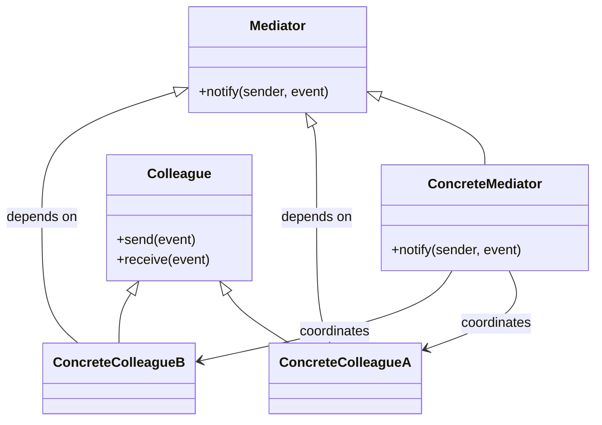
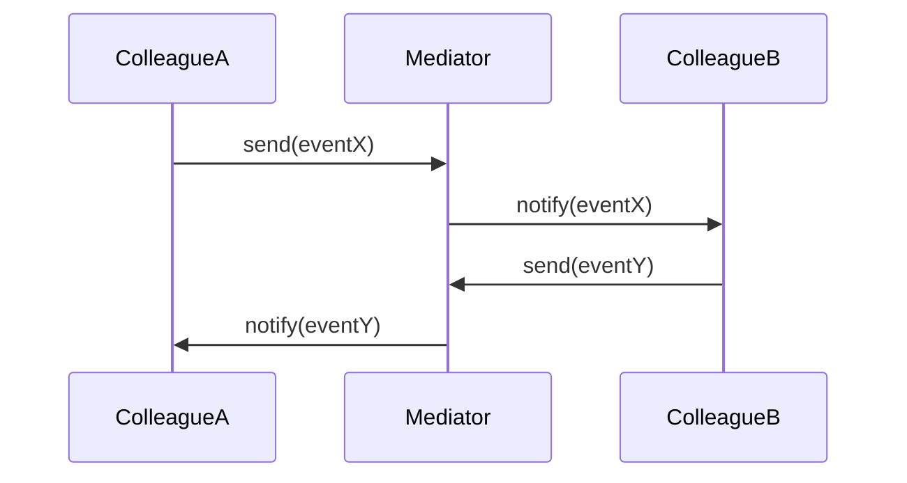
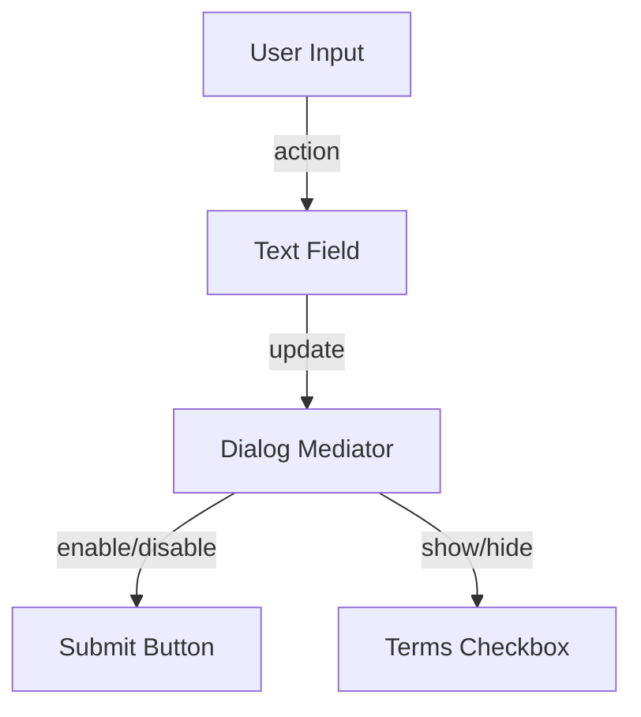

# Mediator Pattern: A Technical Primer

## Introduction

The Mediator Pattern is a behavioral software design pattern that centralizes complex communications and control logic between related objects, traditionally referred to as "colleagues." Rather than letting objects refer to each other explicitly, the Mediator Pattern introduces a central mediator object that encapsulates how these objects interact. This approach decouples the colleagues, simplifies their relationships, and makes the system easier to understand and maintain.

The pattern is particularly valuable in systems where numerous objects interact in complex or changing ways, such as user interfaces, collaboration tools, network protocol handlers, or any scenario where coordination among multiple parts is required. The Mediator Pattern is formally described in the "Gang of Four" (GoF) book, "Design Patterns: Elements of Reusable Object-Oriented Software," as one of the major behavioral design patterns.

## Problem Statement

In software systems with multiple interacting classes, direct communication leads to tight coupling. When every object explicitly references and communicates with others, changes in one can directly affect the others, increasing complexity and making the system brittle and hard to change. This tangle of dependencies often manifests itself as:

- Proliferation of inter-object dependencies.
- Difficulty in reusing or testing an object without its collaborators.
- Challenges in understanding and maintaining system behavior.

The Mediator Pattern addresses this by promoting loose coupling through the introduction of a central component that manages interactions.

## Pattern Definition and Intent

**Mediator Pattern:** Defines an object that encapsulates how a set of objects interact. Mediator promotes loose coupling by keeping objects from referring to each other explicitly, and it lets you vary their interaction independently.

**Key Intent:** Centralize communication and control among a set of objects, avoiding the need for them to refer to each other directly.

## Key Components

The Mediator Pattern typically involves the following participants:

- **Mediator**: Declares an interface for communication between Colleague objects.
- **ConcreteMediator**: Implements cooperative behavior by coordinating Colleague objects.
- **Colleague**: Each Colleague knows its Mediator object and communicates with it whenever it would have communicated with another Colleague.
- **ConcreteColleague**: Implements Colleague interface; communicates with other colleagues through the Mediator.

### UML Class Diagram (Mermaid)



## How the Mediator Pattern Works

### Communication Flow

When a Colleague object needs to communicate with another, instead of interacting directly, it sends a message or event to the Mediator. The Mediator receives this event and, as needed, coordinates responses or relays messages to other colleagues.

**Communication Example:**
1. `ColleagueA` wants to notify others of an event.
2. `ColleagueA` informs the `Mediator`.
3. `Mediator` evaluates the event and determines which colleagues are affected.
4. `Mediator` notifies or instructs those colleagues as appropriate.

Such a mechanism centralizes the control logic, thereby eliminating explicit dependencies among the colleagues and making interactions more maintainable.

### Sequence Diagram: Interaction Example



## Architectural Context

The Mediator Pattern is frequently found in user interface toolkits, event-driven architectures, and network communication stacks, where it enables clear separation of concerns. Unlike the Observer Pattern, which broadcasts changes to all observers, the Mediator allows for more sophisticated, centralized control and selectively notifies or directs the correct colleagues.

## Typical Workflows

### 1. Registration of Colleagues

Upon initialization, Colleagues are configured with a reference to the Mediator. This can be done via constructor injection, setter methods, or a registration API.

### 2. Event Dispatch

Colleagues do not directly interact with each other; instead, they send requests, events, or messages to the Mediator.

### 3. Coordination Logic

The Mediator interprets incoming events and orchestrates the appropriate actions, possibly involving one or more colleagues.

### 4. Optional Two-Way Communication

Depending on the implementation, the flow can be unidirectional (colleagues report to Mediator) or bidirectional (Mediator can instruct, update, or modify the behavior of colleagues).

## Implementation Variations

### a) Interface-based Mediator

A strict interface (e.g., `IMediator`) defines how Colleagues communicate. This encourages discipline and testability.

### b) Concrete Mediator

A concrete class implements the mediator logic, encapsulating knowledge about colleague interactions.

### c) Event-Based Mediator

Some implementations rely on an event dispatcher or event bus, where the mediator serves as the central hub.

### d) Hierarchical Mediators

Complex systems may employ mediation in hierarchical layers. A Mediator on one level might interact with parent or child mediators to coordinate across subsystems.

## Assumptions and Constraints

- Objects (colleagues) must be aware of the Mediator, but not of each other.
- The Mediator can become a single point of decision-making or performance bottleneck if not designed with care.
- Changes in colleague relationships do **not** require altering colleagues themselves; only the mediator needs adjustment.

## Code Example (Python-esque Pseudocode)

```python
class Mediator:
    def notify(self, sender, event):
        pass

class ConcreteMediator(Mediator):
    def __init__(self):
        self.colleague_a = None
        self.colleague_b = None

    def notify(self, sender, event):
        if sender == self.colleague_a and event == "EventA":
            self.colleague_b.receive("EventA from A")
        elif sender == self.colleague_b and event == "EventB":
            self.colleague_a.receive("EventB from B")

class Colleague:
    def __init__(self, mediator):
        self.mediator = mediator

    def send(self, event):
        self.mediator.notify(self, event)

    def receive(self, event):
        print(f"{self} received: {event}")

# Usage
mediator = ConcreteMediator()
colleague_a = Colleague(mediator)
colleague_b = Colleague(mediator)
mediator.colleague_a = colleague_a
mediator.colleague_b = colleague_b

colleague_a.send("EventA")
colleague_b.send("EventB")
```

## Practical Engineering Considerations

### Integration Points

- **UI Frameworks**: GUI components like buttons, checkboxes, and forms often communicate through mediators, rather than dispatching events to each other directly.
- **Microservices and Messaging**: In distributed systems, mediators (or orchestrators) coordinate service interactions and workflow, reducing direct service-to-service dependencies.
- **Domain-Driven Design (DDD)**: Mediators can be used to centralize domain events and handle cross-aggregate communications.

### Performance Implications

- **Centralization**: With all communications passing through the mediator, there is potential for bottlenecking if mediator logic becomes complex or is overburdened.
- **Scalability**: For systems with large numbers of colleagues or high-frequency events, mediators may need to be distributed, sharded, or implemented asynchronously to handle load.

### Implementation Challenges

- **Maintaining Simplicity**: As more interactions are incorporated, mediators can become overly complex ("God Object" anti-pattern). Proper design and decomposition are necessary.
- **Extensibility**: When introducing new colleague types or behaviors, design the mediator to be open to extension without frequent breaking changes.

### Common Pitfalls

> **Caution**
>
> Over-centralizing logic in the mediator may trade one source of complexity (spaghetti dependencies) for another (a monolithic mediator class that is hard to manage or test). Strive for a balance and consider decomposition or delegation as system complexity grows.

- Overuse in simple situations, where direct communication would be more straightforward.
- Failing to limit mediator responsibilities, leading to low cohesion.

### Testing Considerations

- Mediators are well-suited for unit testing, as they encapsulate interaction logic and can be tested in isolation from the colleagues.

> **Tip**
>
> Define clear, minimal interfaces for mediators. Use dependency injection or registration mechanisms, which foster modularity and testability.

## Comparison with Related Patterns

- **Observer Pattern**: Both patterns decouple senders and receivers, but the observer pattern is more general broadcast/subscription, while mediator is more about controlled, centralized coordination.
- **Facade Pattern**: Facade provides a simplified interface to a subsystem, but does not coordinate communication between objects inside the subsystem.

## Example: GUI Dialog Components

A common illustrative scenario is a dialog box containing several interdependent components (e.g., buttons, text fields, checkboxes). A Mediator coordinates the enabling/disabling of buttons when various events occur rather than having each component update others directly.



Here, each GUI component (TextField, Button, Checkbox) communicates only with the Mediator, which contains the interaction logic.

## When (and When Not) to Use the Mediator Pattern

**Use Mediator pattern when:**
- Multiple classes interact in complex, changing ways, and it is desirable to avoid direct references.
- Reusing an object is difficult because its interaction with many others is hard-coded.
- Behavior that depends on object communication should be customizable without modifying objects.

**Avoid Mediator when:**
- Only a few objects interact, with simple relationships.
- Centralizing communication would result in a "God Object."

## Design Considerations

- **Event Identification**: Well-designed event naming and scoping is crucial to maintain clarity.
- **Thread Safety**: In concurrent environments, mediators must handle multi-threaded access correctly.
- **Lifecycle Management**: Mediators may need to handle dynamic registration and de-registration of colleagues, especially in long-running or modular systems.
- **Extensibility**: Consider open-closed principles; mediators should allow the addition of new colleague types or behaviors with minimal modification.

## Summary Table: Mediator Pattern Properties

| Aspect               | Details                                                                                  |
|----------------------|------------------------------------------------------------------------------------------|
| Primary Role         | Centralize complex interactions among objects                                            |
| Participants         | Mediator, ConcreteMediator, Colleague, ConcreteColleague                                |
| Motivation           | Decouple colleagues, reduce dependencies, simplify maintenance                          |
| Common Domains       | UI toolkits, workflow engines, network protocol handlers, collaboration tools           |
| Strengths            | Eliminates explicit dependencies; centralizes control logic; enhances maintainability   |
| Trade-offs           | Risk of over-centralization; mediator can become complex; may affect performance        |
| Related Patterns     | Observer, Facade, Command, Chain of Responsibility                                      |

## Real-World Analogues

- **Air Traffic Control**: An air traffic controller (mediator) coordinates all aircraft (colleagues), ensuring safe takeoff, landing, and avoidance of collisions, without aircraft communicating with each other directly.
- **Chat Room Servers**: Participants (clients) send messages to the chat room (mediator), which distributes the messages to the appropriate recipients.

## Conclusion

The Mediator Pattern is a powerful tool for managing complex communications in object-oriented systems. Its primary value lies in promoting loose coupling, isolating change, and simplifying inter-object communication logic. However, it must be applied judiciously to avoid centralizing too much complexity in one place.

By centralizing communication, the Mediator enables flexible, maintainable systems where colleague objects remain unaware of each other's implementation, yielding better cohesion and scalability. When correctly implemented, it forms an essential pattern in any engineer's toolbox for robust software architecture.