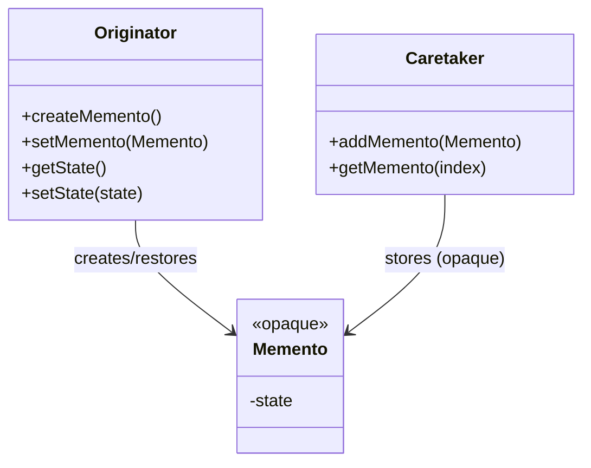
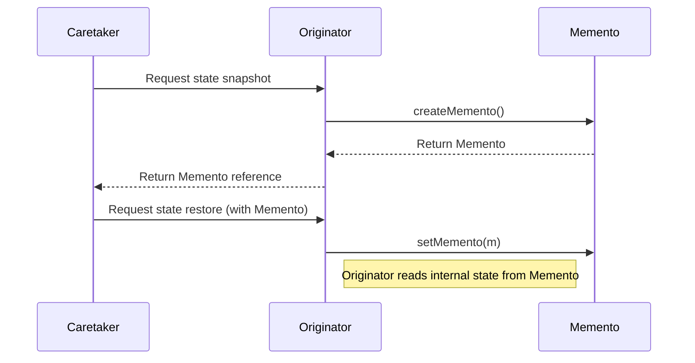
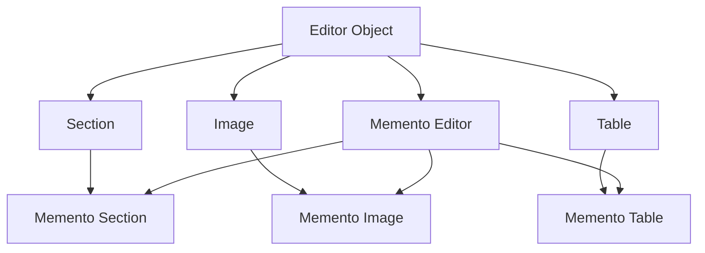

# Memento Pattern: A Technical Primer

## Introduction

The **Memento Pattern** is a behavioral software design pattern. Its primary purpose is to provide the ability to capture and store the current internal state of an object so that it can be restored to this state later, without violating encapsulation. The Memento Pattern is not about persistence or long-term data storage, but rather about transient, in-memory “snapshots” for undo/redo operations and state rollback in objects.

The pattern is a part of the classical “Gang of Four” (GoF) design patterns, described in _Design Patterns: Elements of Reusable Object-Oriented Software_ by Gamma, Helm, Johnson, and Vlissides. Its application is especially common in systems that implement undo mechanisms, editors, simulations, and transactional operations.

## Core Concepts

### Motivation

When external objects need to restore an object to a previous state, direct access to internal details exposes implementation specifics, violating the encapsulation principle of object-oriented design. The Memento Pattern enables state capture and restoration while preserving encapsulation.

### Participants

The pattern consists of three core participants:

1. **Originator**  
   The object whose internal state needs to be saved and later restored.

2. **Memento**  
   An object that stores the state of the Originator. Its interface is typically opaque to other system participants except the Originator.

3. **Caretaker**  
   An entity (object or subsystem) responsible for requesting and storing Mementos but not for examining or modifying their contents.

### Structure

The typical object relationships can be summarized as follows:



- The **Originator** knows how to create a Memento and how to restore itself from one.
- The **Caretaker** holds references to Mementos but cannot modify or inspect the encapsulated data.
- The **Memento** exposes minimal interface, generally none at all, to other objects.

## Memento Pattern in Practice

### Sequence of Operations



### Typical Workflow

- **State Saving:** The Caretaker asks the Originator for a Memento representing the current state. The Originator creates a Memento and returns its reference to the Caretaker.
- **State Restoration:** When needed, the Caretaker returns a previously saved Memento to the Originator, which uses it to roll back its state.
- **Encapsulation:** Only the Originator can create and interpret Memento contents; the Caretaker merely stores and passes references.

### Implementation Sketch (e.g., in Java)

```java
// Originator
public class Editor {
    private String content;

    public void setContent(String c) { content = c; }
    public String getContent() { return content; }

    public EditorMemento save() { return new EditorMemento(content); }
    public void restore(EditorMemento memento) { this.content = memento.getContent(); }
}

// Memento (package-private)
class EditorMemento {
    private final String content;
    EditorMemento(String c) { content = c; }
    String getContent() { return content; }
}

// Caretaker
public class History {
    private Stack<EditorMemento> stack = new Stack<>();
    public void push(EditorMemento m) { stack.push(m); }
    public EditorMemento pop() { return stack.pop(); }
}
```

**Access Control:**  
The Memento's internal state is kept hidden, typically by scoping or access modifiers.

## Common Applications

- **Undo/Redo in Editors:**  
  Saving undo history for commands without exposing internal data structures.

- **State Rollback in Transactions or Simulations:**  
  Allowing transient rollback to prior safe states.

- **Process Snapshots:**  
  Temporarily saving the progress or status of long-running operations.

## Architectural Considerations

### State Granularity

One must choose what to serialize into the Memento. The granularity can range from entire objects (deep copy) to incremental deltas (diffs).

- **Full Snapshot:**  
  Simple but can be memory-intensive.
- **Differential Mementos:**  
  Store only the change, reducing memory at the cost of more complex restoration logic.

### Memory and Performance

- **Memory Overhead:**  
  In systems where state is large or changes often, saving too many Mementos can result in significant memory consumption.
- **Engineering Approaches:**  
  - Limit number of stored Mementos (ring buffer)
  - Allow explicit user control (undo points)
  - Employ compression or delta-encoding

> :warning: **Warning:**  
> Caretakers holding large numbers of Mementos for sizable objects can create memory leaks and performance degradation if not managed carefully.

### Encapsulation Techniques

The Memento should not allow external examination or modification of captured state to avoid violating encapsulation.

- **Scoped Access:**  
  - Declare the Memento as a private/protected inner class
  - Package-private constructors/methods (as in the Java example above)
- **Opaque Interfaces:**  
  The Memento object exposes no getters or setters outside the Originator’s context.

### Thread Safety

If the Originator, Caretaker, or Memento are accessed concurrently, synchronization may be needed to prevent inconsistencies.

> :bulb: **Tip:**  
> Immutable Mementos simplify thread safety, as read-only data can be shared between threads without locking.

### Language Idioms and Constraints

- **Serialization:**  
  Some language environments favor using built-in serialization for Mementos, while others encourage manual extraction of relevant fields.
- **Type Safety:**  
  Since only the Originator should create and apply its Mementos, strongly typed access is often used to avoid mismatch between object and Memento.

## Pattern Variations

### White Box vs Black Box Memento

- **Black Box Memento:**  
  The Memento’s implementation is hidden from all objects except the Originator. Preferred for strict encapsulation.
- **White Box Memento:**  
  The Memento’s fields are exposed, making the pattern easier to implement but less encapsulated.

### Single vs Multi-level Undo

- **Single-level:**  
  Store only one previous state (simple undo).
- **Multi-level:**  
  Store a stack or list of Mementos for multi-step undo/redo chains.
- **Transactional:**  
  Group multiple state changes into a composite Memento for atomic undo/redo.

### Composite Memento

When the Originator is composed of sub-objects (e.g., rich models in an editor), a composite Memento recursively collects the state of all contained objects.



## Integration Points

### With Command Pattern

The Memento Pattern is often combined with the **Command Pattern**:

- Each command may record a Memento before execution for undo/redo.
- Composite commands manage stacks of Mementos for multi-step undo.

### Persistence vs In-Memory Usage

While Mementos are typically in-memory, they can be serialized for persistent undo, versioning, or crash recovery. However, persistent state introduces additional challenges such as:

- Version compatibility and schema evolution
- Security considerations (do not serialize sensitive state to disk unless secure)
- Integrity (checksums or validation when loading)

## Engineering Pitfalls

> :x: **Caution:**  
> Avoid strong references from the Memento to the Originator to prevent resource leaks or unintended persistence of objects.

> :information_source: **Note:**  
> Do not expose Memento’s internal mechanism as part of the API contract, as this can encourage misuse and tight coupling.

**Common Mistakes:**
- Storing only partial state, resulting in incorrect restoration
- Not managing memento lifecycles, leading to unbounded growth
- Not considering data immutability, risking state corruption

## Related Patterns

- **Command Pattern:**  
  Stores actions for undo/redo functionality. Often combined with Memento for state capture before/after commands.
- **Snapshot:**  
  Broader pattern for capturing state, not specific to object encapsulation or undo/redo.

## Example: Undo/Redo System Diagram

```mermaid
flowchart TD
    User[User]
    UI[User Interface]
    AppCore[Application Core]
    UndoMgr[Undo Manager (Caretaker)]
    Document[Document (Originator)]
    Snap[Snapshot (Memento)]

    User --> UI
    UI --> AppCore
    AppCore -->|Save state| UndoMgr
    UndoMgr -- Stores --> Snap
    UndoMgr -->|Restore state| AppCore
    AppCore --> Document
    Document -- Provides --> Snap
    AppCore <--|Apply snapshot| Snap
```

## Summary of Practical Considerations

- Use the Memento Pattern when you must implement undo/rollback features **without** exposing or breaking the abstraction of object internals.
- Mementos should be opaque and, ideally, immutable.
- Watch for memory, performance, and lifecycle impact of storing large or numerous Mementos.
- Integrate with patterns like Command for richer undo/redo semantics.
- Carefully manage encapsulation in your implementation language to prevent exposure of sensitive state.

--- 

The Memento Pattern is a critical technique for capturing and restoring object state safely and cleanly, especially in user-facing applications, editors, simulations, and transactional modeling. When applied judiciously, it allows for powerful state management features without compromising object-oriented design principles.