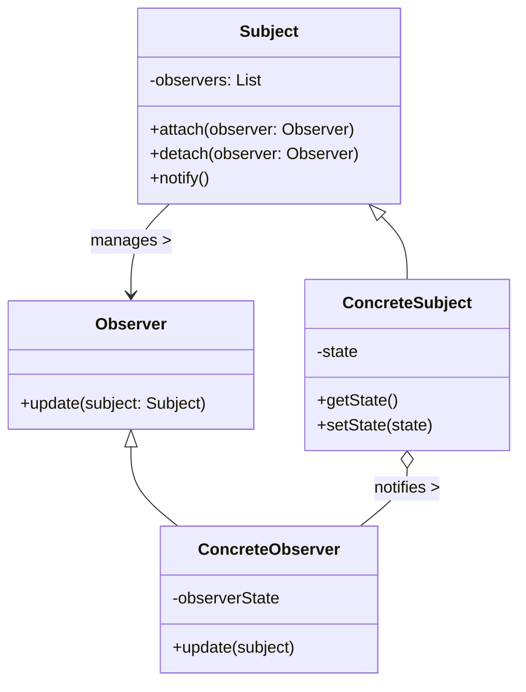
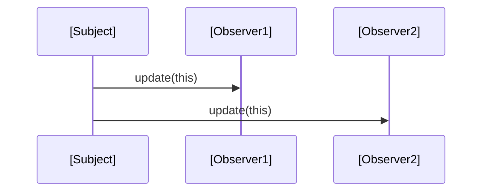
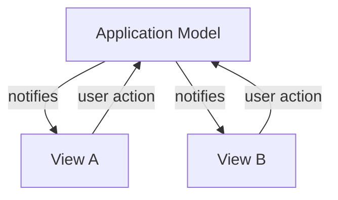

# Observer Pattern: Technical Primer

## Introduction and Context

The Observer Pattern is a foundational software design pattern integral to behavioral pattern classification. Originating from the seminal "Gang of Four" (GoF) book _Design Patterns: Elements of Reusable Object-Oriented Software_, the Observer Pattern addresses the requirement to maintain consistency among related objects without tightly coupling them. It enables the creation of a one-to-many dependency such that when the state of one object (the subject) changes, all its dependents (observers) are notified and updated automatically.

This pattern has broad applicability, especially in user interface toolkits, event-driven systems, publishing/subscription (pub/sub) models, Model-View-Controller (MVC) architectures, data binding scenarios, and distributed event notification services. Its principles underpin many contemporary frameworks and standards, including event handling in JavaScript, .NET's event delegates, Java's `java.util.Observer`, and CORBA's Notification Service.

## Fundamental Concepts

At its core, the Observer Pattern decouples the subject (state holder) from its observers (dependents) by separating notification from state management. The essential concepts include:

- **Subject**: The object with the state that needs to be observed. It maintains a list of observers, supports operations to attach/detach observers, and notifies them on state changes.
- **Observer**: An entity that wishes to be notified when the subject changes. Observers register with one or more subjects and implement an update mechanism.
- **Notification**: The process by which the subject informs observers of changes, usually through a method call or event dispatch.

### Class Relationships



## Pattern Structure and Dynamics

### Workflow Sequence

1. **Registration**: Observers express interest in a subject by registering (attaching) themselves.
2. **State Change**: The subject undergoes a state change via operation(s).
3. **Notification**: The subject invokes the `notify()` operation, which in turn calls `update(this)` on each observer.
4. **Reaction**: Each observer executes its `update` logic in reaction to the change.

#### Sequence Diagram Example



In practice, the exact mechanism may vary—with synchronous or asynchronous notification, pull (observer queries state) or push (subject sends data) models, and more.

## Architectural Variations

### Push vs. Pull Models

- **Push Model**: The subject actively sends details of the change to observers with the notification.
- **Pull Model**: The subject merely signals a change; observers then query the subject for the current state as needed.

### Synchronous vs. Asynchronous Notification

- **Synchronous**: Observers are updated immediately in a blocking manner.
- **Asynchronous**: Notifications may be queued or dispatched via event loops, supporting higher scalability and decoupling.

### Self-Detaching Observers

Observers can sometimes detach themselves during `update` to support one-time notifications or cleanup, although engineering care is needed to avoid concurrent modification issues.

### Chained or Cascading Updates

Observers may themselves be subjects for other observer sets, creating complex update chains. This requires attention to avoid notification cycles or unbounded propagation.

## Implementation: Typical Workflow

The following pseudocode illustrates a basic Observer Pattern implementation (in a Java/C++-style OOP language):

```java
// Observer interface
interface Observer {
    void update(Subject subject); 
}

// Subject base class
class Subject {
    private List<Observer> observers = new ArrayList<>();
    public void attach(Observer o) { observers.add(o); }
    public void detach(Observer o) { observers.remove(o); }
    public void notifyObservers() {
        for (Observer o : observers)
            o.update(this);
    }
}

// Concrete Subject example
class DataStream extends Subject {
    private int value;
    public void setValue(int v) {
        value = v;
        notifyObservers();
    }
    public int getValue() { return value; }
}

// Concrete Observer example
class Display implements Observer {
    public void update(Subject subject) {
        if (subject instanceof DataStream) {
            System.out.println("Value updated: " + ((DataStream)subject).getValue());
        }
    }
}
```

The pattern can be adapted to idioms in functional, reactive, or concurrent environments.

## Engineering Considerations and Common Pitfalls

> **Note**
> The Observer Pattern can be a source of subtle bugs and performance problems if not carefully managed, especially in complex or high-frequency notification scenarios.

### Memory Management

A common pitfall: lingering references from the subject to observers, leading to memory leaks (especially in languages without automatic garbage collection).

> **Caution**
> Always provide a means for observers to detach/unsubscribe and ensure references are cleaned up when observers are no longer required.

### Update Granularity

Overly coarse-grained notifications can lead to inefficient updates (observers reacting unnecessarily), while fine-grained change tracking increases subject complexity.

- **Tip:** Use event payloads to communicate only what changed if minimizing update work is crucial.

### Ordering and Consistency

Observers are often notified in registration order, but this is not guaranteed unless explicitly specified. For stateful observers that depend on one another, undefined ordering can result in race conditions or inconsistencies.

### Re-Entrancy and Notification Loops

Poorly architected observers (especially those that modify the subject during notification) can trigger re-entrant updates or infinite notification cycles.

> **Warning**
> Avoid allowing observers to indirectly trigger subject state changes during notification. Defensive programming or notification suppression (e.g., change batching) may be necessary.

### Thread Safety and Concurrency

In multi-threaded environments, access to subjects and observer lists must be synchronized to avoid race conditions or inconsistent observer sets.

- Use thread-safe observer registries (e.g., `CopyOnWriteArrayList` in Java, concurrent collections, or explicit locks).
- Asynchronous event queues or message buses may be preferable for decoupling producers and consumers.

### Integration Points

Observer patterns are frequently integrated with:

- UI toolkits (model-view separation)
- Event buses or message brokers (decoupled event-driven architecture)
- Property binding frameworks (automatic data propagation)
- Logging, instrumentation, or monitoring infrastructure

In distributed systems (e.g., CORBA Notification Service, WS-Eventing, MQTT, Redis Pub/Sub), networked observers receive notifications via messaging protocols, introducing additional concerns regarding reliability, ordering, and eventual consistency.

## Standards and Specifications

- Java provides `java.util.Observer` (now deprecated in Java 9+ in favor of event-listener approaches).
- .NET supports observer semantics via `IObserver<T>` and `IObservable<T>` interfaces, standardized in .NET Reactive Extensions (Rx).
- CORBA Notification Service and WS-Eventing specify wire-level notification semantics in distributed settings.
- Message brokers (e.g., MQTT, Apache Kafka, Redis Pub/Sub) implement pub/sub semantics founded on observer principles.

## Practical Example: UI Model-View Synchronization

A canonical Observer application is in model-view synchronization in GUI environments:

- **Model** (subject) holds application state.
- **View(s)** (observers) listen and update UI as the model state changes.



This setup ensures any change in the model is immediately visible to all views, while user interactions in views propagate updates to the model.

## Variants and Related Patterns

- **Event-Listener Pattern**: A specialized observer variant where observers register for specific events/signals rather than all state changes.
- **Publish-Subscribe Pattern**: Decouples sources (publishers) and sinks (subscribers) further, often via a message broker or bus, to enable wider scalability or cross-process communication.
- **Mediator Pattern**: Centralizes complex communication and control logic, whereas Observer directly notifies dependents.

## Strengths and Limitations

### Strengths

- Decouples subjects and observers, promoting modularity and maintainability.
- Facilitates event-driven and reactive architectures.
- Suitable for dynamic subscription scenarios (attach/detach at runtime).

### Limitations

- Potential for performance bottlenecks if notifications are frequent or observers are slow.
- Susceptible to memory leaks if observers are not correctly de-registered.
- Partial ordering and notification cycles can introduce subtle bugs if not managed.

## Summary Table: Observer Pattern at a Glance

| Aspect                  | Description                                                                          |
|-------------------------|--------------------------------------------------------------------------------------|
| **Pattern Type**        | Behavioral                                                                          |
| **Intent**              | Maintain consistency between subject and dependents without tight coupling           |
| **Participants**        | Subject, Observer, ConcreteSubject, ConcreteObserver                                |
| **Applicable Domains**  | UI/MVC, event systems, distributed event brokers, data binding, monitoring          |
| **Typical Mechanism**   | Callback interface or event dispatch                                                 |
| **Key Variations**      | Push vs. pull, synchronous vs. asynchronous, local vs. distributed                  |
| **Common Pitfalls**     | Memory leaks, notification order, re-entrancy, scalability                          |
| **Relevant Standards**  | Java `Observer`, .NET Rx, CORBA Notification, WS-Eventing, MQTT, message brokers    |
| **Related Patterns**    | Mediator, Event-Listener, Publish-Subscribe                                         |

## Conclusion

The Observer Pattern is a crucial tool in the engineer’s design arsenal, enabling adaptive, loosely coupled event-driven systems. While straightforward in concept, robust implementation requires careful engineering around state consistency, memory management, notifications, concurrency, and scalability. Its principles form the backbone of modern UI frameworks and distributed communication infrastructures, with direct analogies to many standardized protocols in software engineering.

> **Note**
> [Diagram to be added later: Event propagation across distributed observer pools.]