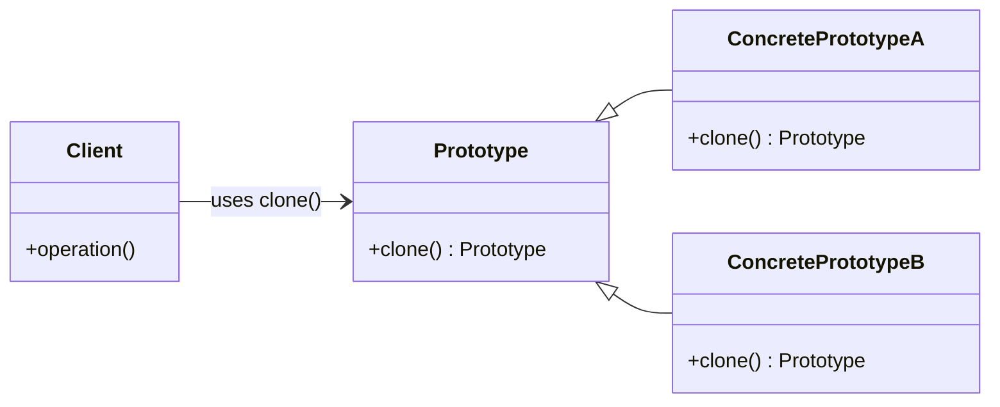
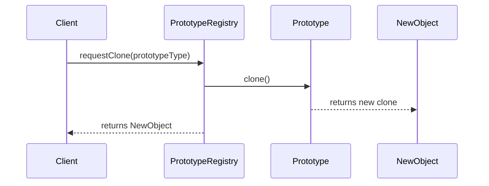

# Prototype Pattern

## 1. Introduction

The Prototype Pattern is a creational design pattern in software engineering, used to instantiate new objects by copying pre-existing instances instead of creating new objects from scratch. This approach is particularly valuable when object creation is resource-intensive or when system flexibility and dynamic object configuration are required.

Part of the broader family of creational patterns—alongside the Builder, Factory Method, and Abstract Factory patterns—the Prototype Pattern offers an alternative to conventional instantiation via constructors. Its primary goal is to handle the complexity or performance cost associated with directly instantiating and configuring new objects.

## 2. Technical Context and Motivation

In object-oriented systems, creating complex objects may involve multiple steps, expensive computations, or intricate initialization. When many similar objects are required, and each shares an initial configuration, the conventional constructor-driven instantiation approach can be inefficient. The Prototype Pattern addresses this by allowing objects to be cloned, i.e., copied from a prototype instance, which can be pre-configured to suit different use cases.

**Common scenarios for leveraging the Prototype Pattern:**
- Managing resource-intensive object creation (e.g., parsing large data files, network requests, or constructing objects with many dependencies).
- Avoiding subclass proliferation in configuration-centric systems.
- Creating objects at runtime without hardcoding their types.

## 3. Definition and Core Concepts

### 3.1. Definition

> The Prototype Pattern defines the kinds of objects to create using a prototypical instance, and creates new objects by copying this prototype.

### 3.2. Key Components

- **Prototype Interface**: Declares a cloning method, typically named `clone()` or `copy()`, which returns a fully initialized copy of the object.
- **ConcretePrototype**: Implements the prototype interface, providing the logic for copying itself.
- **Client**: Uses the cloning operation to create new object instances from known prototypes.

### 3.3. Core Mechanism

Each prototype object is responsible for copying itself and returning the copy to the requester. The client code remains decoupled from the specific classes of the objects being created, relying instead on the prototype's ability to clone itself.

**Relevant Standard:**  
Though there is no universal interface mandated by a cross-language standard, common platforms provide such facilities:  
- Java: `java.lang.Cloneable` interface and `Object.clone()` method.
- C++: Copy constructors and assignment operators.
- Python: `copy` module's `copy` and `deepcopy` functions.

## 4. Architecture and Workflow

### 4.1. Prototype Pattern Structure

The following Mermaid diagram depicts the prototype creation workflow:



**Diagram Explanation:**  
- `Prototype` is the interface or abstract class declaring the `clone()` method.
- `ConcretePrototypeA` and `ConcretePrototypeB` implement `Prototype`, providing concrete cloning mechanics.
- `Client` creates new objects through the `clone()` method without needing to know the specific subtype.

### 4.2. Instantiation Workflow

A typical instantiation flow using the Prototype Pattern:

1. System initializes and registers one or more prototype objects.
2. Client asks for a new object of a particular type.
3. System looks up the appropriate prototype and clones it.
4. Client receives and uses the new, cloned object.

#### Instantiation Sequence Diagram



## 5. Implementation Considerations

### 5.1. Shallow vs Deep Copy

A critical design consideration is whether the cloning operation should perform a **shallow** or **deep** copy:

- **Shallow Copy:** Copies all field values as-is, including references to mutable objects. Efficient but can lead to unintended object sharing.
- **Deep Copy:** Recursively copies all objects referenced, ensuring completely independent clones. Higher overhead but eliminates data sharing between clones.

> **⚠️ Warning**
> Incorrect implementation of cloning—especially with mutable fields—can lead to subtle bugs caused by unexpected sharing of internal object state.

### 5.2. Registration and Prototype Management

Often, a **prototype registry** or manager object is used to maintain references to one or more prototypes. This registry exposes an API for clients to retrieve clones by type or identifier.

**Example registry pattern:**
- Map of string identifiers to prototype instances.
- Methods for registering a new prototype and for cloning by key.

### 5.3. Language Support and Performance

- Not all languages have built-in support for object cloning, deep copying, or serialization, requiring custom code.
- Serialization-based cloning (e.g., serializing/deserializing the object graph) can ensure deep copies but may introduce significant performance costs.

> **💡 Tip**
> In high-performance scenarios, avoid serialization-based cloning in favor of custom, efficient copy logic.

## 6. Practical Usage and Variations

### 6.1. Example Use Case: GUI Frameworks

In graphical user interface (GUI) frameworks, widgets or controls often share default appearance and behavior but may require minor modifications. Instead of constructing each widget from scratch, a prototypical widget can be cloned and customized.

### 6.2. Dynamic Object Creation

If new object types must be created at runtime, but their type is not known until execution, registering prototypes enables dynamic, data-driven creation of object graphs.

### 6.3. Configurable Products

Systems with highly configurable products (e.g., game engines, CAD software) can allow end-users to define and register prototypes, which the system can later clone and instantiate on demand.

## 7. Comparison to Related Patterns

| Pattern                    | Instantiation Mechanism             | Use Case                                               |
|----------------------------|-------------------------------------|--------------------------------------------------------|
| **Prototype**              | Cloning from prototype instance     | Dynamic, runtime, or expensive object creation         |
| **Factory Method**         | Subclass-based factory method       | Defer instantiation to subclasses                      |
| **Abstract Factory**       | Families of factories               | Related objects/products families                      |
| **Builder**                | Stepwise construction               | Complex object construction with distinct steps        |

> **ℹ️ Note**
> The Prototype Pattern complements but does not replace factory patterns. It is especially useful when product types are not fixed at compile-time.

## 8. Engineering Considerations

### 8.1. Integration Points

Prototype-based cloning is most effective at boundaries where:
- Objects must be instantiated repeatedly with small modifications.
- Object configuration is determined at runtime.
- Persistence, undo/redo, or copy/paste functionality is required.

### 8.2. Performance Implications

- **Reduced Construction Overhead:** Bypassing constructor logic can significantly improve instantiation performance for complex objects.
- **Memory Usage:** Deep copies may increase memory use if internal data is duplicated unnecessarily.
- **Object Identity Caveats:** Cloned objects may reference external shared singletons, leading to unexpected coupling or mutation if not managed carefully.

### 8.3. Thread Safety

Cloning operations must account for concurrency:
- Prototypes must not be modified while being cloned.
- If prototype objects may be mutated, apply synchronization or use immutable prototypes.

> **🚨 Caution**
> Mutable shared prototype instances are a common source of concurrency bugs and should be avoided or protected by proper synchronization.

### 8.4. Customization and Extension

- Allowing clients to override or modify prototypes can introduce flexibility but also potential for configuration errors.
- Provide clear API contracts for what properties are overridden before or after cloning.

## 9. Implementation Example

### 9.1. Pseudocode

Below is language-agnostic pseudocode illustrating the pattern:

```pseudocode
interface Prototype {
    Prototype clone()
}

class ConcretePrototype implements Prototype {
    state
    method clone() {
        newObj = new ConcretePrototype()
        newObj.state = deepCopy(this.state)
        return newObj
    }
}

class PrototypeRegistry {
    prototypes = map<string, Prototype>
    method register(key, prototype) {
        prototypes[key] = prototype
    }
    method clone(key) {
        return prototypes[key].clone()
    }
}

// Usage:
proto = new ConcretePrototype()
proto.state = [1, 2, 3]
registry = new PrototypeRegistry()
registry.register("example", proto)

newObj = registry.clone("example")
```

### 9.2. Mermaid Code Flowchart: Prototype Registry Logic

```mermaid
flowchart TD
    A[Start] --> B[Prototype Registry Initialized]
    B --> C[Register Prototypes]
    C --> D[Client Requests Clone by Key]
    D --> E[Registry Looks Up Prototype]
    E --> F[Call clone() on Prototype]
    F --> G[Return Cloned Object]
    G --> H[Client Uses New Object]
    H --> I[End]
```

## 10. Common Pitfalls & Solutions

- **Incorrect or missing deep copy:** Leads to shared state between objects. Solution: Clearly document and implement cloning depth based on use case.
- **Prototypes with external dependencies:** Dependencies (like database handles or system resources) should not be cloned directly. Solution: Reinitialize or inject dependencies post-clone.
- **Prototype mutation at runtime:** If prototypes change during lifecycle, previously cloned objects may become inconsistent. Solution: Immutable prototypes or version-controlled prototype registries.

> **⚠️ Warning**
> Avoid mutable and globally accessible prototype instances unless synchronization or immutability is strictly enforced.

## 11. Summary

The Prototype Pattern is a flexible and powerful creational design technique, especially useful in domains where object initialization is expensive, object types are determined at runtime, or system configurability and copy/paste semantics are paramount. By delegating the creation of objects to their own cloning methods and utilizing central registries, software engineers can build adaptable and efficient systems while maintaining decoupling and open/closed principles.

**Mermaid diagrams and pseudocode in this primer provide a reference for understanding key workflows and structures. Practical adoption requires diligent handling of cloning semantics (shallow vs. deep), prototype lifecycle management, and concurrency controls to ensure design robustness and maintainability.**