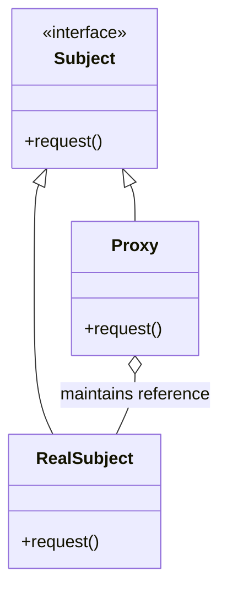
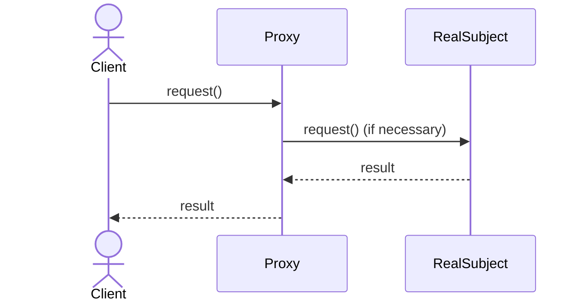
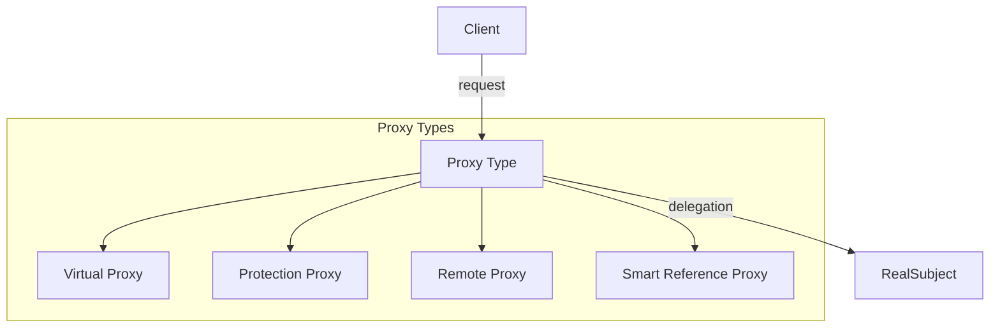
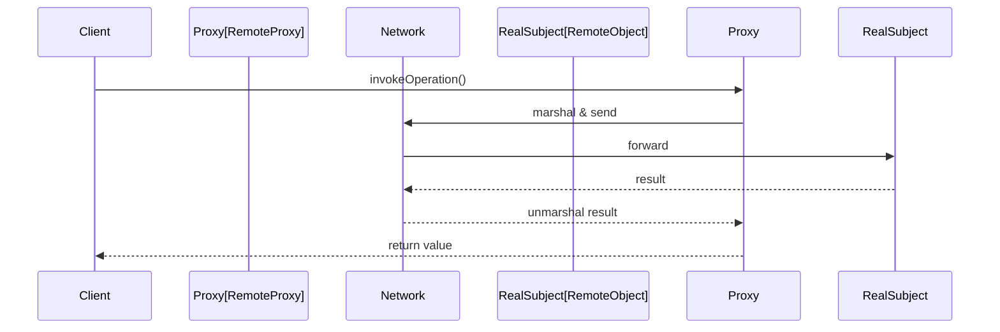

# Proxy Pattern: A Technical Primer

## Introduction

The Proxy Pattern is a structural design pattern commonly referenced in software engineering. It provides a surrogate or placeholder for another object to control access to it. The intent is to introduce an additional layer of indirection to support controlled access, deferred instantiation, resource management, security, or other cross-cutting concerns. The Proxy Pattern is foundational in object-oriented programming and is applicable in distributed systems, resource management, network access, and security enforcement within a variety of technical architectures.

This primer provides a thorough exploration of the Proxy Pattern, its key use cases, implementation strategies, variations, and engineering considerations.

---

## Concept and Motivation

In object-oriented design, objects often interact with one another through well-defined interfaces. However, direct access may not always be desirable or efficient. The Proxy Pattern introduces a stand-in object (the proxy) that controls, enhances, or delays access to the real object (the subject).

### Primary Motivations

- **Control Access:** Restrict, monitor, or log usage of the real object.
- **Resource Optimization:** Defer creation or loading of resource-intensive objects.
- **Remote Interaction:** Hide the complexity of communicating with remote objects or services.
- **Enhancement:** Transparently add behavior before or after delegating to the real object.

The Proxy Pattern aligns with the Single Responsibility and Open-Closed Principles by separating access control and ancillary logic from the core implementation of the real subject.

---

## Core Components

The typical architecture of the Proxy Pattern is defined by the following participants:

- **Subject (Interface):** The common interface that both the RealSubject and Proxy implement. This allows the Proxy to stand in transparently for the RealSubject.
- **RealSubject:** The concrete implementation of the Subject—where the original functionality resides.
- **Proxy:** The stand-in object that implements the same interface as RealSubject and manages access or augments its behavior.

### Proxy Pattern: Component Diagram



---

## Structural Overview

In practice, the Proxy wraps access to the RealSubject, often holding a reference to it. The Proxy can instantiate the RealSubject, check permissions, manage remote calls, cache results, or provide any intermediate logic as needed.

### Sequence Diagram: Typical Request Flow



---

## Proxy Variants

The pattern manifests through several commonly recognized variants, each addressing a particular concern:

### 1. Virtual Proxy

Defers the creation and initialization of expensive objects until they are actually needed. Useful when object instantiation is resource-intensive.

**Example:** Lazy loading of large images in a GUI application.

### 2. Protection Proxy

Controls access to the RealSubject by checking permissions or authorizations before delegating requests.

**Example:** Securing sensitive operations through access checks.

### 3. Remote Proxy (a.k.a. Stub)

Represents an object in a different address space, such as across a network or process boundary. The proxy manages underlying network or IPC protocols.

**Example:** Java RMI's stubs, CORBA proxies.

### 4. Smart Reference Proxy

Performs additional actions when an object is accessed—such as reference counting, logging, or automatic locking.

**Example:** Thread-safe wrappers, logging proxies, memory management wrappers.

### Visualizing Proxy Variants



---

## Practical Implementations

### Workflow and Integration

1. **Identification:** Determine where access to an object needs to be controlled or where indirect access provides value.
2. **Definition:** Extract and define a Subject interface detailing the required behavior.
3. **Proxy Creation:** Implement a Proxy class that shares the Subject interface. The Proxy includes logic for access control, instantiation, delegation, etc.
4. **Subject Substitution:** Client code interacts only with the Subject interface without knowledge of whether the RealSubject or Proxy is being used. Dependency injection or factory patterns often support substituting the Proxy transparently.

### Example: Virtual Proxy in Java

```java
// Subject interface
public interface Image {
    void display();
}

// RealSubject implementation
public class RealImage implements Image {
    private String filename;
    public RealImage(String filename) {
        this.filename = filename;
        loadFromDisk();
    }
    private void loadFromDisk() {
        // load image data, costly operation
    }
    public void display() {
        // actual drawing logic
    }
}

// Proxy implementation
public class ProxyImage implements Image {
    private RealImage realImage;
    private String filename;
    public ProxyImage(String filename) {
        this.filename = filename;
    }
    public void display() {
        if (realImage == null) {
            realImage = new RealImage(filename); // lazy loading
        }
        realImage.display();
    }
}
```

#### Usage

```java
Image image = new ProxyImage("test.jpg");
image.display(); // RealImage is loaded and displayed
image.display(); // No loading, RealImage is reused
```

---

## Engineering Considerations

### Integration Points

- **Dependency Injection:** Proxies can be introduced via dependency injection containers, allowing seamless substitution and aspect-oriented programming.
- **Autogenerated Proxies:** Many frameworks and platforms support the generation of proxies at runtime (e.g., Java Dynamic Proxies, .NET Remoting, Spring AOP).

### Performance Implications

- **Latency:** Proxy logic and communication (especially in remote proxies) can introduce additional latency.
- **Memory Footprint:** Virtual proxies can reduce overall memory usage via lazy loading, but proxies themselves add a layer of indirection and minimal overhead.
- **Scalability:** When serving as a network proxy, scaling and load balancing must be considered.

### Implementation Challenges

- **Transparent Behavior:** The proxy must faithfully implement all of the Subject interface to remain transparent to the client.
- **Exception Handling:** Errors and exceptions in the RealSubject must be reported or managed consistently by the Proxy.
- **Thread Safety:** If proxy logic involves shared state or mutable data, appropriate synchronization is essential.

> [!WARNING]
> Introducing proxies to secure objects does not guarantee security at the network boundary. Proxies within the same process space as malicious code may be bypassed. Security proxies are effective only when clients cannot subvert or replace proxy usage.

### Common Pitfalls

> [!CAUTION]
> Avoid tight coupling between proxies and real subjects. Violating interface contracts or leaking implementation details undermines the benefits of the pattern.

- **Overuse:** Not every object requires a proxy; inappropriate use increases system complexity.
- **Performance Overhead:** Frequent, unnecessary proxy logic can lead to measurable overhead, especially for fine-grained operations.

---

## Proxy Pattern in Distributed Systems

The Proxy Pattern is essential for location transparency in networked and distributed systems. Technologies such as CORBA, Java RMI, and .NET Remoting rely on proxies (often referred to as ‘stubs’) to represent remote objects locally. These proxies marshal, transmit, and route requests transparently.

### Sequence Diagram: Remote Proxy Workflow



Organizations building distributed, cloud-native, or microservices architectures regularly deploy proxies for API gateways, circuit breakers, and service meshes (e.g., Envoy, Istio).

---

## Proxy Pattern vs. Related Patterns

### Adapter vs. Proxy

- **Goal:** Adapter translates an interface to another, whereas Proxy preserves the interface but interposes additional functionality.
- **Interchangeability:** Proxies are intended to be interchangeable with their subjects, while adapters provide conversion.

### Decorator vs. Proxy

- **Goal:** Decorator enhances object behavior without necessarily controlling access.
- **Transparency:** Both implement the same interface; Decorator focuses on extension, Proxy on mediation.

---

## Real-World Applications

- **Persistence Proxies:** ORM frameworks (such as Hibernate) use proxies to enable lazy-loading of entities.
- **Security Proxies:** Web application firewalls and API gateways enforce security and monitoring at service boundaries.
- **Cache Proxies:** Caching proxies (like memcached wrappers) intercept calls to retrieve or recycle expensive data.
- **Service Location in SOA:** Service registries provide proxy stubs to abstract service endpoints from consumers.

---

## Standards and Protocols

- **CORBA / IIOP:** Proxies are generated as part of the interface definition and object request brokering.
- **gRPC:** Clients interact with server-side services using strongly-typed proxies autogenerated from service contracts.
- **Network Protocols:** HTTP, SOCKS proxies mediate client-server communications, matching the intent of the pattern at the protocol level.

---

## Summary Table: Proxy Pattern Key Points

| Aspect                | Proxy Pattern Role                                      |
|-----------------------|--------------------------------------------------------|
| Transparency          | Proxy and RealSubject implement the same interface     |
| Primary Purposes      | Access control, lazy loading, remote access, logging   |
| Use Cases             | Distributed systems, security, resource management     |
| Key Constraints       | Proxy must not alter expected semantics of Subject     |
| Performance Impact    | Overhead from indirection and (possibly) I/O           |
| Related Patterns      | Adapter (structure), Decorator (extension)             |

---

## Conclusion

The Proxy Pattern is a vital structural pattern within software engineering, enabling controlled, efficient, and manageable interaction with objects. Its applications range from lazy loading to remote invocation and security enforcement. Correctly implemented, proxies offer robust means to separate concerns, optimize resources, insert cross-cutting logic, and enforce policies without altering core system logic. As with all structural patterns, careful consideration of requirements and implementation trade-offs is essential to harness its benefits effectively.