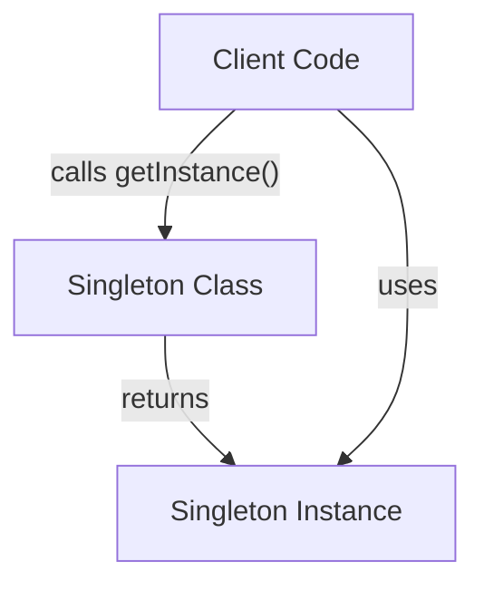
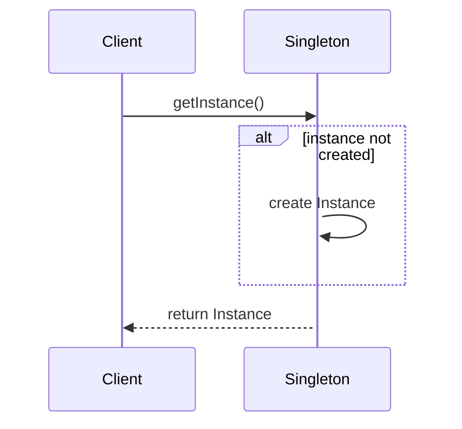
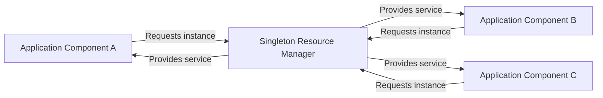

# Singleton Pattern

The Singleton Pattern is a well-known design pattern, classified as a "creational pattern" within the catalog of object-oriented design patterns. Its primary purpose is to restrict the instantiation of a class to a single object, ensuring exactly one instance of that class across the scope of the application. Furthermore, it provides a global access point to this instance, facilitating controlled coordination and resource management.

The pattern was originally described as part of the seminal "Design Patterns: Elements of Reusable Object-Oriented Software" (Gamma, Helm, Johnson, Vlissides, 1994) — commonly known as the "Gang of Four" (GoF) book — and has since become a foundational topic in software engineering.

---

## Core Concepts and Motivation

A **singleton** encapsulates the following characteristics:

- **Single Instance**: Ensures that only one instance of a class exists at any given time.
- **Global Access Point**: Allows clients to obtain a reference to that single instance via a well-defined method or property.
- **Controlled Instantiation**: Prevents external objects from creating additional instances, typically by restricting access to class constructors.

The primary motivations for the Singleton Pattern are:

- **Shared Resources**: Where exactly one instance of an object is required to coordinate actions across a system, such as configuration managers, logging services, caches, or connection pools.
- **Consistent State**: Where shared state is critical and should not diverge due to accidental duplication.

---

## Technical Architecture

The Singleton Pattern can be realized through several architectural techniques. The essential elements of a singleton class are:

1. **Private or Protected Constructor**  
   Prevents direct instantiation by clients.

2. **Static Variable to Hold the Instance**  
   Stores the reference to the single created object.

3. **Public Static Method/Property to Access the Instance**  
   Often named `getInstance`, this method provides global access.

4. **Thread Safety (where applicable)**  
   In multi-threaded environments, special synchronization is required to prevent multiple instantiations.

### Basic Structure



---

## Implementation Workflow

A conceptual sequence of operations for interacting with a Singleton is as follows:

1. **Client requests the singleton instance** via an access method/property.
2. **The instance is checked**: if it does not exist yet, it is created.
3. **Subsequent requests** return the existing instance.



---

## Typical Implementations

The Singleton can be implemented in several ways, with trade-offs depending on language and environment. Below are common approaches:

### 1. Lazy Initialization Singleton

The instance is only created the first time it is requested.

**Example in pseudocode:**
```
class Singleton {
    private static instance = null

    private Singleton() { /* ... */ }

    public static getInstance() {
        if (instance == null) {
            instance = new Singleton()
        }
        return instance
    }
}
```
**Advantages:** Instance is not created until needed.  
**Disadvantages:** Not thread-safe by default.

### 2. Eager Initialization Singleton

The instance is created at the time of class loading.

```
class Singleton {
    private static instance = new Singleton()

    private Singleton() { /* ... */ }

    public static getInstance() {
        return instance
    }
}
```
**Advantages:** Simple, inherently thread-safe (in most languages).  
**Disadvantages:** Instance exists even if never used.

### 3. Thread-Safe Singleton

Ensures only one instance is created even in multithreaded scenarios.

**Double-Checked Locking (Java-like pseudocode):**
```
class Singleton {
    private static volatile instance = null

    private Singleton() { }

    public static getInstance() {
        if (instance == null) {
            synchronized (Singleton.class) {
                if (instance == null) {
                    instance = new Singleton()
                }
            }
        }
        return instance
    }
}
```

> :warning: **Caution**
>
> Thread safety must be carefully considered to avoid subtle bugs, deadlocks, or performance bottlenecks in concurrent environments. Double-checked locking must be implemented using correct language-level memory barriers (e.g., `volatile` in Java).

### 4. Language-Specific Approaches

Some modern programming languages offer language-level features to simplify singleton implementation:

- **C#**: Static constructors guarantee lazy, thread-safe initialization.
- **Python**: Module-level instantiation, metaclasses, or decorators.
- **Scala/Kotlin**: Language support for singleton objects.

---

## System Overview Diagram

A high-level architecture diagram illustrates the typical use of a singleton object as a common resource manager in a system:



---

## Practical Considerations

### Integration Points

Singletons are commonly integrated as utility objects, managers, or central registries. Typical use cases include logging subsystems, configuration readers, device managers, and caches.

> :bulb: **Tip**
>
> Where possible, favor dependency injection to reduce coupling on global state. Restricting explicit use of singletons makes code more testable and maintainable.

### Performance Implications

- **Startup Cost**: Eagerly-constructed singletons may contribute to application startup time.
- **Concurrency**: Synchronized or locked accessors can become bottlenecks.
- **Resource Lifetime**: Long-lived singletons, if not carefully managed, may complicate resource reclamation (e.g., database connections not released).

### Implementation Challenges

- **Serialization**: Singleton semantics may be broken by object serialization/deserialization—ensure returned instances always refer to the same underlying object.
- **Subclassing and Extension**: Singletons are difficult to subclass; most implementations prohibit it.
- **Testing**: Global singletons can make unit testing difficult due to hidden dependencies and shared state.

> :warning: **Caution**
>
> Overuse of singletons leads to tightly coupled codebases and hidden dependencies. Use the pattern only when it is semantically justified.

---

## Common Variations & Alternatives

### Variations

- **Parameterized Singleton**: E.g., multiton—multiple singletons differentiated by key.
- **Scoped Singleton**: Singleton per thread, request, or session, rather than process-wide.

### Alternatives

- **Factory Method Pattern**: Where multiple configurations/instances may be valid, consider using a factory to manage instantiation transparently.
- **Dependency Injection**: Inversion of control containers can provide singleton-like behavior without explicit singleton code.

---

## Constraints and Assumptions

- **Global State Management**: Singleton introduces global state; this should be tightly controlled.
- **Lifetime Semantics**: The application must define when and how the singleton lifespan is managed (e.g., creation, reset, and destruction).

---

## Summary

The Singleton Pattern is a widely applicable technique for ensuring that a single instance of a class exists within an application and that this instance is globally accessible. Its classic application is in scenarios such as managing shared resources or providing centralized services. While straightforward to implement, especially with modern language features, the singleton pattern has important consequences for system architecture, concurrency, testability, and maintainability.

Engineers must assess the necessity for singletons carefully and implement them with due regard for thread safety, performance implications, and system evolution. Patterns such as the Factory Method and frameworks supporting dependency injection may often better reflect evolving requirements.

In summary, understanding the Singleton Pattern and its implications forms a foundation for robust software design, especially when balancing global state with modularity and testability.