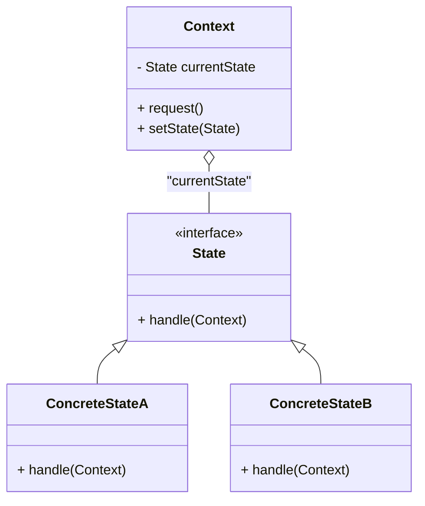
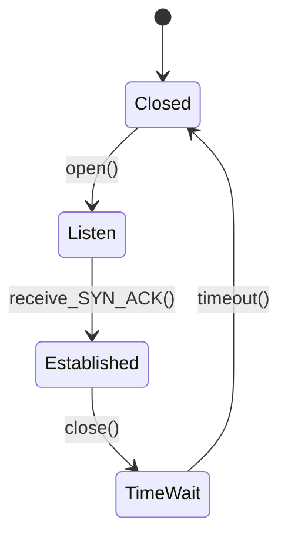
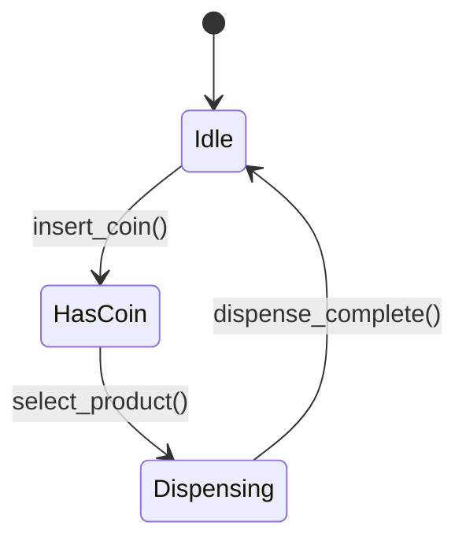

# State Pattern: Technical Primer

## Introduction

The State Pattern is a behavioural design pattern that enables an object to alter its behaviour when its internal state changes. This pattern encapsulates state-specific behaviour into separate state objects and delegates state-dependent operations to the current state object, thereby allowing the context object to exhibit different behaviour without altering its code.

The State Pattern is particularly useful for objects that must behave differently depending on their current internal state, when the state transitions are clearly defined, and when the logic for handling these states would otherwise result in complex, monolithic conditional statements.

## Technical Context and Motivation

In software engineering, it is common to encounter objects whose operations depend on an internal mode or state. Classic examples include parsing tokens, user authentication workflows, connection sessions, and finite state machine implementations. Without a structured approach, such logic tends to be implemented using large conditional blocks (e.g., `switch` or `if/else` chains), leading to code that is difficult to read, maintain, or extend.

The State Pattern addresses this by promoting the following key principles:

- **Encapsulate state-specific behaviour in dedicated classes.**
- **Allow the context to change its active state at runtime.**
- **Localize state transitions and logic to avoid scattering across the codebase.**

The State Pattern is defined in the classic "Gang of Four" (GoF) design patterns book and falls within the behavioural category of design patterns, which are concerned with algorithms and the assignment of responsibilities between objects.

## Core Concepts and Architecture

### Participants

The State Pattern involves the following primary participants:

- **Context:** The class whose behaviour varies with its state. The context maintains a reference to a state instance that represents its current state.
- **State (Abstract or Interface):** Declares an interface for encapsulating the behaviour associated with a particular state of the context.
- **ConcreteState:** Implements behaviour associated with a state of the context.

#### Mermaid Class Diagram: State Pattern Structure



### Workflow and Behaviour

- The **Context** holds an instance of a **ConcreteState** subclass representing its current state.
- Client objects interact with the context exclusively, triggering state-specific behaviour through context methods.
- The context delegates request handling to the current state. State objects may instruct the context to transition to a different state.
- State transitions are made explicit, controlled, and potentially encapsulated within state methods.

This approach eliminates the need for long, complex conditional statements in the context and decouples state-specific behaviour into modular, extensible components.

## Example: TCP Connection State

A practical example can be found in TCP connection management, where a connection object may be in states such as **Closed**, **Listen**, **Established**, and **TimeWait**, each with its own response to incoming events (e.g., receiving a SYN or ACK).

Without the State Pattern:

- The connection class contains extensive `switch` logic for every event.
- Adding a new state or modifying transitions requires invasive changes.

With the State Pattern:

- Each state (e.g., Closed, Listen, Established) is its own class.
- Modifications to state logic are confined to state classes, improving local reasoning.

#### Mermaid State Diagram: TCP Connection States (Simplified)



## Implementation Variations

### Classic Implementation

- **State Interface**: One abstract base class or interface for all states.
- **Context Ownership**: Context holds exactly one reference to a state at any time, delegating method calls.
- **State Transitions**: State objects may instruct the context to transition states (by calling `setState` with a new state).

### Singleton State Objects

Since states are often stateless or have immutable data, state objects may be implemented as singletons to reduce object creation overhead.

### Functional and Modern Language Variations

Languages supporting first-class functions or polymorphism (e.g., Kotlin, Scala, JavaScript) may use closures, function references, or algebraic data types to represent states and transitions, reducing boilerplate.

### State Context Sharing

In some scenarios, multiple contexts may share state objects or transition tables, especially in resource-constrained environments.

## Comparison to Similar Patterns

- **Strategy Pattern:** Both use composition to delegate behaviour, but the Strategy Pattern allows the client to choose the algorithm, while the State Pattern allows the internal state of the context to determine behaviour.
- **Finite State Machine (FSM):** The State Pattern provides an object-oriented approach to finite state machines, localizing state behaviour.

## State Pattern in Practice

### Integration Points

- **Frameworks:** Often integrated into workflow engines, parsers, UI state management systems, connection/session handlers, and protocol implementations.
- **Testing:** State objects can be tested in isolation.

### Performance Considerations

- **Object allocation:** Excessive state object creation can be avoided by using stateless singleton instances.
- **Dispatch overhead:** Delegation adds a level of indirection; negligible in most practical uses, but should be considered in performance-critical code.

### Implementation Challenges and Pitfalls

> **Warning**
> Be cautious when allowing direct transitions between arbitrary state objects. Ensure state transitions are valid and defined, ideally modelling them as enumerated or graph-based transitions.

- **State Explosion:** Too many state classes can result in code bloat or unmanageable complexity. Proper abstraction and, where appropriate, combining states may be necessary.
- **Transition Logic Leakage:** Avoid embedding context-specific logic in the state classes; transitions should remain within the domain of the context or be defined clearly as part of the protocol.
- **Circular References:** Ensure proper memory management if context and states have circular references, especially in languages with manual memory management.

### Extensibility and Maintainability

Key benefits include improved maintainability and extensibility:

- Adding or modifying state-specific behaviour does not impact context or other states.
- The code adheres to the Open/Closed Principle.
- Behaviour can be dynamically modified at runtime.

## Practical Example: Vending Machine

Suppose we implement a simple state-driven vending machine with the following states:

- **Idle**: Awaiting coin insertion.
- **HasCoin**: Waiting for product selection.
- **Dispensing**: Dispensing selected product.

#### Mermaid State Diagram: Vending Machine



**Class Structure (Pseudocode Example):**

```plaintext
VendingMachine (Context):
    - currentState: VendingMachineState

VendingMachineState (Interface):
    + insertCoin()
    + selectProduct()
    + dispenseComplete()

IdleState, HasCoinState, DispensingState (each implements VendingMachineState)
```

Each state class only implements the logic relevant to its state and its legal state transitions.

## Engineering Considerations

### Integration with Finite State Machines

The State Pattern provides an object-oriented implementation of FSMs. For complex or formally defined protocols, table-driven approaches or formal FSM libraries may be preferred, but the State Pattern is ideal when:

- Each state has complex, cohesive logic.
- Transitions are not strictly regular or involve side effects.
- States can be reused across contexts or configured at runtime.

### Thread Safety

> **Caution**
> If the context object is accessed concurrently (e.g., in multi-threaded environments), care must be taken to ensure state transitions and method calls are thread-safe. Immutable state instances and synchronized state transitions can be helpful.

### Logging, Instrumentation, and Debugging

Implementations can benefit from:

- Logging state transitions.
- Keeping a history of state changes for debugging or auditing.
- Instrumenting state entry, exit, and transition events.

### Serialization and Persistence

For long-lived objects or distributed systems, it may be necessary to persist context state. This can involve:

- Saving the current state identifier.
- Restoring the correct state object upon deserialization.
- Handling transitions that might have occurred during message delivery or downtime.

## Example Code (Java-Like Pseudocode)

```java
// State Interface
public interface State {
    void handle(Context ctx);
}

// Concrete States
public class StateA implements State {
    public void handle(Context ctx) {
        // Handle state-specific logic
        ctx.setState(new StateB());
    }
}

public class StateB implements State {
    public void handle(Context ctx) {
        // Handle state-specific logic
        ctx.setState(new StateA());
    }
}

// Context
public class Context {
    private State currentState;
    public Context(State initial) {
        this.currentState = initial;
    }
    public void request() {
        currentState.handle(this);
    }
    public void setState(State state) {
        this.currentState = state;
    }
}
```

This example illustrates how the state can be switched dynamically at runtime, encapsulating behaviour changes without requiring the context to manage state logic directly.

## Common Variations

- **Table-Driven State Pattern:** Instead of classes, states and transitions are defined in lookup tables (maps), routing events to handlers or closures. Useful when behaviour is simple and much of it can be shared.
- **Hierarchical State Models:** For systems with many states sharing behaviour, hierarchical (composite) state patterns can be used, allowing for inheritance of common logic.

## Summary

The State Pattern is a foundational behavioural design pattern that enables objects to change their behaviour dynamically based on internal state, with clean separation of concerns and clear extensibility. It serves as an object-oriented foundation for finite state machines and is widely applicable in protocol handlers, workflow systems, user interface logic, and anywhere complex state-dependent behaviour is encountered.

By encapsulating each state as an explicit, first-class object, engineers gain flexibility in managing state complexity, improving code maintainability and enhancing the ability to accommodate change without introducing errors or undue coupling.

> **Tip**
> Use the State Pattern when an object’s behaviour changes substantially depending on state, and when replacing complex conditional logic with polymorphism provides significant maintainability and clarity benefits.