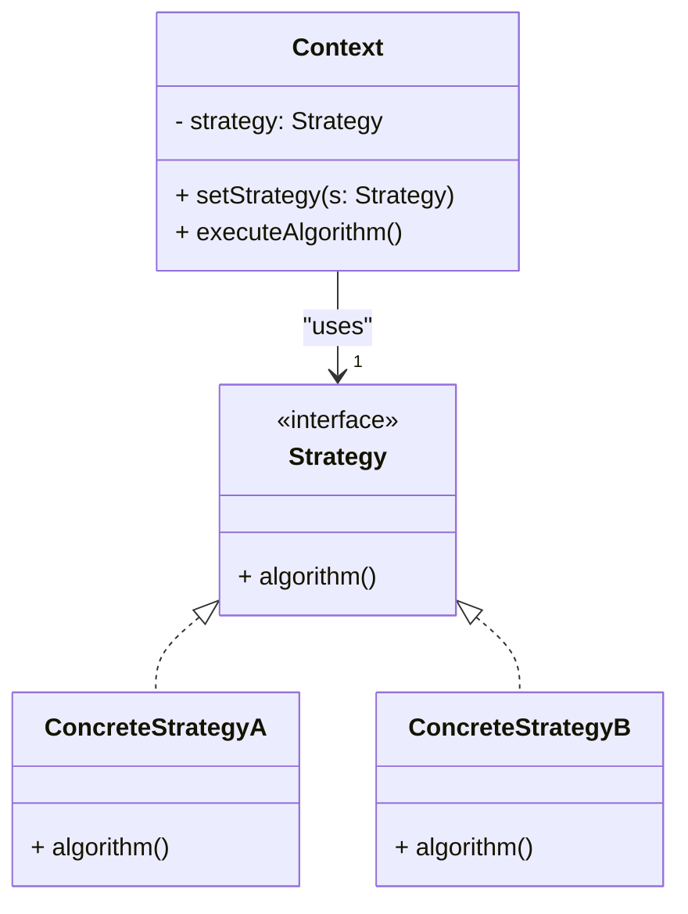
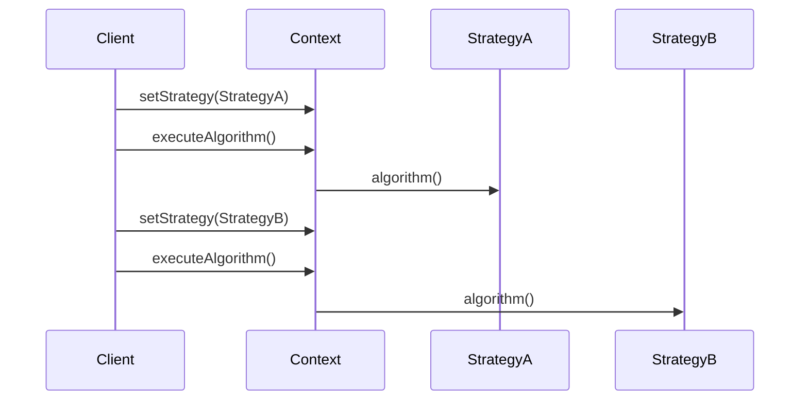

# Strategy Pattern: A Technical Primer

## Introduction

In software engineering, behavioral design patterns are essential in managing algorithms, relationships, and responsibilities among objects. The **Strategy Pattern** is a seminal behavioral pattern that enables an application to define a family of algorithms, encapsulate each one as a separate class, and make them interchangeable within a context at runtime. This architectural pattern decouples the specific algorithm from the context, allowing the behavior to be selected dynamically and promoting flexibility, scalability, and maintainability.

The Strategy Pattern addresses the problem of conditional logic proliferation, algorithm selection rigidity, and code duplication that often arises when multiple behaviors are implemented within a single class. The pattern is widely used in frameworks, libraries, and system designs that require runtime adaptability and extensibility of algorithms without modifying the context in which they operate.

## Core Concepts and Architecture

### Intent and Applicability

The Strategy Pattern enables an object (the **Context**) to delegate an operation to a **Strategy** object, which defines a specific algorithm or behavior. This allows the implementation of an algorithm to vary independently from the Context that uses it.

**Use Cases:**
- Applications requiring runtime selection among multiple algorithms (e.g., sorting, compression, data validation).
- Elimination of complex conditional statements (such as `if`, `switch`) that choose between different behaviors.
- Encapsulating behaviors so they can evolve independently and be reused in other contexts.

### Key Components

The Strategy Pattern consists of three main components:

1. **Strategy Interface (or Abstract Class):** Defines the contract (common interface) for all supported algorithms.
2. **Concrete Strategies:** Implement the Strategy interface, each providing a different algorithm or behavior.
3. **Context:** Maintains a reference to a Strategy object and delegates executing behaviors to it.

**Mermaid Diagram: Strategy Pattern Class Structure**



### Interaction Workflow

The core workflow for the Strategy Pattern is as follows:
1. **Strategy Definition:** All algorithms implement a common interface.
2. **Strategy Assignment:** The Context is configured with a specific Strategy (either via constructor injection, setter, or other means).
3. **Delegation:** When the Context needs to perform the operation, it delegates to the Strategy.
4. **Runtime Change:** The Strategy can be changed at runtime, altering Context behavior without code modification.

## Implementation Details

### Example: Sorting Algorithms

Suppose you have a sorting utility that should support multiple sorting algorithms:

- **Strategy Interface:** `SortStrategy` with a method `sort(List<T> data)`.
- **Concrete Strategies:** `QuickSortStrategy`, `MergeSortStrategy`, etc.
- **Context:** `Sorter` class holding a reference to `SortStrategy`.

**Sample implementation in pseudo-code:**

```java
// Strategy Interface
public interface SortStrategy {
    void sort(List<T> data);
}

// Concrete Strategies
public class QuickSortStrategy implements SortStrategy {
    public void sort(List<T> data) { /* quick sort logic */ }
}

public class MergeSortStrategy implements SortStrategy {
    public void sort(List<T> data) { /* merge sort logic */ }
}

// Context
public class Sorter {
    private SortStrategy strategy;
    
    public Sorter(SortStrategy strategy) {
        this.strategy = strategy;
    }
    public void setStrategy(SortStrategy strategy) {
        this.strategy = strategy;
    }
    public void sort(List<T> data) {
        strategy.sort(data);
    }
}
```

### Dynamic Strategy Selection

The ability to change strategies at runtime may be crucial in contexts such as:

- User-configurable preferences (e.g., compression versus speed).
- Adapting to environmental constraints (e.g., memory or CPU availability).
- Testing different algorithms under the same framework.

### Thread Safety Considerations

When using the Strategy Pattern in multi-threaded environments, it is essential to ensure that the Strategy object is either immutable or not shared unsafely across threads.

> **Warning**
> Mutable, shared strategies can result in race conditions. Ensure strategies are stateless or each thread has its own instance.

## Common Variations and Related Patterns

### Strategy vs. State Pattern

While both patterns encapsulate behavior and support switching at runtime, their intent differs:

- **Strategy Pattern:** Client explicitly changes the algorithm based on the context.
- **State Pattern:** Object changes its behavior automatically based on its internal state.

### Strategy and Command Pattern

Both patterns encapsulate an action, but the Command Pattern typically focuses on parameterizing objects with operations, supporting undo/redo, logging, and transaction management. Strategy is focused purely on interchangeable algorithms.

### Strategy in Functional Programming

Languages with first-class functions or lambda expressions often leverage function pointers, delegates, or higher-order functions rather than the object-oriented Strategy pattern. However, the underlying principle—passing behavior as data—remains consistent.

### Policy Injection and IoC Integration

Strategy pattern integrates well with Inversion of Control (IoC) frameworks, such as Spring or Guice, by injecting different strategies based on configuration or environment.

> **Tip**
> Dependency Injection frameworks can automate strategy instantiation and selection, reducing coupling between context and specific strategies.

## Architectural and Engineering Considerations

### Integration Points

- **Application Logic:** Used to decouple decision logic and enable flexible algorithm swapping.
- **Plug-in Systems:** Allows third-party or late-bound strategies to be registered or discovered at runtime.
- **API Design:** Exposing strategy setters or using the Strategy pattern as part of public API design can promote flexibility and future extensibility.

### Performance Implications

- **Indirection Overhead:** Adds a layer of abstraction that may introduce minimal runtime overhead (virtual function dispatch, indirection).
- **Object Creation:** Frequent creation of strategy objects can impact performance if not managed properly. Reuse strategies where appropriate.
- **Interface Contracts:** Introduce interface method invocation, which may impact very low-latency implementations (typically negligible in most applications).

### Implementation Challenges

- **Strategy Proliferation:** Care must be taken to avoid overusing the pattern, resulting in too many trivial strategies. Group related algorithms where appropriate.
- **Strategy-Context Coupling:** Context should rely only on the strategy interface and avoid assumptions about concrete implementations.
- **Parameter Sharing:** If a strategy requires parameters not available in the context, consider redesigning to avoid leaking context-specific data into the strategy.

### Common Pitfalls

> **Caution**
> Do not expose context internals to strategies or vice versa. The pattern is designed to promote *separation of concerns*.

> **Alert**
> Adding or removing a strategy at runtime may have system-wide effects if clients expect certain invariants. Design robust fallback and error-handling mechanisms.

## Constraints and Assumptions

- **Algorithm Interface Consistency:** All strategies must adhere to the same interface or contract. This ensures seamless interchangeability.
- **Statelessness Preferred:** Strategies should ideally be stateless to maximize safety and reusability.
- **Single Responsibility:** Use strategy for well-defined, cohesive algorithms. Avoid leaking unrelated logic into strategy objects.

## Real-World Applications

- **Sorting Libraries:** Java’s `Comparator`, Python’s custom key functions in `sorted()`, and C++’s function objects.
- **UI Layouts:** Calculating layout strategies (e.g., grid, flow, flex).
- **Compression:** Swappable compression algorithms (e.g., ZIP, GZIP, BZIP2).
- **Authentication:** Pluggable authentication mechanisms (e.g., OAuth, JWT, LDAP).
- **Game Development:** NPC behaviors, AI strategies.

## UML and Sequence Visualization

### Strategy Selection and Execution Sequence



## Design Guidelines and Best Practices

- **Interface First:** Always program to the strategy interface, not implementation.
- **Encapsulation:** Do not let strategies access context internals unnecessarily.
- **Discovery and Registration:** Use registries or IoC containers for runtime discovery and selection.
- **Testing:** Strategies are easy to unit test individually, as they are decoupled from context.
- **Extensibility:** Adding new algorithms should not require modifying existing context or strategy interfaces.

## Summary Table: Strategy Pattern Characteristics

| Feature                       | Details                                                                                      |
|-------------------------------|----------------------------------------------------------------------------------------------|
| Purpose                       | Encapsulate interchangeable algorithms independent of their clients                          |
| Key Components                | Strategy Interface, Concrete Strategies, Context                                             |
| Patterns Related              | State Pattern, Command Pattern                                                               |
| Common Use Cases              | Sorting, authentication, formatting, compression, AI behaviors                              |
| Language Support              | OOP: Direct, with interfaces/classes; FP: via lambdas, higher-order functions               |
| Implementation Complexity     | Low to Moderate                                                                              |
| Typical Pitfalls              | Overuse, strategy-context coupling, unsafe state sharing                                     |
| Runtime Overhead              | Minimal for most use cases                                                                   |

## Conclusion

The Strategy Pattern is a cornerstone behavioral design pattern providing runtime flexibility to choose among various algorithms while promoting separation of concerns, maintainability, and extensibility. Its judicious application leads to cleaner, more modular, and scalable codebases by abstracting away algorithm selection from clients and contexts. When integrated thoughtfully, it minimizes conditional complexity, facilitates algorithm evolution, and enables sophisticated behaviors in dynamic systems.

Use the Strategy Pattern to address algorithm selection challenges, facilitate testing and code reuse, and maintain open systems that can evolve without excessive code modification. As with all design patterns, apply it in scenarios where the underlying problem-space merits such abstraction, balancing flexibility with architectural clarity.