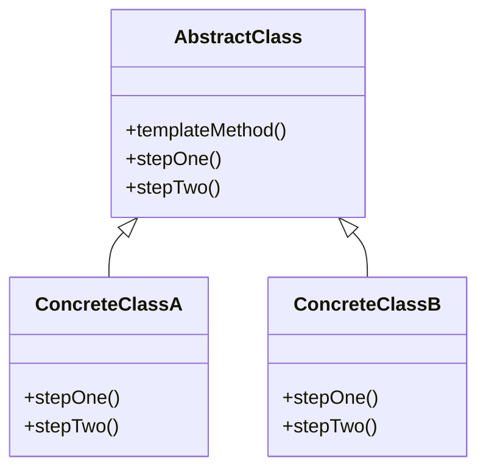
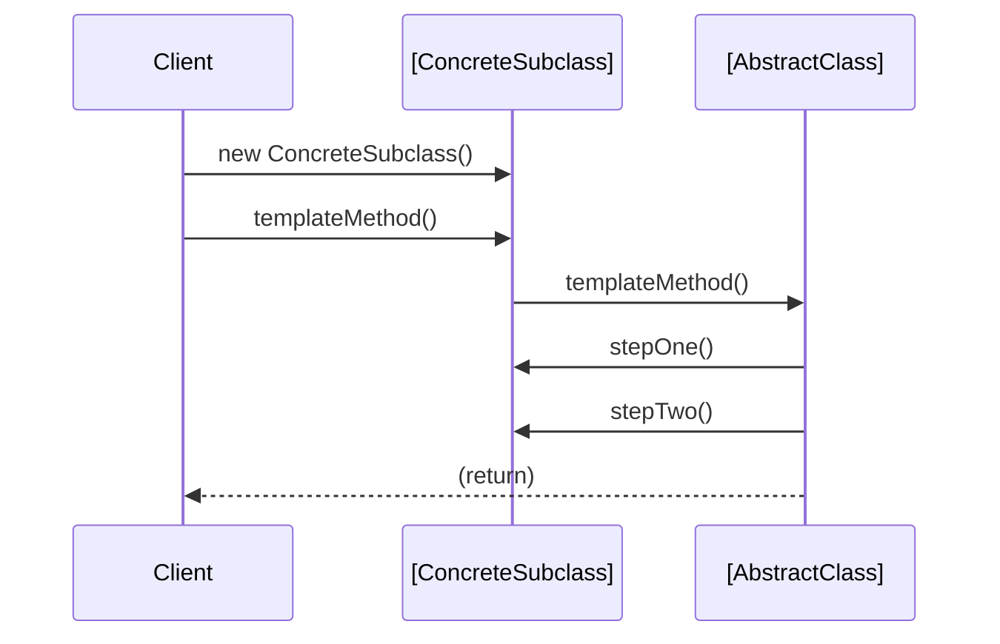
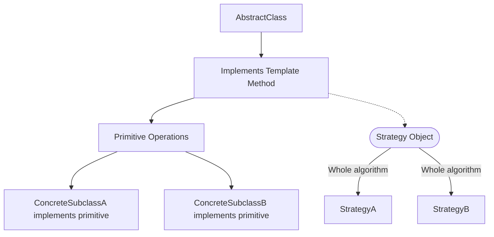

# Template Method Pattern

## Introduction

The Template Method Pattern is a classic design pattern in software engineering. It addresses the problem of defining the skeleton of an algorithm in an operation, deferring some steps to subclasses without altering the overall structure of the algorithm. First described by the “Gang of Four” (GoF) in *Design Patterns: Elements of Reusable Object-Oriented Software*, it is classified as a behavioral pattern due to its focus on varying parts of an object’s behavior.

Template Method excels in scenarios where an algorithm structure must be reused across different contexts, but some steps require semantic customization. By leveraging inheritance, the pattern promotes code reuse, enforces consistency, and centralizes the “invariant” control flow.

## Core Concepts

### Role and Structure

At its core, the Template Method Pattern involves:

- **Abstract Class (or Base Class):** Defines the overall structure of the algorithm as a “template method” (typically a concrete method), calling a series of operations—some of which are implemented in the abstract/base class and others left as abstract or “hook” methods.
- **Concrete Subclasses:** Implement the customizable steps required by the algorithm (“primitive operations”).
- **Template Method:** The defining method that sequences algorithm steps, some fixed and some variable.

This structure achieves *inversion of control*: the abstract class determines and manages algorithm flow, while subclasses supply details.

### UML Representation



*Diagram: Template Method class hierarchy*

## Key Components

1. **Template Method**

    - Defines the fixed sequence of algorithmic steps.
    - Typically `final` in Java or `non-overridable` in C# to prevent alteration by subclasses.
    - Calls “primitive operations,” some of which may be abstract or have default implementations.

2. **Primitive Operations**

    - Abstract or virtual methods representing customizable steps.
    - Must be implemented by subclasses to supply step-specific behavior.

3. **(Optional) Hook Methods**

    - Provide extensibility points that subclasses can override but are not required to.
    - Often use default (empty) implementations.

## Pattern Mechanics

The Template Method pattern applies the following logic:

- The core algorithm sequence is centralized and fixed.
- Essential steps are abstracted into operations for later customization.
- Subclasses avoid having to re-implement boilerplate or invariant logic.
- Variation is achieved via enforced subclassing.

**Example Pseudocode**

```java
abstract class DataProcessor {
    // Template method (defined sequence)
    public final void process() {
        readData();
        processData();
        writeData();
    }

    // Primitive operations
    protected abstract void readData();
    protected abstract void processData();

    // Optional method with default implementation
    protected void writeData() {
        System.out.println("Writing data to default output");
    }
}

class CsvDataProcessor extends DataProcessor {
    protected void readData() { /* logic to read CSV */ }
    protected void processData() { /* specific data processing */ }
}

class XmlDataProcessor extends DataProcessor {
    protected void readData() { /* logic to read XML */ }
    protected void processData() { /* specific data processing */ }
    protected void writeData() { /* customized write logic */ }
}
```

## Architectural Context and Technical Placement

Template Method’s principle of “define the algorithm, defer steps” enables cross-cutting control of process flow in use cases such as:

- File parsing and generation (CSV, XML, JSON, etc.)
- Network protocol handlers (e.g., handshake, data exchange, teardown)
- Framework-level execution hooks (e.g., the “render” pattern in web view rendering engines)
- Batch jobs and ETL pipelines
- Transactional workflows and phased computations

It is a foundational pattern for frameworks, where “Hollywood Principle” (“Don’t call us, we’ll call you”) is central.

## Workflow Illustration

### Sequence Diagram: Typical Usage



*Diagram: Method invocation flow in Template Method pattern*

## Practical Implementation

### Typical Workflow

1. **Define the Core Algorithm**  
    The abstract/base class implements the template method, composing a fixed series of steps.

2. **Mark Variability Points**  
    Identify steps that vary and declare these as abstract or virtual methods (primitive operations) to be implemented by subclasses.

3. **Optional Hooks**  
    Supply optional, overridable hooks for extensibility (e.g., “before” or “after” behaviors).

4. **Subclass and Implement**  
    Create subclasses to fulfill specific behaviors for each primitive operation.

5. **Instantiate and Execute**  
    Clients instantiate the appropriate subclass and call the template method.

### Code Example: Python

```python
class DataTransformer:
    def transform(self):
        self.load()
        self.clean()
        self.analyze()
        self.export()

    def load(self):
        raise NotImplementedError

    def clean(self):
        raise NotImplementedError

    def analyze(self):
        print("Default analysis")

    def export(self):
        print("Default export")

class CsvTransformer(DataTransformer):
    def load(self):
        print("Loading CSV data")
    def clean(self):
        print("Cleaning CSV data")

class JsonTransformer(DataTransformer):
    def load(self):
        print("Loading JSON data")
    def clean(self):
        print("Cleaning JSON data")
    def export(self):
        print("Exporting to JSON")
```

## Integration Points and Engineering Considerations

### Integration With Frameworks

The Template Method pattern is most effective when base classes are tightly coupled with a central process (e.g., application lifecycle, request/response pipeline, batch jobs). Notable frameworks using this pattern:

- **JUnit:** Test case execution (`setUp`, `tearDown` are hooks for user code)
- **Spring/JavaEE:** Lifecycle hooks in beans/services
- **Django:** Class-based views employ template methods for `get`, `post` workflows

### Performance & Scalability

The pattern itself is neutral regarding performance. However,

- **Excessive inheritance and template usage can lead to deep hierarchies**, increasing cognitive load and potentially impeding code maintainability.
- **Final methods (in languages such as Java)** protect the core template from unintended overrides, improving robustness.
- **Excessive hooks** can lead to fragile base class problems if contract is unclear.

### Common Pitfalls

> [!CAUTION]
> Avoid “fragile base class” syndrome. If the base class is modified (e.g., adding new steps or changing the order), dependent subclasses may break in unexpected ways.

> [!TIP]
> Use clear, well-documented extension points and a minimal, stable set of primitive operations.

- Subclasses must be aware of contract obligations for each primitive operation.
- Unclear naming or excessive optional steps can reduce code readability and cause ambiguity.

### Variations

Several modifications and related patterns are frequently encountered:

- **Hooks with Default Implementations:** Not all algorithm steps require subclass involvement—hooks allow optional override.
- **Functional or Strategy Injection:** Instead of subclassing, some languages (e.g., JavaScript, Python) allow function-passing or mixins for variable steps.
- **Parallel to Strategy Pattern:** Strategy enables replacement of entire algorithms, while Template Method structures the algorithm and only allows selected steps to vary.



*Diagram: Contrast between Template Method (left) and Strategy (right)*

## Constraints and Assumptions

- Assumes use of inheritance-based polymorphism (interface or abstract class).
- Typically favored in statically-typed, class-based languages (Java, C#, C++, etc.), although patterns can be simulated in dynamically-typed languages.
- Relies on the subclass contract to faithfully implement variable steps.
- Encapsulation may be partially broken if subclasses require protected base class methods or internal state access.

## Real-World Applications

- **Compilers and Interpreters:** Parsing and code generation phases follow a fixed sequence with customizable handlers.
- **ETL/Data Pipelines:** Templates for loading, transforming, and exporting data.
- **Web Frameworks:** Request/response flow, with overridable hooks for middleware or view logic.
- **Network Protocol Implementations:** Template for connection setup, data transfer, and teardown phases.

## Related Patterns

- **Strategy Pattern:** Substitutes entire algorithms at runtime (composition over inheritance); more flexible but requires explicit delegation.
- **Factory Method:** Often used in conjunction with Template Method for the creation step within a process.
- **Decorator Pattern:** Useful for adding responsibilities dynamically, not necessarily structuring algorithms.

## Alternatives and Modern Considerations

- *Composition vs. Inheritance*: Modern languages often encourage favoring composition (passing behavior as delegates/closures) over inheritance, especially to avoid rigid hierarchies.
- *Interface Default Implementations*: Some languages allow interfaces to define default implementations and extension points, reducing the rigidity of traditional abstract classes.
- *Functional Approaches*: In functional programming, algorithms may be composed from higher-order functions rather than class hierarchies, reducing reliance on the pattern.

> [!NOTE]
> Diagram to be added later: Example batch job workflow with overridable steps in a real-world data processing system.

## Conclusion

The Template Method Pattern is a foundational tool for imposing structure on variant algorithms while promoting code reuse and reliability. While its inheritance-based approach has both strengths—centralized control, extensibility—and drawbacks—rigid hierarchies, fragile base classes—it remains prevalent in object-oriented frameworks and system architectures that require consistent, repeatable workflows with customizable sub-steps. For engineering teams, careful documentation of extension points and clear contracts for subclass implementation are essential to effective, maintainable use of this pattern. The Template Method is a central pillar among behavioral patterns and continues to influence both classic and modern architecture paradigms.