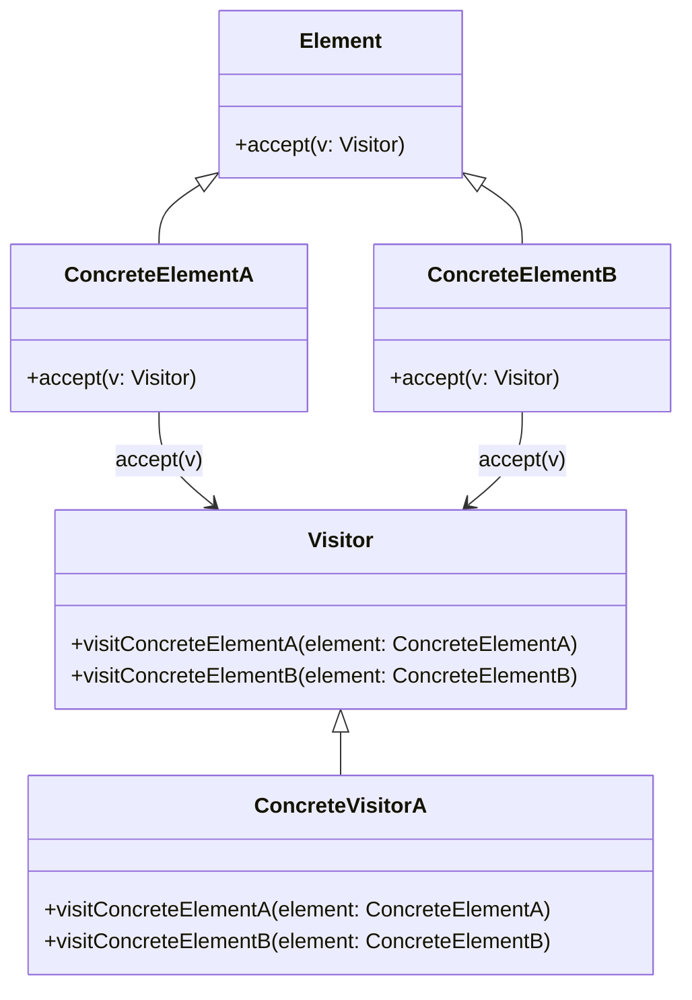
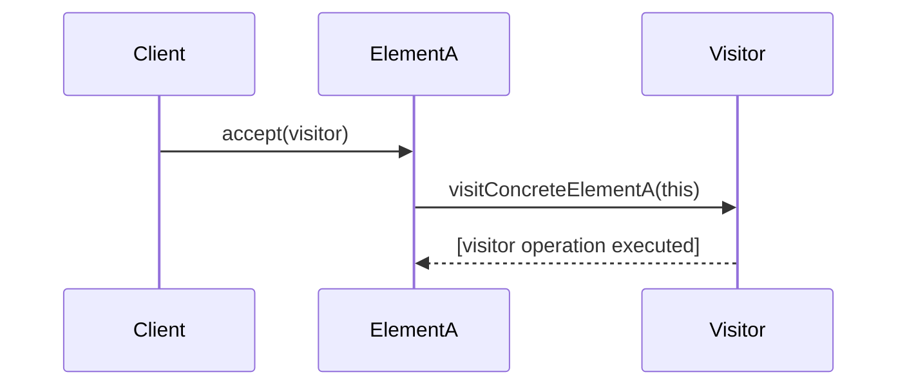

# Visitor Pattern: Technical Primer

## Introduction

The Visitor Pattern is a behavioral design pattern that enables adding new operations to existing object structures without modifying the structures. It achieves this by decoupling algorithms from the objects on which they operate, encapsulating the algorithms in separate visitor classes. This separation is particularly advantageous in complex object hierarchies where new operations must be added frequently, enabling compliance with the Open/Closed Principle (OCP) of SOLID design principles.

Predominantly used in scenarios like compiler design, syntax tree manipulation, and persistent object traversal, the Visitor Pattern is especially effective when an object structure is stable but individual operations evolve over time.

## Technical Context and Motivation

Modern software often requires supporting new operations over existing data structures without polluting the data structure’s codebase or causing maintenance issues. The Visitor Pattern responds to this need by:

- Centralizing operations associated with classes in disparate hierarchies
- Reducing code duplication when similar functionality is implemented for various classes
- Facilitating maintainability and scalability of codebases with complex object models

It is closely related to, and sometimes combined with, patterns such as Composite (for hierarchical structures) and Interpreter (for expression trees). The Visitor Pattern is also prevalent in frameworks that require traversing object graphs or processing heterogeneous collections.

## Core Concepts

### Participants and Relationships

The standard implementation of the Visitor Pattern involves the following primary components:

- **Visitor**: An interface or abstract class declaring a visit operation for each supported element type.
- **ConcreteVisitor**: Implements the operations, providing behavior for each element type.
- **Element**: An interface or abstract class declaring an `accept(visitor)` method, which accepts visitors.
- **ConcreteElement**: Implements the Element interface and defines how a visitor interacts with it.

#### UML Class Diagram (Mermaid)



**Explanation:**  
Each `Element` knows how to `accept()` a `Visitor`, and each `Visitor` knows how to `visit()` each concrete `Element`.

### Double Dispatch Mechanism

Traditional method calling uses single dispatch (runtime method selection based on the receiver’s type), but the Visitor Pattern employs double dispatch. That is, both the element and the visitor’s types determine the operation executed. This is essential for dynamic selection of behavior across both axes—object structure and visitor.

**Workflow Sequence Diagram (Mermaid)**



The client initiates traversal by sending an `accept()` call to an element, either directly or through iteration over a collection. The element then calls the appropriate `visit()` method on the visitor, passing itself (`this`) as a parameter.

---

## Implementation Details

### Basic Workflow

1. **Element Hierarchy**  
   Define an abstract element with an accept method, implemented by all concrete elements.
2. **Visitor Interface/Abstract Base**  
   Specify visit operations for every concrete element type.
3. **Concrete Visitors**  
   Implement custom operations for each element.
4. **Traversal & Invocation**  
   The client or a composite element iterates through element collections, invoking `accept(visitor)` on each, which in turn calls back into the visitor.

**Typical Traversal Example (pseudo-code):**

```java
class ConcreteElementA implements Element {
    void accept(Visitor v) {
        v.visitConcreteElementA(this);
    }
}
class Drawing implements Element {
    List<Element> children;
    void accept(Visitor v) {
        for (Element child : children) {
            child.accept(v);
        }
    }
}
```

### Common Variations

- **Composite + Visitor**:  
  Frequently, the Visitor pattern is coupled with the Composite pattern, enabling traversal over tree-structured objects. The element's `accept()` implementation invokes visitor logic on itself and then recursively on its children.

- **Reflection-based Visitors**:  
  Languages supporting reflection or runtime type information may implement more generic visitors, allowing dispatch logic to reside in visitor code, sometimes reducing boilerplate at the cost of type safety.

- **Return Values & Side Effects**:  
  While the pattern as originally formulated assumes void visitors (side-effect-only operations), alternative designs allow passing results back using generics or through return values.

- **Parameterization**:  
  Some advanced applications allow visitors to carry state from node to node. This can be achieved by introducing context or state parameters in `accept()` and `visit()` methods.

## Engineering Considerations

### Advantages

- **Separation of Concerns**:  
  Business logic for operations resides in visitor classes rather than in data structures, supporting single-responsibility and open/closed principles.

- **Easier Addition of Operations**:  
  Adding new functionality is accomplished by writing new visitors, not modifying existing class hierarchies.

- **Traversals over Complex Structures**:  
  Natural fit for manipulating data in graphs, expression trees, parse trees, and document object models (DOM).

### Drawbacks and Limitations

- **Adding New Element Types**:  
  Each addition to the element hierarchy necessitates updating every existing visitor, which can be laborious in systems where elements are more likely to change than operations.

- **Coupling to Concrete Types**:  
  The visitor needs to know about every concrete element type, introducing tight coupling between visitors and data objects. This may expose implementation details.

- **Violation of Encapsulation**:  
  If internal state of elements must be exposed for visitors, encapsulation can be compromised.

> :warning: **Warning**  
> The Visitor Pattern is most beneficial when the object structure is stable and operations change more frequently. Applying it when element types are unstable can dramatically increase maintenance overhead.

### Integration

- **API Surfaces**:  
  Expose a uniform `accept()` method on all elements.
- **Collections Support**:  
  Often coordinated with composite elements, enabling the visitor to traverse entire structures without manual iteration.
- **Language Support**:  
  Patterns relying on double dispatch can be more verbose in languages without multimethods (e.g., Java, C++), whereas languages with built-in pattern matching or multimethods (e.g., Clojure, Scala) may support more elegant approaches.

### Performance Implications

- **Polymorphic Calls**:  
  Design incurs the overhead of additional method invocations, though these are virtual-call dispatches, and typically negligible compared to application logic.
- **Inlining**:  
  Deep visitor chains may inhibit function inlining and compiler optimizations, depending on language and optimization strategies.
- **Memory Footprint**:  
  Additional classes for visitors and possible context objects can contribute to non-trivial code size increases in large hierarchies.

## Practical Example

### Abstract Syntax Tree (AST) Traversal

Consider a language interpreter or compiler with an AST representing expressions:

- `Literal`
- `Addition`
- `Multiplication`

Each node implements `accept(visitor)`.

```java
interface Visitor {
    void visitLiteral(Literal l);
    void visitAddition(Addition a);
    void visitMultiplication(Multiplication m);
}

interface Expr {
    void accept(Visitor v);
}

class Literal implements Expr {
    int value;
    void accept(Visitor v) { v.visitLiteral(this); }
}

class Addition implements Expr {
    Expr left, right;
    void accept(Visitor v) { v.visitAddition(this); }
}

class Multiplication implements Expr {
    Expr left, right;
    void accept(Visitor v) { v.visitMultiplication(this); }
}
```

Implement an **EvaluatorVisitor** to compute expression values:

```java
class EvaluatorVisitor implements Visitor {
    Stack<Integer> stack = new Stack<>();

    void visitLiteral(Literal l) { stack.push(l.value); }

    void visitAddition(Addition a) {
        a.left.accept(this);
        a.right.accept(this);
        stack.push(stack.pop() + stack.pop());
    }

    void visitMultiplication(Multiplication m) {
        m.left.accept(this);
        m.right.accept(this);
        stack.push(stack.pop() * stack.pop());
    }

    int getResult() { return stack.peek(); }
}
```

**AST Traversal Flow (Mermaid Diagram)**

```mermaid
graph TD
    A[EvaluatorVisitor] -->|accept| B[Literal]
    A -->|accept| C[Addition]
    A -->|accept| D[Multiplication]
    B -->|visitLiteral| A
    C -->|visitAddition (left/right)| B
    D -->|visitMultiplication (left/right)| B
```

---

## Common Use Cases

1. **Compilers and Interpreters**:  
   AST traversal for semantic analysis, code generation, optimization.
2. **Object Serialization**:  
   Persisting or transmitting object graphs by implementing serialization logic in visitors.
3. **GUI Hierarchies**:  
   Rendering or event propagation in UI component trees.
4. **Code Analysis and Instrumentation**:  
   Static analysis tools, profilers, and transformation utilities.

## Pattern Variants and Extensions

### Acyclic Visitor

To mitigate the need for every visitor to implement every element, some implementations use marker interfaces or default behavior, sacrificing type safety for extensibility.

### Multiple Visitors

It is possible to apply multiple visitors simultaneously, supporting multi-faceted traversals (e.g., validation + code generation). State must be managed carefully to avoid side-effects or inconsistent results.

### Reflective Visitor

Instead of static dispatch, reflective visitors use introspection to route calls—this results in somewhat looser coupling but forfeits compile-time safety.

## Comparison to Related Patterns

- **Strategy Pattern**:  
  Encapsulates one algorithm; Visitor encapsulates families of algorithms across object structures.

- **Composite Pattern**:  
  Visitor is often paired with Composite; Composite models tree structure, Visitor decouples operations.

- **Interpreter Pattern**:  
  Often built atop Composite and Visitor for AST manipulation.

## Design Guidelines and Best Practices

- **Keep Element Interfaces Stable**:  
  If element types evolve rapidly, avoid Visitor or be prepared for significant refactoring.
- **Cluster Related Operations**:  
  Cohesive groups of related operations (such as pretty-printing, code generation) should share visitors.
- **Prevent Leaky Abstractions**:  
  Avoid exposing internal state solely to enable visitor operations.

> :tip: **Tip**
> Use abstract adapters or default implementations to reduce boilerplate visitor code when element hierarchies are large and only a subset of visit operations are required.

## Conclusion

The Visitor Pattern is a robust solution for separating operations from data structures, affording enhanced flexibility and maintainability for evolving sets of operations over complex object hierarchies. While its adoption introduces ceremony and certain coupling challenges, its utility in cases such as AST traversal, object serialization, and UI frameworks is well established. Architects should choose the Visitor Pattern when the set of element types is stable, and extensibility in operations is a primary requirement, taking care to manage the associated trade-offs in code maintainability, evolution, and encapsulation.