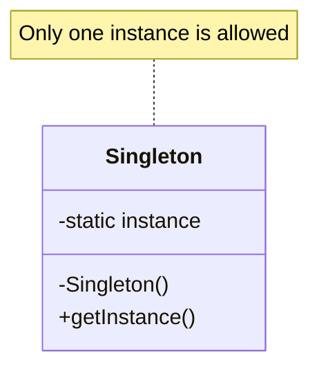
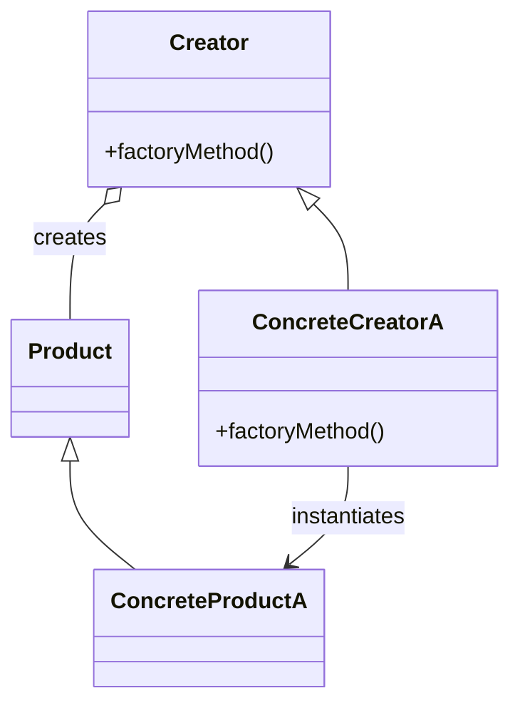
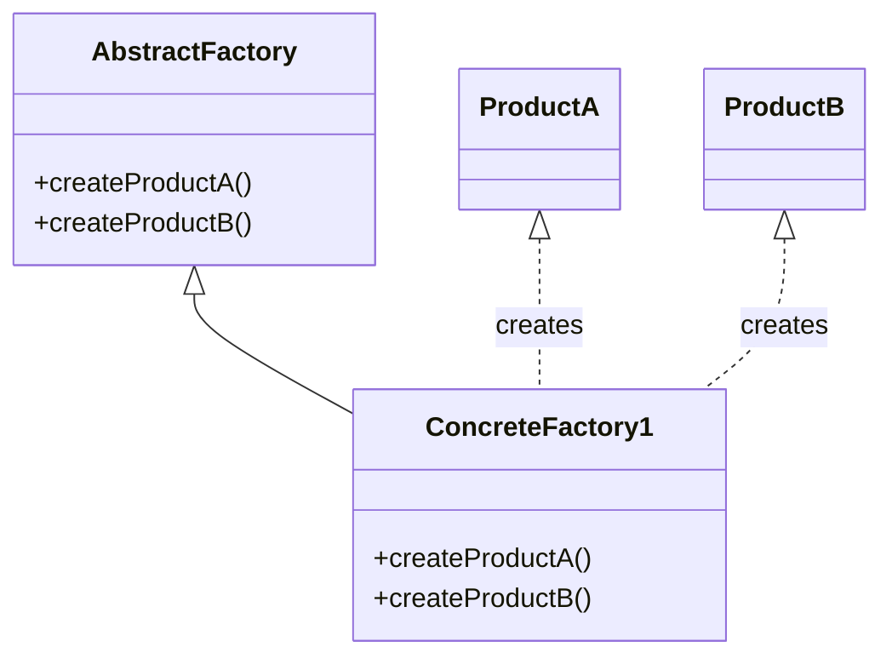
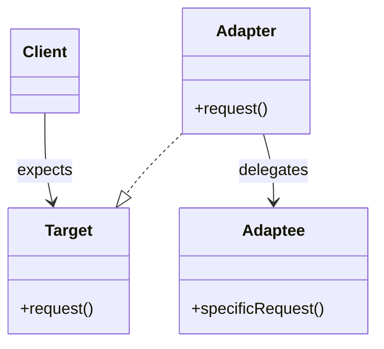
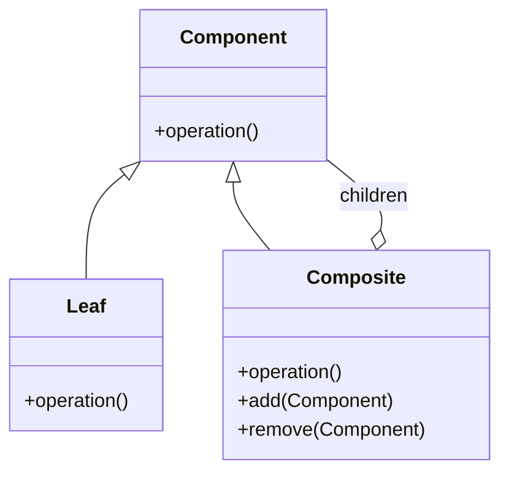
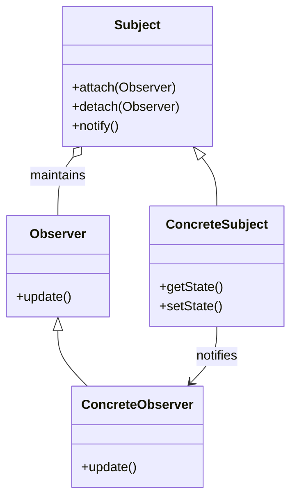

# Introduction

In software engineering, recurring problems often arise during the design of object-oriented systems. By identifying and codifying best practices into *design patterns*, engineers can utilize proven solutions rather than devising new ones each time such problems are encountered. The Gang of Four (*GoF*) design patterns refer to the foundational set of patterns introduced in the seminal book, _Design Patterns: Elements of Reusable Object-Oriented Software_ (1994) by Erich Gamma, Richard Helm, Ralph Johnson, and John Vlissides. These patterns present reusable templates for solving common software architecture challenges, promoting maintainable, flexible, and robust systems.

# Technical Context

Design patterns operate at the mid-level of abstraction. They are not concrete implementations, nor are they as generic as programming paradigms. Instead, they encapsulate best practices within the object-oriented paradigm — most notably as applied in languages such as Java, C++, C#, and Python — but the principles are also valuable in various modern, composite, or functional languages.

GoF design patterns are distinguished from architectural patterns (which govern the macroscopic organization of systems, e.g., Layers, MVC) and from idioms (which are language-specific low-level techniques). Patterns define object collaborations, roles, and structures, providing a vocabulary for engineers to reason about design trade-offs and codebase structure.

# Core Concepts and Classification

The GoF identifies 23 classic design patterns, grouped according to their purpose and nature:

- **Creational Patterns:** Concerned with object creation mechanisms, decoupling instantiation from system composition.
- **Structural Patterns:** Facilitate composition of classes and objects, ensuring flexible system organization by varying their structure.
- **Behavioral Patterns:** Concerned with communication between objects, encapsulating logic for complex workflows or responsibilities.

The table below summarizes this classification:

| Category          | Key Purpose                  | Example Patterns           |
|-------------------|-----------------------------|----------------------------|
| Creational        | Abstract object instantiation| Singleton, Factory Method  |
| Structural        | Compose objects and classes  | Adapter, Composite         |
| Behavioral        | Manage object interactions   | Observer, Strategy         |

# Creational Patterns

Creational patterns abstract the process of instantiating objects. By delegating object creation to specific methods or components, they provide increased flexibility and encapsulation. This reduces coupling to concrete classes and isolates system components from implementation changes.

## 1. Singleton

Ensures a class has only one instance and provides a global access point for it. Commonly used for logging, configuration, or resource management components.

**Mermaid Diagram: Singleton Structure**



### Engineering Considerations

- **Thread-Safety:** Ensuring single instantiation under concurrent access may require synchronization.
- **Global State:** Overuse leads to tightly coupled code and potential issues with global mutable state.
- **Testing:** Singletons can complicate unit testing.

## 2. Factory Method

Defines an interface for creating an object, but allows subclasses to alter the type of objects that will be created.

**Mermaid Diagram: Factory Method Structure**



### Practical Use Cases

- Frameworks where components must instantiate user-provided or platform-specific objects.
- Libraries that decouple core logic from product variants.

## 3. Abstract Factory

Provides an interface to create families of related or dependent objects without specifying their concrete classes.

**Mermaid Diagram: Abstract Factory Structure**



### Engineering Notes

- Abstract Factories simplify object creation for frameworks and plug-ins, ensuring consistency among product families.
- Can be combined with Factory Method for greater extensibility.
- Overuse may introduce unnecessary indirection.

## 4. Builder

Separates the construction of a complex object from its representation, enabling different representations to be created with the same construction process.

**Use Case Example:** Constructing documents in multiple formats (e.g., PDF, HTML), or assembling configuration objects with optional parameters.

## 5. Prototype

Creates new objects by copying existing ones, rather than instantiating new ones from scratch. Useful for cases where object creation is costly or involves significant setup.

# Structural Patterns

Structural patterns ease the design of complex systems by defining simple ways to realize relationships among entities.

## 1. Adapter

Adapts an interface of a class into another interface expected by the client.

**Mermaid Diagram: Adapter Pattern**



### Engineering Considerations

- Facilitates integration with legacy code or third-party libraries.
- Can be implemented using class inheritance (class adapter) or object composition (object adapter).

## 2. Bridge

Decouples abstraction from its implementation, enabling them to vary independently.

**Typical Use Case:** GUI toolkits that support multiple operating systems.

## 3. Composite

Composes objects into tree structures to represent part-whole hierarchies. Clients treat individual objects and compositions uniformly.

**Mermaid Diagram: Composite Pattern**



### Engineering Considerations

- Simplifies client-side code by enabling uniform treatment of leaf and composite nodes.
- Recursion is often used for operations over composite structures.

## 4. Decorator

Dynamically adds responsibilities to objects without affecting other objects.

**Example Use Case:** Adding scrolling, borders, or logging to a UI component at runtime.

## 5. Facade

Provides a unified interface to a set of interfaces in a subsystem, simplifying its usage.

## 6. Flyweight

Uses sharing to efficiently support many fine-grained objects.

## 7. Proxy

Provides a surrogate or placeholder for another object, controlling access or adding functionality.

# Behavioral Patterns

Behavioral patterns encapsulate algorithms, workflows, and interactions among objects, promoting decoupled and flexible code.

## 1. Observer

Defines a one-to-many dependency, so that when one object changes state, all its dependents are notified and updated automatically.

**Mermaid Diagram: Observer Pattern**



### Typical Use Cases

- Event handling systems (UI frameworks, pub/sub); model-view synchronization.
- Reactive programming and real-time data propagation.

## 2. Strategy

Defines a family of algorithms, encapsulates each one, and makes them interchangeable.

**Use Case Scenario:** Sorting algorithms in a library; compression strategies.

## 3. Command

Encapsulates a request as an object, letting you parameterize clients with different requests, queue or log requests, and support undoable operations.

## 4. Chain of Responsibility

Passes a request along a chain of handlers, where each handler decides either to process the request or to pass it on.

## 5. Iterator

Provides a way to access elements of a collection sequentially without exposing its underlying representation.

## 6. Mediator

Defines an object that encapsulates communication between a set of objects, promoting loose coupling.

## 7. Memento

Captures and externalizes an object's internal state, so it can be restored later without violating encapsulation.

## 8. State

Allows an object to alter its behavior when its internal state changes.

## 9. Template Method

Defines the skeleton of an algorithm in a superclass but lets subclasses override specific steps.

## 10. Visitor

Separates algorithms from the objects on which they operate, enabling new operations without changing the classes.

# Application and Workflow

## Design Pattern Selection and Application

Engineers should select patterns based on observed design problems, not implementation-first. The typical workflow involves:

1. **Analyzing the Problem:** Identify commonality and variability in requirements or design.
2. **Mapping to Patterns:** Match problem profiles to known patterns, referencing GoF documentation.
3. **Integrating Patterns:** Apply the pattern structure, names, and roles across relevant classes and interfaces.
4. **Refinement:** Refactor code to fit pattern collaborations, abstracting as appropriate.
5. **Testing and Evaluation:** Validate that pattern use enhances maintainability, extensibility, and clarity without overengineering.

```mermaid
flowchart TD
    A[Identify recurring design problem]
        --> B[Review relevant GoF patterns]
        --> C[Match problem to suitable pattern(s)]
        --> D[Refactor/design classes for pattern roles]
        --> E[Test and review for fitness]
        --> F[Iterate or integrate with codebase]
```

## Integration Points and Interoperability

Patterns interact with one another:

- Composite and Decorator often combined for complex UI frameworks.
- Factory Method and Singleton may be used together for resource management.
- Observer and Mediator often found together in event-driven architectures.

Patterns are agnostic to specific frameworks but play crucial roles in the extensibility strategies for platforms like Java EE (e.g., Servlets use Factory Method; GUI toolkits use Observer and Composite).

# Implementation Challenges and Engineering Decisions

## Common Challenges

- **Pattern Overuse:** Applying patterns where a straightforward solution suffices leads to unnecessary abstraction and complexity.
- **Inappropriate Pattern Selection:** Choosing a pattern not fit for the problem can impede maintainability.
- **Premature Design:** Adopting patterns before understanding the actual problem requirements risks rigidity.

> [!WARNING]
> Excessive or inappropriate use of design patterns can introduce indirection and reduce system clarity, contradicting their original aim of simplification.

## Typical Pitfalls

- **Misunderstanding Pattern Intent:** Implementing patterns without understanding their motivation may produce anti-patterns.
- **Violation of SOLID Principles:** Patterns are often described with SOLID in mind, but poor implementation may still result in tightly coupled code.
- **Ignoring Testing Considerations:** Some patterns (Singleton, for example) complicate automated testing, necessitating extra care.

## Assumptions and Constraints

- Patterns assume familiarity with object-oriented concepts.
- Their usefulness is bounded by the language features (e.g., lack of multiple inheritance limits some pattern implementations).
- May not align with functional or data-oriented paradigms unless adapted.

## Performance Implications

- Patterns like Flyweight optimize memory at the cost of complexity.
- Decorator and Proxy introduce additional indirection and dynamic dispatch, impacting runtime performance.
- Singleton may become a bottleneck if not thread-safe.

# Standardization and Patterns in Practice

While there are no formal standardization bodies for design patterns, their structure provides a quasi-standard vocabulary for OO design. They are referenced in key documentation and are sometimes reflected in design notation (such as UML). They influence frameworks aligned with the following principles:

- **Separation of concerns**
- **Encapsulation**
- **Open/Closed Principle**
- **Inversion of Control**

# Modern Interpretations and Variations

Many GoF patterns remain highly relevant. However, trends such as dependency injection, aspect-oriented programming, and functional programming have resulted in adapted or alternative forms (e.g., use of lambdas for Command or Strategy; use of frameworks for Dependency Injection). Some object-oriented patterns are directly supported by language features in modern languages (sealed classes, records, mixins).

# Summary Diagram: Design Pattern Landscape

```mermaid
graph TD
    A[Creational Patterns] -->|object instantiation| F[Singleton]
    A --> G[Factory Method]
    A --> H[Abstract Factory]
    A --> I[Builder]
    A --> J[Prototype]

    B[Structural Patterns] --> K[Adapter]
    B --> L[Bridge]
    B --> M[Composite]
    B --> N[Decorator]
    B --> O[Facade]
    B --> P[Flyweight]
    B --> Q[Proxy]

    C[Behavioral Patterns] --> R[Observer]
    C --> S[Strategy]
    C --> T[Command]
    C --> U[Chain of Responsibility]
    C --> V[Iterator]
    C --> W[Mediator]
    C --> X[Memento]
    C --> Y[State]
    C --> Z[Template Method]
    C --> AA[Visitor]
```



# Conclusion

The GoF design patterns provide a powerful vocabulary and toolset for designing robust object-oriented systems. By applying these patterns judiciously—guided by real problems and engineering constraints—software engineers can craft systems that balance flexibility, extensibility, and maintainability. Understanding the intent, structure, trade-offs, and practical consequences of each pattern is essential for their effective use in modern software engineering.

> [!TIP]
> Continually reference real-world software problems and apply patterns only as necessary to maintain a pragmatic, maintainable architecture.