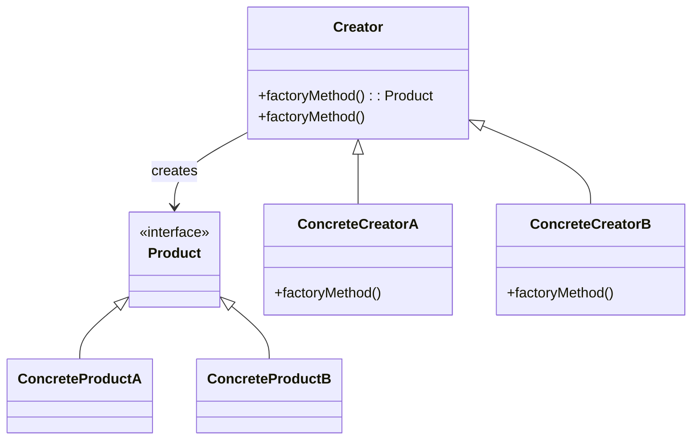
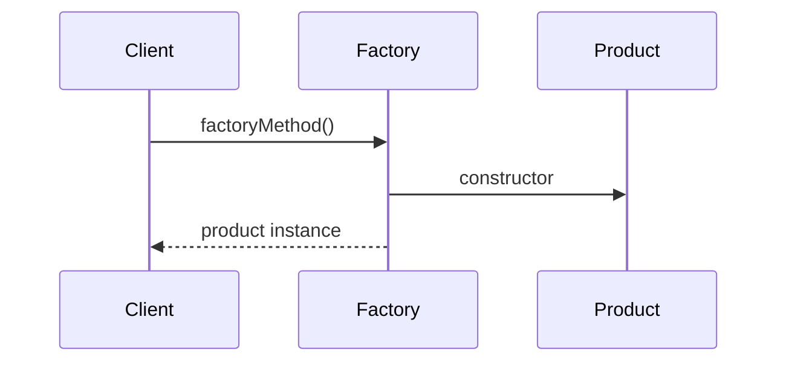
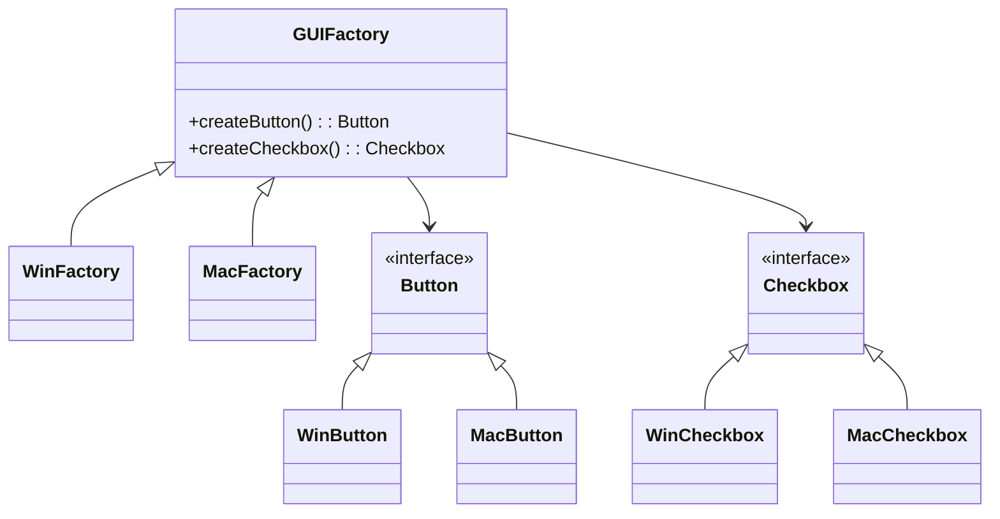
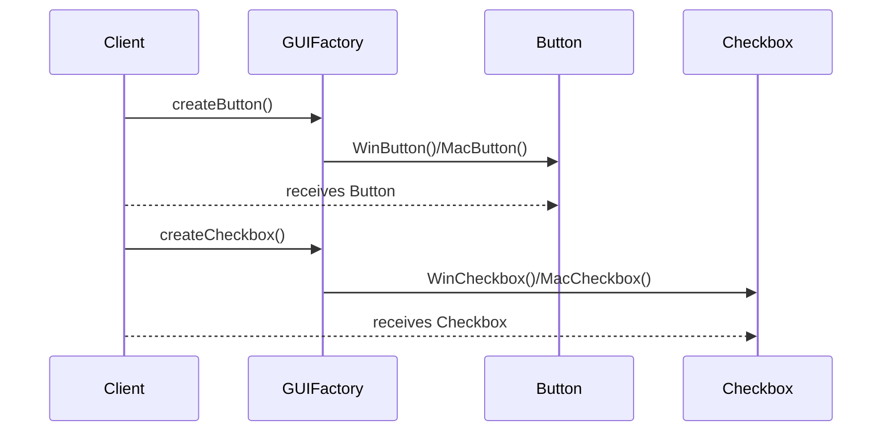

# Factory Pattern

## Introduction

The Factory Pattern is a key concept in object-oriented software design, categorized under creational design patterns. Its primary intent is to **encapsulate object creation**, allowing client code to delegate the instantiation of complex or variant objects to a dedicated "factory" component. This abstraction loosens coupling, promotes code reusability, and enhances system flexibility by localizing the construction logic.

## Technical Context

The Factory Pattern operates within the realm of design patterns established by the seminal "Gang of Four" (GoF) text, _Design Patterns: Elements of Reusable Object-Oriented Software_. In general, factory patterns underpin frameworks, libraries, and applications where concrete classes may vary based on runtime configuration, environment, or user input.

Factories are especially relevant in the context of interface-driven development, dependency injection, plugin architectures, and software addressing open-closed principle (OCP) requirements.

## Core Concepts and Components

### Participants in the Factory Pattern

1. **Product Interface (or Abstract Product)**  
   Defines the interface or abstract class that concrete products must implement.

2. **Concrete Products**  
   Implementations of the product interface, representing different object variants to be instantiated.

3. **Factory Interface (optional in Simple Factory)**  
   Specifies a method for creating objects.

4. **Concrete Factories**  
   Classes that implement the factory interface to construct specific product variants.

5. **Client**  
   The code that interacts with the factory rather than directly instantiating product classes.

### Key Variations

The Factory Pattern family includes:

- **Simple Factory (Static Factory Method)**  
  Not formally a GoF pattern, but represents the simplest decoupling: a static method encapsulates instantiation.

- **Factory Method (GoF)**  
  Delegates construction to a subclass of the creator, promoting extension over modification.

- **Abstract Factory (GoF)**  
  Provides an interface to create families of related objects, ensuring products are instantiated consistently.

#### Diagram: Factory Pattern Overview (Factory Method Variant)



## How the Factory Pattern Works

### Basic Operation

Instead of client code calling constructors directly, the client requests an instance from a factory. The factory encapsulates the creation logic and determines the appropriate concrete product to instantiate.

#### Sequence Example: Basic Factory Method Invocation



### Detailed Workflow

1. **Client invokes factory method**  
   Client code either receives a factory (commonly via dependency injection) or calls a static factory method.

2. **Factory determines the concrete type**  
   The factory applies decision logic (e.g., configuration parameters, environment) to select which product to instantiate.

3. **Product is constructed and returned**  
   The factory creates the product instance and hands it to the client, typically upcast to a common interface.

### Constraints and Assumptions

- Factories must expose a consistent interface for object creation.
- Factories should not expose implementation details of concrete products.
- Product construction may involve complex logic: caching, pooling, or dependency resolution.

### Typical Use Cases

- When a system must be independent of how its objects are created, composed, and represented.
- When the type of object to be created is determined at runtime or by context (localization, environment, user configuration).
- When enforcing consistency amongst families of related or dependent objects (Abstract Factory pattern).
- When applying the Dependency Inversion Principle; facilitating dependency injection.

## Common Implementations and Variations

### 1. Simple Factory

A static or singleton method encapsulates conditional construction logic, centralizing object creation.

**Example — Simple Logger Factory (Python):**
```python
class Logger:
    def log(self, message): pass

class FileLogger(Logger):
    def log(self, message):
        print(f"Write to file: {message}")

class ConsoleLogger(Logger):
    def log(self, message):
        print(f"Console: {message}")

class LoggerFactory:
    @staticmethod
    def get_logger(type: str) -> Logger:
        if type == 'file':
            return FileLogger()
        elif type == 'console':
            return ConsoleLogger()
        raise ValueError("Unknown logger type")
```

### 2. Factory Method (GoF)

Encapsulates instantiation in a method intended to be overridden by subclasses. The creator specifies an interface but not the exact class.

**Usage Pattern:**
```java
abstract class Dialog {
    public void renderWindow() {
        Button okButton = createButton();
        okButton.render();
    }
    public abstract Button createButton();
}

class WindowsDialog extends Dialog {
    public Button createButton() {
        return new WindowsButton();
    }
}

class LinuxDialog extends Dialog {
    public Button createButton() {
        return new LinuxButton();
    }
}
```

### 3. Abstract Factory

Used to create families of related objects, providing interfaces for creating each kind of product.



## Practical Engineering Considerations

### Integration Points

- **Dependency Injection Frameworks:**  
  Modern IoC containers (e.g., Spring, Guice) frequently use factories for constructing and injecting dependencies.

- **Plugin and Extension Systems:**  
  Factories are essential for instantiating unknown-at-compile-time modules or adapters.

### Performance Implications

- **Object Pooling:**  
  Factories may be extended to pool instances rather than creating anew, impacting memory and creation overhead.

- **Initialization Cost:**  
  Complex factory logic (reflection, I/O, configuration) may incur startup penalties.  
  Use lazy initialization or asynchronous factories for heavy operations.

### Implementation Challenges

- **Testing:**  
  Decoupling with factories enhances testability, as mocks can be injected in place of real factories.

- **Configurability:**  
  Too-generic factories can lead to overcomplicated configuration, harming readability and maintainability.

- **Discovery and Registration:**  
  Dynamically registering concrete products (via metadata, reflection) can further decouple systems but at the expense of greater runtime complexity.

### Common Pitfalls

> **Warning**
>
> Overusing factory patterns can lead to "factory hell", where layers of factories obscure program flow and complicate debugging.

> **Alert**
>
> Factories that breach encapsulation by exposing internal construction logic defeat the pattern's purpose.

### Best Practices

- Name factories clearly (e.g., `ProductFactory`, `WidgetFactory`).
- Return interfaces, not concrete classes.
- Avoid business logic in factories; focus on instantiation.
- Prefer parameter objects to excessive conditionals in factory methods.

## Comparing Factory Variations

| Pattern          | Flexibility       | Typical Use                   | Drawbacks                           |
|------------------|------------------|-------------------------------|-------------------------------------|
| Simple Factory   | Low/Medium       | Basic abstraction             | Not extensible, not strictly GoF    |
| Factory Method   | High             | Open/closed extension         | Requires subclassing                |
| Abstract Factory | Very High        | Families of related objects   | Increased complexity, indirection   |

## Factory Pattern in the Broader Pattern Ecosystem

- **Related Patterns:**
  - **Strategy Pattern:** Configures behaviors at runtime via factories.
  - **Dependency Injection:** Often uses factories as providers.
  - **Prototype Pattern:** Alternative for object cloning, not instantiation.
  - **Builder Pattern:** Used for step-wise complex object assembly when direct construction is impractical.

## Standards and Specifications

There is no formal industry-wide API or RFC specific to factory patterns; however, many frameworks formally describe their factory or provider interfaces (e.g., Java’s `javax.inject.Provider`, .NET’s `IServiceProvider`, and creational mechanisms in dependency injection specs).

In UML, the Factory Method and Abstract Factory are formally defined in model diagrams and object creation flowcharts.

## Case Study: Applying Factory Pattern in a Cross-Platform UI Toolkit

**Problem:**  
A UI toolkit must instantiate widgets for diverse operating systems, ensuring consistent creation API.

**Solution:**  
Implement an abstract factory providing widget families for each OS variant.



## When **Not** to Use Factory Patterns

- When all products share trivial instantiation logic.
- Where class hierarchies are unlikely to change or require extension.
- For immutable types that require no construction encapsulation.

## Conclusion

The Factory Pattern embodies a principled approach to object creation, pivotal for loosely coupled, scalable, and extensible software architectures. Mastery of factories and their nuanced variations is essential for engineers building complex, modular, and testable systems. While indispensable in many scenarios, prudent application—aligned with project complexity and extensibility requirements—is critical to avoid overengineering. Factory patterns, alongside other creational and behavioral patterns, enable flexible and maintainable object-oriented designs.