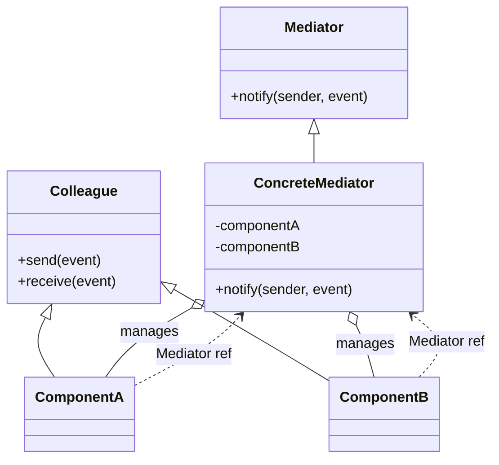
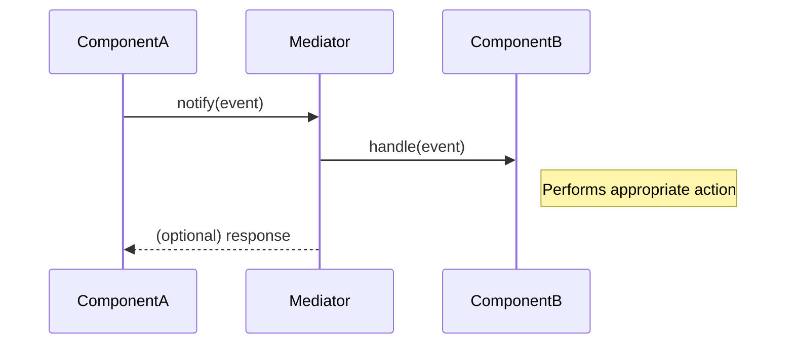
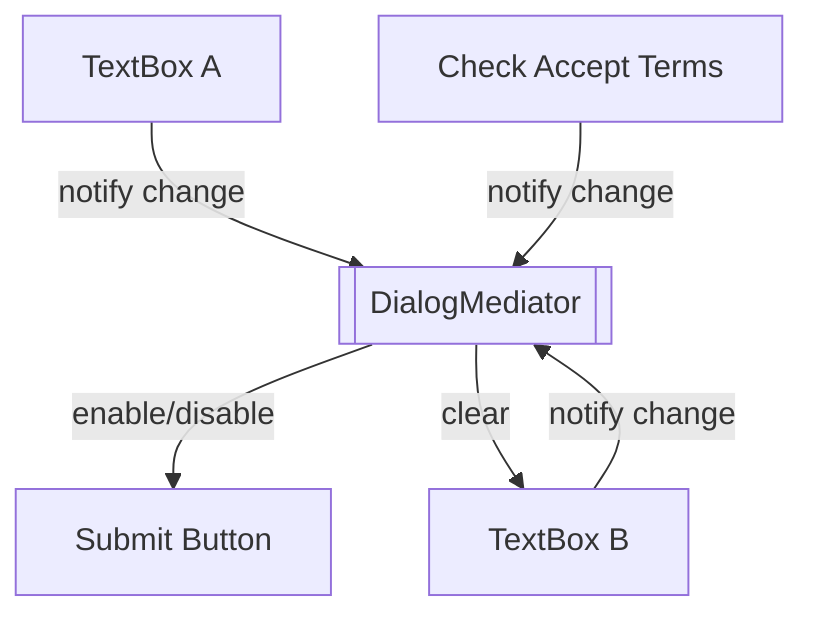

# Mediator Pattern: A Technical Primer

## Introduction

The **Mediator Pattern** is a behavioural software design pattern that facilitates loose coupling among communicating objects by centralising complex communication logic within a mediator object. Originating from the seminal "Gang of Four" (GoF) Design Patterns (Gamma et al., 1994), the Mediator Pattern addresses issues of entangled dependencies and difficult-to-maintain interactions that arise in systems where multiple objects communicate directly.

This pattern is most applicable in scenarios where a set of objects interact in nontrivial ways, potentially forming complex webs of inter-object references ("spaghetti code"). By extracting collaboration logic into a dedicated mediator, the pattern promotes **decoupled architecture**, enhances maintainability, and improves code comprehension.

## Context and Motivation

In an object-oriented system, classes frequently need to interact. Naively, each object may reference all other relevant peers, resulting in a tight coupling that complicates maintenance:

- Modifications to communication logic necessitate changes in many classes.
- The system becomes fragile and error-prone as the network of direct references grows.
- Testing and reusing individual components is hindered.

The Mediator Pattern resolves these problems by routing all communications through a **Mediator** object—a central authority that encapsulates how a set of objects interact. This allows each object (colleague) to remain unaware of the others, enhancing modularity and supporting the **Single Responsibility Principle**.

## Terminology and Key Components

The core components of the pattern are:

- **Mediator**: The central object that defines the interface for communication between colleague objects.
- **ConcreteMediator**: A concrete implementation of the Mediator, containing the actual communication logic.
- **Colleague(s)**: Objects (also known as participants or components) that communicate via the mediator.

### Diagram: Structural Overview



## Core Concepts

### Centralised Communication

Rather than components exchanging messages or calling each other directly, all communication routes through the mediator. Components have references to the mediator, but not to each other. The mediator is responsible for dispatching messages, coordinating actions, and implementing protocols among collaborators.

### Decoupling and Reuse

Because colleagues are no longer responsible for handling the details of mutual interactions, they are simpler and more reusable. This abstraction enables substituting new implementations of colleagues or mediators with minimal risk of breaking the overall system.

### Event Handling

Frequently, the pattern is implemented such that colleagues notify the mediator when an event occurs; the mediator then orchestrates further propagation, action, or commands to other colleagues. This style is similar to event dispatching or controller logic.

## Typical Architecture and Workflow

The general workflow using the Mediator Pattern is as follows:

1. **Initialization**: The mediator is instantiated and configured with references to the colleague objects. Each colleague is given a reference to the mediator.
2. **Communication**: When a colleague needs to interact with another, it instead communicates with the mediator, typically by sending a notification or requesting a service.
3. **Logic Centralisation**: The mediator contains all logic for routing messages, transforming requests, or determining which colleagues should respond.
4. **Response or Propagation**: The mediator invokes appropriate actions or passes information to colleagues as needed.

### Sequence Diagram: Typical Communication



## Practical Example

Consider a dialog window in a GUI framework, with several UI elements (buttons, text fields, checkboxes). These components often interact: selecting a checkbox may enable or disable buttons, filling one text box may clear another, etc.

### Example Scenario

- Components: `TextBox`, `Button`, `CheckBox`
- Mediator: `DialogMediator`

Without a mediator, each component needs references and logic for all possible peers. With a mediator, logic for enabling/disabling is centralised.



## Implementation Details

### Abstract Structure (Pseudocode)

```plaintext
interface Mediator {
    notify(sender, event)
}

class ConcreteMediator implements Mediator {
    colleagueA
    colleagueB
    notify(sender, event):
        if event == "changed":
            // handle coordination logic
}

class Colleague {
    mediator
    send(event):
        mediator.notify(this, event)
    receive(event):
        // specific reaction
}
```

### Constraints and Assumptions

- All colleagues must communicate only via the mediator.
- The mediator may require references to all colleagues to dispatch events; circular dependencies can be avoided by initialising mediator and colleagues carefully.
- The mediator may become a complex object itself if the interaction logic is nontrivial.

> [!WARNING]
> Beware of "God Object" anti-pattern: An overly complex or growing mediator can become difficult to manage and test. Maintain clear separation of concerns and, if needed, refactor complex mediation logic into smaller, dedicated components.

## Common Variations

### Callback-based and Event-driven Mediation

In languages and frameworks supporting event handling or observer-to-pub/sub systems, the mediator may act as an event dispatcher or controller. This can be combined with frameworks that natively support callback registration (e.g., JavaScript, C# events).

### Hierarchical Mediators

In large systems, multiple mediator instances may coordinate subsets of components, forming mediator hierarchies. This approach further compartmentalises communication and limits scope.

### Domain-specific Mediators

The Mediator Pattern is often expanded or adapted to match domain events or protocols, encapsulating complex workflows such as transaction coordination, workflow engines, or even messaging brokers in distributed systems.

## Comparison to Related Patterns

| Pattern              | Primary Purpose                               | Key Difference                                               |
|----------------------|-----------------------------------------------|--------------------------------------------------------------|
| Observer             | Broadcast to all observers                    | Observers notified; no central coordination.                 |
| Publish–Subscribe    | Decoupled event distribution                  | Pub/sub via broker; no explicit mediation protocol per event.|
| Command              | Encapsulate requests as objects               | Focuses on command creation and execution, not mediation.    |
| Facade               | Simplified interface to subsystems            | Facade provides an API; mediation is about component interaction.|

> [!TIP]
> Use the Mediator Pattern when direct client-to-client interaction is undesirable or complex, but a central protocol/coordination is needed. When events merely need to be broadcast, simpler Observer or Pub/Sub patterns may suffice.

## Standards and Interface Practices

Though there is no specific industry standard for mediator interfaces, the Mediator Pattern often informs architectural decisions in UI libraries, concurrent systems, and enterprise integration patterns (EIP). Several message routing and workflow orchestration tools (e.g., Apache Camel, Camunda) conceptually employ mediation, echoing the pattern's principles.

**Integration points** commonly include:

- User interface frameworks (centralised dialogs/controllers).
- Component-based systems (game engines, plug-in architectures).
- Workflow engines or orchestration services.

Where practical, define interfaces that maintain colleagues' ignorance of each other's implementations. Dependency Injection frameworks aid in mediator and colleague lifecycle management.

## Engineering Considerations

### Integration Points

- Mediators can be registered or injected into components at runtime.
- Event-driven architectures may integrate mediators as controllers or message routers.
- Testing is simplified as component logic is decoupled from protocols.

### Performance Implications

- All communication flows through the mediator, potentially creating a bottleneck.
- Excess logic in the mediator may introduce latency.
- For high-frequency interactions or distributed systems, consider decentralising mediation or using scalable event buses.

### Implementation Challenges

- Initial introduction may require significant refactoring if objects are tightly coupled.
- Managing references and lifecycle among colleagues and mediator needs careful design to avoid memory leaks or circular dependencies (especially in garbage-collected languages).

### Common Pitfalls

- Mediator grows too large ("God Object")—refactor mediation logic or modularise protocols.
- Overusing mediation where direct messaging or observer suffices leads to unnecessary indirection.
- Failing to adhere to interface contracts, breaking decoupling guarantees.

## Advanced Topics

### Extension to Distributed Systems

In distributed architectures, the Mediator Pattern inspires message brokers and orchestrators that coordinate services, e.g., **Enterprise Service Bus (ESB)** or **Saga**-coordinator in microservice contexts. While not identical, these architectural elements inherit the principle of decoupled, centralised coordination.

### Role in CQRS and Event Sourcing

In **CQRS (Command Query Responsibility Segregation)** and **Event Sourcing**, mediator-style controllers may orchestrate command handling and propagate resulting state changes to interested parties.

## Summary

The Mediator Pattern fosters decentralised component design by routing all interactions through a central mediator object. This encapsulation reduces inter-object dependencies, yielding code that is more maintainable and extensible. While solving communication complexity, its principal trade-off is the risk of mediator bloat—careful design ensures this central entity remains manageable.

The Mediator Pattern is a foundational design tool for solving coordination problems in object-rich environments, finding use in UI frameworks, component-based systems, and scalable distributed applications. It complements, but is distinct from, related patterns such as Observer and Publish–Subscribe.

When applied judiciously, the Mediator Pattern is instrumental in achieving modular, maintainable, and evolvable software systems.